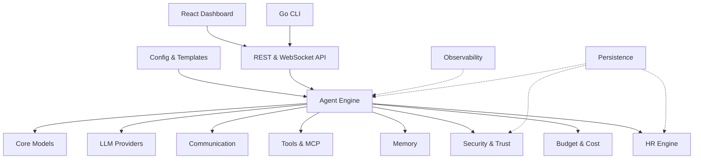

<p align="center">
  <strong>SynthOrg</strong><br>
  <em>Build AI teams that actually collaborate -- with roles, budgets, memory, and governance.</em>
</p>

<p align="center">
  <a href="https://securityscorecards.dev/viewer/?uri=github.com/Aureliolo/synthorg"></a>
  <a href="https://slsa.dev"></a>
  <a href="https://codecov.io/gh/Aureliolo/synthorg"></a>
  <a href="https://github.com/Aureliolo/synthorg/blob/main/LICENSE"></a>
  <a href="https://www.python.org/downloads/"></a>
  <a href="https://synthorg.io/docs"></a>
</p>

---

SynthOrg is a Python framework for building **synthetic organizations** -- autonomous AI agents orchestrated as a virtual company. Unlike task-queue or DAG-based agent frameworks, SynthOrg models agents as members of an actual organization with roles, departments, hierarchies, persistent memory, budgets, and structured communication.

Define your company in YAML. Agents collaborate through a message bus, follow workflows (Kanban, Agile sprints, or custom), track costs against budgets, and produce real artifacts. The framework is provider-agnostic (100+ LLMs via [LiteLLM](https://github.com/BerriAI/litellm)), configuration-driven ([Pydantic v2](https://docs.pydantic.dev/) models), and designed for the full autonomy spectrum -- from human approval on every action to fully autonomous operation.

> **Early access.** Core subsystems are built and tested (13,000+ unit tests, 80%+ coverage). APIs may change between releases. See the [roadmap](https://synthorg.io/docs/roadmap/) for what's next.

## Why SynthOrg?

Most agent frameworks give you **functions that call LLMs**. SynthOrg gives you a **company that thinks**.

- **Roles, not functions.** Agents are CEO, engineer, designer, QA -- with personality, goals, seniority, and autonomy levels. 9 company templates and 23 personality presets get you started fast.
- **Shared organizational memory.** Hybrid retrieval pipeline (dense + BM25 sparse with RRF fusion), tool-based and context injection strategies, procedural memory auto-generation from failures, consolidation, and archival. Agents remember across sessions.
- **Cost-aware by design.** Per-agent token budgets, automatic model downgrade at task boundaries, spending reports, trend analysis, and CFO-level optimization with anomaly detection.
- **Trust spectrum.** From locked-down (human approves every tool call) to fully autonomous -- with a fail-closed security rule engine, output scanning, progressive trust, and audit logging in between.
- **Real workflows.** Kanban boards, Agile sprints with velocity tracking, ceremony scheduling (8 strategies), visual workflow editor with starter blueprints and version history with diff/rollback, and workflow execution from graph definitions.
- **Provider-agnostic.** Any LLM via LiteLLM -- Ollama, LM Studio, vLLM, and 100+ cloud providers. Local model management with pull/delete/configure for Ollama and LM Studio.

## Quick Start

### Install

```bash
# Linux / macOS
curl -sSfL https://synthorg.io/get/install.sh | bash
```

```powershell
# Windows (PowerShell)
irm https://synthorg.io/get/install.ps1 | iex
```

### Run

```bash
synthorg init       # interactive setup wizard
synthorg start      # pull images + start containers
```

Open [localhost:3000](http://localhost:3000) -- the **setup wizard** walks you through company config, LLM providers, agent setup with personality presets, and theme selection. Choose **Guided Setup** for the full experience or **Quick Setup** (company name + provider only, configure the rest later).

### From source

```bash
git clone https://github.com/Aureliolo/synthorg.git
cd synthorg
uv sync                  # install dev + test deps
uv sync --group docs     # install docs toolchain
```

### Docker Compose (manual)

```bash
cp docker/.env.example docker/.env
docker compose -f docker/compose.yml up -d
curl http://localhost:3001/api/v1/health
```

## What's Inside

**[Agent Orchestration](https://synthorg.io/docs/design/engine/)** -- Task decomposition, 6 routing strategies, execution loops (ReAct, Plan-and-Execute, Hybrid, auto-selection by complexity), crash recovery with checkpoint resume, multi-agent coordination, and multi-project support with project-scoped teams and isolated budgets.

**[Budget & Cost Management](https://synthorg.io/docs/design/operations/)** -- Per-agent and per-project cost limits with hierarchical cascading, auto-downgrade to cheaper models at task boundaries, spending reports, budget forecasting, and anomaly detection.

**[Security & Trust](https://synthorg.io/docs/security/)** -- SecOps agent with fail-closed rule engine, progressive trust (4 strategies), configurable autonomy levels (4 tiers), approval gates, LLM fallback evaluator, and audit logging. Container images are cosign-signed with [SLSA L3](https://slsa.dev) provenance.

**[Memory](https://synthorg.io/docs/design/memory/)** -- 5 memory types (episodic, semantic, procedural, working, organizational) with hybrid retrieval, three injection strategies (context, tool-based, and self-editing memory), query reformulation, procedural memory auto-generation from failures, consolidation, and pluggable backends.

**[Communication](https://synthorg.io/docs/design/communication/)** -- Message bus, hierarchical delegation with loop prevention, conflict resolution (4 strategies), and meeting protocols (round-robin, position papers, structured phases).

**[Tools & MCP](https://synthorg.io/docs/guides/mcp-tools/)** -- Built-in tools (file system, git, sandbox, code runner) plus MCP bridge for external tools. Layered sandboxing with subprocess and Docker backends. SSRF prevention with configurable allowlists.

**[Web Dashboard](https://synthorg.io/docs/design/page-structure/)** -- React 19 + shadcn/ui dashboard with org chart, task board, agent detail, budget tracking, provider management, workflow editor, ceremony policy settings, and setup wizard. Real-time WebSocket updates.

**[Notifications](https://synthorg.io/docs/design/operations/#notifications)** -- Pluggable notification sinks (console, ntfy, Slack, email) with severity filtering. Approval gates, budget thresholds, and timeout escalations emit alerts through a fan-out dispatcher.

**[CLI](https://synthorg.io/get/)** -- Go binary with init, start, stop, status, doctor, config, wipe, cleanup commands. Cosign signature and SLSA provenance verification at pull time.

## Architecture



## Compare

SynthOrg vs [44 agent frameworks](https://synthorg.io/compare/) across 14 dimensions -- org structure, multi-agent coordination, memory, budget tracking, security, observability, and more.

## Documentation

| Section | What's there |
|---------|-------------|
| [User Guide](https://synthorg.io/docs/user_guide/) | Install, configure, run, customize |
| [Guides](https://synthorg.io/docs/guides/) | Quickstart, company config, agents, budget, security, MCP tools, deployment, logging, memory |
| [Design Specification](https://synthorg.io/docs/design/) | Agents, org structure, communication, engine, memory, operations, brand & UX, strategy (14 pages) |
| [Architecture](https://synthorg.io/docs/architecture/) | System overview, tech stack, decision log |
| [REST API](https://synthorg.io/docs/rest-api/) | Scalar/OpenAPI reference |
| [Library Reference](https://synthorg.io/docs/api/) | Auto-generated from docstrings (14 modules) |
| [Security](https://synthorg.io/docs/security/) | Application security, container hardening, CI/CD security (8 scanners) |
| [Licensing](https://synthorg.io/docs/licensing/) | BSL 1.1 terms, Additional Use Grant, commercial options |
| [Roadmap](https://synthorg.io/docs/roadmap/) | Current status, open questions, future vision |

> **Contributors:** Start with the [Design Specification](https://synthorg.io/docs/design/) before implementing any feature. See [`DESIGN_SPEC.md`](docs/DESIGN_SPEC.md) for the full design set.

## License

[Business Source License 1.1](LICENSE) -- free production use for non-competing organizations with fewer than 500 employees and contractors. Converts to Apache 2.0 on the change date specified in [LICENSE](LICENSE). See [licensing details](https://synthorg.io/docs/licensing/) for the full rationale and what's permitted.
