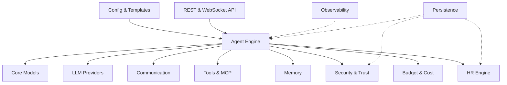

> [!CAUTION]
> **MASSIVE WORK IN PROGRESS** -- SynthOrg is under active development and is **not ready for production use**.
> APIs, configuration formats, and behavior may change without notice between releases.
> Some features shown in the documentation are planned but not yet fully implemented.
> Follow progress on [GitHub](https://github.com/Aureliolo/synthorg) or check the [roadmap](docs/roadmap/).

<p align="center">
  <strong>SynthOrg</strong>
</p>

<p align="center">
  A framework for building synthetic organizations -- autonomous AI agents orchestrated as a virtual company.
</p>

<p align="center">
  <a href="https://github.com/Aureliolo/synthorg/actions/workflows/ci.yml"></a>
  <a href="https://codecov.io/gh/Aureliolo/synthorg"></a>
  <a href="https://github.com/Aureliolo/synthorg/blob/main/LICENSE"></a>
  <a href="https://www.python.org/downloads/"></a>
  <a href="https://synthorg.io/docs"></a>
  <a href="https://securityscorecards.dev/viewer/?uri=github.com/Aureliolo/synthorg"></a>
  <a href="https://slsa.dev"></a>
</p>

---

## What is SynthOrg?

SynthOrg lets you define agents with roles, personalities, budgets, and tools, then orchestrate them to collaborate on complex tasks as a virtual organization. Each agent has a defined role (CEO, developer, designer, QA), persistent memory, and access to real tools. Agents collaborate through structured communication, follow workflows, and produce real artifacts -- code, documents, designs, and more.

The framework is provider-agnostic (any LLM via LiteLLM), configuration-driven (YAML + Pydantic), and designed for the full autonomy spectrum -- from locked-down human approval of every action to fully autonomous operation.

## Capabilities

<table>
<tr>
<td width="33%">

**Agent Orchestration**

Define agents with roles, models, and tools. The engine handles task decomposition, routing, execution loops (ReAct, Plan-and-Execute, Hybrid, auto-selection by complexity), crash recovery (checkpoint resume), and multi-agent coordination.

</td>
<td width="33%">

**Budget & Cost Management**

Per-agent cost limits, auto-downgrade to cheaper models at task boundaries, spending reports, CFO-level cost optimization with anomaly detection.

</td>
<td width="33%">

**Security & Trust**

SecOps agent with fail-closed rule engine, progressive trust (4 strategies), configurable autonomy levels, audit logging, and approval timeout policies. Container images are cosign-signed with SLSA L3 provenance, verified by the CLI at pull time.

</td>
</tr>
<tr>
<td>

**Memory**

Per-agent and shared organizational memory with retrieval pipeline, non-inferable filtering, consolidation, and archival. Pluggable backends via protocol.

</td>
<td>

**Communication**

Message bus, hierarchical delegation with loop prevention, conflict resolution (4 strategies), and meeting protocols (round-robin, position papers, structured phases).

</td>
<td>

**Tools & Integration**

Built-in tools (file system, git, sandbox, code runner) plus MCP bridge for external tools. Layered sandboxing with subprocess and Docker backends.

</td>
</tr>
</table>

## Quick Start

### Install CLI

```bash
# Linux / macOS
curl -sSfL https://synthorg.io/get/install.sh | bash
```

```powershell
# Windows (PowerShell)
irm https://synthorg.io/get/install.ps1 | iex
```

### Setup & Run

```bash
synthorg init       # interactive setup wizard
synthorg start      # pull images + start containers
synthorg status     # check health
synthorg doctor     # diagnostics if something is wrong
synthorg config set channel dev  # opt in to pre-release builds
synthorg wipe       # factory-reset with interactive backup and restart prompts
synthorg cleanup    # remove old container images
```

Open [http://localhost:3000](http://localhost:3000) after `synthorg start` -- on a fresh install, the **setup wizard** guides you through creating an admin account (if needed), choosing a company template, naming your company, customizing agents, configuring LLM providers, setting theme preferences, and reviewing the organization before launch.

### Development (from source)

```bash
git clone https://github.com/Aureliolo/synthorg.git
cd synthorg
uv sync                  # install dev + test deps
uv sync --group docs     # install docs toolchain (zensical)
```

### Docker Compose (manual)

```bash
cp docker/.env.example docker/.env
docker compose -f docker/compose.yml up -d
curl http://localhost:3001/api/v1/health   # verify (replace 3001 if BACKEND_PORT was changed)
docker compose -f docker/compose.yml down  # stop
```

## Architecture



## Documentation

| Section | Description |
|---------|-------------|
| [Design Specification](docs/design/index.md) | Vision, agents, communication, engine, memory, operations, brand & UX, page structure |
| [Architecture](docs/architecture/index.md) | System overview, tech stack, decision log |
| [API Reference](docs/rest-api.md) | REST API reference (Scalar/OpenAPI) |
| [Library Reference](docs/api/index.md) | Auto-generated from docstrings |
| [Security](docs/security.md) | Security architecture, hardening, CI/CD security |
| [Developer Setup](docs/getting_started.md) | Clone, test, lint, contribute |
| [User Guide](docs/user_guide.md) | Install, configure, run via Docker |

> **Contributors:** Start with the [Design Overview](docs/design/index.md) before implementing any feature -- it is the mandatory starting point for architecture, data models, and behavior. [`DESIGN_SPEC.md`](docs/DESIGN_SPEC.md) serves as a pointer to the full design set.

## Status

Early development. The core subsystems (agent engine, security, communication, memory, tools, budget, HR, persistence, observability) are built and unit-tested, but the project has not been run end-to-end as a cohesive product. See the [roadmap](docs/roadmap/) for what's next.

## License

[Business Source License 1.1](LICENSE) -- free production use for non-competing organizations with fewer than 500 employees and contractors. Converts to Apache 2.0 on the change date specified in [LICENSE](LICENSE). See [licensing details](https://synthorg.io/docs/licensing/) for the full rationale and what's permitted.
