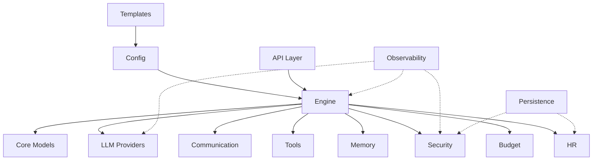

# Architecture Overview

SynthOrg is organized as a modular, protocol-driven framework. Every major subsystem is defined by a protocol interface, enabling pluggable strategy implementations.

## Module Map

## Module Responsibilities

| Module | Purpose |
|--------|---------|
| **core** | Shared domain models — Agent, Task, Role, Company, Project, Approval, Artifact |
| **engine** | Agent orchestration — execution loops (ReAct, Plan-and-Execute), task decomposition, routing, assignment, parallel execution, recovery, shutdown |
| **providers** | LLM provider abstraction — LiteLLM adapter, capability matching, routing strategies (5), retry + rate limiting |
| **communication** | Inter-agent messaging — bus, dispatcher, delegation, loop prevention, conflict resolution (4 strategies), meeting protocols (3) |
| **memory** | Persistent agent memory — retrieval pipeline (ranking, filtering, injection), shared org memory, consolidation/archival |
| **security** | Security subsystem — SecOps agent, rule engine (soft-allow/hard-deny), output scanner, progressive trust (4 strategies), autonomy levels, timeout policies |
| **budget** | Cost management — cost tracking, budget enforcement (pre-flight/in-flight), auto-downgrade, quota/subscription, CFO optimizer, spending reports |
| **hr** | Agent lifecycle — hiring, firing, onboarding, offboarding, registry, performance tracking, promotion/demotion |
| **tools** | Tool system — registry, built-in tools (file system, git, sandbox, code runner), MCP bridge, role-based access |
| **api** | REST + WebSocket API — Litestar controllers, JWT + API key auth, guards, channels |
| **config** | Company configuration — YAML schema, loader, validation, defaults |
| **templates** | Pre-built company templates — personality presets, template builder |
| **persistence** | Operational data — pluggable backend protocol, SQLite implementation |
| **observability** | Structured logging — structlog, event constants, correlation tracking, log sinks |

## Design Principles

1. **Protocol-driven** — Every major subsystem defines a protocol interface. Concrete strategies implement the protocol. New strategies can be added without modifying existing code.

2. **Immutability** — Configuration and identity use frozen Pydantic models. Runtime state evolves via `model_copy(update=...)`. No in-place mutation.

3. **Fail-closed security** — The security rule engine defaults to deny. Actions must be explicitly allowed by matching rules.

4. **Structured concurrency** — Async operations use `asyncio.TaskGroup` for fan-out/fan-in. No bare `create_task` calls.

5. **Provider-agnostic** — All LLM interactions go through the provider abstraction. No vendor-specific code in business logic.

6. **Observable by default** — Every module uses structured logging with domain-specific event constants. Correlation IDs track requests across agent boundaries.

## Further Reading

- [Design Specification](https://github.com/Aureliolo/synthorg/blob/main/DESIGN_SPEC.md) — Full high-level spec (~3500 lines, 18 sections)
- [Design Decisions](decisions.md) — Architectural Decision Records (ADRs)
- [API Reference](../api/index.md) — Auto-generated from source code
