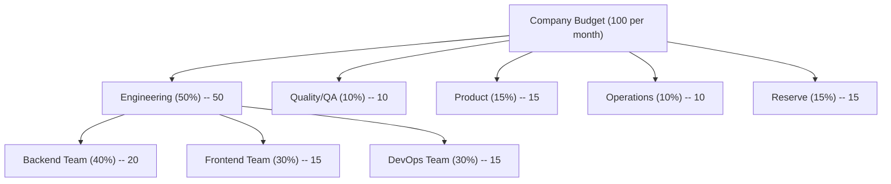

# Budget & Cost Management

SynthOrg treats money as a first-class runtime constraint. Every LLM call carries a currency-stamped `CostRecord`, budgets cascade from the company down to individual teams, and three layers of enforcement (pre-flight, in-flight, task-boundary) prevent runaway spending without breaking in-progress work.

---

## Budget Hierarchy

The framework enforces a hierarchical budget structure. Allocations cascade from the company
level through departments to individual teams.



!!! abstract "Note"

    Percentages are illustrative defaults. All allocations are configurable per company.
    Numeric amounts in the diagram are unitless; `budget.currency` is an ISO 4217 code
    resolved per the regional-defaults chain (user/company setting -> browser/system ->
    neutral fallback). SynthOrg stamps `budget.currency` onto every row at
    record-creation time; historical rows retain the code that was active when they were
    written, so changing the setting only affects newly created rows. Numeric cost values
    are never converted -- updating the setting relabels the display symbol for future
    records, not the existing ones.

## Cost Tracking

Every API call is tracked with full context:

```json
{
  "agent_id": "sarah_chen",
  "task_id": "task-123",
  "provider": "example-provider",
  "model": "example-medium-001",
  "input_tokens": 4500,
  "output_tokens": 1200,
  "cost": 0.0315,
  "currency": "<operator-configured>",
  "timestamp": "2026-02-27T10:30:00Z"
}
```

Every `CostRecord`, `TaskMetricRecord`, `LlmCalibrationRecord`, and `AgentRuntimeState` carries its own `currency`
(ISO 4217 code validated against the allowlist in `synthorg.budget.currency`). The
`budget.currency` setting determines the currency stamped on new rows; historical rows
retain the code that was active when they were created, so changing `budget.currency`
is safe and does not invalidate history.

Every aggregation site -- `CostTracker`, `ReportGenerator`, `CostOptimizer`,
per-agent / per-department / per-project rollups, and the HR `WindowMetrics` multi-window
strategy -- enforces a same-currency invariant. Mixing currencies raises
`MixedCurrencyAggregationError` (HTTP 409, `MIXED_CURRENCY_AGGREGATION` error code) at the
aggregator rather than silently producing a meaningless total. `CostTracker.record()`
additionally rejects at the ingestion boundary when the incoming record's currency differs
from the currently-configured `budget.currency`, so new writes cannot introduce drift
against the live setting. Historical rows written before a `budget.currency` change still
carry their original code, so a rollup that spans the change window will legitimately see
mixed currencies -- the aggregator raises rather than silently combining them. Operators
who change `budget.currency` should either scope reports to a single currency window or
run a proper migration that converts both the numeric amount and the currency code
together under a documented FX policy; a raw
`UPDATE cost_records SET currency = '<new-code>'` is a **re-label, not a conversion**,
and must only be used when the operator knows the existing numeric values are already
denominated in the target code (for example, correcting an initial mis-configuration
before any production data accumulated). SynthOrg does not ship an FX engine; callers are
responsible for the conversion policy when they need one.

`CostRecord` stores `input_tokens` and `output_tokens`; `total_tokens` is a `@computed_field`
property on `TokenUsage` (the model embedded in `CompletionResponse`). Spending aggregation
models (`AgentSpending`, `DepartmentSpending`, `PeriodSpending`) extend a shared
`_SpendingTotals` base class that also carries the per-aggregation currency.

The `GET /budget/records` endpoint returns paginated cost records alongside two server-computed
summaries (aggregated from **all** matching records, not just the current page):

- **`daily_summary`**: per-day aggregation with `date`, `total_cost`, `total_input_tokens`,
  `total_output_tokens`, and `record_count`, sorted chronologically.
- **`period_summary`**: overall stats including `avg_cost` (computed), `total_cost`,
  `total_input_tokens`, `total_output_tokens`, and `record_count`.

## CFO Agent Responsibilities

The CFO agent (when enabled) acts as a cost management system. Budget tracking, per-task cost
recording, and cost controls are enforced by `BudgetEnforcer` (a service the engine composes).
CFO cost optimization is implemented via `CostOptimizer`.

- Monitor real-time spending across all agents
- Alert when departments approach budget limits
- Suggest model downgrades when budget is tight
- Report daily/weekly spending summaries
- Recommend hiring/firing based on cost efficiency
- Block tasks that would exceed remaining budget
- Optimize model routing for cost/quality balance

`CostOptimizer` implements anomaly detection (sigma + spike factor), per-agent efficiency
analysis, model downgrade recommendations (via `ModelResolver`), routing optimization
suggestions, and operation approval evaluation. `ReportGenerator` produces multi-dimensional
spending reports with task/provider/model breakdowns and period-over-period comparison.

## Cost Controls

The budget system enforces three layers: pre-flight checks, in-flight monitoring, and
task-boundary auto-downgrade.

```yaml
budget:
  total_monthly: 100.00
  currency: "<ISO 4217 code>"  # display-only, no FX conversion
  reset_day: 1
  alerts:
    warn_at: 75               # percent
    critical_at: 90
    hard_stop_at: 100
  per_task_limit: 5.00
  per_agent_daily_limit: 10.00
  auto_downgrade:
    enabled: true
    threshold: 85              # percent of budget used
    boundary: "task_assignment" # task_assignment only -- NEVER mid-execution
    downgrade_map:             # ordered pairs -- aliases reference configured models
      - ["large", "medium"]
      - ["medium", "small"]
      - ["small", "local-small"]
```

!!! tip "Auto-Downgrade Boundary"

    Model downgrades apply only at **task assignment time**, never mid-execution. An agent
    halfway through an architecture review cannot be switched to a cheaper model -- the task
    completes on its assigned model. The next task assignment respects the downgrade threshold.
    This prevents quality degradation from mid-thought model switches.

    When a downgrade target alias matches a valid tier name (`large`/`medium`/`small`), the
    downgraded `ModelConfig` stores the tier in `model_tier`, enabling prompt profile
    adaptation (see [Prompt Profiles](agent-execution.md#prompt-profiles)).

!!! info "Minimal Configuration"

    The only required field is `total_monthly`. All other fields have sensible defaults:

    ```yaml
    budget:
      total_monthly: 100.00
    ```

## Quota Degradation

When a provider's quota is exhausted, the framework applies the configured degradation
strategy before failing. Each provider has a `DegradationConfig` specifying the strategy:

| Strategy | Behavior |
|----------|----------|
| `alert` (default) | Raise `QuotaExhaustedError` immediately |
| `fallback` | Walk the `fallback_providers` list, use the first provider with available quota |
| `queue` | Wait for the soonest quota window to reset (capped at `queue_max_wait_seconds`), then retry |

```yaml
providers:
  example-provider:
    degradation:
      strategy: "fallback"
      fallback_providers:
        - "secondary-provider"
        - "local-provider"
  secondary-provider:
    degradation:
      strategy: "queue"
      queue_max_wait_seconds: 300
```

`QuotaTracker` also exposes a synchronous `peek_quota_available()` method that returns
a `dict[str, bool]` snapshot of per-provider quota availability.  This is used by the
`QuotaAwareSelector` at routing time to prefer providers with remaining quota.  The
method reads cached counters without acquiring the async lock (safe on the single-threaded
asyncio event loop) and tolerates TOCTOU for heuristic selection decisions.

Degradation is resolved during pre-flight checks (`BudgetEnforcer.check_can_execute`),
which returns a `PreFlightResult` carrying the effective provider and degradation details.
The engine's `AgentEngine._apply_degradation` swaps the provider driver via the
`ProviderRegistry` when FALLBACK selects a different provider. QUEUE keeps the same
provider -- it waits for the quota window to rotate, then re-checks.

!!! tip "Degradation Boundary"
    Like auto-downgrade, degradation applies only at **task assignment time** (pre-flight).
    An agent mid-execution is never switched to a different provider.

## LLM Call Analytics

Every LLM provider call is tracked with comprehensive metadata for financial reporting,
debugging, and orchestration overhead analysis.

### Per-Call Tracking and Proxy Overhead Metrics

Every completion call produces a `CompletionResponse` with `TokenUsage` (token counts and
cost). The engine layer creates a `CostRecord` (with agent/task context) and records it
into `CostTracker`. The engine additionally logs **proxy overhead metrics** at task
completion:

- `turns_per_task` -- number of LLM turns to complete the task
- `tokens_per_task` -- total tokens consumed
- `cost_per_task` -- total cost in configured currency
- `duration_seconds` -- wall-clock execution time
- `prompt_tokens` -- estimated system prompt tokens
- `prompt_token_ratio` -- ratio of prompt tokens to total tokens (overhead indicator; warns when >0.3)

These are natural overhead indicators -- a task consuming 15 turns and 50k tokens for a
one-line fix signals a problem. Metrics are captured in `TaskCompletionMetrics`, a frozen
Pydantic model with a `from_run_result()` factory method.

### Call Categorization and Orchestration Ratio

When multi-agent coordination exists, each `CostRecord` is tagged with a **call category**:

| Category | Description | Examples |
|----------|-------------|---------|
| `productive` | Direct task work -- tool calls, code generation, task output | Agent writing code, running tests |
| `coordination` | Inter-agent communication -- delegation, reviews, meetings | Manager reviewing work, agent presenting in meeting |
| `system` | Framework overhead -- system prompt injection, context loading | Initial prompt, [memory retrieval injection](memory.md#memory-injection-strategies) |
| `embedding` | Embedding model calls -- memory store/retrieve vectorization | Mem0 store embedding, similarity search query embedding |

The **orchestration ratio** (`coordination / total`) is surfaced in metrics and alerts. If
coordination tokens consistently exceed productive tokens, the company configuration needs
tuning (fewer approval layers, simpler [meeting protocols](communication.md#meeting-protocol),
etc.).

???+ note "Coordination Metrics Suite"

    A comprehensive suite of coordination metrics derived from empirical agent scaling research
    ([Kim et al., 2025](https://arxiv.org/abs/2512.08296)). These metrics explain coordination
    dynamics and enable data-driven tuning of multi-agent configurations.

    | Metric | Symbol | Definition | What It Signals |
    |--------|--------|------------|-----------------|
    | **Coordination efficiency** | `Ec` | `success_rate / (turns / turns_sas)` -- success normalized by relative turn count vs single-agent baseline | Overall coordination ROI. Low Ec = coordination costs exceed benefits |
    | **Coordination overhead** | `O%` | `(turns_mas - turns_sas) / turns_sas * 100%` -- relative turn increase | Communication cost. Optimal band: 200--300%. Above 400% = over-coordination |
    | **Error amplification** | `Ae` | `error_rate_mas / error_rate_sas` -- relative failure probability | Whether MAS corrects or propagates errors. Centralized ~4.4x, Independent ~17.2x |
    | **Message density** | `c` | Inter-agent messages per reasoning turn | Communication intensity. Performance saturates at ~0.39 messages/turn |
    | **Redundancy rate** | `R` | Mean cosine similarity of agent output embeddings | Agent agreement. Optimal at ~0.41 (balances fusion with independence) |
    | **Amdahl ceiling** | `Sc` | Theoretical max speedup from Amdahl's Law given parallelizable fraction | Diminishing returns threshold. Recommends ideal team size |
    | **Straggler gap** | `Gs` | `(slowest_turn - median_turn) / median_turn` | Bottleneck severity. High gap = one agent blocks the group |
    | **Token-speedup ratio** | `Rt` | `total_tokens / speedup_factor` | Cost efficiency of parallelism. Rising ratio = diminishing token ROI |
    | **Message overhead** | `Mo` | Pairwise message count relative to team size | Quadratic communication detection. `is_quadratic` flag when `O(n^2)` |

    All 9 metrics are opt-in via `coordination_metrics.enabled` in analytics config. `Ec` and
    `O%` are cheap (turn counting). `Ae` requires baseline comparison data. `R` requires
    semantic analysis of agent outputs (embedding cosine similarity). `c`, `Sc`, `Gs`, `Rt`,
    and `Mo` are computed from execution telemetry (turn counts, token usage, message logs).

    ```yaml
    coordination_metrics:
      enabled: false                       # opt-in -- enable for data gathering
      collect:
        - efficiency                       # cheap -- turn counting
        - overhead                         # cheap -- turn counting
        - error_amplification              # requires SAS baseline data
        - message_density                  # requires message counting infrastructure
        - redundancy                       # requires embedding computation on outputs
        - amdahl_ceiling                   # computed from parallelizable fraction
        - straggler_gap                    # computed from per-agent turn times
        - token_speedup_ratio              # computed from token usage + speedup
        - message_overhead                 # computed from pairwise message counts
      baseline_window: 50                  # number of SAS runs to establish baseline for Ae
      error_taxonomy:
        enabled: false                     # opt-in -- enable for targeted diagnosis
        categories:
          - logical_contradiction
          - numerical_drift
          - context_omission
          - coordination_failure
    ```

???+ note "Full Analytics Layer Configuration"

    Expanded per-call metadata for comprehensive financial and operational reporting:

    ```yaml
    call_analytics:
      track:
        - call_category                    # productive, coordination, system, embedding
        - success                          # true/false
        - retry_count                      # 0 = first attempt succeeded
        - retry_reason                     # rate_limit, timeout, internal_error
        - latency_ms                       # wall-clock time for the call
        - finish_reason                    # stop, tool_use, max_tokens, error
        - cache_hit                        # prompt caching hit/miss (provider-dependent)
      aggregation:
        - per_agent_daily                  # agent spending over time
        - per_task                         # total cost per task
        - per_department                   # department-level rollups
        - per_provider                     # provider reliability and cost comparison
        - orchestration_ratio              # coordination vs productive tokens
      alerts:
        orchestration_ratio:
          info: 0.30                       # info if coordination > 30% of total
          warn: 0.50                       # warn if coordination > 50% of total
          critical: 0.70                   # critical if coordination > 70% of total
        retry_rate_warn: 0.1               # warn if > 10% of calls need retries
    ```

    Analytics metadata is append-only and never blocks execution. Failed analytics writes are
    logged and skipped -- the agent's task is never delayed by telemetry.

### Coordination Error Taxonomy

When coordination metrics collection is enabled, the system classifies
coordination errors into structured categories for targeted diagnosis.
Each category supports a pluggable dual-implementation system: a cheap
heuristic variant (regex/structural) and an optional LLM-backed semantic
variant (accurate, expensive, disabled by default).

**Detection scope**: detectors operate at SAME_TASK (single execution) or
TASK_TREE (parent + delegate executions via `parent_task_id` linkage).
Cross-agent data is sanitized via `sanitize_message` before inclusion.

| Error Category | Description | Heuristic Variant | Semantic Variant | Default Scope |
|---------------|-------------|-------------------|------------------|--------------|
| **Logical contradiction** | Agent asserts both "X is true" and "X is false" | Regex assertion matching | LLM reasoning over assistant texts | SAME_TASK |
| **Numerical drift** | Accumulated errors from cascading rounding (>5% deviation) | Context-labeled number extraction + % drift | LLM cross-verification of numerical claims | SAME_TASK |
| **Context omission** | Failure to reference previously established entities | Capitalized entity set diff (first-half/second-half) | LLM entity introduction/disposition tracking | SAME_TASK |
| **Coordination failure** | Message misinterpretation, task allocation conflicts | Tool errors + error finish reasons | LLM classification of coordination breakdowns | SAME_TASK |
| **Delegation protocol violation** | Broken delegation chains, missing parent linkage | Structural check: parent_task_id, delegation_chain integrity | -- | TASK_TREE |
| **Review pipeline violation** | PASS without stages, PASS contradicting FAIL stage | Structural check: verdict/stage consistency | -- | TASK_TREE |
| **Authority breach attempt** | Execution cost exceeding authority budget limit | Budget comparison: total turn cost vs limit | -- | SAME_TASK |

**Pipeline architecture**: detectors implement the `Detector` protocol and are
discovered dynamically from `ErrorTaxonomyConfig.detectors` (a dict mapping
`ErrorCategory` to per-category variant/scope config). When multiple variants
target the same category, a `CompositeDetector` runs them concurrently and
deduplicates findings by `(turn_range, description_hash, category)`.

**Downstream sinks**: `ClassificationSink` protocol enables wiring findings
into the performance tracker (`PerformanceTrackerSink`) and notification
dispatcher (`NotificationDispatcherSink`, threshold-filtered).

**Cost control**: LLM semantic variants share the provider's rate limiter and
track per-classification-run cost against `classification_budget_per_task`.

Error taxonomy classification runs post-execution (never blocks agent work)
and logs structured events to the observability layer. Enable via
`coordination_metrics.error_taxonomy.enabled: true`.

Error categories derived from [Kim et al., 2025](https://arxiv.org/abs/2512.08296) and the
Multi-Agent System Failure Taxonomy (MAST) by Cemri et al. (2025).

## Risk Budget

The framework tracks **cumulative risk** alongside monetary cost. While the
`RiskClassifier` assigns per-action risk levels (LOW/MEDIUM/HIGH/CRITICAL),
the risk budget tracks risk _accumulation_ -- an agent executing 50 MEDIUM-risk
actions in a row should trigger escalation even though each individual action
is approved.

### Risk Scoring Model

Each action is scored on four dimensions (0.0--1.0):

| Dimension | Meaning | 0.0 | 1.0 |
|-----------|---------|-----|-----|
| `reversibility` | How irreversible | Fully reversible | Irreversible |
| `blast_radius` | Scope of impact | None | Global |
| `data_sensitivity` | Data touched | Public | Secret |
| `external_visibility` | External parties | Internal only | Fully public |

A weighted sum produces a scalar `risk_units` value (default weights:
0.3/0.3/0.2/0.2). The `RiskScorer` protocol is pluggable; the default
implementation maps built-in `ActionType` values to pre-defined `RiskScore`
instances (CRITICAL ~0.88, HIGH ~0.62, MEDIUM ~0.31, LOW ~0.05).

### Risk Budget Configuration

```yaml
budget:
  risk_budget:
    enabled: false                  # opt-in
    per_task_risk_limit: 5.0
    per_agent_daily_risk_limit: 20.0
    total_daily_risk_limit: 100.0
    alerts:
      warn_at: 75                   # percent of daily limit
      critical_at: 90
```

Zero limits mean unlimited. Risk budget is disabled by default.

### Risk Tracker

`RiskTracker` mirrors `CostTracker`: append-only `RiskRecord` entries with
TTL-based eviction (7 days), asyncio.Lock concurrency safety, and
per-agent/per-task/total aggregation queries.

### Enforcement

`BudgetEnforcer` checks risk limits alongside monetary limits:

1. **Pre-flight**: `check_risk_budget()` checks per-task, per-agent daily,
   and total daily risk limits. Raises `RiskBudgetExhaustedError` on breach.
2. **Recording**: `record_risk()` scores and records each action via
   the `RiskScorer` and `RiskTracker`.
3. **Auto-downgrade**: `RISK_BUDGET_EXHAUSTED` added to `DowngradeReason`.

### Shadow Mode

`SecurityEnforcementMode` (on `SecurityConfig`) controls enforcement:

| Mode | Behavior |
|------|----------|
| `active` (default) | Full enforcement -- verdicts applied as-is |
| `shadow` | Full pipeline runs, audit recorded, but blocking verdicts convert to ALLOW |
| `disabled` | No evaluation, always ALLOW |

Shadow mode enables pre-deployment calibration: operators can observe what
_would_ have been blocked without disrupting agent work, then tune risk
weights and limits before switching to active enforcement.

## Automated Reporting

The framework generates periodic reports summarizing spending, performance,
task completion, and risk trends. Reports are generated on demand via API
or on a schedule.

### Report Periods

| Period | Coverage |
|--------|----------|
| `daily` | Previous day (00:00 UTC to 00:00 UTC) |
| `weekly` | Previous week (Monday 00:00 UTC to Monday 00:00 UTC) |
| `monthly` | Previous month (1st 00:00 UTC to 1st 00:00 UTC) |

### Report Templates

| Template | Data Source | Contents |
|----------|-----------|----------|
| `spending_summary` | `CostTracker` | Per-task, per-provider, per-model cost breakdowns |
| `performance_metrics` | `PerformanceTracker` | Per-agent quality scores, task counts, cost/risk totals |
| `task_completion` | `CostTracker` | Completion rates, department breakdowns |
| `risk_trends` | `RiskTracker` | Risk accumulation by agent and action type, daily trend |
| `comprehensive` | All sources | Combines all templates into a single report |

### API Endpoints

| Method | Path | Description |
|--------|------|-------------|
| `POST` | `/api/v1/reports/generate` | Generate an on-demand report for a given period |
| `GET` | `/api/v1/reports/periods` | List available report periods |

## Prefill Token Equivalents (PTE)

PTE is an additional hardware-aware efficiency metric (from
[arXiv:2604.05404](https://arxiv.org/abs/2604.05404)) that accounts for KV-cache
eviction between tool calls and tool-response inflation. Unlike raw token counts,
PTE correlates better with wall-clock latency for tool-integrated reasoning.

**Formula approximation** (no internal KV state required):

    PTE = input_tokens * (1 + eviction_penalty * prior_tool_call_count)
        + output_tokens
        + tool_response_tokens * tool_inflation_factor

Default tuning: ``eviction_penalty = 0.3``, ``tool_inflation_factor = 1.5``.
``PTEConfig`` defines these tuning parameters where
``prefill_token_equivalents(..., config=...)`` is called.

**Integration**: PTE is **additive, not a replacement** for token budgets. Token
budgets continue to drive per-task spend caps; PTE drives efficiency analysis via
``EfficiencyRatios.pte`` and ``pte_ratio``.

**Configuration**: ``budget.pte_tracking_enabled: bool = False`` (opt-in).

---

## See Also

- [Providers](providers.md) -- provider abstraction, routing, quota
- [Tools](tools.md) -- tool invocation cost tracking
- [Design Overview](index.md) -- full index
