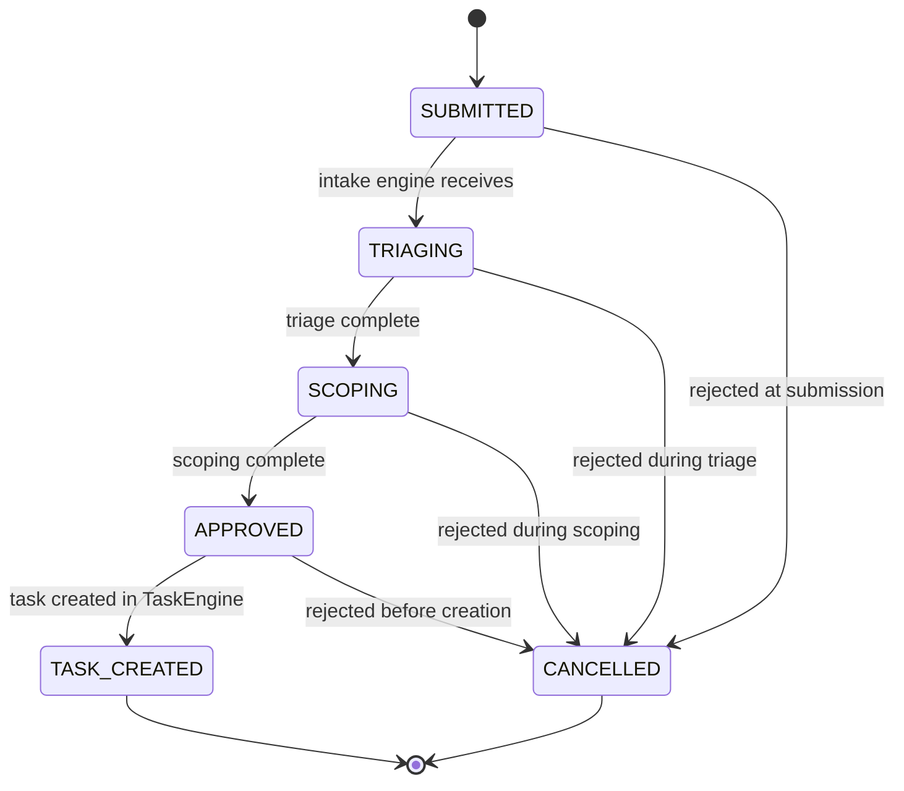

# Client Simulation

The client simulation subsystem generates synthetic workloads that exercise the full
task lifecycle end-to-end. Simulated clients (AI-driven, human, or hybrid) submit task
requirements through an intake pipeline and review completed deliverables via a
configurable review pipeline. This enables systematic evaluation of agent performance,
organizational throughput, and quality metrics without real external clients.

---

## Architecture Overview

```text
ClientPool                    IntakeEngine              TaskEngine
  |                              |                         |
  +-- AIClient ----+             |                         |
  +-- HumanClient -+-- submit -->+-- IntakeStrategy ------>+-- CREATED
  +-- HybridClient +             |   (direct/agent)        |     |
                                 |                         |   ASSIGNED
RequirementGenerator             |                         |     |
  +-- TemplateGenerator          |                         |   IN_PROGRESS
  +-- LLMGenerator               |                         |     |
  +-- DatasetGenerator           |                    ReviewPipeline
  +-- HybridGenerator            |                      |        |
  +-- ProceduralGenerator        |                      +-- InternalReviewStage
                                 |                      +-- ClientReviewStage
FeedbackStrategy                 |                         |
  +-- BinaryFeedback             |                       COMPLETED
  +-- ScoredFeedback             |                         |
  +-- CriteriaCheckFeedback      |                    SimulationRunner
  +-- AdversarialFeedback        |                      |
                                 |                    ReportStrategy
                                 |                      +-- DetailedReport
                                 |                      +-- SummaryReport
                                 |                      +-- MetricsOnly
                                 |                      +-- JsonExport
```

---

## Client Types

### ClientInterface Protocol

All client types implement `ClientInterface`, providing two operations:

- **`submit_requirement(context)`** -- Generate or submit a task requirement.
  Returns `None` when the client declines to participate.
- **`review_deliverable(context)`** -- Review a completed deliverable and return
  feedback with acceptance decision and reasoning.

### AIClient

LLM-backed client with a configurable persona. Uses `CompletionProvider` for
requirement generation and deliverable review. Persona-driven prompts based on
`ClientProfile` (expertise domains, strictness level).

### HumanClient

Delegates to the API/dashboard for human input. Uses an async callback pattern
for approval flows. No LLM calls -- pure API/UI delegation.

### HybridClient

Composes `AIClient` + `HumanClient`: AI drafts requirements and evaluates
deliverables, human confirms or overrides decisions.

---

## Client Profile

```python
class ClientProfile(BaseModel):
    client_id: NotBlankStr
    name: NotBlankStr
    persona: NotBlankStr
    expertise_domains: tuple[NotBlankStr, ...]
    strictness_level: float  # 0.0 (lenient) to 1.0 (strict)
```

Profiles control how clients generate requirements and evaluate deliverables.
`strictness_level` influences feedback strategies -- stricter clients reject
more deliverables and provide more detailed failure analysis.

---

## Request Lifecycle

Client requests follow an independent state machine from the task lifecycle:



`RequestStatus` is independent from `TaskStatus`. After `TASK_CREATED`, the
task's own lifecycle (CREATED -> ASSIGNED -> ... -> COMPLETED) takes over.

---

## Requirement Generation

Five pluggable strategies implement `RequirementGenerator`:

| Strategy | Approach | Cost | Variety |
|----------|----------|------|---------|
| `TemplateGenerator` | Pattern-based with variable slots | Low | Low |
| `LLMGenerator` | LLM-generated novel requirements | High | High |
| `DatasetGenerator` | Loads from curated corpus | Low | Medium |
| `HybridGenerator` | Dataset seeds + LLM refinement | Medium | High |
| `ProceduralGenerator` | Algorithmic with dependency graphs | Low | Medium |

Each returns `tuple[TaskRequirement, ...]` containing structured requirements
with title, description, type, priority, complexity, and acceptance criteria.

---

## Feedback Strategies

Four pluggable strategies implement `FeedbackStrategy`:

| Strategy | Signal | Use Case |
|----------|--------|----------|
| `BinaryFeedback` | Accept/reject with reason | Simple pass/fail evaluation |
| `ScoredFeedback` | Multi-dimensional scoring | Rich feedback for agent learning |
| `CriteriaCheckFeedback` | Per-criterion pass/fail | Structured failure analysis |
| `AdversarialFeedback` | Deliberately strict/ambiguous | Stress testing and edge cases |

All produce `ClientFeedback` with `accepted` boolean, `reason`, optional `scores`
dictionary, and `unmet_criteria` tuple.

---

## Review Pipeline

The review pipeline walks a chain of `ReviewStage` implementations in order.
Each stage returns a `ReviewVerdict`:

- **PASS** -- Continue to the next stage.
- **FAIL** -- Short-circuit; task returns to IN_PROGRESS for rework.
- **SKIP** -- Stage not applicable; continue to next.

Pipeline progress is tracked in task metadata (not via new `TaskStatus` values).
The task stays in `IN_REVIEW` throughout pipeline execution.

```python
# Metadata tracked on the task during pipeline execution
{
    "review_pipeline": {
        "current_stage": "client",
        "stages_completed": ["internal"],
        "stage_results": {
            "internal": {"verdict": "pass", "reason": null},
            "client": {"verdict": "fail", "reason": "Missing tests"}
        }
    }
}
```

### Built-in Stages

- **InternalReviewStage** -- Wraps existing `ReviewGateService` logic.
  Backward-compatible default first stage.
- **ClientReviewStage** -- Invokes `ClientInterface.review_deliverable()`.
  Maps `ClientFeedback` to `ReviewStageResult`.

---

## Intake Engine

The `IntakeEngine` manages the `ClientRequest` lifecycle from `SUBMITTED`
through `TASK_CREATED`. It routes requests to a configured `IntakeStrategy`:

- **DirectIntake** -- Pass-through; creates a task immediately from the
  requirement with minimal validation.
- **AgentIntake** -- Routes to an intake agent (PM/Account Manager) for
  triage, scoping, and approval before task creation.

---

## Task Source Tracking

Tasks created through client simulation carry a `source` field:

```python
class TaskSource(StrEnum):
    INTERNAL = "internal"      # Created by agent/human within the org
    CLIENT = "client"          # From a client (real or simulated)
    SIMULATION = "simulation"  # From simulation runner
```

This enables filtering and analytics by task origin without affecting the
task lifecycle state machine.

---

## Simulation Runner

`SimulationRunner` orchestrates batch simulation runs:

1. Spawn a pool of clients (AI/human/hybrid mix per `ClientPoolConfig`).
2. Generate requirements via `RequirementGenerator`.
3. Submit requirements to `IntakeEngine`.
4. Wait for task completion via `TaskEngine`.
5. Review deliverables via `ClientReviewStage`.
6. Collect metrics (`SimulationMetrics`).
7. Generate reports via `ReportStrategy`.

`ContinuousMode` provides event-driven always-on simulation with scheduled
requirement generation and review triggers.

---

## Configuration

All configuration is composed into `ClientSimulationConfig`:

```python
class ClientSimulationConfig(BaseModel):
    pool: ClientPoolConfig           # Pool size, AI/human/hybrid ratios
    generators: RequirementGeneratorConfig  # Strategy + settings
    feedback: FeedbackConfig         # Strategy + scoring rubric
    report: ReportConfig             # Report style discriminator
    runner: SimulationRunnerConfig   # Concurrency, timeouts
    continuous: ContinuousModeConfig # Interval, max concurrent
```

---

## Configuration & Factories

Each client strategy family has a config discriminator that a factory
function in `synthorg.client.factory` dispatches to the concrete
implementation. Misconfiguration fails loudly -- every factory raises
`UnknownStrategyError` (a `ValueError` subclass) on an unknown
discriminator rather than silently falling back to a default.

| Config discriminator | Factory function | Strategies |
|---|---|---|
| `RequirementGeneratorConfig.strategy` | `build_requirement_generator()` | `template` → `TemplateGenerator`, `llm` → `LLMGenerator`, `dataset` → `DatasetGenerator`, `procedural` → `ProceduralGenerator` |
| `FeedbackConfig.strategy` | `build_feedback_strategy(config, *, client_id)` | `binary` → `BinaryFeedback`, `scored` → `ScoredFeedback`, `criteria_check` → `CriteriaCheckFeedback`, `adversarial` → `AdversarialFeedback` |
| `ReportConfig.strategy` | `build_report_strategy()` | `summary` → `SummaryReport`, `detailed` → `DetailedReport`, `json_export` → `JsonExportReport`, `metrics_only` → `MetricsOnlyReport` |
| `ClientPoolConfig.selection_strategy` | `build_client_pool_strategy()` | `round_robin` → `RoundRobinStrategy`, `weighted_random` → `WeightedRandomStrategy`, `domain_matched` → `DomainMatchedStrategy` |
| `adapter` arg (intake entry point) | `build_entry_point_strategy(adapter, *, project_id=None)` | `direct` → `DirectAdapter`, `project` → `ProjectAdapter`, `intake` → `IntakeAdapter` |

The factories follow the project-wide pluggable-subsystems pattern
(protocol + strategy + factory + config discriminator). No silent
defaults: a misspelled discriminator is a hard error at construction
time, not a runtime surprise during a simulation.

!!! note "Hybrid requirement generator is intentionally excluded from factory dispatch"
    `RequirementGeneratorConfig.strategy="hybrid"` does **not** resolve
    through `build_requirement_generator()`. `HybridGenerator` composes
    multiple underlying generators with weights, so it has no
    single-argument factory; callers must construct it manually with a
    tuple of `(generator, weight)` pairs. Passing `"hybrid"` to the
    factory raises `UnknownStrategyError` -- this is a deliberate
    deviation from the other strategies, not an oversight.

---

## Observability

Event constants in `synthorg.observability.events.client` and
`synthorg.observability.events.review_pipeline` cover:

- Client request lifecycle (submitted, triaging, scoped, approved, rejected)
- Client review lifecycle (started, completed, feedback recorded)
- Requirement generation events
- Simulation run lifecycle (started, round completed, completed)
- Review pipeline lifecycle (started, stage completed, completed)
- Intake processing (received, accepted, rejected)
