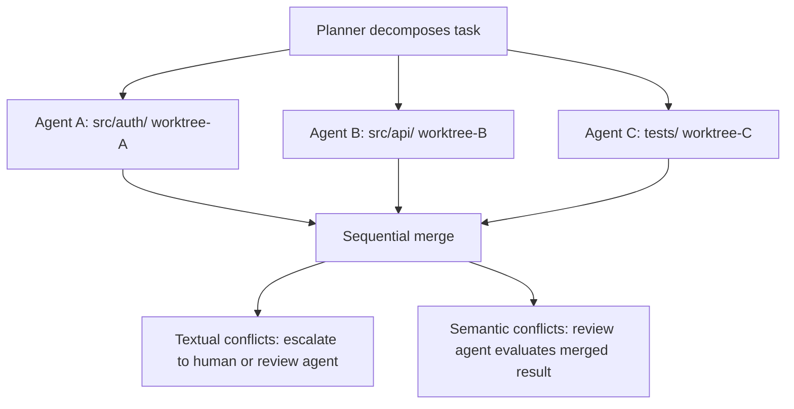

# Coordination & Resilience

This page covers system-level features that span multiple agents and protect against failure: crash recovery with checkpoint resume, graceful shutdown strategies, concurrent workspace isolation (Git worktrees / virtual filesystem / per-branch), and multi-agent coordination topology (centralized, decentralized, context-dependent dispatchers).

## Agent Crash Recovery

When an agent execution fails unexpectedly (unhandled exception, OOM, process
kill), the framework applies a recovery mechanism. Recovery strategies are
implemented behind a `RecoveryStrategy` protocol, making the system pluggable.

### RecoveryStrategy Protocol

| Method | Signature | Description |
|--------|-----------|-------------|
| `recover` | `async def recover(*, task_execution, error_message, context) -> RecoveryResult` | Apply recovery to a failed task execution |
| `get_strategy_type` | `def get_strategy_type() -> str` | Return strategy type identifier (must not be empty) |

### RecoveryResult Model

| Field | Type | Description |
|-------|------|-------------|
| `task_execution` | `TaskExecution` | Updated execution after recovery (typically `FAILED`) |
| `strategy_type` | `NotBlankStr` | Strategy identifier |
| `context_snapshot` | `AgentContextSnapshot` | Redacted snapshot (turn count, accumulated cost, message count, max turns -- no message contents) |
| `error_message` | `NotBlankStr` | Error that triggered recovery |
| `failure_category` | `FailureCategory` | Machine-readable classification (`TOOL_FAILURE`, `STAGNATION`, `BUDGET_EXCEEDED`, `QUALITY_GATE_FAILED`, `TIMEOUT`, `DELEGATION_FAILED`, `UNKNOWN`) |
| `failure_context` | `dict[str, Any]` | Structured strategy-specific failure metadata (deep-copied at construction; defaults to `{}`) |
| `criteria_failed` | `tuple[NotBlankStr, ...]` | Acceptance criteria that were not met (unique; validated on construction) |
| `stagnation_evidence` | `StagnationResult \| None` | Stagnation detection result when applicable |
| `checkpoint_context_json` | `str \| None` | Serialized `AgentContext` for resume (`None` for non-checkpoint strategies) |
| `resume_attempt` | `int` (ge=0) | Current resume attempt number (0 when not resuming) |
| `can_resume` | `bool` (computed) | `checkpoint_context_json is not None` |
| `can_reassign` | `bool` (computed) | `retry_count < task.max_retries` |

`failure_category` is inferred from the error message via `infer_failure_category()` (keyword-based heuristic).  `UNKNOWN` is the deliberate default when no keyword rule matches -- an honest classification is more useful than a silent `TOOL_FAILURE` lie that would masquerade unknown causes in dashboards, reports, and reconciliation prompts.  Checkpoint reconciliation messages include the category and any unmet criteria (both passed through `sanitize_message` to strip paths, URLs, and prompt-injection markers) so the resumed agent has structured context about what failed without carrying leaked secrets.

**Cross-field invariants.** `RecoveryResult` enforces two cross-field rules at construction:

- `stagnation_evidence` is set iff `failure_category` is `STAGNATION` (and the evidence verdict must not be `NO_STAGNATION` -- evidence that the detector ruled out stagnation cannot back a STAGNATION result).
- `criteria_failed` must be non-empty when `failure_category` is `QUALITY_GATE_FAILED`.

Strategies that only have an error string (`FailAndReassignStrategy`, `CheckpointRecoveryStrategy._build_resume_result`) use `infer_failure_category_without_evidence()`, which clamps `STAGNATION` / `QUALITY_GATE_FAILED` to `UNKNOWN` -- the unclamped helper would crash construction on any error message containing the keywords "stagnation", "quality", or "criteria" because those strategies cannot supply the required sidecar data.

**Transition-reason wire format.** After a recovery, the post-execution pipeline embeds `failure_category` (and a sanitized summary of `criteria_failed` when present) into the task-status transition reason as `"Post-recovery status: <status> (failure_category=<value>[, unmet_criteria=<summary>])"`.  The `(failure_category=<value>)` suffix is a hook for downstream consumers (e.g. routing / reassignment components) to read category metadata from status history without re-parsing the raw error message.  The key name (`failure_category`) and value format are a stable contract: future consumers will depend on it, so changes require a coordinated rollout.

### Recovery Strategies

=== "Strategy 1: Fail-and-Reassign"

    **Default / MVP**

    The engine catches the failure at its outermost boundary, logs a redacted
    `AgentContext` snapshot (turn count, accumulated cost -- excluding message
    contents to avoid leaking sensitive prompts/tool outputs), transitions the
    task to `FAILED`, and makes it available for reassignment (manual or
    automatic via the task router).

    ```yaml
    crash_recovery:
      strategy: "fail_reassign"            # fail_reassign, checkpoint
    ```

    - Simple, no persistence dependency
    - All progress is lost on crash -- acceptable for short single-agent tasks

    On crash:

    1. Catch exception at the `AgentEngine` boundary (outermost `try/except`
       in `AgentEngine.run()`)
    2. Log at ERROR with redacted `AgentContextSnapshot` (turn count,
       accumulated cost, message count, max turns -- message contents excluded)
    3. Transition `TaskExecution` -> `FAILED` with the exception as the failure
       reason
    4. `RecoveryResult.can_reassign` reports whether `retry_count < max_retries`

    !!! info
        The `can_reassign` flag is computed and returned in `RecoveryResult`.
        The caller (task router) is responsible for incrementing `retry_count`
        when creating the next `TaskExecution`.

=== "Strategy 2: Checkpoint Recovery"

    The engine persists an `AgentContext` snapshot after each completed turn. On
    crash, the framework detects the failure (via heartbeat timeout or
    exception), loads the last checkpoint, and resumes execution from the exact
    turn where it left off. The immutable `model_copy(update=...)` pattern makes
    checkpointing trivial -- each `AgentContext` is a complete, self-contained
    frozen state that serializes cleanly via `model_dump_json()`.

    ```yaml
    crash_recovery:
      strategy: "checkpoint"
      checkpoint:
        persist_every_n_turns: 1           # checkpoint frequency
        # Storage backend determined by the injected CheckpointRepository
        heartbeat_interval_seconds: 30     # detect unresponsive agents
        max_resume_attempts: 2             # retry limit before falling back to fail_reassign
    ```

    - Preserves progress -- critical for long tasks (multi-step plans,
      epic-level work)
    - Requires persistence layer and reconciliation message on resume
    - Natural fit with the existing immutable state model

    When resuming from a checkpoint, the agent receives a system message
    informing it of the resume point (turn number) and the error that triggered
    recovery. This reconciliation message allows the agent to review its
    progress and adapt. Richer reconciliation (e.g. workspace change
    detection) is planned.

=== "Lightweight Alternative: Session Replay"

    `Session.replay()` (`engine/session.py`) provides a lighter-weight
    alternative to full checkpoint/resume.  It reconstructs `AgentContext`
    from the observability event log rather than from a persisted checkpoint
    snapshot.

    - **Read-only reconstruction**: replays turn count, accumulated cost,
      and task status transitions -- but not full conversation history
      (events do not store message content; turns are represented as
      placeholder messages).
    - **No persistence dependency**: relies on whichever observability sink
      the operator configured (structlog file, OTLP backend, Postgres).
    - **Best-effort**: `ReplayResult.replay_completeness` (0.0--1.0) indicates
      how much state was recovered.
    - **Use case**: recovery after brain failure when checkpoint persistence
      is not configured or the checkpoint is stale.

    See [Brain / Hands / Session](agent-execution.md#brain--hands--session) for the full
    architecture.

## Graceful Shutdown Protocol

When the process receives SIGTERM/SIGINT (user Ctrl+C, Docker stop, systemd
shutdown), the framework stops cleanly without losing work or leaking costs.
Shutdown strategies are implemented behind a `ShutdownStrategy` protocol.

### Strategy 1: Cooperative with Timeout (Default / MVP)

The engine sets a shutdown event, stops accepting new tasks, and gives in-flight
agents a grace period to finish their current turn. Agents check the shutdown
event at turn boundaries (between LLM calls, before tool invocations) and exit
cooperatively. After the grace period, remaining agents are force-cancelled.
**All tasks terminated by this strategy -- whether they exited cooperatively or
were force-cancelled -- are marked `INTERRUPTED`** by the engine layer.
(Strategy 4 uses `SUSPENDED` for successfully checkpointed tasks instead;
see [Strategy 4](#strategy-4-checkpoint-and-stop).)

```yaml
graceful_shutdown:
  strategy: "cooperative_timeout"    # cooperative_timeout, immediate, finish_tool, checkpoint
  grace_seconds: 30                  # time for agents to finish cooperatively
  cleanup_seconds: 5                 # time for final cleanup (persist cost records, close connections)
```

On shutdown signal:

1. Set `shutdown_event` (`asyncio.Event`) -- agents check this at turn
   boundaries
2. Stop accepting new tasks (drain gate closes)
3. Wait up to `grace_seconds` for agents to exit cooperatively
4. Force-cancel remaining agents (`task.cancel()`) -- tasks transition to
   `INTERRUPTED`
5. Cleanup phase (`cleanup_seconds`): persist cost records, close provider
   connections, flush logs

!!! info "INTERRUPTED status"
    `INTERRUPTED` indicates the task was stopped due to process shutdown --
    regardless of whether the agent exited cooperatively or was force-cancelled
    -- and is eligible for manual or automatic reassignment on restart. Valid
    transitions: `ASSIGNED -> INTERRUPTED`, `IN_PROGRESS -> INTERRUPTED`,
    `INTERRUPTED -> ASSIGNED`.

!!! tip "Cross-platform compatibility"
    `loop.add_signal_handler()` is not supported on Windows. The implementation
    uses `signal.signal()` as a fallback. SIGINT (Ctrl+C) works cross-platform;
    SIGTERM on Windows requires `os.kill()`.

!!! warning "In-flight LLM cost leakage"
    Non-streaming API calls that are interrupted result in tokens billed but no
    response received (silent cost leak). The engine logs request start (with
    input token count) before each provider call, so interrupted calls have at
    minimum an input-cost audit record. Streaming calls are charged only for
    tokens sent before disconnect.

### Strategy 2: Immediate Cancel

All agent tasks are cancelled immediately via `task.cancel()` with no grace
period. Fastest shutdown but highest data loss -- partial tool side effects,
billed-but-lost LLM responses. Tasks are marked `INTERRUPTED`.

```yaml
graceful_shutdown:
  strategy: "immediate"
  cleanup_seconds: 5
```

### Strategy 3: Finish Current Tool

Like cooperative timeout, but uses a per-tool timeout (default 60s) to allow
the current tool invocation to complete. The execution loop finishes the
current tool before checking shutdown at turn boundaries; this strategy
gives a longer window for that. Tasks that exceed the tool timeout are
force-cancelled and marked `INTERRUPTED`.

```yaml
graceful_shutdown:
  strategy: "finish_tool"
  tool_timeout_seconds: 60
  cleanup_seconds: 5
```

### Strategy 4: Checkpoint and Stop

On shutdown signal, agents checkpoint cooperatively during the grace period.
Stragglers are checkpointed via a `checkpoint_saver` callback, then cancelled.
Successfully checkpointed tasks transition to `SUSPENDED` (not `INTERRUPTED`);
failed checkpoints fall back to `INTERRUPTED`. On restart, the engine loads
checkpoints and resumes execution from the exact point of interruption. This
naturally extends [Checkpoint Recovery](#agent-crash-recovery) -- the only
difference is whether the checkpoint was written proactively (graceful
shutdown) or loaded from the last turn (crash recovery).

!!! info "SUSPENDED vs INTERRUPTED"
    `SUSPENDED` indicates the task was checkpointed before stop and can resume
    from the exact point of interruption.  `INTERRUPTED` indicates the task was
    stopped without a checkpoint and requires full reassignment.  Both are
    non-terminal: `SUSPENDED -> ASSIGNED`, `INTERRUPTED -> ASSIGNED`.

```yaml
graceful_shutdown:
  strategy: "checkpoint"
  grace_seconds: 30
  cleanup_seconds: 5
```

## Concurrent Workspace Isolation

When multiple agents work on the same codebase concurrently, they may need to
edit overlapping files. The framework provides a pluggable
`WorkspaceIsolationStrategy` protocol for managing concurrent file access.

### Strategy 1: Planner + Git Worktrees (Default)

The task planner decomposes work to minimize file overlap across agents. Each
agent operates in its own git worktree (shared `.git` object database,
independent working tree). On completion, branches are merged sequentially.

This is the dominant industry pattern (used by major coding agent products
and IDE background agents).



???+ example "Workspace isolation configuration"

    ```yaml
    workspace_isolation:
      strategy: "planner_worktrees"      # planner_worktrees, sequential, file_locking
      planner_worktrees:
        max_concurrent_worktrees: 8
        merge_order: "completion"        # completion (first done merges first), priority, manual
        conflict_escalation: "human"     # human, review_agent
        cleanup_on_merge: true
        semantic_analysis:
          enabled: false
          file_extensions: [".py"]
          max_files: 50
          max_file_bytes: 524288
          git_concurrency: 10
          llm_model: null
          llm_temperature: 0.1
          llm_max_tokens: 4096
          llm_max_retries: 2
    ```

- True filesystem isolation -- agents cannot overwrite each other's work
- Maximum parallelism during execution; conflicts deferred to merge time
- Leverages mature git infrastructure for merge, diff, and history

### Semantic Conflict Detection

Git merges catch textual conflicts (overlapping edits to the same lines), but
many real-world integration bugs are *semantic* - the merge succeeds textually
yet the combined code is broken. The semantic conflict detection subsystem
analyzes merged results to catch these issues before they reach main.

**SemanticAnalyzer protocol and composite pattern.** The `SemanticAnalyzer`
protocol defines a single `analyze(workspace, changed_files, repo_root, base_sources)` method.
The default `CompositeSemanticAnalyzer` dispatches all configured analyzers
concurrently via `asyncio.TaskGroup` and deduplicates their combined results,
allowing AST-based checks and optional LLM-based analysis to compose
transparently. Analyzer failures are logged and skipped without aborting
the remaining analyzers.

**AST-based checks.** Four pure-function checks run against the merged source
without external dependencies:

1. **Removed references** - detects calls or imports referencing names that no
   longer exist in the merged code (e.g., Agent A renames a function, Agent B
   calls the old name).
2. **Signature mismatches** - detects functions whose signatures changed between
   base and merged versions in ways that break existing call sites.
3. **Duplicate definitions** - detects multiple top-level definitions of the
   same name in a single file (e.g., two agents independently add a `process()`
   function that git merges into disjoint hunks).
4. **Import conflicts** - detects conflicting imports of the same name from
   different modules.

**Optional LLM-based analysis.** When `llm_model` is configured in
`SemanticAnalysisConfig`, a provider-backed analyzer sends the diff to an LLM
for deeper reasoning about subtle semantic issues that AST checks cannot catch.

**SemanticAnalysisConfig.** A frozen Pydantic model controlling the analysis
pipeline: `enabled` toggle, `file_extensions` filter, `max_files` and
`max_file_bytes` limits to bound analysis cost, `git_concurrency` to cap
concurrent `git show` subprocess fan-out, and LLM-specific settings
(`llm_model`, `llm_temperature`, `llm_max_tokens`, `llm_max_retries`).

**Flow through MergeResult and MergeOrchestrator.** After a textually
successful merge, the `MergeOrchestrator` invokes the configured
`SemanticAnalyzer`. Any detected issues are attached to the `MergeResult` as
`semantic_conflicts` (tuple of `MergeConflict` with `conflict_type=SEMANTIC`).
The calling code can then decide whether to accept, revert, or escalate based
on the severity and count of semantic conflicts.

### Future Strategies

Strategy 2: Sequential Dependencies
:   Tasks with overlapping file scopes are ordered sequentially via a dependency
    graph. Prevents conflicts by construction but limits parallelism. Requires
    upfront knowledge of which files a task will touch.

Strategy 3: File-Level Locking
:   Files are locked at task assignment time. Eliminates conflicts at the source
    but requires predicting file access -- difficult for LLM agents that
    discover what to edit as they go. Risk of deadlock if multiple agents need
    overlapping file sets.

### State Coordination vs Workspace Isolation

These are complementary systems handling different types of shared state:

| State Type | Coordination | Mechanism |
|-----------|-------------|-----------|
| Framework state (tasks, assignments, budget) | Centralized single-writer (`TaskEngine`) | `model_validate` / `with_transition` via async queue |
| Code and files (agent work output) | Workspace isolation (`WorkspaceIsolationStrategy`) | Git worktrees / branches |
| Agent memory (personal) | Per-agent ownership | Each agent owns its memory exclusively |
| Org memory (shared knowledge) | Single-writer (`OrgMemoryBackend`) | `OrgMemoryBackend` protocol with role-based write access control |

### Worktree Disk Quota

Per-worktree disk usage limits with a background watcher that emits warning
and exceeded events when thresholds are crossed.

**Configuration** (on `PlannerWorktreesConfig`):

| Field | Default | Description |
|-------|---------|-------------|
| `max_disk_gb_per_worktree` | `5.0` | Maximum disk usage in GB per worktree |
| `auto_cleanup_on_threshold` | `True` | Signal cleanup when limit exceeded |
| `cleanup_warning_threshold` | `0.8` | Usage ratio for warning events (0.5-1.0) |

**Watcher** (`DiskQuotaWatcher`): checks worktree disk usage via recursive
directory size computation. Emits `WORKSPACE_DISK_WARNING` at the warning
threshold and `WORKSPACE_DISK_EXCEEDED` at the limit. Does not delete
worktrees directly -- signals the `WorkspaceManager` to act.

**Module**: `src/synthorg/engine/workspace/disk_quota.py`

## Task Decomposability & Coordination Topology

Empirical research on agent scaling
([Kim et al., 2025](https://arxiv.org/abs/2512.08296) -- 180 controlled
experiments across 3 LLM families and 4 benchmarks) demonstrates that **task
decomposability is the strongest predictor of multi-agent effectiveness** --
stronger than team size, model capability, or coordination architecture.

### Task Structure Classification

Each task carries a `task_structure` field classifying its decomposability:

| Structure | Description | Multi-Agent Effect | Example |
|-----------|-------------|------------|---------|
| `sequential` | Steps must execute in strict order; each depends on prior state | **Negative** (-39% to -70%) | Multi-step build processes, ordered migrations, chained API calls |
| `parallel` | Sub-problems can be investigated independently, then synthesized | **Positive** (+57% to +81%) | Financial analysis (revenue + cost + market), multi-file review, research across sources |
| `mixed` | Some sub-tasks are parallel, but a sequential backbone connects phases | **Variable** (depends on ratio) | Feature implementation (design // research -> implement -> test) |

Classification can be:

- **Explicit** -- set in task config by the task creator or manager agent
- **Inferred** -- derived from task properties (tool count, dependency graph,
  acceptance criteria structure) by the task router

### Per-Task Coordination Topology

The [communication pattern](communication.md#communication-patterns) is
configured at the company level, but **coordination topology can be selected
per-task** based on task structure and properties.

| Task Properties | Recommended Topology | Rationale |
|----------------|---------------------|-----------|
| `sequential` + few artifacts (<=4) | **Single-agent (SAS)** | Coordination overhead fragments reasoning capacity on sequential tasks |
| `parallel` + structured domain | **Centralized** | Orchestrator decomposes, sub-agents execute in parallel, orchestrator synthesizes. Lowest error amplification (4.4x) |
| `parallel` + exploratory/open-ended | **Decentralized** | Peer debate enables diverse exploration of high-entropy search spaces |
| `mixed` | **Context-dependent** | Sequential backbone handled by single agent; parallel sub-tasks delegated to sub-agents |

### Auto Topology Selector

When topology is set to `"auto"`, the engine selects coordination topology based
on measurable task properties:

```yaml
coordination:
  topology: "auto"                    # auto, sas, centralized, decentralized, context_dependent
  auto_topology_rules:
    sequential_override: "sas"
    parallel_default: "centralized"
    mixed_default: "context_dependent"
  max_concurrency_per_wave: null        # None = unlimited
  max_delegation_rounds: 3             # soft cap; hard abort at 2x (6)
  fail_fast: false
  enable_workspace_isolation: true
  base_branch: main
```

The auto-selector uses task structure, artifact count, and (when available from
the memory subsystem) historical single-agent success rate as inputs. Kim et al.
achieved 87% accuracy predicting optimal architecture from task properties
across held-out configurations.

### Coordination Group Size Bounds

Per-task coordination-group size is **not** the same as per-company size. An
Enterprise Org template with 20-50 agents does not run 20-50-agent coordination
waves -- it runs small coordination groups drawn from the roster.

| Scope | Bound | Enforcement |
|-------|-------|-------------|
| Per-coordination-group (agents in a single `coordination_topology` wave) | **3-4 agents** (recommended) | `CoordinationConfig.max_concurrency_per_wave` |
| Per-task total team (orchestrator + sub-agents + verifiers) | **~7 agents** | Soft cap -- logged warning above threshold |
| Per-meeting participants | **3-5 ideal, 8 hard cap** | Enforced by meeting protocol token budgets and quadratic-growth warnings (see [Meeting Protocol](communication.md#meeting-protocol)) |
| Per-company / org roster | **No hard bound** | Organizational-simulation fidelity, not per-task reasoning efficiency |

### Multi-Agent Coordination Pipeline

The `MultiAgentCoordinator` orchestrates the end-to-end pipeline that transforms
a parent task into parallel agent work:

```text
decompose -> route -> resolve topology -> validate -> dispatch -> rollup -> update parent
```

**Pipeline phases:**

1. **Decompose** -- `DecompositionService` breaks the parent task into subtasks
   with a dependency DAG
2. **Route** -- `TaskRoutingService` assigns each subtask to an agent based on
   skills, workload, and topology
3. **Resolve topology** -- reads topology from routing decisions; falls back to
   `CENTRALIZED` if `AUTO` was not resolved upstream
4. **Validate** -- fails the pipeline if all subtasks are unroutable
5. **Dispatch** -- a `TopologyDispatcher` executes waves (workspace setup ->
   parallel execution -> merge -> teardown)
6. **Rollup** -- aggregates subtask statuses into a `SubtaskStatusRollup`
7. **Update parent** -- transitions the parent task via `TaskEngine` (if provided)

Each phase produces a `CoordinationPhaseResult` (success/failure + duration).

**Topology dispatchers:**

| Dispatcher | Topology | Workspace Isolation | Wave Strategy |
|-----------|----------|-------------------|---------------|
| `SasDispatcher` | SAS | Never | Sequential waves from DAG |
| `CentralizedDispatcher` | Centralized | Optional (config-driven) | DAG waves, post-execution merge |
| `DecentralizedDispatcher` | Decentralized | Mandatory (raises if unavailable) | DAG waves, post-execution merge |
| `ContextDependentDispatcher` | Context-dependent | Per-wave (multi-subtask waves only) | DAG waves, per-wave merge/teardown |

The `select_dispatcher` factory maps a resolved `CoordinationTopology` to the
appropriate dispatcher; `AUTO` must be resolved before dispatch.

#### Per-Agent Attribution

After the pipeline completes, `build_agent_contributions()` in
`coordination/attribution.py` produces a `tuple[AgentContribution, ...]` from
routing decisions and wave outcomes:

- **`AgentContribution`** -- frozen Pydantic model recording each agent's
  `contribution_score` (0.0--1.0), `failure_attribution` classification, and
  optional `evidence` excerpt.
- **Failure attribution categories** -- `"direct"` (agent's own failure),
  `"upstream_contamination"` (bad input from another agent),
  `"coordination_overhead"` (system-initiated: budget, shutdown, parking),
  `"quality_gate"` (failed quality check).
- **Integration** -- contributions are fed into `PerformanceTracker
  .record_coordination_contributions()` for trend analysis.

---

## See Also

- [Task & Workflow Engine](engine.md) -- task dispatch, state coordination
- [Agent Execution](agent-execution.md) -- per-agent execution loop, prompt profiles
- [Verification & Quality](verification-quality.md) -- review pipeline, verification stage
- [Design Overview](index.md) -- full index
