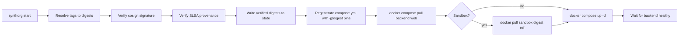

# Deployment & Container Runtime

SynthOrg ships as six container images to `ghcr.io/aureliolo/synthorg-{backend,web,sandbox,sidecar,fine-tune-gpu,fine-tune-cpu}`. The **backend** and **web** images are managed as Docker Compose services by the CLI. The **sandbox**, **sidecar**, and **fine-tune-{gpu,cpu}** images are not Compose services -- the CLI pre-pulls sandbox when requested, and the backend spawns sandbox/sidecar/fine-tune containers on demand via the Docker API. The CLI verifies cosign signatures for all enabled images (both Compose-managed and on-demand) before starting.

---

## Images we publish

| Image | Purpose | Base |
|-------|---------|------|
| `backend` | SynthOrg orchestration engine (Litestar + uvicorn) | apko-composed Wolfi base (`docker/backend/apko.yaml`, `python-3.14` resolved via apko lockfile); thin `docker/backend/Dockerfile` layers the uv-built venv on top |
| `web` | React SPA and built docs, served by **Caddy** | Pure apko (no Dockerfile); composes `caddy` + `ca-certificates-bundle` + melange-built `synthorg-web-assets` apk + `/etc/synthorg/Caddyfile` |
| `sandbox` | Ephemeral agent code execution image spawned on demand by the backend | apko-composed Wolfi base (`docker/sandbox/apko.yaml`) with `busybox` and `git`; fully rootless (UID 10001, cap_drop: ALL). Network enforcement handled by a separate sidecar proxy container |
| `sidecar` | Transparent network proxy sidecar for sandbox containers | apko-composed Wolfi base (`docker/sidecar/apko.yaml`) with `iptables` and `busybox`; Go binary providing dual-layer DNS + DNAT enforcement of `allowed_hosts` |
| `fine-tune-gpu` | Ephemeral embedding fine-tuning container (GPU variant, ~4 GB: torch with bundled CUDA runtime). Default when fine-tuning is enabled. **amd64 only**; requires an NVIDIA GPU + compatible host driver for practical training speed. | apko-composed Wolfi base (`docker/fine-tune/apko.yaml`) with Python 3.14 + openblas; thin `docker/fine-tune/Dockerfile` layers torch + sentence-transformers on top with `FINE_TUNE_EXTRA=fine-tune-gpu` |
| `fine-tune-cpu` | Ephemeral embedding fine-tuning container (CPU variant, ~1.7 GB: torch without CUDA). Safer default for hosts without an NVIDIA GPU; training is slower. **amd64 only** | Same base + Dockerfile as `fine-tune-gpu`; torch comes from `download.pytorch.org/whl/cpu` via `[tool.uv.sources]` when built with `FINE_TUNE_EXTRA=fine-tune-cpu` |

Each published image is signed with **cosign keyless** via GitHub OIDC in `.github/workflows/docker.yml` and attested with **SLSA Level 3 provenance**. **CycloneDX SBOMs** are generated per image and uploaded as GitHub Release artifacts. At pull/start time, `cli/internal/verify/verify.go` verifies cosign signatures and SLSA provenance (bypassable with `--skip-verify`); SBOM contents are not validated at runtime.

## apko-composed base images

The backend, sandbox, and sidecar images use a **Hybrid A** pattern: apko composes the base image declaratively from Wolfi packages (`python-3.14`, `git`, etc.) with exact versions resolved via `apko.lock.json`, and a thin Dockerfile layers the application on top (`FROM apko-base@sha256:...`, `COPY .venv`, `COPY src`, `ENTRYPOINT`). The sidecar image adds `iptables` for DNAT setup but the sandbox image is minimal (no iptables, no elevated privileges). The web image is **pure apko** -- no Dockerfile -- composing Caddy plus a melange-packaged static site bundle.

Wolfi is a separate distribution from Alpine. It reuses the `apk` package format but is built against **glibc**, not musl, so Python `manylinux` wheels install natively without source rebuilds and `uv` runs at full speed. This is the decisive reason Wolfi wins over both Alpine and Debian-slim for our workload.

Reconciliation mechanisms:

| Mechanism | Target | Cadence |
|-----------|--------|---------|
| Renovate (Docker ecosystem + digest pinning) | Thin Dockerfile `FROM` lines (apko-base digest) | Daily |
| `apko lock --update` cron (`.github/workflows/apko-lock.yml`) | `docker/*/apko.lock.json` (backend, sandbox, sidecar, fine-tune, web) | Weekly (Mon 06:00 UTC) -- the single `fine-tune` apko base is shared by both `-gpu` and `-cpu` runtime images |

## Image verification at launch

`synthorg start` runs `cli/internal/verify/verify.go` which resolves each tag to a digest, verifies the cosign signature and SLSA provenance, and writes the verified digest into `state.VerifiedDigests`. The digest-pinned references are then rendered into `compose.yml` so the started containers run exactly the image the CLI verified. `--skip-verify` bypasses this for air-gapped environments.

## Sandbox image resolution

When `--sandbox` is enabled, the CLI verifies the sandbox image alongside the others, pre-pulls it via `docker pull <digest-ref>` (the sandbox is **not** a compose service -- the backend spawns ephemeral sandbox containers on demand via `aiodocker`), and passes the digest-pinned reference to the backend container as `SYNTHORG_SANDBOX_IMAGE`. The backend's `DockerSandboxConfig.image` field reads this env var as its default via a Pydantic `default_factory`; explicit YAML under `sandboxing.docker.image` still wins when set. This keeps the CLI pin and the backend pin version-locked.

The backend gets `/var/run/docker.sock` mounted **read-write** (it needs `create`, `start`, `stop`, and `exec` on the daemon). The sandbox image retains a full shell plus `git` but no iptables -- it is fully rootless (UID 10001, `cap_drop: ALL`, `no-new-privileges`, read-only root filesystem). Per-host:port `allowed_hosts` network enforcement is handled by a separate sidecar proxy container that shares the sandbox's network namespace. The sidecar runs with `NET_ADMIN` (for iptables DNAT setup) and provides dual-layer enforcement: DNS filtering (allowed hostnames forwarded, denied get NXDOMAIN) and transparent TCP proxying (connections to unauthorized hosts are dropped with TCP RST).

## Web server

The web image runs **Caddy** inside a pure-apko Wolfi image. Caddy serves the React SPA at `/`, the built documentation at `/docs`, proxies REST requests at `/api/` and WebSocket connections at `/api/v1/ws` to the backend, and emits a per-request CSP nonce via the `templates` directive + `{http.request.uuid}` placeholder. The full security-header set (CSP, HSTS, X-Frame-Options, Referrer-Policy, Permissions-Policy) is configured in `web/Caddyfile`. Pre-compressed `.gz` siblings built by melange are served via Caddy's `precompressed gzip` file_server option.

---

## See Also

- [Tools](tools.md) -- sandbox backends, lifecycle strategies
- [Backup](backup.md) -- persistence snapshots and restore
- [Design Overview](index.md) -- full index
