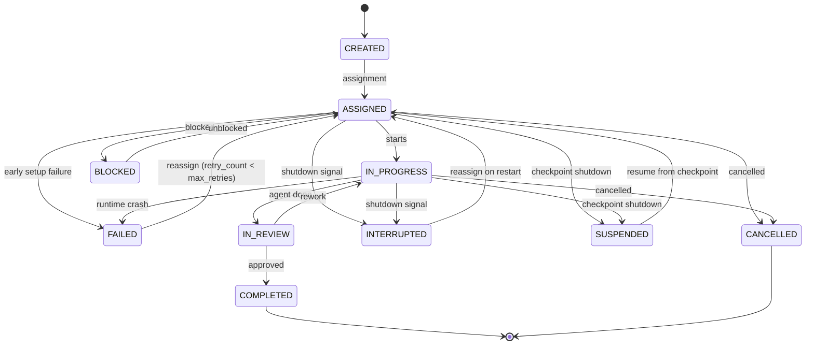

# Task & Workflow Engine

The task and workflow engine orchestrates how work flows through a synthetic
organization -- from task creation and assignment through agent execution,
crash recovery, and graceful shutdown. Every major subsystem (execution loops,
recovery strategies, shutdown strategies, workspace isolation) is implemented
behind a pluggable protocol interface.

---

## Task Lifecycle



!!! info "Non-terminal states"
    `BLOCKED`, `FAILED`, `INTERRUPTED`, and `SUSPENDED` are non-terminal:

    - **BLOCKED** returns to `ASSIGNED` when unblocked.
    - **FAILED** returns to `ASSIGNED` for retry when `retry_count < max_retries`
      (see [Crash Recovery](#agent-crash-recovery)).
    - **INTERRUPTED** returns to `ASSIGNED` on restart
      (see [Graceful Shutdown](#graceful-shutdown-protocol)).
    - **SUSPENDED** returns to `ASSIGNED` for resume from checkpoint
      (see [Graceful Shutdown](#graceful-shutdown-protocol), Strategy 4).
    - **COMPLETED** and **CANCELLED** are the only terminal states with no
      outgoing transitions.

!!! info "Runtime wrapper"
    During execution, `Task` is wrapped by `TaskExecution` (a frozen Pydantic
    model) that tracks status transitions via `model_copy(update=...)`,
    accumulates `TokenUsage` cost, and records a `StatusTransition` audit trail.
    The original `Task` is preserved unchanged; `to_task_snapshot()` produces a
    `Task` copy with the current execution status for persistence.

---

## Task Definition

```yaml
task:
  id: "task-123"
  title: "Implement user authentication API"
  description: "Create REST endpoints for login, register, logout with JWT tokens"
  type: "development"           # development, design, research, review, meeting, admin
  priority: "high"              # critical, high, medium, low
  project: "proj-456"
  created_by: "product_manager_1"
  assigned_to: "sarah_chen"
  reviewers: ["engineering_lead", "security_engineer"]
  dependencies: ["task-120", "task-121"]
  artifacts_expected:
    - type: "code"
      path: "src/auth/"
    - type: "tests"
      path: "tests/auth/"
    - type: "documentation"
      path: "docs/api/auth.md"
  acceptance_criteria:
    - "JWT-based auth with refresh tokens"
    - "Rate limiting on login endpoint"
    - "Unit and integration tests with >80% coverage"
    - "API documentation"
  estimated_complexity: "medium"  # simple, medium, complex, epic
  task_structure: "parallel"      # sequential, parallel, mixed
  coordination_topology: "auto"  # auto, sas, centralized, decentralized, context_dependent
  budget_limit: 2.00             # max spend for this task in base currency (display formatted per budget.currency)
  deadline: null
  max_retries: 1                 # max reassignment attempts after failure (0 = no retry)
  status: "assigned"
  parent_task_id: null           # parent task ID when created via delegation
  delegation_chain: []           # ordered agent IDs of delegators (root first)
```

`task_structure` and `coordination_topology` are described in
[Task Decomposability & Coordination Topology](#task-decomposability-coordination-topology).

---

## Workflow Types

The framework supports four workflow types for organizing task execution:

### Sequential Pipeline

```text
Requirements --> Design --> Implementation --> Review --> Testing --> Deploy
```

### Parallel Execution

```text
        ┌--> Frontend Dev --┐
Task ---|                    |---> Integration --> QA
        └--> Backend Dev  --┘
```

The `ParallelExecutor` implements concurrent agent execution with
`asyncio.TaskGroup`, configurable concurrency limits, resource locking for
exclusive file access, error isolation, and progress tracking.

### Kanban Board

```text
Backlog | Ready | In Progress | Review | Done
   o    |   o   |      *      |   o    |  ***
   o    |   o   |      *      |        |  **
   o    |       |             |        |  *
```

The `KanbanColumn` enum defines five columns that map bidirectionally to
`TaskStatus` (Backlog=CREATED, Ready=ASSIGNED, In Progress=IN_PROGRESS,
Review=IN_REVIEW, Done=COMPLETED).  Off-board statuses (BLOCKED, FAILED,
INTERRUPTED, SUSPENDED, CANCELLED) map to `None`.  `KanbanConfig` provides per-column
WIP limits with strict (hard-reject) or advisory (log-warning) enforcement.
Column transitions are validated independently and resolved to the underlying
task status transition path.

### Agile Kanban

The fourth workflow type combines the Kanban board columns with Agile
sprint time-boxing.  The `WorkflowType.AGILE_KANBAN` enum value selects
this combined mode; `WorkflowConfig` aggregates both `KanbanConfig` and
`SprintConfig` under a single top-level section (`workflow`) in the root
configuration.

```text
Planning --> Active --> In Review --> Retrospective --> Completed
```

The `SprintStatus` lifecycle is strictly linear: PLANNING, ACTIVE,
IN_REVIEW, RETROSPECTIVE, COMPLETED.  Each sprint is a discrete
lifecycle -- a new sprint is created after the previous one completes
(no automatic cycling).  The `Sprint` model tracks task IDs, story
points (committed and completed), dates, and duration.  Sprint backlog
management functions enforce status-dependent gates (e.g. tasks can only be
added during PLANNING).  `SprintConfig` defines sprint duration, task limits,
velocity window, and ceremony configurations that integrate with the meeting
protocol system (`MeetingProtocolType` and `MeetingFrequency`).
`VelocityRecord` captures delivery metrics from completed sprints with a
rolling average calculation.

Builtin templates declare a `workflow_config` section with default
Kanban/Sprint sub-configurations (WIP limits, sprint duration, ceremonies).
The template renderer maps these into the root `WorkflowConfig` during
rendering.  Template variables (`sprint_length`, `wip_limit`) allow users
to customize workflow settings at template instantiation time.

!!! info "Ceremony Scheduling"
    Sprint ceremony runtime scheduling -- including pluggable strategies,
    velocity calculation, 3-level config resolution, and sprint auto-transition
    -- is documented on the dedicated [Ceremony Scheduling](ceremony-scheduling.md)
    design page.

---

## Workflow Definitions (Visual Editor)

A **WorkflowDefinition** is a design-time blueprint -- a visual directed graph that can be persisted, validated, and exported as YAML for the engine's coordination/decomposition system. This is distinct from the runtime `WorkflowConfig` (Kanban/Sprint settings above).

### Node Types (`WorkflowNodeType`)

| Type | Purpose |
|------|---------|
| `start` | Single entry point (exactly one required) |
| `end` | Single exit point (exactly one required) |
| `task` | A task step with title, type, priority, complexity, coordination topology |
| `agent_assignment` | Routing strategy and role filter for agent selection |
| `conditional` | Boolean branch (true/false outgoing edges) |
| `parallel_split` | Fan-out to 2+ parallel branches |
| `parallel_join` | Fan-in with configurable join strategy (all/any) |

### Edge Types (`WorkflowEdgeType`)

| Type | Semantics |
|------|-----------|
| `sequential` | Default linear flow |
| `conditional_true` / `conditional_false` | Boolean branch from conditional nodes |
| `parallel_branch` | From parallel split to branch targets |

### Validation

`validate_workflow()` checks semantic correctness beyond model-level structural integrity:

- All nodes reachable from START; END reachable from START
- Conditional nodes must have exactly one TRUE and one FALSE outgoing edge
- Parallel split nodes need 2+ parallel_branch edges
- Task nodes require a `title` in config
- No cycles in the graph

### YAML Export

`export_workflow_yaml()` performs topological sort and emits a flat step list with `depends_on` references, `agent_assignment` config, conditional expressions, and parallel branch/join metadata. START and END nodes are omitted (structural markers only). `depends_on` entries are either a plain string (sequential/parallel edges) or an object `{ id, branch: "true"|"false" }` (conditional edges with explicit branch metadata). The importer prefers explicit branch metadata when present and falls back to counter-based inference for backward compatibility with plain strings.

### Persistence

`WorkflowDefinitionRepository` provides CRUD via SQLite with JSON-serialized nodes/edges. The `/workflows` API controller exposes 14 endpoints: list, get, create, update (with optimistic concurrency), delete, validate, validate draft, export, list blueprints, create from blueprint, list version history, get version diff, rollback to previous version, and get single version.

#### Version History

Workflow definitions are versioned via the generic `VersionSnapshot[WorkflowDefinition]` infrastructure (see `src/synthorg/versioning/`). Each create, update, or rollback operation calls `VersioningService[WorkflowDefinition].snapshot_if_changed()` to persist a content-addressable snapshot. The `workflow_definition_versions` table uses the generic `(entity_id, version, content_hash, snapshot, saved_by, saved_at)` schema shared by all versioned entity types -- `saved_by` records the actor who triggered the mutation and `saved_at` records the UTC timestamp of the snapshot. Content-hash deduplication skips no-change saves; concurrent writes are resolved via `INSERT OR IGNORE` with conflict retry.

### Workflow Execution

When a user **activates** a workflow definition, the `WorkflowExecutionService`
creates a `WorkflowExecution` instance that tracks per-node processing state
and maps TASK nodes to concrete `Task` instances created via the `TaskEngine`.

**Strategy: Eager instantiation.** All tasks on reachable paths are created
upfront at activation time with `Task.dependencies` wired from the graph
topology. The TaskEngine's existing status machine handles execution ordering.

**Activation algorithm** (topological walk):

1. Validate the definition via `validate_workflow()`.
2. Build adjacency maps and topological sort via shared `graph_utils`.
3. Walk nodes in topological order:
   - **START/END**: Mark `COMPLETED` (structural markers, no tasks).
   - **AGENT_ASSIGNMENT**: Mark `COMPLETED`; stash `agent_name` config for
     downstream TASK nodes.
   - **TASK**: Create a concrete task via `TaskEngine.create_task()`. Resolve
     upstream TASK dependencies by reverse-walking through control nodes.
     Apply `assigned_to` from any preceding agent assignment. Mark
     `TASK_CREATED` with the created `task_id`.
   - **CONDITIONAL**: Evaluate `condition_expression` against the provided
     runtime `context` dict using a safe string evaluator. Mark the untaken
     branch's downstream nodes as `SKIPPED`.
   - **PARALLEL_SPLIT/JOIN**: Mark `COMPLETED`. Branch targets proceed with
     no mutual dependency; join semantics are handled by dependency wiring.
4. Transition execution to `RUNNING` status; persist.

**Execution lifecycle** (`WorkflowExecutionStatus`): `PENDING` (created) ->
`RUNNING` (tasks instantiated) -> `COMPLETED` | `FAILED` | `CANCELLED`.

**Per-node tracking** (`WorkflowNodeExecutionStatus`): `PENDING`, `SKIPPED`
(conditional branch not taken), `TASK_CREATED` (concrete task instantiated),
`TASK_COMPLETED` (task finished successfully), `TASK_FAILED` (task failed or
cancelled), `COMPLETED` (control node processed).

**Condition evaluator** (`condition_eval.py`): Safe string evaluator
(no `eval()`/`exec()`). Supports boolean literals (`true`/`false`), context
key lookup (truthy check), equality (`key == value`), inequality
(`key != value`), compound operators (`AND`, `OR`, `NOT` --
case-insensitive), and parenthesized groups. Operator precedence:
NOT > AND > OR. Simple expressions without compound operators take a
zero-overhead quick path. Parse errors are logged and resolve to `False`.

**Persistence**: `WorkflowExecutionRepository` with SQLite implementation.
`node_executions` stored as JSON array (same pattern as definition
nodes/edges). Optimistic concurrency via version counter.

**API endpoints** (`/workflow-executions` controller):

| Method | Path | Description |
|--------|------|-------------|
| POST | `/activate/{workflow_id}` | Activate a workflow definition |
| GET | `/by-definition/{workflow_id}` | List executions for a definition |
| GET | `/{execution_id}` | Get a specific execution |
| POST | `/{execution_id}/cancel` | Cancel an execution |

---

## Task Routing & Assignment

Tasks can be assigned through multiple strategies:

| Strategy | Description |
|----------|-------------|
| **Manual** | Human or manager explicitly assigns |
| **Role-based** | Auto-assign to agents with matching role/skills |
| **Load-balanced** | Distribute evenly across available agents |
| **Auction** | Agents "bid" on tasks based on confidence/capability |
| **Hierarchical** | Flow down through management chain |
| **Cost-optimized** | Assign to cheapest capable agent |

All six strategies are implemented behind the `TaskAssignmentStrategy` protocol.
Scoring-based strategies filter out agents at capacity via
`AssignmentRequest.max_concurrent_tasks`. `ManualAssignmentStrategy` raises
exceptions on failure; scoring-based strategies return
`AssignmentResult(selected=None)`.

---

## TaskEngine -- Centralized State Coordination

All task state mutations flow through a single-writer `TaskEngine` that owns the
authoritative task state. This eliminates race conditions when multiple agents
attempt concurrent transitions on the same task.

### Architecture

```text
Agent / API  ──submit()──▶  asyncio.Queue  ──▶  _processing_loop  ──▶  Persistence
                                                    │
                                                    ├──▶  Version tracking (optimistic concurrency)
                                                    ├──▶  Snapshot publishing (MessageBus)
                                                    └──▶  _observer_queue  ──▶  _observer_dispatch_loop  ──▶  Observers
```

- **Single writer**: A background `asyncio.Task` consumes `TaskMutation`
  requests sequentially from an `asyncio.Queue`.
- **Immutable-style updates**: Each mutation constructs a new `Task` instance
  from the previous one (for example via
  `Task.model_validate({**task.model_dump(), **updates})` or
  `Task.with_transition(...)`); the existing instance is never mutated.
- **Optimistic concurrency**: Per-task version counters held in-memory
  (volatile).  An unknown task is seeded at version 1 on first access --
  this is a heuristic baseline, **not** loaded from persistence.  Version
  tracking resets on engine restart; durable persistence of versions is a
  future enhancement.  Callers can pass `expected_version` to detect stale
  writes; on mismatch the engine returns a failed `TaskMutationResult`
  with `error_code="version_conflict"`.  Convenience methods raise
  `TaskVersionConflictError`.
- **Read-through**: `get_task()` and `list_tasks()` bypass the queue and
  read directly from persistence -- safe because TaskEngine is the sole writer.
- **Snapshot publishing**: On success, a `TaskStateChanged` event is published
  to the message bus for downstream consumers (WebSocket bridge, audit, etc.).

### Mutation Types

| Mutation | Description |
|----------|-------------|
| `CreateTaskMutation` | Generates a unique ID, persists, and returns the new task. |
| `UpdateTaskMutation` | Applies field updates with immutable-field rejection (`id`, `status`, `created_by`) and re-validates via `model_validate`. |
| `TransitionTaskMutation` | Validates status transition via `Task.with_transition()`, supports field overrides. |
| `DeleteTaskMutation` | Removes from persistence and clears version tracking. |
| `CancelTaskMutation` | Shortcut for transition to `CANCELLED`. |

### Error Handling

- **Typed errors**: `TaskNotFoundError` and `TaskVersionConflictError` provide
  precise failure classification -- API controllers catch these directly instead
  of parsing error strings.
- **Error sanitization**: Internal exception details (file paths, URLs) are
  redacted via a shared ``sanitize_message()`` helper
  (``engine/sanitization.py``) before reaching callers or LLM context.
  Long messages are truncated, which also limits stack trace exposure.
  Applied in ``_handle_fatal_error``, checkpoint reconciliation, and
  compaction summaries.
- **Queue full**: `TaskEngineQueueFullError` signals backpressure when the
  queue is at capacity.

### Lifecycle

- **start()**: Spawns two background tasks: the mutation processing loop
  and the observer dispatch loop.
- **stop()**: Sets `_running = False`, drains the mutation queue within a
  configurable timeout, then places a `None` sentinel on the observer
  queue to signal completion. The observer dispatch loop exits when it
  dequeues the sentinel. Remaining timeout budget is used for observer
  drain. Abandoned futures receive a failure result.

### AgentEngine ↔ TaskEngine Incremental Sync

`AgentEngine` syncs task status transitions to `TaskEngine` incrementally at
each lifecycle point, rather than reporting only the final status. This gives
real-time visibility into execution progress and improves crash recovery
(a crash mid-execution leaves the task at the last-reached stage, not stuck
at `ASSIGNED`).

**Transition sequences** (1--2 `submit()` calls per execution, bounded):

| Path | Synced transitions |
|------|--------------------|
| Happy (review-gated) | `IN_PROGRESS` → `IN_REVIEW` (review gate) |
| Shutdown | `IN_PROGRESS` → `INTERRUPTED` |
| Error | `IN_PROGRESS` → `FAILED` (after recovery) |
| MAX_TURNS / BUDGET | `IN_PROGRESS` only |

**Semantics:**

- **Best-effort**: Sync failures are logged and swallowed -- agent execution
  is never blocked by a TaskEngine issue. Each sync failure is isolated and
  does not prevent subsequent transitions.
- **Critical IN_PROGRESS**: The initial `ASSIGNED → IN_PROGRESS` sync is
  logged at `ERROR` on failure (TaskEngine state coherence for all subsequent
  transitions depends on it).  Other sync failures log at `WARNING`.
- **Direct `submit()`**: Uses `TaskEngine.submit()` with
  `TransitionTaskMutation` directly (not the convenience `transition_task()`
  method) to inspect `TaskMutationResult` success/failure without exception
  propagation, keeping sync best-effort.
- **No concurrency concern**: Each task has exactly one executing agent at
  any time. Parallel agents operate on separate tasks.

**Snapshot channel**: TaskEngine publishes `TaskStateChanged` events to the
`"tasks"` channel (matching `CHANNEL_TASKS` in `api.channels`) so events
reach the `MessageBusBridge` and WebSocket consumers.

### Observer Mechanism

In addition to message-bus publishing, `TaskEngine` supports an observer
pattern for in-process consumers that need to react asynchronously to
task state changes.

**Registration**: `register_observer()` accepts an async callback with
signature `Callable[[TaskStateChanged], Awaitable[None]]`. Observers
are stored in registration order.

**Dispatch architecture**: Observer notifications are decoupled from the
mutation pipeline via a dedicated `_observer_queue` and background
`_observer_dispatch_loop`. After a successful mutation, the processing
loop enqueues a `TaskStateChanged` event with `put_nowait()`. The
observer dispatch loop dequeues events and invokes all registered
observers sequentially per event. If the observer queue is full, the
event is logged at WARNING and dropped (best-effort delivery).

**Notification semantics**: best-effort. Observer errors are logged at
WARNING and swallowed (`MemoryError` and `RecursionError` propagate) --
a failing observer never blocks the mutation pipeline or prevents
subsequent observers from running.

**`WorkflowExecutionObserver`** is the first registered observer. It
bridges TaskEngine state changes into the workflow execution lifecycle:

- On `COMPLETED`, `FAILED`, or `CANCELLED` task transitions,
  `handle_task_state_changed` looks up the workflow execution (if any)
  that owns the task.
- It updates the corresponding `WorkflowNodeExecution` status and
  evaluates whether the overall workflow execution should transition
  (all tasks done -> `COMPLETED`, any task failed or cancelled -> `FAILED`).
- The node status update and execution transition are persisted in a
  single repository save to avoid inconsistent intermediate states.

---

## Agent Execution Status

The `ExecutionStatus` enum (in `core/enums.py`) tracks the per-agent runtime
execution state:

| Status | Meaning |
|--------|---------|
| `IDLE` | Agent is not currently executing -- no active task or execution run. |
| `EXECUTING` | Agent is actively processing a task within an execution loop. |
| `PAUSED` | Agent is waiting for an external event (e.g. approval gate). |

`ExecutionStatus` is consumed by `AgentRuntimeState` (in `engine/agent_state.py`),
which is persisted via `AgentStateRepository` for dashboard queries and
graceful-shutdown discovery. See the [Agents design page](agents.md#runtime-state)
for how `AgentRuntimeState` fits into the runtime state layer.

---

## Agent Execution Loop

The agent execution loop defines how an agent processes a task from start to
finish. The framework provides multiple configurable loop architectures behind
an `ExecutionLoop` protocol, making the system extensible. The default can vary
by task complexity and is configurable per agent or role.

### ExecutionLoop Protocol

All loop implementations satisfy the `ExecutionLoop` runtime-checkable protocol:

`get_loop_type() -> str`
:   Returns a unique identifier (e.g., `"react"`).

`execute(...) -> ExecutionResult`
:   Runs the loop to completion, accepting `AgentContext`,
    `CompletionProvider`, optional `ToolInvoker`, optional `BudgetChecker`,
    optional `ShutdownChecker`, and optional `CompletionConfig`.

**Supporting models:**

`TerminationReason`
:   Enum: `COMPLETED`, `MAX_TURNS`, `BUDGET_EXHAUSTED`, `SHUTDOWN`, `STAGNATION`,
    `ERROR`, `PARKED`.  `max_turns` defaults to 20.

`TurnRecord`
:   Frozen per-turn stats (tokens, cost, tool calls, finish reason).

`ExecutionResult`
:   Frozen outcome with final context, termination reason, turn records, and
    optional error message (required when reason is `ERROR`).

`BudgetChecker`
:   Callback type `Callable[[AgentContext], bool]` invoked before each LLM call.

`ShutdownChecker`
:   Callback type `Callable[[], bool]` checked at turn boundaries to initiate
    cooperative shutdown.

### Loop Implementations

=== "Loop 1: ReAct"

    **Default for Simple Tasks**

    A single interleaved loop: the agent reasons about the current state,
    selects an action (tool call or response), observes the result, and repeats
    until done or `max_turns` is reached.

    ```mermaid
    graph LR
        A[Think] --> B[Act]
        B --> C[Observe]
        C --> A
        C --> D{Terminate?}
        D -->|task complete, max turns,<br/>budget exhausted, or error| E[Done]
    ```

    ```yaml
    execution_loop: "react"              # react, plan_execute, hybrid, auto
    ```

    | | |
    |---|---|
    | **Strengths** | Simple, proven, flexible. Easy to implement. Works well for short tasks. |
    | **Weaknesses** | Token-heavy on long tasks (re-reads full context every turn). No long-term planning -- greedy step-by-step. |
    | **Best for** | Simple tasks, quick fixes, single-file changes. |

=== "Loop 2: Plan-and-Execute"

    A two-phase approach: the agent first generates a step-by-step plan, then
    executes each step sequentially. On failure, the agent can replan. Different
    models can be used for planning vs execution (e.g., large model for
    planning, small model for execution steps).

    ```mermaid
    graph LR
        A[Plan<br/>1 call] --> B[Execute Steps<br/>N calls]
        B --> C{Step failed?}
        C -->|yes| A
        C -->|no| D[Done]
    ```

    ```yaml
    execution_loop: "plan_execute"
    plan_execute:
      planner_model: null              # null = use agent's model; override for cost optimization
      executor_model: null
      max_replans: 3
    ```

    | | |
    |---|---|
    | **Strengths** | Token-efficient for long tasks. Auditable plan artifact. Supports model tiering. |
    | **Weaknesses** | Rigid -- plan may be wrong, replanning is expensive. Over-plans simple tasks. |
    | **Best for** | Complex multi-step tasks, epic-level work, tasks spanning multiple files. |

=== "Loop 3: Hybrid Plan + ReAct Steps"

    **Recommended for Complex Tasks**

    The agent creates a high-level plan (3--7 steps). Each step is executed as a
    mini-ReAct loop with its own turn limit. After each step, the agent
    checkpoints -- summarizing progress and optionally replanning remaining
    steps. Checkpoints are natural points for human inspection or task
    suspension.

    ```mermaid
    graph TD
        A[Plan] --> B[Step 1: mini-ReAct]
        B --> C[Checkpoint: summarize progress]
        C --> D[Step 2: mini-ReAct]
        D --> E[Checkpoint: replan if needed]
        E --> F[Step N: mini-ReAct]
        F --> G[Done]
    ```

    ```yaml
    execution_loop: "hybrid"
    hybrid:
      planner_model: null
      executor_model: null
      max_plan_steps: 7
      max_turns_per_step: 5
      max_replans: 3
      checkpoint_after_each_step: true
      allow_replan_on_completion: true
    ```

    | | |
    |---|---|
    | **Strengths** | Strategic planning + tactical flexibility. Natural checkpoints for suspension/inspection. |
    | **Weaknesses** | Most complex to implement. Plan granularity needs tuning per task type. |
    | **Best for** | Complex tasks, multi-file refactoring, tasks requiring both planning and adaptivity. |

!!! tip "Auto-selection"
    When `execution_loop: "auto"`, the framework selects the loop via three
    layers:

    1. **Rule matching** -- maps `estimated_complexity` to a loop type:
       simple -> ReAct, medium -> Plan-and-Execute, complex/epic -> Hybrid.
       Configurable via `AutoLoopConfig.rules` (a tuple of `AutoLoopRule`).
       When no rule matches, falls back to `default_loop_type` (default:
       react).  All loop types in rules, `hybrid_fallback`, and
       `default_loop_type` are validated against the known set at
       construction time.
    2. **Budget-aware downgrade** -- when monthly budget utilization is at
       or above `budget_tight_threshold` (default 80%), hybrid selections
       are downgraded to plan_execute to conserve budget.
    3. **Hybrid fallback** -- when `hybrid_fallback` is set (default:
       `None`), redirects hybrid selections to the specified loop type.
       With `None` (default), the hybrid loop runs directly.

### AgentEngine Orchestrator

`AgentEngine` is the top-level entry point for running an agent on a task. It
composes the execution loop with prompt construction, context management, tool
invocation, and cost tracking into a single `run()` call. When an
`auto_loop_config` is provided (mutually exclusive with `execution_loop`),
the engine dynamically selects the loop per task via `_resolve_loop()`.
Optional `plan_execute_config`, `hybrid_loop_config`, and
`compaction_callback` are forwarded to the auto-selected loop so it
receives the same configuration as a statically configured loop.

The engine also exposes an optional ``coordinate()`` method that delegates to a
``MultiAgentCoordinator`` when one is configured (see :doc:`coordination`).

**Signature:**

```python
async run(
    identity, task, completion_config?, max_turns?,
    memory_messages?, timeout_seconds?, effective_autonomy?
) -> AgentRunResult
```

**Pipeline steps:**

1. **Validate inputs** -- agent must be `ACTIVE`, task must be `ASSIGNED` or
   `IN_PROGRESS`. Raises `ExecutionStateError` on violation.
2. **Pre-flight budget enforcement** -- if `BudgetEnforcer` is provided, check
   monthly hard stop and daily limit via `check_can_execute()`, then apply
   auto-downgrade via `resolve_model()`. Raises `BudgetExhaustedError` or
   `DailyLimitExceededError` on violation.
3. **Project validation** -- if `ProjectRepository` is provided, validate that the
   task's project exists (`ProjectNotFoundError` if not) and that the agent is a
   member of the project team (`ProjectAgentNotMemberError` if not; empty teams
   allow any agent). When the project has a non-zero budget and `BudgetEnforcer`
   is available, check project-level budget via `check_project_budget()`. Raises
   `ProjectBudgetExhaustedError` when the project's accumulated cost has reached
   its budget. Pre-flight project budget checks are best-effort under concurrency
   (TOCTOU); the in-flight `BudgetChecker` closure provides the true safety net.
4. **Build system prompt** -- calls `build_system_prompt()` with agent identity,
   task, and resolved model tier. The tier determines a `PromptProfile` that
   controls prompt verbosity (see [Prompt Profiles](#prompt-profiles) below),
   including personality token trimming when the section exceeds the profile's
   `max_personality_tokens` budget. Trimming metadata is returned in
   `SystemPrompt.personality_trim_info`.
   Tool definitions are NOT included in the prompt; they are supplied via the
   API's `tools` parameter ([Decision Log](../architecture/decisions.md) D22).
   Follows the **non-inferable-only principle**: system prompts include only
   information the agent cannot discover by reading the codebase or environment
   (role constraints, custom conventions, organizational policies).
5. **Create context** -- `AgentContext.from_identity()` with the configured
   `max_turns`.
6. **Seed conversation** -- injects system prompt, optional memory messages, and
   formatted task instruction as initial messages.
7. **Transition task** -- `ASSIGNED` -> `IN_PROGRESS` (pass-through if already
   `IN_PROGRESS`).
8. **Prepare tools and budget** -- creates `ToolInvoker` from registry and
   `BudgetChecker` from `BudgetEnforcer` (task + monthly + daily + project limits
   with pre-computed baselines and alert deduplication) or from task budget limit
   alone when no enforcer is configured.
9. **Resolve execution loop** -- if `auto_loop_config` is set, calls
   `select_loop_type()` with the task's `estimated_complexity` and current
   budget utilization (via `BudgetEnforcer.get_budget_utilization_pct()`).
   Budget-aware downgrade: hybrid is downgraded to plan_execute when
   utilization >= threshold.  Optional hybrid fallback applies when
   `hybrid_fallback` is configured.  When no auto config is set, uses
   the statically configured loop.  The auto-selected loop receives the
   engine's `compaction_callback`, `plan_execute_config` (for
   plan-execute), and `hybrid_loop_config` (for hybrid), along with the
   approval gate and stagnation detector.
10. **Delegate to loop** -- calls `ExecutionLoop.execute()` with context,
   provider, tool invoker, budget checker, and completion config. If
   `timeout_seconds` is set, wraps the call in `asyncio.wait`; on expiry
   the run returns with `TerminationReason.ERROR` but cost recording and
   post-execution processing still occur.
   When escalations are detected after tool execution (via
   `ToolInvoker.pending_escalations`), the `ApprovalGate` evaluates whether
   parking is needed. If so, the context is serialized via `ParkService`
   and persisted when a `ParkedContextRepository` is configured; the loop
   then returns a `PARKED` result.
11. **Record costs** -- records accumulated `TokenUsage` to `CostTracker` (if
    available), tagged with `project_id` for project-level cost aggregation.
    Cost recording failures are logged but do not affect the result.
12. **Apply post-execution transitions:**
    - `COMPLETED` termination: IN_PROGRESS -> IN_REVIEW (review gate).
      The task parks at IN_REVIEW until resolved by one of two paths:
      (a) a human approves (-> COMPLETED) or rejects (-> IN_PROGRESS
      for rework) via the approval API, or (b) the
      ``ApprovalTimeoutScheduler`` applies a configured timeout policy
      (auto-approve, auto-deny, or escalate).  Both paths delegate to
      ``ReviewGateService`` for the actual state transition.

      ``ReviewGateService`` structurally enforces no-self-review: if
      the decider equals ``task.assigned_to``, it raises
      ``SelfReviewError`` (surfaced as HTTP 403 at the approval
      controller, with a generic message that never echoes internal
      agent/task identifiers) and no transition occurs.  The check
      runs in two phases: the approval controller calls
      ``check_can_decide`` as a **preflight** *before*
      ``approval_store.save_if_pending`` -- this guarantees a rejected
      self-review attempt never leaves a decided approval row or a
      broadcast WebSocket event behind.  ``complete_review``
      independently re-runs the check as defense-in-depth at the
      service boundary; the service makes no assumption that the
      caller ran the preflight.  ``TaskNotFoundError`` maps to 404
      and ``TaskVersionConflictError`` to 409, both with generic
      messages to avoid leaking task UUIDs via error bodies.

      The service attempts to append a ``DecisionRecord`` to the
      auditable decisions drop-box (``DecisionRepository``) for every
      completed review -- capturing executor, reviewer, outcome,
      approval-ID cross-reference, and an acceptance-criteria snapshot.
      This append is **best-effort**: known transient persistence
      failures (``QueryError`` / ``DuplicateRecordError``) are logged
      via ``logger.exception`` and do NOT roll back the state
      transition (the transition is the source of truth; the drop-box
      is the audit trail).  Programming errors (``ValidationError``,
      ``TypeError``, ``AttributeError``) are deliberately NOT caught --
      they propagate loudly so schema drift surfaces in dev/CI instead
      of being masked as silent audit loss.  See the "Review Gate
      Invariants" section of ``docs/design/operations.md`` for the
      full three-layer enforcement model (service preflight, Pydantic
      validator, SQL CHECK constraint).

      **Identity versioning (#1076, implemented):** Agent identities
      are versioned as first-class artifacts via the generic
      ``VersioningService[T]`` infrastructure. ``ReviewGateService``
      looks up the executing agent's latest identity version and injects
      ``charter_version: {agent_id, version, content_hash}`` into the
      ``DecisionRecord.metadata`` field (best-effort; lookup failure
      is logged at WARNING and the decision record is still written).
      See ``docs/design/agents.md`` for the full design.
    - `SHUTDOWN` termination: current status -> INTERRUPTED (or SUSPENDED
      if the checkpoint strategy successfully checkpointed the task;
      see [Graceful Shutdown](#graceful-shutdown-protocol)).
    - `ERROR` termination: recovery strategy is applied (default
      `FailAndReassignStrategy` transitions to FAILED;
      see [Crash Recovery](#agent-crash-recovery)).
    - All other termination reasons (`MAX_TURNS`, `BUDGET_EXHAUSTED`,
      `STAGNATION`, `PARKED`) leave the task in its current state.
      `STAGNATION` indicates the agent was stuck in a repetitive loop.
      `PARKED` indicates the agent was
      suspended by an approval-timeout policy; the task remains at its current
      status until explicitly resumed.
    - Each transition is synced to TaskEngine incrementally (see
      [AgentEngine ↔ TaskEngine Incremental Sync](#agentengine--taskengine-incremental-sync)).
    - Transition failures are logged but do not discard the successful execution
      result.
13. **Procedural memory generation** (non-critical) -- when
    `ProceduralMemoryConfig` is enabled and the execution failed
    (recovery_result exists), a separate proposer LLM call analyses the
    failure and stores a `PROCEDURAL` memory entry for future retrieval.
    Optionally materializes a SKILL.md file. Failures are logged but do
    not affect the result (see [Memory > Procedural Memory Auto-Generation](memory.md#procedural-memory-auto-generation)).
14. **Return result** -- wraps `ExecutionResult` in `AgentRunResult` with
    engine-level metadata.

**Error handling:** `MemoryError` and `RecursionError` propagate
unconditionally. `BudgetExhaustedError` (including `DailyLimitExceededError`)
returns `TerminationReason.BUDGET_EXHAUSTED` without recovery -- budget
exhaustion is a controlled stop, not a crash. All other exceptions are caught
and wrapped in an `AgentRunResult` with `TerminationReason.ERROR`.

???+ note "AgentRunResult model"
    `AgentRunResult` is a frozen Pydantic model wrapping `ExecutionResult`
    with engine metadata:

    - `execution_result` -- outcome from the execution loop
    - `system_prompt` -- the `SystemPrompt` used for this run
    - `duration_seconds` -- wall-clock run time
    - `agent_id`, `task_id` -- identifiers
    - Computed fields: `termination_reason`, `total_turns`, `total_cost_usd`,
      `is_success`, `completion_summary`

---

## Prompt Profiles

Auto-downgrade changes the model tier but the system prompt must adapt too.
A `PromptProfile` controls how verbose and detailed the system prompt is for
each model tier.

### Built-in Profiles

| Profile    | Tier   | Personality          | Max Personality Tokens | Org Policies | Acceptance Criteria | Autonomy |
|------------|--------|----------------------|------------------------|--------------|---------------------|----------|
| **full**   | large  | Full behavioral enums | 500                   | Included     | Nested list         | Full     |
| **standard** | medium | Description + style + traits | 200              | Included     | Nested list         | Summary  |
| **basic**  | small  | Style keyword only   | 80                     | Excluded     | Flat semicolon line | Minimal  |

### Personality Trimming

When the personality section exceeds `max_personality_tokens`, progressive
trimming enforces the budget as a secondary control after `personality_mode`:

1. **Tier 1 -- Drop enums**: override mode to `"condensed"` (removes behavioral
   enum fields like risk_tolerance, creativity, verbosity, etc.)
2. **Tier 2 -- Truncate description**: shorten `personality_description` to fit
   the remaining budget (word-boundary aware, appends `"..."`)
3. **Tier 3 -- Minimal fallback**: override mode to `"minimal"`
   (`communication_style` only)

Trimming metadata is attached to `SystemPrompt.personality_trim_info`
(`PersonalityTrimInfo` model with `before_tokens`, `after_tokens`,
`max_tokens`, `trim_tier`, and `budget_met` computed field). Runtime
settings in the `ENGINE` namespace control trimming
(`personality_trimming_enabled`, `personality_max_tokens_override`,
`personality_trimming_notify`).

**Dashboard notification**: when trimming activates and
`personality_trimming_notify` is enabled (default `true`), `AgentEngine`
publishes a `WsEvent(event_type=WsEventType.PERSONALITY_TRIMMED)` on the
`agents` WebSocket channel. The payload carries `agent_id`, `agent_name`,
`task_id`, `before_tokens`, `after_tokens`, `max_tokens`, `trim_tier`, and
`budget_met`. The dashboard subscribes via the global `useGlobalNotifications`
hook and renders a live toast so operators see token-budget pressure in
real time. Publishing is best-effort: failures log
`prompt.personality.notify_failed` at WARNING and never block task
execution (`MemoryError`, `RecursionError`, and `asyncio.CancelledError`
propagate per the standard best-effort publisher contract). Wiring the
notifier callback is the responsibility of the engine host; API-layer
integrations use the `synthorg.api.app.make_personality_trim_notifier`
factory to build a callback bound to the live `ChannelsPlugin`.

### Tier Flow

1. Template YAML specifies agent tier (`large`/`medium`/`small`)
2. Model matcher resolves tier to a concrete model, stores `model_tier` in
   `ModelConfig`
3. Budget auto-downgrade updates `model_tier` when the target alias is a
   canonical tier name (`large`/`medium`/`small`); non-tier aliases (e.g.
   `"local-small"`) leave `model_tier` unchanged
4. Engine reads the preserved or updated `identity.model.model_tier` and passes
   it to `build_system_prompt()`
5. Prompt builder resolves `PromptProfile` and adapts template rendering

### Invariants

- **Authority** and **Identity** sections are **never** stripped regardless of
  profile
- When `model_tier` is `None` (unknown), the **full** profile is used as a safe
  default
- Profile selection is logged via `prompt.profile.selected` (with
  `requested_tier`, `selected_tier`, and `defaulted` flag);
  `prompt.profile.default` is emitted at DEBUG level when falling back
  to the full profile
- Personality trimming is logged via `prompt.personality.trimmed` (with
  `before_tokens`, `after_tokens`, `max_tokens`, and `trim_tier`)

---

## Stagnation Detection

Agents can persist in unproductive loops, repeating the same tool calls without
making progress. Stagnation detection analyzes `TurnRecord` tool call history
across a sliding window, intervenes with a corrective prompt injection, and
terminates early with `STAGNATION` if correction fails.

### Protocol Interface

```python
@runtime_checkable
class StagnationDetector(Protocol):
    async def check(
        self,
        turns: tuple[TurnRecord, ...],
        *,
        corrections_injected: int = 0,
    ) -> StagnationResult: ...

    def get_detector_type(self) -> str: ...
```

Async protocol -- future implementations may consult external services or
LLM-based analysis.

### Default Implementation: `ToolRepetitionDetector`

Uses dual-signal detection:

1. **Repetition ratio** -- excess duplicates divided by total fingerprint count
   in the window. A fingerprint appearing 3 times contributes 2 to the
   duplicate count.
2. **Cycle detection** -- checks for repeating A→B→A→B patterns at the turn
   level (`seq[-2k:-k] == seq[-k:]` for cycle lengths 2..len/2).

Fingerprints are computed as `name:sha256(canonical_json_args)[:16]`,
sorted per-turn for order-independent comparison.

### Configuration (`StagnationConfig`)

| Field                  | Default | Description                                       |
|------------------------|---------|---------------------------------------------------|
| `enabled`              | `True`  | Whether stagnation detection is active             |
| `window_size`          | `5`     | Number of recent tool-bearing turns to analyze     |
| `repetition_threshold` | `0.6`   | Duplicate ratio that triggers detection            |
| `cycle_detection`      | `True`  | Whether to detect repeating patterns               |
| `max_corrections`      | `1`     | Corrective prompts before terminating (0 = none)   |
| `min_tool_turns`       | `2`     | Minimum tool-bearing turns before any check fires  |

### Intervention Flow

1. **No stagnation** -- execution continues normally
2. **`INJECT_PROMPT`** -- a corrective USER-role message is injected into the
   conversation (up to `max_corrections` times)
3. **`TERMINATE`** -- execution terminates with `TerminationReason.STAGNATION`
   and stagnation metadata attached to the result

### Loop Integration

- **ReactLoop**: stagnation checked after each successful turn; corrections
  counter is loop-scoped
- **PlanExecuteLoop**: stagnation checked per step (different steps
  legitimately repeat similar patterns like read→edit→test); corrections
  counter is step-scoped, window resets across step boundaries
- **HybridLoop**: same per-step semantics as PlanExecuteLoop; stagnation
  checked within the mini-ReAct sub-loop, corrections counter and
  window are step-scoped
- `STAGNATION` termination leaves the task in its current state (like
  `MAX_TURNS` -- the task is not failed, it's returned to the caller)

---

## Context Budget Management

Agents running long tasks consume their LLM context window without awareness.
The context budget system tracks fill levels, injects soft indicators into
system prompts, and compresses conversations at turn boundaries.

### Context Fill Tracking

`AgentContext` carries three context-budget fields:

- `context_fill_tokens` -- estimated tokens in the full context (system prompt +
  conversation + tool definitions)
- `context_capacity_tokens` -- the model's `max_context_tokens` from
  `ModelCapabilities`, or `None` when unknown
- `context_fill_percent` -- computed percentage (`fill / capacity * 100`),
  `None` when capacity is unknown

Fill is re-estimated after each turn via `update_context_fill()` in
`context_budget.py`, using the `PromptTokenEstimator` protocol (default:
`DefaultTokenEstimator` at `len(text) // 4`).

### Soft Budget Indicators

`ContextBudgetIndicator` is injected into the system prompt via
`_SECTION_CONTEXT_BUDGET`:

```text
[Context: 12,450/16,000 tokens (78%) | 0 archived blocks]
```

The indicator is set at initial prompt build time. The `archived_blocks` count
is derived from `CompressionMetadata.compactions_performed`.

### Compaction Hook

`CompactionCallback` is a type alias (`Callable[[AgentContext], Coroutine[...,
AgentContext | None]]`) wired into `ReactLoop`, `PlanExecuteLoop`, and
`HybridLoop` via their constructors -- the same injection pattern as `checkpoint_callback`,
`stagnation_detector`, and `approval_gate`.

The default implementation (`make_compaction_callback` in
`compaction/summarizer.py`) archives oldest conversation turns into a summary
message when `context_fill_percent` exceeds a configurable threshold (default
80%).

`CompactionConfig` controls:

| Field | Default | Description |
|-------|---------|-------------|
| `fill_threshold_percent` | `80.0` | Fill percentage that triggers compaction |
| `min_messages_to_compact` | `4` | Minimum messages before compaction is allowed |
| `preserve_recent_turns` | `3` | Recent turn pairs to keep uncompressed |

Assistant message snippets included in the summary are sanitized via
``sanitize_message()`` to redact file paths and URLs before injection into LLM
context. Compaction errors are logged but never propagated -- compaction is
advisory, not critical.

### Compressed Checkpoint Recovery

`CompressionMetadata` is persisted on `AgentContext` and serialized into
checkpoint JSON. On resume, `deserialize_and_reconcile()` detects compressed
checkpoints and includes compression-aware information in the reconciliation
message:

The ``error_message`` is sanitized via ``sanitize_message()`` before inclusion to
prevent file paths and URLs from leaking into LLM context.

```text
Execution resumed from checkpoint at turn 8. Note: conversation was
previously compacted (archived 12 turns). Previous error: ...
```

### Loop Integration

- **ReactLoop**: compaction checked after stagnation detection, at turn
  boundaries (between completed turns)
- **PlanExecuteLoop**: compaction checked within step execution at turn
  boundaries, before stagnation detection
- **HybridLoop**: compaction checked at turn boundaries within the
  mini-ReAct sub-loop, same as PlanExecuteLoop

All loops use the shared `invoke_compaction()` helper from `loop_helpers.py`.

---

## Agent Crash Recovery

When an agent execution fails unexpectedly (unhandled exception, OOM, process
kill), the framework applies a recovery mechanism. Recovery strategies are
implemented behind a `RecoveryStrategy` protocol, making the system pluggable.

### RecoveryStrategy Protocol

| Method | Signature | Description |
|--------|-----------|-------------|
| `recover` | `async def recover(*, task_execution, error_message, context) -> RecoveryResult` | Apply recovery to a failed task execution |
| `get_strategy_type` | `def get_strategy_type() -> str` | Return strategy type identifier (must not be empty) |

### RecoveryResult Model

| Field | Type | Description |
|-------|------|-------------|
| `task_execution` | `TaskExecution` | Updated execution after recovery (typically `FAILED`) |
| `strategy_type` | `NotBlankStr` | Strategy identifier |
| `context_snapshot` | `AgentContextSnapshot` | Redacted snapshot (turn count, accumulated cost, message count, max turns -- no message contents) |
| `error_message` | `NotBlankStr` | Error that triggered recovery |
| `failure_category` | `FailureCategory` | Machine-readable classification (`TOOL_FAILURE`, `STAGNATION`, `BUDGET_EXCEEDED`, `QUALITY_GATE_FAILED`, `TIMEOUT`, `DELEGATION_FAILED`, `UNKNOWN`) |
| `failure_context` | `dict[str, Any]` | Structured strategy-specific failure metadata (deep-copied at construction; defaults to `{}`) |
| `criteria_failed` | `tuple[NotBlankStr, ...]` | Acceptance criteria that were not met (unique; validated on construction) |
| `stagnation_evidence` | `StagnationResult \| None` | Stagnation detection result when applicable |
| `checkpoint_context_json` | `str \| None` | Serialized `AgentContext` for resume (`None` for non-checkpoint strategies) |
| `resume_attempt` | `int` (ge=0) | Current resume attempt number (0 when not resuming) |
| `can_resume` | `bool` (computed) | `checkpoint_context_json is not None` |
| `can_reassign` | `bool` (computed) | `retry_count < task.max_retries` |

`failure_category` is inferred from the error message via `infer_failure_category()` (keyword-based heuristic).  `UNKNOWN` is the deliberate default when no keyword rule matches -- an honest classification is more useful than a silent `TOOL_FAILURE` lie that would masquerade unknown causes in dashboards, reports, and reconciliation prompts.  Checkpoint reconciliation messages include the category and any unmet criteria (both passed through `sanitize_message` to strip paths, URLs, and prompt-injection markers) so the resumed agent has structured context about what failed without carrying leaked secrets.

**Cross-field invariants.** `RecoveryResult` enforces two cross-field rules at construction:

- `stagnation_evidence` is set iff `failure_category` is `STAGNATION` (and the evidence verdict must not be `NO_STAGNATION` -- evidence that the detector ruled out stagnation cannot back a STAGNATION result).
- `criteria_failed` must be non-empty when `failure_category` is `QUALITY_GATE_FAILED`.

Strategies that only have an error string (`FailAndReassignStrategy`, `CheckpointRecoveryStrategy._build_resume_result`) use `infer_failure_category_without_evidence()`, which clamps `STAGNATION` / `QUALITY_GATE_FAILED` to `UNKNOWN` -- the unclamped helper would crash construction on any error message containing the keywords "stagnation", "quality", or "criteria" because those strategies cannot supply the required sidecar data.

**Transition-reason wire format.** After a recovery, the post-execution pipeline embeds `failure_category` (and a sanitized summary of `criteria_failed` when present) into the task-status transition reason as `"Post-recovery status: <status> (failure_category=<value>[, unmet_criteria=<summary>])"`.  The `(failure_category=<value>)` suffix is provided by this PR as a hook for future downstream consumers (e.g. routing / reassignment components that have not yet shipped) to read category metadata from status history without re-parsing the raw error message.  The actual routing and reassignment work -- consuming this field to pick a differently-capable agent, cheaper tier, or alternate tool loadout -- is deferred and will be implemented in a follow-up.  The key name (`failure_category`) and value format are nonetheless a stable contract going forward: future consumers will depend on it, so changes require a coordinated rollout.

### Recovery Strategies

=== "Strategy 1: Fail-and-Reassign"

    **Default / MVP**

    The engine catches the failure at its outermost boundary, logs a redacted
    `AgentContext` snapshot (turn count, accumulated cost -- excluding message
    contents to avoid leaking sensitive prompts/tool outputs), transitions the
    task to `FAILED`, and makes it available for reassignment (manual or
    automatic via the task router).

    ```yaml
    crash_recovery:
      strategy: "fail_reassign"            # fail_reassign, checkpoint
    ```

    - Simple, no persistence dependency
    - All progress is lost on crash -- acceptable for short single-agent tasks

    On crash:

    1. Catch exception at the `AgentEngine` boundary (outermost `try/except`
       in `AgentEngine.run()`)
    2. Log at ERROR with redacted `AgentContextSnapshot` (turn count,
       accumulated cost, message count, max turns -- message contents excluded)
    3. Transition `TaskExecution` -> `FAILED` with the exception as the failure
       reason
    4. `RecoveryResult.can_reassign` reports whether `retry_count < max_retries`

    !!! info
        The `can_reassign` flag is computed and returned in `RecoveryResult`.
        The caller (task router) is responsible for incrementing `retry_count`
        when creating the next `TaskExecution`.

=== "Strategy 2: Checkpoint Recovery"

    The engine persists an `AgentContext` snapshot after each completed turn. On
    crash, the framework detects the failure (via heartbeat timeout or
    exception), loads the last checkpoint, and resumes execution from the exact
    turn where it left off. The immutable `model_copy(update=...)` pattern makes
    checkpointing trivial -- each `AgentContext` is a complete, self-contained
    frozen state that serializes cleanly via `model_dump_json()`.

    ```yaml
    crash_recovery:
      strategy: "checkpoint"
      checkpoint:
        persist_every_n_turns: 1           # checkpoint frequency
        # Storage backend determined by the injected CheckpointRepository
        heartbeat_interval_seconds: 30     # detect unresponsive agents
        max_resume_attempts: 2             # retry limit before falling back to fail_reassign
    ```

    - Preserves progress -- critical for long tasks (multi-step plans,
      epic-level work)
    - Requires persistence layer and reconciliation message on resume
    - Natural fit with the existing immutable state model

    When resuming from a checkpoint, the agent receives a system message
    informing it of the resume point (turn number) and the error that triggered
    recovery. This reconciliation message allows the agent to review its
    progress and adapt.  Richer reconciliation (e.g. workspace change
    detection) is planned for a future iteration.

---

## Graceful Shutdown Protocol

When the process receives SIGTERM/SIGINT (user Ctrl+C, Docker stop, systemd
shutdown), the framework stops cleanly without losing work or leaking costs.
Shutdown strategies are implemented behind a `ShutdownStrategy` protocol.

### Strategy 1: Cooperative with Timeout (Default / MVP)

The engine sets a shutdown event, stops accepting new tasks, and gives in-flight
agents a grace period to finish their current turn. Agents check the shutdown
event at turn boundaries (between LLM calls, before tool invocations) and exit
cooperatively. After the grace period, remaining agents are force-cancelled.
**All tasks terminated by this strategy -- whether they exited cooperatively or
were force-cancelled -- are marked `INTERRUPTED`** by the engine layer.
(Strategy 4 uses `SUSPENDED` for successfully checkpointed tasks instead;
see [Strategy 4](#strategy-4-checkpoint-and-stop).)

```yaml
graceful_shutdown:
  strategy: "cooperative_timeout"    # cooperative_timeout, immediate, finish_tool, checkpoint
  grace_seconds: 30                  # time for agents to finish cooperatively
  cleanup_seconds: 5                 # time for final cleanup (persist cost records, close connections)
```

On shutdown signal:

1. Set `shutdown_event` (`asyncio.Event`) -- agents check this at turn
   boundaries
2. Stop accepting new tasks (drain gate closes)
3. Wait up to `grace_seconds` for agents to exit cooperatively
4. Force-cancel remaining agents (`task.cancel()`) -- tasks transition to
   `INTERRUPTED`
5. Cleanup phase (`cleanup_seconds`): persist cost records, close provider
   connections, flush logs

!!! info "INTERRUPTED status"
    `INTERRUPTED` indicates the task was stopped due to process shutdown --
    regardless of whether the agent exited cooperatively or was force-cancelled
    -- and is eligible for manual or automatic reassignment on restart. Valid
    transitions: `ASSIGNED -> INTERRUPTED`, `IN_PROGRESS -> INTERRUPTED`,
    `INTERRUPTED -> ASSIGNED`.

!!! tip "Cross-platform compatibility"
    `loop.add_signal_handler()` is not supported on Windows. The implementation
    uses `signal.signal()` as a fallback. SIGINT (Ctrl+C) works cross-platform;
    SIGTERM on Windows requires `os.kill()`.

!!! warning "In-flight LLM cost leakage"
    Non-streaming API calls that are interrupted result in tokens billed but no
    response received (silent cost leak). The engine logs request start (with
    input token count) before each provider call, so interrupted calls have at
    minimum an input-cost audit record. Streaming calls are charged only for
    tokens sent before disconnect.

### Strategy 2: Immediate Cancel

All agent tasks are cancelled immediately via `task.cancel()` with no grace
period. Fastest shutdown but highest data loss -- partial tool side effects,
billed-but-lost LLM responses. Tasks are marked `INTERRUPTED`.

```yaml
graceful_shutdown:
  strategy: "immediate"
  cleanup_seconds: 5
```

### Strategy 3: Finish Current Tool

Like cooperative timeout, but uses a per-tool timeout (default 60s) to allow
the current tool invocation to complete. The execution loop finishes the
current tool before checking shutdown at turn boundaries; this strategy
gives a longer window for that. Tasks that exceed the tool timeout are
force-cancelled and marked `INTERRUPTED`.

```yaml
graceful_shutdown:
  strategy: "finish_tool"
  tool_timeout_seconds: 60
  cleanup_seconds: 5
```

### Strategy 4: Checkpoint and Stop

On shutdown signal, agents checkpoint cooperatively during the grace period.
Stragglers are checkpointed via a `checkpoint_saver` callback, then cancelled.
Successfully checkpointed tasks transition to `SUSPENDED` (not `INTERRUPTED`);
failed checkpoints fall back to `INTERRUPTED`. On restart, the engine loads
checkpoints and resumes execution from the exact point of interruption. This
naturally extends [Checkpoint Recovery](#agent-crash-recovery) -- the only
difference is whether the checkpoint was written proactively (graceful
shutdown) or loaded from the last turn (crash recovery).

!!! info "SUSPENDED vs INTERRUPTED"
    `SUSPENDED` indicates the task was checkpointed before stop and can resume
    from the exact point of interruption.  `INTERRUPTED` indicates the task was
    stopped without a checkpoint and requires full reassignment.  Both are
    non-terminal: `SUSPENDED -> ASSIGNED`, `INTERRUPTED -> ASSIGNED`.

```yaml
graceful_shutdown:
  strategy: "checkpoint"
  grace_seconds: 30
  cleanup_seconds: 5
```

---

## Concurrent Workspace Isolation

When multiple agents work on the same codebase concurrently, they may need to
edit overlapping files. The framework provides a pluggable
`WorkspaceIsolationStrategy` protocol for managing concurrent file access.

### Strategy 1: Planner + Git Worktrees (Default)

The task planner decomposes work to minimize file overlap across agents. Each
agent operates in its own git worktree (shared `.git` object database,
independent working tree). On completion, branches are merged sequentially.

This is the dominant industry pattern (used by major coding agent products
and IDE background agents).

```text
Planner decomposes task:
|- Agent A: src/auth/     (worktree-A)
|- Agent B: src/api/      (worktree-B)
└- Agent C: tests/        (worktree-C)

Each in isolated git worktree
        |
On completion: sequential merge
|- Merge A -> main
|- Rebase B on main, merge
└- Rebase C on main, merge
        |
Textual conflicts: git detects, escalate to human or review agent
Semantic conflicts: review agent evaluates merged result
```

???+ example "Workspace isolation configuration"

    ```yaml
    workspace_isolation:
      strategy: "planner_worktrees"      # planner_worktrees, sequential, file_locking
      planner_worktrees:
        max_concurrent_worktrees: 8
        merge_order: "completion"        # completion (first done merges first), priority, manual
        conflict_escalation: "human"     # human, review_agent
        cleanup_on_merge: true
        semantic_analysis:
          enabled: false
          file_extensions: [".py"]
          max_files: 50
          max_file_bytes: 524288
          git_concurrency: 10
          llm_model: null
          llm_temperature: 0.1
          llm_max_tokens: 4096
          llm_max_retries: 2
    ```

- True filesystem isolation -- agents cannot overwrite each other's work
- Maximum parallelism during execution; conflicts deferred to merge time
- Leverages mature git infrastructure for merge, diff, and history

### Semantic Conflict Detection

Git merges catch textual conflicts (overlapping edits to the same lines), but
many real-world integration bugs are *semantic* - the merge succeeds textually
yet the combined code is broken. The semantic conflict detection subsystem
analyzes merged results to catch these issues before they reach main.

**SemanticAnalyzer protocol and composite pattern.** The `SemanticAnalyzer`
protocol defines a single `analyze(workspace, changed_files, repo_root, base_sources)` method.
The default `CompositeSemanticAnalyzer` dispatches all configured analyzers
concurrently via `asyncio.TaskGroup` and deduplicates their combined results,
allowing AST-based checks and optional LLM-based analysis to compose
transparently. Analyzer failures are logged and skipped without aborting
the remaining analyzers.

**AST-based checks.** Four pure-function checks run against the merged source
without external dependencies:

1. **Removed references** - detects calls or imports referencing names that no
   longer exist in the merged code (e.g., Agent A renames a function, Agent B
   calls the old name).
2. **Signature mismatches** - detects functions whose signatures changed between
   base and merged versions in ways that break existing call sites.
3. **Duplicate definitions** - detects multiple top-level definitions of the
   same name in a single file (e.g., two agents independently add a `process()`
   function that git merges into disjoint hunks).
4. **Import conflicts** - detects conflicting imports of the same name from
   different modules.

**Optional LLM-based analysis.** When `llm_model` is configured in
`SemanticAnalysisConfig`, a provider-backed analyzer sends the diff to an LLM
for deeper reasoning about subtle semantic issues that AST checks cannot catch.

**SemanticAnalysisConfig.** A frozen Pydantic model controlling the analysis
pipeline: `enabled` toggle, `file_extensions` filter, `max_files` and
`max_file_bytes` limits to bound analysis cost, `git_concurrency` to cap
concurrent `git show` subprocess fan-out, and LLM-specific settings
(`llm_model`, `llm_temperature`, `llm_max_tokens`, `llm_max_retries`).

**Flow through MergeResult and MergeOrchestrator.** After a textually
successful merge, the `MergeOrchestrator` invokes the configured
`SemanticAnalyzer`. Any detected issues are attached to the `MergeResult` as
`semantic_conflicts` (tuple of `MergeConflict` with `conflict_type=SEMANTIC`).
The calling code can then decide whether to accept, revert, or escalate based
on the severity and count of semantic conflicts.

### Future Strategies

Strategy 2: Sequential Dependencies
:   Tasks with overlapping file scopes are ordered sequentially via a dependency
    graph. Prevents conflicts by construction but limits parallelism. Requires
    upfront knowledge of which files a task will touch.

Strategy 3: File-Level Locking
:   Files are locked at task assignment time. Eliminates conflicts at the source
    but requires predicting file access -- difficult for LLM agents that
    discover what to edit as they go. Risk of deadlock if multiple agents need
    overlapping file sets.

### State Coordination vs Workspace Isolation

These are complementary systems handling different types of shared state:

| State Type | Coordination | Mechanism |
|-----------|-------------|-----------|
| Framework state (tasks, assignments, budget) | Centralized single-writer (`TaskEngine`) | `model_validate` / `with_transition` via async queue |
| Code and files (agent work output) | Workspace isolation (`WorkspaceIsolationStrategy`) | Git worktrees / branches |
| Agent memory (personal) | Per-agent ownership | Each agent owns its memory exclusively |
| Org memory (shared knowledge) | Single-writer (`OrgMemoryBackend`) | `OrgMemoryBackend` protocol with role-based write access control |

---

## Task Decomposability & Coordination Topology

Empirical research on agent scaling
([Kim et al., 2025](https://arxiv.org/abs/2512.08296) -- 180 controlled
experiments across 3 LLM families and 4 benchmarks) demonstrates that **task
decomposability is the strongest predictor of multi-agent effectiveness** --
stronger than team size, model capability, or coordination architecture.

### Task Structure Classification

Each task carries a `task_structure` field classifying its decomposability:

| Structure | Description | Multi-Agent Effect | Example |
|-----------|-------------|------------|---------|
| `sequential` | Steps must execute in strict order; each depends on prior state | **Negative** (-39% to -70%) | Multi-step build processes, ordered migrations, chained API calls |
| `parallel` | Sub-problems can be investigated independently, then synthesized | **Positive** (+57% to +81%) | Financial analysis (revenue + cost + market), multi-file review, research across sources |
| `mixed` | Some sub-tasks are parallel, but a sequential backbone connects phases | **Variable** (depends on ratio) | Feature implementation (design // research -> implement -> test) |

Classification can be:

- **Explicit** -- set in task config by the task creator or manager agent
- **Inferred** -- derived from task properties (tool count, dependency graph,
  acceptance criteria structure) by the task router

### Per-Task Coordination Topology

The [communication pattern](communication.md#communication-patterns) is
configured at the company level, but **coordination topology can be selected
per-task** based on task structure and properties. This allows the engine to use
the most efficient coordination approach for each task rather than applying a
single company-wide pattern.

| Task Properties | Recommended Topology | Rationale |
|----------------|---------------------|-----------|
| `sequential` + few artifacts (<=4) | **Single-agent (SAS)** | Coordination overhead fragments reasoning capacity on sequential tasks |
| `parallel` + structured domain | **Centralized** | Orchestrator decomposes, sub-agents execute in parallel, orchestrator synthesizes. Lowest error amplification (4.4x) |
| `parallel` + exploratory/open-ended | **Decentralized** | Peer debate enables diverse exploration of high-entropy search spaces |
| `mixed` | **Context-dependent** | Sequential backbone handled by single agent; parallel sub-tasks delegated to sub-agents |

### Auto Topology Selector

When topology is set to `"auto"`, the engine selects coordination topology based
on measurable task properties:

```yaml
coordination:
  topology: "auto"                    # auto, sas, centralized, decentralized, context_dependent
  auto_topology_rules:
    # sequential tasks -> always single-agent
    sequential_override: "sas"
    # parallel tasks -> select based on domain structure
    parallel_default: "centralized"
    # mixed tasks -> SAS backbone for sequential phases, delegates parallel sub-tasks
    mixed_default: "context_dependent"  # hybrid: not a single topology -- engine selects per-phase
  max_concurrency_per_wave: null        # None = unlimited
  fail_fast: false
  enable_workspace_isolation: true
  base_branch: main
```

The auto-selector uses task structure, artifact count, and (when available from
the memory subsystem) historical single-agent success rate as inputs.

!!! info "Research basis"
    These heuristics are derived from Kim et al. (2025), which achieved 87%
    accuracy predicting optimal architecture from task properties across
    held-out configurations. The SynthOrg context differs (role-differentiated
    agents vs. identical agents), so thresholds should be validated empirically
    once multi-agent execution is implemented.

### Multi-Agent Coordination Pipeline

The `MultiAgentCoordinator` orchestrates the end-to-end pipeline that transforms
a parent task into parallel agent work:

```text
decompose → route → resolve topology → validate → dispatch → rollup → update parent
```

**Pipeline phases:**

1. **Decompose** -- `DecompositionService` breaks the parent task into subtasks
   with a dependency DAG
2. **Route** -- `TaskRoutingService` assigns each subtask to an agent based on
   skills, workload, and topology
3. **Resolve topology** -- reads topology from routing decisions; falls back to
   `CENTRALIZED` if `AUTO` was not resolved upstream
4. **Validate** -- fails the pipeline if all subtasks are unroutable
5. **Dispatch** -- a `TopologyDispatcher` executes waves (workspace setup →
   parallel execution → merge → teardown)
6. **Rollup** -- aggregates subtask statuses into a `SubtaskStatusRollup`
7. **Update parent** -- transitions the parent task via `TaskEngine` (if provided)

Each phase produces a `CoordinationPhaseResult` (success/failure + duration).
Phase failures in decompose/route/validate raise `CoordinationPhaseError` with
partial results; rollup and update-parent failures are captured but do not abort
the pipeline.

**Topology dispatchers:**

| Dispatcher | Topology | Workspace Isolation | Wave Strategy |
|-----------|----------|-------------------|---------------|
| `SasDispatcher` | SAS | Never | Sequential waves from DAG |
| `CentralizedDispatcher` | Centralized | Optional (config-driven) | DAG waves, post-execution merge |
| `DecentralizedDispatcher` | Decentralized | Mandatory (raises if unavailable) | DAG waves, post-execution merge |
| `ContextDependentDispatcher` | Context-dependent | Per-wave (multi-subtask waves only) | DAG waves, per-wave merge/teardown |

The `select_dispatcher` factory maps a resolved `CoordinationTopology` to the
appropriate dispatcher; `AUTO` must be resolved before dispatch.

**Wave execution** (`group_builder.build_execution_waves`) converts DAG parallel
groups and routing decisions into `ParallelExecutionGroup` instances. Subtasks
without routing decisions are skipped. Empty waves (all subtasks unroutable) are
dropped.

#### Per-Agent Attribution

After the pipeline completes, `build_agent_contributions()` in
`coordination/attribution.py` produces a `tuple[AgentContribution, ...]` from
routing decisions and wave outcomes:

- **`AgentContribution`** -- frozen Pydantic model recording each agent's
  `contribution_score` (0.0--1.0), `failure_attribution` classification, and
  optional `evidence` excerpt.
- **`CoordinationResultWithAttribution`** -- wrapper pairing the frozen
  `CoordinationResult` with the contribution tuple. The `avg_contribution_score`
  computed field provides a quick aggregate.
- **Failure attribution categories** -- `"direct"` (agent's own failure),
  `"upstream_contamination"` (bad input from another agent),
  `"coordination_overhead"` (system-initiated: budget, shutdown, parking),
  `"quality_gate"` (failed quality check).
- **Integration** -- contributions are fed into `PerformanceTracker
  .record_coordination_contributions()` for trend analysis.  The async
  method `record_task_metric()` guards writes behind an `asyncio.Lock`;
  `record_coordination_contributions()` is synchronous (no await points)
  so dict operations are atomic within the single-threaded event loop.

---

## ACG Vocabulary Cross-Reference

*Research findings from #848. See also: `docs/research/acg-formalism-evaluation.md`.*

The Agentic Computation Graph (ACG) formalism (arXiv:2603.22386) provides a graph-level
vocabulary for reasoning about agentic execution: nodes as atomic computation steps, edges
as data/control flow, scheduling policies, resource constraints, and termination conditions.
SynthOrg's engine maps closely to this vocabulary. The cross-reference below is maintained
as a **bidirectional glossary** -- use ACG terms when discussing execution graphs with
external audiences; use SynthOrg terms in implementation discussions.

### Vocabulary Mapping

| ACG Term | SynthOrg Equivalent | Fidelity | Notes |
|----------|--------------------|---------:|-------|
| ACG Template | `CompanyConfig` + company YAML | Partial | ACG is graph-level; SynthOrg operates at org-level |
| Realized Graph | `AgentContext` + `TaskExecution` + `CoordinationResult` | Strong | Runtime execution state |
| Execution Trace | `TurnRecord` tuple + observability events (82+ constants) | Strong | SynthOrg's trace is richer than ACG baseline |
| Nodes | LLM calls (`call_provider`), tool invocations, validation checks | Strong | Typed via `NodeType` enum on `TurnRecord.node_types` |
| Edges | `SubtaskDefinition.dependencies`, `DecompositionPlan` DAG | Strong | Multi-agent; implicit in single-agent loops |
| Scheduling Policies | `AutoLoopConfig` + `select_loop_type()` + `CoordinationConfig` | Strong | Loop selector + topology selection |
| Conditional Branching | HybridLoop replan, PlanExecuteLoop step checks | Partial | Not expressed as graph-level conditionals |
| Parallel Composition | `ParallelExecutor`, `CoordinationWave`, `asyncio.TaskGroup` | Strong | Fan-out/fan-in with DAG wave execution |
| Resource Constraints | `BudgetEnforcer`, quota degradation, `ContextBudget` | Strong | Richer than ACG: 3-layer enforcement + in-flight |
| Graph Mutation | Hybrid replanning, stagnation correction injection | Partial | Runtime; not exposed as first-class graph mutation |
| Termination Conditions | `TerminationReason` enum (7 reasons) | Strong | Explicit enumeration covers all exit paths |
| Node Cost | `TurnRecord.cost_usd`, `TokenUsage` | Strong | Per-turn cost attribution |

**SynthOrg concepts not captured by ACG**: agent personality, episodic and procedural
memory, trust levels, autonomy presets, hiring/firing lifecycle. These are organizational
abstractions above the computation graph level.

### Survey Findings Validation

Key claims from the ACG survey validated against SynthOrg's architecture:

- *"Structural improvements outperform prompt refinement when the scaffold is poorly
  matched"*: confirmed by loop selector behavior -- `select_loop_type()` switches execution
  structure based on task complexity, not just prompt content.
- *"Selection/pruning from a super-graph outperforms unconstrained generation"*: confirmed
  by template-based company creation -- `CompanyConfig` constrains the agent topology
  before instantiation rather than generating it freely.
- *"Quality-cost tradeoffs must be explicit with hard budget caps"*: confirmed by
  `BudgetEnforcer`'s hard stop + model auto-downgrade at configurable utilization
  thresholds.
- *"Strong verifiers enable more aggressive graph mutation"*: partially confirmed --
  `StepQualitySignal` and HybridLoop replanning allow conditional graph mutation, but
  formal quality gates on replanning decisions are not yet implemented.

---

## Context Compaction

*Research findings from #687. See also: `docs/research/agent-controlled-compaction.md`.*

Context compaction is invoked at turn boundaries when context fill exceeds the configured
threshold (`CompactionConfig.fill_threshold_percent`, default 80%). The `invoke_compaction()`
helper in `engine/loop_helpers.py` is shared across all three execution loops.

### Current Implementation

The current `_build_summary()` in `compaction/summarizer.py` performs simple text
concatenation: assistant message snippets capped at 100 characters each, total summary
capped at 500 characters. No LLM calls, no semantic awareness, no preservation of
reasoning artifacts.

**Known limitations**:

- Fixed 80% threshold is not context-aware -- too aggressive for simple tasks, potentially
  too late for complex multi-step tasks.
- Epistemic markers ("wait", "hmm", "actually") are stripped or truncated. These carry
  disproportionate value for reasoning chains: empirical data (arXiv:2603.24472) shows
  their removal degrades accuracy by up to 63% on complex reasoning tasks (AIME24).
- No memory offloading -- compacted context is discarded rather than written to
  `MemoryBackend`. LangChain's Deep Agents offload at 20k tokens; SynthOrg has no
  equivalent.
- Summarization quality is significantly below LLM-based approaches (LangChain uses
  LLM-based summarization; SynthOrg uses concatenation).

### Roadmap

**Phase 1 (MVP)**: Agent-controlled compaction tool + epistemic marker preservation.

- Add `compress_context` tool following the `registry_with_memory_tools()` pattern.
  Parameters: `{ strategy: "summarize"|"archive", preserve_markers: bool, reason: str }`.
- **Architecture**: Tools cannot mutate `AgentContext` (frozen Pydantic). The tool returns
  a `metadata["compaction_directive"]` flag; the loop detects it after the tool batch
  and calls `invoke_compaction()` -- preserving the immutable context pattern.
- Dual-threshold safety net: 80% soft (agent-guided, system prompt indicator already
  exists) / 95% hard (system auto-compact fallback). New `CompactionConfig` fields:
  `agent_controlled: bool`, `safety_threshold_percent: float = 95.0`.
- Epistemic marker detection in `_build_summary()`: regex patterns for hesitation,
  self-correction, and uncertainty markers; messages above a density threshold are
  promoted from "archivable" to "preserved".

**Phase 2**: LLM-based summarization + memory offloading.

- Replace concatenation with a lightweight LLM summarization call
  (counted as `LLMCallCategory.SYSTEM`).
- Offload archived turns to `MemoryBackend` (episodic storage) instead of discarding.
- Task-complexity-adaptive compaction policy using `task.estimated_complexity`:
  SIMPLE = aggressive; COMPLEX/EPIC = conservative with high marker preservation.

**Phase 3**: Evaluate surprisal-based token cost (arXiv:2603.08462) -- per-token cost
weighted by surprisal under a frozen base model. Empirical results: 41% token reduction,
<1.5% accuracy drop. **Not recommended for Phase 1/2**: inference cost (forward pass
per token) is not justified until Phase 2 data validates the need.

If semantic token cost is needed before Phase 3, the recommended lighter proxy is
**TF-IDF importance weighting**: build a TF-IDF corpus from the current context turns,
score each token, and treat low-scoring tokens (below a tunable percentile threshold)
as compressible filler. The resulting importance map can drive selective truncation in
`_build_summary()` without any additional model inference -- a significantly cheaper
approximation of the surprisal signal.
