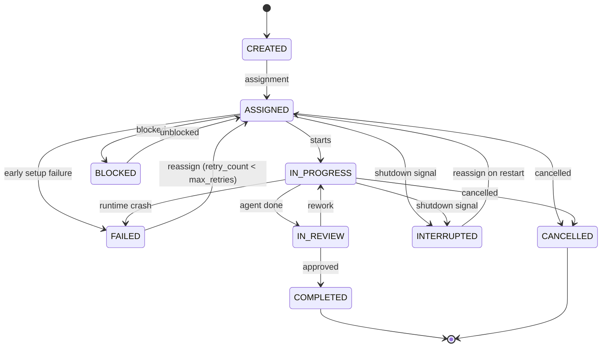

# Task & Workflow Engine

The task and workflow engine orchestrates how work flows through a synthetic
organization -- from task creation and assignment through agent execution,
crash recovery, and graceful shutdown. Every major subsystem (execution loops,
recovery strategies, shutdown strategies, workspace isolation) is implemented
behind a pluggable protocol interface.

---

## Task Lifecycle



!!! info "Non-terminal states"
    `BLOCKED`, `FAILED`, and `INTERRUPTED` are non-terminal:

    - **BLOCKED** returns to `ASSIGNED` when unblocked.
    - **FAILED** returns to `ASSIGNED` for retry when `retry_count < max_retries`
      (see [Crash Recovery](#agent-crash-recovery)).
    - **INTERRUPTED** returns to `ASSIGNED` on restart
      (see [Graceful Shutdown](#graceful-shutdown-protocol)).
    - **COMPLETED** and **CANCELLED** are the only terminal states with no
      outgoing transitions.

!!! info "Runtime wrapper"
    During execution, `Task` is wrapped by `TaskExecution` (a frozen Pydantic
    model) that tracks status transitions via `model_copy(update=...)`,
    accumulates `TokenUsage` cost, and records a `StatusTransition` audit trail.
    The original `Task` is preserved unchanged; `to_task_snapshot()` produces a
    `Task` copy with the current execution status for persistence.

---

## Task Definition

```yaml
task:
  id: "task-123"
  title: "Implement user authentication API"
  description: "Create REST endpoints for login, register, logout with JWT tokens"
  type: "development"           # development, design, research, review, meeting, admin
  priority: "high"              # critical, high, medium, low
  project: "proj-456"
  created_by: "product_manager_1"
  assigned_to: "sarah_chen"
  reviewers: ["engineering_lead", "security_engineer"]
  dependencies: ["task-120", "task-121"]
  artifacts_expected:
    - type: "code"
      path: "src/auth/"
    - type: "tests"
      path: "tests/auth/"
    - type: "documentation"
      path: "docs/api/auth.md"
  acceptance_criteria:
    - "JWT-based auth with refresh tokens"
    - "Rate limiting on login endpoint"
    - "Unit and integration tests with >80% coverage"
    - "API documentation"
  estimated_complexity: "medium"  # simple, medium, complex, epic
  task_structure: "parallel"      # sequential, parallel, mixed
  coordination_topology: "auto"  # auto, sas, centralized, decentralized, context_dependent
  budget_limit: 2.00             # max USD for this task
  deadline: null
  max_retries: 1                 # max reassignment attempts after failure (0 = no retry)
  status: "assigned"
  parent_task_id: null           # parent task ID when created via delegation
  delegation_chain: []           # ordered agent IDs of delegators (root first)
```

`task_structure` and `coordination_topology` are described in
[Task Decomposability & Coordination Topology](#task-decomposability-coordination-topology).

---

## Workflow Types

The framework supports four workflow types for organizing task execution:

### Sequential Pipeline

```text
Requirements --> Design --> Implementation --> Review --> Testing --> Deploy
```

### Parallel Execution

```text
        ┌--> Frontend Dev --┐
Task ---|                    |---> Integration --> QA
        └--> Backend Dev  --┘
```

The `ParallelExecutor` implements concurrent agent execution with
`asyncio.TaskGroup`, configurable concurrency limits, resource locking for
exclusive file access, error isolation, and progress tracking.

### Kanban Board

```text
Backlog | Ready | In Progress | Review | Done
   o    |   o   |      *      |   o    |  ***
   o    |   o   |      *      |        |  **
   o    |       |             |        |  *
```

### Agile Sprints

```text
Sprint Backlog --> Sprint Execution --> Review --> Retrospective --> Next Sprint
```

---

## Task Routing & Assignment

Tasks can be assigned through multiple strategies:

| Strategy | Description |
|----------|-------------|
| **Manual** | Human or manager explicitly assigns |
| **Role-based** | Auto-assign to agents with matching role/skills |
| **Load-balanced** | Distribute evenly across available agents |
| **Auction** | Agents "bid" on tasks based on confidence/capability |
| **Hierarchical** | Flow down through management chain |
| **Cost-optimized** | Assign to cheapest capable agent |

All six strategies are implemented behind the `TaskAssignmentStrategy` protocol.
Scoring-based strategies filter out agents at capacity via
`AssignmentRequest.max_concurrent_tasks`. `ManualAssignmentStrategy` raises
exceptions on failure; scoring-based strategies return
`AssignmentResult(selected=None)`.

---

## TaskEngine — Centralized State Coordination

All task state mutations flow through a single-writer `TaskEngine` that owns the
authoritative task state. This eliminates race conditions when multiple agents
attempt concurrent transitions on the same task.

### Architecture

```text
Agent / API  ──submit()──▶  asyncio.Queue  ──▶  _processing_loop  ──▶  Persistence
                                                    │
                                                    ├──▶  Version tracking (optimistic concurrency)
                                                    └──▶  Snapshot publishing (MessageBus)
```

- **Single writer**: A background `asyncio.Task` consumes `TaskMutation`
  requests sequentially from an `asyncio.Queue`.
- **Immutable-style updates**: Each mutation constructs a new `Task` instance
  from the previous one (for example via
  `Task.model_validate({**task.model_dump(), **updates})` or
  `Task.with_transition(...)`); the existing instance is never mutated.
- **Optimistic concurrency**: Per-task version counters held in-memory
  (volatile).  An unknown task is seeded at version 1 on first access —
  this is a heuristic baseline, **not** loaded from persistence.  Version
  tracking resets on engine restart; durable persistence of versions is a
  future enhancement.  Callers can pass `expected_version` to detect stale
  writes; on mismatch the engine returns a failed `TaskMutationResult`
  with `error_code="version_conflict"`.  Convenience methods raise
  `TaskVersionConflictError`.
- **Read-through**: `get_task()` and `list_tasks()` bypass the queue and
  read directly from persistence — safe because TaskEngine is the sole writer.
- **Snapshot publishing**: On success, a `TaskStateChanged` event is published
  to the message bus for downstream consumers (WebSocket bridge, audit, etc.).

### Mutation Types

| Mutation | Description |
|----------|-------------|
| `CreateTaskMutation` | Generates a unique ID, persists, and returns the new task. |
| `UpdateTaskMutation` | Applies field updates with immutable-field rejection (`id`, `status`, `created_by`) and re-validates via `model_validate`. |
| `TransitionTaskMutation` | Validates status transition via `Task.with_transition()`, supports field overrides. |
| `DeleteTaskMutation` | Removes from persistence and clears version tracking. |
| `CancelTaskMutation` | Shortcut for transition to `CANCELLED`. |

### Error Handling

- **Typed errors**: `TaskNotFoundError` and `TaskVersionConflictError` provide
  precise failure classification — API controllers catch these directly instead
  of parsing error strings.
- **Error sanitization**: Internal exception details (SQL paths, stack traces)
  are replaced with a generic message before reaching callers.
- **Queue full**: `TaskEngineQueueFullError` signals backpressure when the
  queue is at capacity.

### Lifecycle

- **start()**: Spawns the background processing task.
- **stop()**: Sets `_running = False`, drains the queue within a configurable
  timeout, then cancels. Abandoned futures receive a failure result.

### AgentEngine ↔ TaskEngine Incremental Sync

`AgentEngine` syncs task status transitions to `TaskEngine` incrementally at
each lifecycle point, rather than reporting only the final status. This gives
real-time visibility into execution progress and improves crash recovery
(a crash mid-execution leaves the task at the last-reached stage, not stuck
at `ASSIGNED`).

**Transition sequences** (1–3 `submit()` calls per execution, bounded):

| Path | Synced transitions |
|------|--------------------|
| Happy (COMPLETED) | `IN_PROGRESS` → `IN_REVIEW` → `COMPLETED` |
| Shutdown | `IN_PROGRESS` → `INTERRUPTED` |
| Error | `IN_PROGRESS` → `FAILED` (after recovery) |
| MAX_TURNS / BUDGET | `IN_PROGRESS` only |

**Semantics:**

- **Best-effort**: Sync failures are logged and swallowed — agent execution
  is never blocked by a TaskEngine issue. Each sync failure is isolated and
  does not prevent subsequent transitions.
- **Critical IN_PROGRESS**: The initial `ASSIGNED → IN_PROGRESS` sync is
  logged at `ERROR` on failure (TaskEngine state coherence for all subsequent
  transitions depends on it).  Other sync failures log at `WARNING`.
- **Direct `submit()`**: Uses `TaskEngine.submit()` with
  `TransitionTaskMutation` directly (not the convenience `transition_task()`
  method) to inspect `TaskMutationResult` success/failure without exception
  propagation, keeping sync best-effort.
- **No concurrency concern**: Each task has exactly one executing agent at
  any time. Parallel agents operate on separate tasks.

**Snapshot channel**: TaskEngine publishes `TaskStateChanged` events to the
`"tasks"` channel (matching `CHANNEL_TASKS` in `api.channels`) so events
reach the `MessageBusBridge` and WebSocket consumers.

---

## Agent Execution Status

The `ExecutionStatus` enum (in `core/enums.py`) tracks the per-agent runtime
execution state:

| Status | Meaning |
|--------|---------|
| `IDLE` | Agent is not currently executing — no active task or execution run. |
| `EXECUTING` | Agent is actively processing a task within an execution loop. |
| `PAUSED` | Agent is waiting for an external event (e.g. approval gate). |

`ExecutionStatus` is consumed by `AgentRuntimeState` (in `engine/agent_state.py`),
which is persisted via `AgentStateRepository` for dashboard queries and
graceful-shutdown discovery. See the [Agents design page](agents.md#runtime-state)
for how `AgentRuntimeState` fits into the runtime state layer.

---

## Agent Execution Loop

The agent execution loop defines how an agent processes a task from start to
finish. The framework provides multiple configurable loop architectures behind
an `ExecutionLoop` protocol, making the system extensible. The default can vary
by task complexity and is configurable per agent or role.

### ExecutionLoop Protocol

All loop implementations satisfy the `ExecutionLoop` runtime-checkable protocol:

`get_loop_type() -> str`
:   Returns a unique identifier (e.g., `"react"`).

`execute(...) -> ExecutionResult`
:   Runs the loop to completion, accepting `AgentContext`,
    `CompletionProvider`, optional `ToolInvoker`, optional `BudgetChecker`,
    optional `ShutdownChecker`, and optional `CompletionConfig`.

**Supporting models:**

`TerminationReason`
:   Enum: `COMPLETED`, `MAX_TURNS`, `BUDGET_EXHAUSTED`, `SHUTDOWN`, `STAGNATION`,
    `ERROR`, `PARKED`.  `max_turns` defaults to 20.

`TurnRecord`
:   Frozen per-turn stats (tokens, cost, tool calls, finish reason).

`ExecutionResult`
:   Frozen outcome with final context, termination reason, turn records, and
    optional error message (required when reason is `ERROR`).

`BudgetChecker`
:   Callback type `Callable[[AgentContext], bool]` invoked before each LLM call.

`ShutdownChecker`
:   Callback type `Callable[[], bool]` checked at turn boundaries to initiate
    cooperative shutdown.

### Loop Implementations

=== "Loop 1: ReAct"

    **Default for Simple Tasks**

    A single interleaved loop: the agent reasons about the current state,
    selects an action (tool call or response), observes the result, and repeats
    until done or `max_turns` is reached.

    ```mermaid
    graph LR
        A[Think] --> B[Act]
        B --> C[Observe]
        C --> A
        C --> D{Terminate?}
        D -->|task complete, max turns,<br/>budget exhausted, or error| E[Done]
    ```

    ```yaml
    execution_loop: "react"              # react, plan_execute, hybrid, auto
    ```

    | | |
    |---|---|
    | **Strengths** | Simple, proven, flexible. Easy to implement. Works well for short tasks. |
    | **Weaknesses** | Token-heavy on long tasks (re-reads full context every turn). No long-term planning -- greedy step-by-step. |
    | **Best for** | Simple tasks, quick fixes, single-file changes. |

=== "Loop 2: Plan-and-Execute"

    A two-phase approach: the agent first generates a step-by-step plan, then
    executes each step sequentially. On failure, the agent can replan. Different
    models can be used for planning vs execution (e.g., large model for
    planning, small model for execution steps).

    ```mermaid
    graph LR
        A[Plan<br/>1 call] --> B[Execute Steps<br/>N calls]
        B --> C{Step failed?}
        C -->|yes| A
        C -->|no| D[Done]
    ```

    ```yaml
    execution_loop: "plan_execute"
    plan_execute:
      planner_model: null              # null = use agent's model; override for cost optimization
      executor_model: null
      max_replans: 3
    ```

    | | |
    |---|---|
    | **Strengths** | Token-efficient for long tasks. Auditable plan artifact. Supports model tiering. |
    | **Weaknesses** | Rigid -- plan may be wrong, replanning is expensive. Over-plans simple tasks. |
    | **Best for** | Complex multi-step tasks, epic-level work, tasks spanning multiple files. |

=== "Loop 3: Hybrid Plan + ReAct Steps"

    **Recommended for Complex Tasks**

    The agent creates a high-level plan (3--7 steps). Each step is executed as a
    mini-ReAct loop with its own turn limit. After each step, the agent
    checkpoints -- summarizing progress and optionally replanning remaining
    steps. Checkpoints are natural points for human inspection or task
    suspension.

    ```mermaid
    graph TD
        A[Plan] --> B[Step 1: mini-ReAct]
        B --> C[Checkpoint: summarize progress]
        C --> D[Step 2: mini-ReAct]
        D --> E[Checkpoint: replan if needed]
        E --> F[Step N: mini-ReAct]
        F --> G[Done]
    ```

    ```yaml
    execution_loop: "hybrid"
    hybrid:
      max_plan_steps: 7
      max_turns_per_step: 5
      checkpoint_after_each_step: true
      allow_replan: true
    ```

    | | |
    |---|---|
    | **Strengths** | Strategic planning + tactical flexibility. Natural checkpoints for suspension/inspection. |
    | **Weaknesses** | Most complex to implement. Plan granularity needs tuning per task type. |
    | **Best for** | Complex tasks, multi-file refactoring, tasks requiring both planning and adaptivity. |

!!! tip "Auto-selection"
    When `execution_loop: "auto"`, the framework selects the loop based on
    `estimated_complexity`: simple -> ReAct, medium -> Plan-and-Execute,
    complex/epic -> Hybrid. Configurable via `auto_loop_rules` -- a mapping
    of complexity thresholds to loop implementations.

### AgentEngine Orchestrator

`AgentEngine` is the top-level entry point for running an agent on a task. It
composes the execution loop with prompt construction, context management, tool
invocation, and cost tracking into a single `run()` call.

The engine also exposes an optional ``coordinate()`` method that delegates to a
``MultiAgentCoordinator`` when one is configured (see :doc:`coordination`).

**Signature:**

```python
async run(
    identity, task, completion_config?, max_turns?,
    memory_messages?, timeout_seconds?, effective_autonomy?
) -> AgentRunResult
```

**Pipeline steps:**

1. **Validate inputs** -- agent must be `ACTIVE`, task must be `ASSIGNED` or
   `IN_PROGRESS`. Raises `ExecutionStateError` on violation.
2. **Pre-flight budget enforcement** -- if `BudgetEnforcer` is provided, check
   monthly hard stop and daily limit via `check_can_execute()`, then apply
   auto-downgrade via `resolve_model()`. Raises `BudgetExhaustedError` or
   `DailyLimitExceededError` on violation.
3. **Build system prompt** -- calls `build_system_prompt()` with agent identity
   and task. Tool definitions are NOT included in the prompt; they are supplied
   via the API's `tools` parameter
   ([Decision Log](../architecture/decisions.md) D22).
   Follows the **non-inferable-only principle**: system prompts include only
   information the agent cannot discover by reading the codebase or environment
   (role constraints, custom conventions, organizational policies).
4. **Create context** -- `AgentContext.from_identity()` with the configured
   `max_turns`.
5. **Seed conversation** -- injects system prompt, optional memory messages, and
   formatted task instruction as initial messages.
6. **Transition task** -- `ASSIGNED` -> `IN_PROGRESS` (pass-through if already
   `IN_PROGRESS`).
7. **Prepare tools and budget** -- creates `ToolInvoker` from registry and
   `BudgetChecker` from `BudgetEnforcer` (task + monthly + daily limits with
   pre-computed baselines and alert deduplication) or from task budget limit
   alone when no enforcer is configured.
8. **Delegate to loop** -- calls `ExecutionLoop.execute()` with context,
   provider, tool invoker, budget checker, and completion config. If
   `timeout_seconds` is set, wraps the call in `asyncio.wait`; on expiry
   the run returns with `TerminationReason.ERROR` but cost recording and
   post-execution processing still occur.
   When escalations are detected after tool execution (via
   `ToolInvoker.pending_escalations`), the `ApprovalGate` evaluates whether
   parking is needed. If so, the context is serialized via `ParkService`
   and persisted when a `ParkedContextRepository` is configured; the loop
   then returns a `PARKED` result.
9. **Record costs** -- records accumulated `TokenUsage` to `CostTracker` (if
   available). Cost recording failures are logged but do not affect the result.
10. **Apply post-execution transitions:**
    - `COMPLETED` termination: IN_PROGRESS -> IN_REVIEW -> COMPLETED (two-hop
      auto-complete; reviewers planned).
    - `SHUTDOWN` termination: current status -> INTERRUPTED
      (see [Graceful Shutdown](#graceful-shutdown-protocol)).
    - `ERROR` termination: recovery strategy is applied (default
      `FailAndReassignStrategy` transitions to FAILED;
      see [Crash Recovery](#agent-crash-recovery)).
    - All other termination reasons (`MAX_TURNS`, `BUDGET_EXHAUSTED`,
      `STAGNATION`, `PARKED`) leave the task in its current state.
      `STAGNATION` indicates the agent was stuck in a repetitive loop.
      `PARKED` indicates the agent was
      suspended by an approval-timeout policy; the task remains at its current
      status until explicitly resumed.
    - Each transition is synced to TaskEngine incrementally (see
      [AgentEngine ↔ TaskEngine Incremental Sync](#agentengine--taskengine-incremental-sync)).
    - Transition failures are logged but do not discard the successful execution
      result.
11. **Return result** -- wraps `ExecutionResult` in `AgentRunResult` with
    engine-level metadata.

**Error handling:** `MemoryError` and `RecursionError` propagate
unconditionally. `BudgetExhaustedError` (including `DailyLimitExceededError`)
returns `TerminationReason.BUDGET_EXHAUSTED` without recovery -- budget
exhaustion is a controlled stop, not a crash. All other exceptions are caught
and wrapped in an `AgentRunResult` with `TerminationReason.ERROR`.

???+ note "AgentRunResult model"
    `AgentRunResult` is a frozen Pydantic model wrapping `ExecutionResult`
    with engine metadata:

    - `execution_result` -- outcome from the execution loop
    - `system_prompt` -- the `SystemPrompt` used for this run
    - `duration_seconds` -- wall-clock run time
    - `agent_id`, `task_id` -- identifiers
    - Computed fields: `termination_reason`, `total_turns`, `total_cost_usd`,
      `is_success`, `completion_summary`

---

## Stagnation Detection

Agents can persist in unproductive loops, repeating the same tool calls without
making progress. Stagnation detection analyzes `TurnRecord` tool call history
across a sliding window, intervenes with a corrective prompt injection, and
terminates early with `STAGNATION` if correction fails.

### Protocol Interface

```python
@runtime_checkable
class StagnationDetector(Protocol):
    async def check(
        self,
        turns: tuple[TurnRecord, ...],
        *,
        corrections_injected: int = 0,
    ) -> StagnationResult: ...

    def get_detector_type(self) -> str: ...
```

Async protocol — future implementations may consult external services or
LLM-based analysis.

### Default Implementation: `ToolRepetitionDetector`

Uses dual-signal detection:

1. **Repetition ratio** — excess duplicates divided by total fingerprint count
   in the window. A fingerprint appearing 3 times contributes 2 to the
   duplicate count.
2. **Cycle detection** — checks for repeating A→B→A→B patterns at the turn
   level (`seq[-2k:-k] == seq[-k:]` for cycle lengths 2..len/2).

Fingerprints are computed as `name:sha256(canonical_json_args)[:16]`,
sorted per-turn for order-independent comparison.

### Configuration (`StagnationConfig`)

| Field                  | Default | Description                                       |
|------------------------|---------|---------------------------------------------------|
| `enabled`              | `True`  | Whether stagnation detection is active             |
| `window_size`          | `5`     | Number of recent tool-bearing turns to analyze     |
| `repetition_threshold` | `0.6`   | Duplicate ratio that triggers detection            |
| `cycle_detection`      | `True`  | Whether to detect repeating patterns               |
| `max_corrections`      | `1`     | Corrective prompts before terminating (0 = none)   |
| `min_tool_turns`       | `2`     | Minimum tool-bearing turns before any check fires  |

### Intervention Flow

1. **No stagnation** — execution continues normally
2. **`INJECT_PROMPT`** — a corrective USER-role message is injected into the
   conversation (up to `max_corrections` times)
3. **`TERMINATE`** — execution terminates with `TerminationReason.STAGNATION`
   and stagnation metadata attached to the result

### Loop Integration

- **ReactLoop**: stagnation checked after each successful turn; corrections
  counter is loop-scoped
- **PlanExecuteLoop**: stagnation checked per step (different steps
  legitimately repeat similar patterns like read→edit→test); corrections
  counter is step-scoped, window resets across step boundaries
- `STAGNATION` termination leaves the task in its current state (like
  `MAX_TURNS` — the task is not failed, it's returned to the caller)

---

## Context Budget Management

Agents running long tasks consume their LLM context window without awareness.
The context budget system tracks fill levels, injects soft indicators into
system prompts, and compresses conversations at turn boundaries.

### Context Fill Tracking

`AgentContext` carries three context-budget fields:

- `context_fill_tokens` — estimated tokens in the full context (system prompt +
  conversation + tool definitions)
- `context_capacity_tokens` — the model's `max_context_tokens` from
  `ModelCapabilities`, or `None` when unknown
- `context_fill_percent` — computed percentage (`fill / capacity * 100`),
  `None` when capacity is unknown

Fill is re-estimated after each turn via `update_context_fill()` in
`context_budget.py`, using the `PromptTokenEstimator` protocol (default:
`DefaultTokenEstimator` at `len(text) // 4`).

### Soft Budget Indicators

`ContextBudgetIndicator` is injected into the system prompt via
`_SECTION_CONTEXT_BUDGET`:

```text
[Context: 12,450/16,000 tokens (78%) | 0 archived blocks]
```

The indicator is set at initial prompt build time. The `archived_blocks` count
is derived from `CompressionMetadata.compactions_performed`.

### Compaction Hook

`CompactionCallback` is a type alias (`Callable[[AgentContext], Coroutine[...,
AgentContext | None]]`) wired into both `ReactLoop` and `PlanExecuteLoop` via
their constructors — the same injection pattern as `checkpoint_callback`,
`stagnation_detector`, and `approval_gate`.

The default implementation (`make_compaction_callback` in
`compaction/summarizer.py`) archives oldest conversation turns into a summary
message when `context_fill_percent` exceeds a configurable threshold (default
80%).

`CompactionConfig` controls:

| Field | Default | Description |
|-------|---------|-------------|
| `fill_threshold_percent` | `80.0` | Fill percentage that triggers compaction |
| `min_messages_to_compact` | `4` | Minimum messages before compaction is allowed |
| `preserve_recent_turns` | `3` | Recent turn pairs to keep uncompressed |

Compaction errors are logged but never propagated — compaction is advisory,
not critical.

### Compressed Checkpoint Recovery

`CompressionMetadata` is persisted on `AgentContext` and serialized into
checkpoint JSON. On resume, `deserialize_and_reconcile()` detects compressed
checkpoints and includes compression-aware information in the reconciliation
message:

```text
Execution resumed from checkpoint at turn 8. Note: conversation was
previously compacted (archived 12 turns). Previous error: ...
```

### Loop Integration

- **ReactLoop**: compaction checked after stagnation detection, at turn
  boundaries (between completed turns)
- **PlanExecuteLoop**: compaction checked within step execution at turn
  boundaries, before stagnation detection

Both loops use the shared `invoke_compaction()` helper from `loop_helpers.py`.

---

## Agent Crash Recovery

When an agent execution fails unexpectedly (unhandled exception, OOM, process
kill), the framework applies a recovery mechanism. Recovery strategies are
implemented behind a `RecoveryStrategy` protocol, making the system pluggable.

### RecoveryStrategy Protocol

| Method | Signature | Description |
|--------|-----------|-------------|
| `recover` | `async def recover(*, task_execution, error_message, context) -> RecoveryResult` | Apply recovery to a failed task execution |
| `get_strategy_type` | `def get_strategy_type() -> str` | Return strategy type identifier (must not be empty) |

### RecoveryResult Model

| Field | Type | Description |
|-------|------|-------------|
| `task_execution` | `TaskExecution` | Updated execution after recovery (typically `FAILED`) |
| `strategy_type` | `NotBlankStr` | Strategy identifier |
| `context_snapshot` | `AgentContextSnapshot` | Redacted snapshot (turn count, accumulated cost, message count, max turns -- no message contents) |
| `error_message` | `NotBlankStr` | Error that triggered recovery |
| `checkpoint_context_json` | `str \| None` | Serialized `AgentContext` for resume (`None` for non-checkpoint strategies) |
| `resume_attempt` | `int` (ge=0) | Current resume attempt number (0 when not resuming) |
| `can_resume` | `bool` (computed) | `checkpoint_context_json is not None` |
| `can_reassign` | `bool` (computed) | `retry_count < task.max_retries` |

### Recovery Strategies

=== "Strategy 1: Fail-and-Reassign"

    **Default / MVP**

    The engine catches the failure at its outermost boundary, logs a redacted
    `AgentContext` snapshot (turn count, accumulated cost -- excluding message
    contents to avoid leaking sensitive prompts/tool outputs), transitions the
    task to `FAILED`, and makes it available for reassignment (manual or
    automatic via the task router).

    ```yaml
    crash_recovery:
      strategy: "fail_reassign"            # fail_reassign, checkpoint
    ```

    - Simple, no persistence dependency
    - All progress is lost on crash -- acceptable for short single-agent tasks

    On crash:

    1. Catch exception at the `AgentEngine` boundary (outermost `try/except`
       in `AgentEngine.run()`)
    2. Log at ERROR with redacted `AgentContextSnapshot` (turn count,
       accumulated cost, message count, max turns -- message contents excluded)
    3. Transition `TaskExecution` -> `FAILED` with the exception as the failure
       reason
    4. `RecoveryResult.can_reassign` reports whether `retry_count < max_retries`

    !!! info
        The `can_reassign` flag is computed and returned in `RecoveryResult`.
        The caller (task router) is responsible for incrementing `retry_count`
        when creating the next `TaskExecution`.

=== "Strategy 2: Checkpoint Recovery"

    The engine persists an `AgentContext` snapshot after each completed turn. On
    crash, the framework detects the failure (via heartbeat timeout or
    exception), loads the last checkpoint, and resumes execution from the exact
    turn where it left off. The immutable `model_copy(update=...)` pattern makes
    checkpointing trivial -- each `AgentContext` is a complete, self-contained
    frozen state that serializes cleanly via `model_dump_json()`.

    ```yaml
    crash_recovery:
      strategy: "checkpoint"
      checkpoint:
        persist_every_n_turns: 1           # checkpoint frequency
        # Storage backend determined by the injected CheckpointRepository
        heartbeat_interval_seconds: 30     # detect unresponsive agents
        max_resume_attempts: 2             # retry limit before falling back to fail_reassign
    ```

    - Preserves progress -- critical for long tasks (multi-step plans,
      epic-level work)
    - Requires persistence layer and reconciliation message on resume
    - Natural fit with the existing immutable state model

    When resuming from a checkpoint, the agent receives a system message
    informing it of the resume point (turn number) and the error that triggered
    recovery. This reconciliation message allows the agent to review its
    progress and adapt.  Richer reconciliation (e.g. workspace change
    detection) is planned for a future iteration.

---

## Graceful Shutdown Protocol

When the process receives SIGTERM/SIGINT (user Ctrl+C, Docker stop, systemd
shutdown), the framework stops cleanly without losing work or leaking costs.
Shutdown strategies are implemented behind a `ShutdownStrategy` protocol.

### Strategy 1: Cooperative with Timeout (Default / MVP)

The engine sets a shutdown event, stops accepting new tasks, and gives in-flight
agents a grace period to finish their current turn. Agents check the shutdown
event at turn boundaries (between LLM calls, before tool invocations) and exit
cooperatively. After the grace period, remaining agents are force-cancelled.
**All tasks terminated by shutdown -- whether they exited cooperatively or were
force-cancelled -- are marked `INTERRUPTED`** by the engine layer.

```yaml
graceful_shutdown:
  strategy: "cooperative_timeout"    # cooperative_timeout, immediate, finish_tool, checkpoint
  cooperative_timeout:
    grace_seconds: 30                # time for agents to finish cooperatively
    cleanup_seconds: 5               # time for final cleanup (persist cost records, close connections)
```

On shutdown signal:

1. Set `shutdown_event` (`asyncio.Event`) -- agents check this at turn
   boundaries
2. Stop accepting new tasks (drain gate closes)
3. Wait up to `grace_seconds` for agents to exit cooperatively
4. Force-cancel remaining agents (`task.cancel()`) -- tasks transition to
   `INTERRUPTED`
5. Cleanup phase (`cleanup_seconds`): persist cost records, close provider
   connections, flush logs

!!! info "INTERRUPTED status"
    `INTERRUPTED` indicates the task was stopped due to process shutdown --
    regardless of whether the agent exited cooperatively or was force-cancelled
    -- and is eligible for manual or automatic reassignment on restart. Valid
    transitions: `ASSIGNED -> INTERRUPTED`, `IN_PROGRESS -> INTERRUPTED`,
    `INTERRUPTED -> ASSIGNED`.

!!! tip "Cross-platform compatibility"
    `loop.add_signal_handler()` is not supported on Windows. The implementation
    uses `signal.signal()` as a fallback. SIGINT (Ctrl+C) works cross-platform;
    SIGTERM on Windows requires `os.kill()`.

!!! warning "In-flight LLM cost leakage"
    Non-streaming API calls that are interrupted result in tokens billed but no
    response received (silent cost leak). The engine logs request start (with
    input token count) before each provider call, so interrupted calls have at
    minimum an input-cost audit record. Streaming calls are charged only for
    tokens sent before disconnect.

### Future Strategies

Strategy 2: Immediate Cancel
:   All agent tasks are cancelled immediately via `task.cancel()`. Fastest
    shutdown but highest data loss -- partial tool side effects, billed-but-lost
    LLM responses.

Strategy 3: Finish Current Tool
:   Like cooperative timeout, but waits for the current tool invocation to
    complete even if it exceeds the grace period. Needs per-tool timeout as a
    backstop for long-running sandboxed execution.

Strategy 4: Checkpoint and Stop
:   On shutdown signal, each agent persists its full `AgentContext` snapshot and
    transitions to `INTERRUPTED`. On restart, the engine loads checkpoints and
    resumes execution. This naturally extends
    [Checkpoint Recovery](#agent-crash-recovery) -- the only difference is
    whether the checkpoint was written proactively (graceful shutdown) or loaded
    from the last turn (crash recovery).

---

## Concurrent Workspace Isolation

When multiple agents work on the same codebase concurrently, they may need to
edit overlapping files. The framework provides a pluggable
`WorkspaceIsolationStrategy` protocol for managing concurrent file access.

### Strategy 1: Planner + Git Worktrees (Default)

The task planner decomposes work to minimize file overlap across agents. Each
agent operates in its own git worktree (shared `.git` object database,
independent working tree). On completion, branches are merged sequentially.

This is the dominant industry pattern (used by OpenAI Codex, Cursor, Claude
Code, VS Code background agents).

```text
Planner decomposes task:
|- Agent A: src/auth/     (worktree-A)
|- Agent B: src/api/      (worktree-B)
└- Agent C: tests/        (worktree-C)

Each in isolated git worktree
        |
On completion: sequential merge
|- Merge A -> main
|- Rebase B on main, merge
└- Rebase C on main, merge
        |
Textual conflicts: git detects, escalate to human or review agent
Semantic conflicts: review agent evaluates merged result
```

???+ example "Workspace isolation configuration"

    ```yaml
    workspace_isolation:
      strategy: "planner_worktrees"      # planner_worktrees, sequential, file_locking
      planner_worktrees:
        max_concurrent_worktrees: 8
        merge_order: "completion"        # completion (first done merges first), priority, manual
        conflict_escalation: "human"     # human, review_agent
    ```

- True filesystem isolation -- agents cannot overwrite each other's work
- Maximum parallelism during execution; conflicts deferred to merge time
- Leverages mature git infrastructure for merge, diff, and history

### Future Strategies

Strategy 2: Sequential Dependencies
:   Tasks with overlapping file scopes are ordered sequentially via a dependency
    graph. Prevents conflicts by construction but limits parallelism. Requires
    upfront knowledge of which files a task will touch.

Strategy 3: File-Level Locking
:   Files are locked at task assignment time. Eliminates conflicts at the source
    but requires predicting file access -- difficult for LLM agents that
    discover what to edit as they go. Risk of deadlock if multiple agents need
    overlapping file sets.

### State Coordination vs Workspace Isolation

These are complementary systems handling different types of shared state:

| State Type | Coordination | Mechanism |
|-----------|-------------|-----------|
| Framework state (tasks, assignments, budget) | Centralized single-writer (`TaskEngine`) | `model_validate` / `with_transition` via async queue |
| Code and files (agent work output) | Workspace isolation (`WorkspaceIsolationStrategy`) | Git worktrees / branches |
| Agent memory (personal) | Per-agent ownership | Each agent owns its memory exclusively |
| Org memory (shared knowledge) | Single-writer (`OrgMemoryBackend`) | `OrgMemoryBackend` protocol with role-based write access control |

---

## Task Decomposability & Coordination Topology

Empirical research on agent scaling
([Kim et al., 2025](https://arxiv.org/abs/2512.08296) -- 180 controlled
experiments across 3 LLM families and 4 benchmarks) demonstrates that **task
decomposability is the strongest predictor of multi-agent effectiveness** --
stronger than team size, model capability, or coordination architecture.

### Task Structure Classification

Each task carries a `task_structure` field classifying its decomposability:

| Structure | Description | Multi-Agent Effect | Example |
|-----------|-------------|------------|---------|
| `sequential` | Steps must execute in strict order; each depends on prior state | **Negative** (-39% to -70%) | Multi-step build processes, ordered migrations, chained API calls |
| `parallel` | Sub-problems can be investigated independently, then synthesized | **Positive** (+57% to +81%) | Financial analysis (revenue + cost + market), multi-file review, research across sources |
| `mixed` | Some sub-tasks are parallel, but a sequential backbone connects phases | **Variable** (depends on ratio) | Feature implementation (design // research -> implement -> test) |

Classification can be:

- **Explicit** -- set in task config by the task creator or manager agent
- **Inferred** -- derived from task properties (tool count, dependency graph,
  acceptance criteria structure) by the task router

### Per-Task Coordination Topology

The [communication pattern](communication.md#communication-patterns) is
configured at the company level, but **coordination topology can be selected
per-task** based on task structure and properties. This allows the engine to use
the most efficient coordination approach for each task rather than applying a
single company-wide pattern.

| Task Properties | Recommended Topology | Rationale |
|----------------|---------------------|-----------|
| `sequential` + few artifacts (<=4) | **Single-agent (SAS)** | Coordination overhead fragments reasoning capacity on sequential tasks |
| `parallel` + structured domain | **Centralized** | Orchestrator decomposes, sub-agents execute in parallel, orchestrator synthesizes. Lowest error amplification (4.4x) |
| `parallel` + exploratory/open-ended | **Decentralized** | Peer debate enables diverse exploration of high-entropy search spaces |
| `mixed` | **Context-dependent** | Sequential backbone handled by single agent; parallel sub-tasks delegated to sub-agents |

### Auto Topology Selector

When topology is set to `"auto"`, the engine selects coordination topology based
on measurable task properties:

```yaml
coordination:
  topology: "auto"                    # auto, sas, centralized, decentralized, context_dependent
  auto_topology_rules:
    # sequential tasks -> always single-agent
    sequential_override: "sas"
    # parallel tasks -> select based on domain structure
    parallel_default: "centralized"
    # mixed tasks -> SAS backbone for sequential phases, delegates parallel sub-tasks
    mixed_default: "context_dependent"  # hybrid: not a single topology -- engine selects per-phase
  max_concurrency_per_wave: null        # None = unlimited
  fail_fast: false
  enable_workspace_isolation: true
  base_branch: main
```

The auto-selector uses task structure, artifact count, and (when available from
the memory subsystem) historical single-agent success rate as inputs.

!!! info "Research basis"
    These heuristics are derived from Kim et al. (2025), which achieved 87%
    accuracy predicting optimal architecture from task properties across
    held-out configurations. The SynthOrg context differs (role-differentiated
    agents vs. identical agents), so thresholds should be validated empirically
    once multi-agent execution is implemented.

### Multi-Agent Coordination Pipeline

The `MultiAgentCoordinator` orchestrates the end-to-end pipeline that transforms
a parent task into parallel agent work:

```text
decompose → route → resolve topology → validate → dispatch → rollup → update parent
```

**Pipeline phases:**

1. **Decompose** — `DecompositionService` breaks the parent task into subtasks
   with a dependency DAG
2. **Route** — `TaskRoutingService` assigns each subtask to an agent based on
   skills, workload, and topology
3. **Resolve topology** — reads topology from routing decisions; falls back to
   `CENTRALIZED` if `AUTO` was not resolved upstream
4. **Validate** — fails the pipeline if all subtasks are unroutable
5. **Dispatch** — a `TopologyDispatcher` executes waves (workspace setup →
   parallel execution → merge → teardown)
6. **Rollup** — aggregates subtask statuses into a `SubtaskStatusRollup`
7. **Update parent** — transitions the parent task via `TaskEngine` (if provided)

Each phase produces a `CoordinationPhaseResult` (success/failure + duration).
Phase failures in decompose/route/validate raise `CoordinationPhaseError` with
partial results; rollup and update-parent failures are captured but do not abort
the pipeline.

**Topology dispatchers:**

| Dispatcher | Topology | Workspace Isolation | Wave Strategy |
|-----------|----------|-------------------|---------------|
| `SasDispatcher` | SAS | Never | Sequential waves from DAG |
| `CentralizedDispatcher` | Centralized | Optional (config-driven) | DAG waves, post-execution merge |
| `DecentralizedDispatcher` | Decentralized | Mandatory (raises if unavailable) | DAG waves, post-execution merge |
| `ContextDependentDispatcher` | Context-dependent | Per-wave (multi-subtask waves only) | DAG waves, per-wave merge/teardown |

The `select_dispatcher` factory maps a resolved `CoordinationTopology` to the
appropriate dispatcher; `AUTO` must be resolved before dispatch.

**Wave execution** (`group_builder.build_execution_waves`) converts DAG parallel
groups and routing decisions into `ParallelExecutionGroup` instances. Subtasks
without routing decisions are skipped. Empty waves (all subtasks unroutable) are
dropped.
