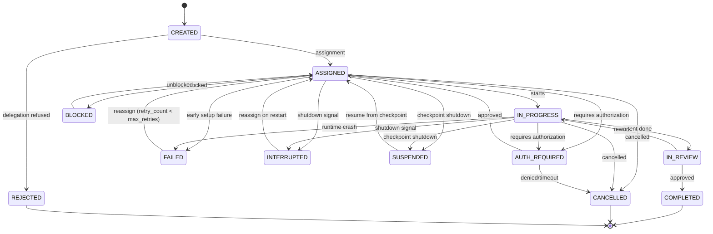
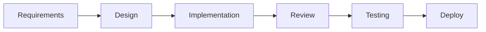
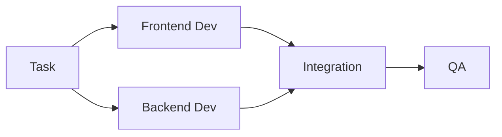
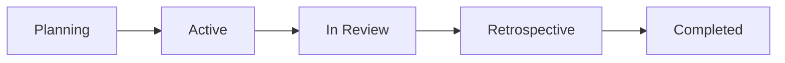

# Task & Workflow Engine

The task and workflow engine orchestrates how work flows through a synthetic
organization -- from task creation and assignment through to review and
completion. This page covers the task-engine core: lifecycle, workflows,
routing, and the single-writer state coordinator.

Related pages:

- [Agent Execution](agent-execution.md) -- per-agent execution loop, prompt profiles, stagnation, context budget, brain/hands/session
- [Coordination](coordination.md) -- multi-agent topology, crash recovery, graceful shutdown, workspace isolation
- [Verification & Quality](verification-quality.md) -- verification stage, harness middleware, review pipeline, intake engine

---

## Task Lifecycle



!!! info "Non-terminal states"
    `BLOCKED`, `FAILED`, `INTERRUPTED`, `SUSPENDED`, and `AUTH_REQUIRED` are
    non-terminal:

    - **BLOCKED** returns to `ASSIGNED` when unblocked.
    - **FAILED** returns to `ASSIGNED` for retry when `retry_count < max_retries`
      (see [Crash Recovery](coordination.md#agent-crash-recovery)).
    - **INTERRUPTED** returns to `ASSIGNED` on restart
      (see [Graceful Shutdown](coordination.md#graceful-shutdown-protocol)).
    - **SUSPENDED** returns to `ASSIGNED` for resume from checkpoint
      (see [Graceful Shutdown](coordination.md#graceful-shutdown-protocol), Strategy 4).
    - **AUTH_REQUIRED** returns to `ASSIGNED` when approved or to `CANCELLED`
      when denied or timed out.
    - **COMPLETED**, **CANCELLED**, and **REJECTED** are terminal states with no
      outgoing transitions.

!!! info "Runtime wrapper"
    During execution, `Task` is wrapped by `TaskExecution` (a frozen Pydantic
    model) that tracks status transitions via `model_copy(update=...)`,
    accumulates `TokenUsage` cost, and records a `StatusTransition` audit trail.
    The original `Task` is preserved unchanged; `to_task_snapshot()` produces a
    `Task` copy with the current execution status for persistence.

---

## Task Definition

```yaml
task:
  id: "task-123"
  title: "Implement user authentication API"
  description: "Create REST endpoints for login, register, logout with JWT tokens"
  type: "development"           # development, design, research, review, meeting, admin
  priority: "high"              # critical, high, medium, low
  project: "proj-456"
  created_by: "product_manager_1"
  assigned_to: "sarah_chen"
  reviewers: ["engineering_lead", "security_engineer"]
  dependencies: ["task-120", "task-121"]
  artifacts_expected:
    - type: "code"
      path: "src/auth/"
    - type: "tests"
      path: "tests/auth/"
    - type: "documentation"
      path: "docs/api/auth.md"
  acceptance_criteria:
    - "JWT-based auth with refresh tokens"
    - "Rate limiting on login endpoint"
    - "Unit and integration tests with >80% coverage"
    - "API documentation"
  estimated_complexity: "medium"  # simple, medium, complex, epic
  task_structure: "parallel"      # sequential, parallel, mixed
  coordination_topology: "auto"  # auto, sas, centralized, decentralized, context_dependent
  budget_limit: 2.00             # max spend for this task in base currency (display formatted per budget.currency)
  deadline: null
  max_retries: 1                 # max reassignment attempts after failure (0 = no retry)
  status: "assigned"
  parent_task_id: null           # parent task ID when created via delegation
  delegation_chain: []           # ordered agent IDs of delegators (root first)
  middleware_override: null       # per-task middleware chain override (null = company default)
  metadata: {}                    # arbitrary key-value metadata (pipeline tracking, labels)
```

`task_structure` and `coordination_topology` are described in
[Task Decomposability & Coordination Topology](coordination.md#task-decomposability--coordination-topology).

---

## Workflow Types

The framework supports four workflow types for organizing task execution:

### Sequential Pipeline



### Parallel Execution



The `ParallelExecutor` implements concurrent agent execution with
`asyncio.TaskGroup`, configurable concurrency limits, resource locking for
exclusive file access, error isolation, and progress tracking.

### Kanban Board

| Backlog | Ready | In Progress | Review | Done  |
|---------|-------|-------------|--------|-------|
| o       | o     | *           | o      | * * * |
| o       | o     | *           |        | * *   |
| o       |       |             |        | *     |

The `KanbanColumn` enum defines five columns that map bidirectionally to
`TaskStatus` (Backlog=CREATED, Ready=ASSIGNED, In Progress=IN_PROGRESS,
Review=IN_REVIEW, Done=COMPLETED).  Off-board statuses (BLOCKED, FAILED,
INTERRUPTED, SUSPENDED, CANCELLED) map to `None`.  `KanbanConfig` provides per-column
WIP limits with strict (hard-reject) or advisory (log-warning) enforcement.
Column transitions are validated independently and resolved to the underlying
task status transition path.

### Agile Kanban

The fourth workflow type combines the Kanban board columns with Agile
sprint time-boxing.  The `WorkflowType.AGILE_KANBAN` enum value selects
this combined mode; `WorkflowConfig` aggregates both `KanbanConfig` and
`SprintConfig` under a single top-level section (`workflow`) in the root
configuration.



The `SprintStatus` lifecycle is strictly linear: PLANNING, ACTIVE,
IN_REVIEW, RETROSPECTIVE, COMPLETED.  Each sprint is a discrete
lifecycle -- a new sprint is created after the previous one completes
(no automatic cycling).  The `Sprint` model tracks task IDs, story
points (committed and completed), dates, and duration.  Sprint backlog
management functions enforce status-dependent gates (e.g. tasks can only be
added during PLANNING).  `SprintConfig` defines sprint duration, task limits,
velocity window, and ceremony configurations that integrate with the meeting
protocol system (`MeetingProtocolType` and `MeetingFrequency`).
`VelocityRecord` captures delivery metrics from completed sprints with a
rolling average calculation.

Builtin templates declare a `workflow_config` section with default
Kanban/Sprint sub-configurations (WIP limits, sprint duration, ceremonies).
The template renderer maps these into the root `WorkflowConfig` during
rendering.  Template variables (`sprint_length`, `wip_limit`) allow users
to customize workflow settings at template instantiation time.

!!! info "Ceremony Scheduling"
    Sprint ceremony runtime scheduling -- including pluggable strategies,
    velocity calculation, 3-level config resolution, and sprint auto-transition
    -- is documented on the dedicated [Ceremony Scheduling](ceremony-scheduling.md)
    design page.

---

## Workflow Definitions (Visual Editor)

A **WorkflowDefinition** is a design-time blueprint -- a visual directed graph that can be persisted, validated, and exported as YAML for the engine's coordination/decomposition system. This is distinct from the runtime `WorkflowConfig` (Kanban/Sprint settings above).

### Node Types (`WorkflowNodeType`)

| Type | Purpose |
|------|---------|
| `start` | Single entry point (exactly one required) |
| `end` | Single exit point (exactly one required) |
| `task` | A task step with title, type, priority, complexity, coordination topology |
| `agent_assignment` | Routing strategy and role filter for agent selection |
| `conditional` | Boolean branch (true/false outgoing edges) |
| `parallel_split` | Fan-out to 2+ parallel branches |
| `parallel_join` | Fan-in with configurable join strategy (all/any) |
| `subworkflow` | Invokes a versioned reusable workflow component from the subworkflow registry with typed input/output contracts (see [Subworkflows](#subworkflows) below). |

### Edge Types (`WorkflowEdgeType`)

| Type | Semantics |
|------|-----------|
| `sequential` | Default linear flow |
| `conditional_true` / `conditional_false` | Boolean branch from conditional nodes |
| `parallel_branch` | From parallel split to branch targets |

### Validation

`validate_workflow()` checks semantic correctness beyond model-level structural integrity:

- All nodes reachable from START; END reachable from START
- Conditional nodes must have exactly one TRUE and one FALSE outgoing edge
- Parallel split nodes need 2+ parallel_branch edges
- Task nodes require a `title` in config
- No cycles in the graph

### YAML Export

`export_workflow_yaml()` performs topological sort and emits a flat step list with `depends_on` references, `agent_assignment` config, conditional expressions, and parallel branch/join metadata. START and END nodes are omitted (structural markers only). `depends_on` entries are either a plain string (sequential/parallel edges) or an object `{ id, branch: "true"|"false" }` (conditional edges with explicit branch metadata). The importer prefers explicit branch metadata when present and falls back to counter-based inference for backward compatibility with plain strings.

### Persistence

`WorkflowDefinitionRepository` provides CRUD via SQLite with JSON-serialized nodes/edges. The `/workflows` API controller exposes 14 endpoints: list, get, create, update (with optimistic concurrency), delete, validate, validate draft, export, list blueprints, create from blueprint, list version history, get version diff, rollback to previous version, and get single version.

#### Version History

Workflow definitions are versioned via the generic `VersionSnapshot[WorkflowDefinition]` infrastructure (see `src/synthorg/versioning/`). Each create, update, or rollback operation calls `VersioningService[WorkflowDefinition].snapshot_if_changed()` to persist a content-addressable snapshot. Content-hash deduplication skips no-change saves; concurrent writes are resolved via `INSERT OR IGNORE` with conflict retry.

### Workflow Execution

When a user **activates** a workflow definition, the `WorkflowExecutionService`
creates a `WorkflowExecution` instance that tracks per-node processing state
and maps TASK nodes to concrete `Task` instances created via the `TaskEngine`.

**Strategy: Eager instantiation.** All tasks on reachable paths are created
upfront at activation time with `Task.dependencies` wired from the graph
topology. The TaskEngine's existing status machine handles execution ordering.

**Activation algorithm** (topological walk):

1. Validate the definition via `validate_workflow()`.
2. Build adjacency maps and topological sort via shared `graph_utils`.
3. Walk nodes in topological order:
   - **START/END**: Mark `COMPLETED` (structural markers, no tasks).
   - **AGENT_ASSIGNMENT**: Mark `COMPLETED`; stash `agent_name` config for
     downstream TASK nodes.
   - **TASK**: Create a concrete task via `TaskEngine.create_task()`. Resolve
     upstream TASK dependencies by reverse-walking through control nodes.
     Apply `assigned_to` from any preceding agent assignment. Mark
     `TASK_CREATED` with the created `task_id`.
   - **CONDITIONAL**: Evaluate `condition_expression` against the provided
     runtime `context` dict using a safe string evaluator. Mark the untaken
     branch's downstream nodes as `SKIPPED`.
   - **PARALLEL_SPLIT/JOIN**: Mark `COMPLETED`. Branch targets proceed with
     no mutual dependency; join semantics are handled by dependency wiring.
4. Transition execution to `RUNNING` status; persist.

**Execution lifecycle** (`WorkflowExecutionStatus`): `PENDING` (created) ->
`RUNNING` (tasks instantiated) -> `COMPLETED` | `FAILED` | `CANCELLED`.

**Per-node tracking** (`WorkflowNodeExecutionStatus`): `PENDING`, `SKIPPED`
(conditional branch not taken), `TASK_CREATED` (concrete task instantiated),
`TASK_COMPLETED` (task finished successfully), `TASK_FAILED` (task failed or
cancelled), `SUBWORKFLOW_COMPLETED` (subworkflow child graph finished),
`COMPLETED` (control node processed).

**Condition evaluator** (`condition_eval.py`): Safe string evaluator
(no `eval()`/`exec()`). Supports boolean literals (`true`/`false`), context
key lookup (truthy check), equality (`key == value`), inequality
(`key != value`), compound operators (`AND`, `OR`, `NOT` --
case-insensitive), and parenthesized groups. Operator precedence:
NOT > AND > OR. Simple expressions without compound operators take a
zero-overhead quick path. Parse errors are logged and resolve to `False`.

**Persistence**: `WorkflowExecutionRepository` with SQLite implementation.
`node_executions` stored as JSON array (same pattern as definition
nodes/edges). Optimistic concurrency via version counter.

**API endpoints** (`/workflow-executions` controller):

| Method | Path | Description |
|--------|------|-------------|
| POST | `/activate/{workflow_id}` | Activate a workflow definition |
| GET | `/by-definition/{workflow_id}` | List executions for a definition |
| GET | `/{execution_id}` | Get a specific execution |
| POST | `/{execution_id}/cancel` | Cancel an execution |

### Subworkflows

Subworkflows are reusable workflow definitions published to a dedicated
registry keyed by `(subworkflow_id, semver)` and invoked from a parent
workflow via the `SUBWORKFLOW` node type. They exist alongside live
workflow definitions -- any `WorkflowDefinition` with
`is_subworkflow = True` is registered into the versioned `subworkflows`
table and becomes referenceable.

**Typed I/O contracts.** Every subworkflow declares typed `inputs` and
`outputs` via `WorkflowIODeclaration` (name, `WorkflowValueType`,
required, optional default, description). A parent `SUBWORKFLOW` node
provides `input_bindings` and `output_bindings` in its config.

**Explicit version pinning.** Parent references always pin a specific
`version` string. Updating a subworkflow publishes a new row with a
new semver; existing parents continue to resolve the old version
until an explicit re-pin.

**Runtime call/return with a frame stack.** `WorkflowExecutionService`
walks each workflow graph inside an `ExecutionFrame` whose
`variables` mapping is private to that frame. When the walker hits a
`SUBWORKFLOW` node it resolves the pinned child, evaluates input
bindings against the parent frame, pushes a new frame, recursively
walks the child graph with qualified node IDs, projects declared
outputs back into the parent scope, and pops.

**Static cycle detection.** `validate_subworkflow_graph()` performs a
DFS across the `(id, version)` reference graph at save time, rejecting
any back-edge with a `SUBWORKFLOW_CYCLE_DETECTED` validation error.

**Runtime depth limit.** `WorkflowConfig.max_subworkflow_depth`
(default `16`) is enforced during the recursive walk; overflow raises
`SubworkflowDepthExceededError` with a bounded error payload.

**API endpoints** (`/subworkflows` controller):

| Method | Path | Description |
|--------|------|-------------|
| GET | `/` | List unique subworkflows (latest version per id) |
| GET | `/search?q=` | Substring search over name and description |
| GET | `/{id}/versions` | List semver strings newest first |
| GET | `/{id}/versions/{version}` | Fetch a specific version |
| GET | `/{id}/versions/{version}/parents` | List parent references |
| POST | `/` | Publish a new subworkflow version |
| DELETE | `/{id}/versions/{version}` | Delete a version (rejected when pinned) |

---

## Task Routing & Assignment

Tasks can be assigned through multiple strategies:

| Strategy | Description |
|----------|-------------|
| **Manual** | Human or manager explicitly assigns |
| **Role-based** | Auto-assign to agents with matching role/skills |
| **Load-balanced** | Distribute evenly across available agents |
| **Auction** | Agents "bid" on tasks based on confidence/capability |
| **Hierarchical** | Flow down through management chain |
| **Cost-optimized** | Assign to cheapest capable agent |

All six strategies are implemented behind the `TaskAssignmentStrategy` protocol.
Scoring-based strategies filter out agents at capacity via
`AssignmentRequest.max_concurrent_tasks`. `ManualAssignmentStrategy` raises
exceptions on failure; scoring-based strategies return
`AssignmentResult(selected=None)`.

---

## TaskEngine -- Centralized State Coordination

All task state mutations flow through a single-writer `TaskEngine` that owns the
authoritative task state. This eliminates race conditions when multiple agents
attempt concurrent transitions on the same task.

### Architecture

```d2
direction: right

agent: "Agent / API"
queue: "asyncio.Queue"
loop: "_processing_loop"
persistence: "Persistence"
version: "Version tracking\n(optimistic concurrency)"
bus: "Snapshot publishing\n(MessageBus)"
obs_queue: "_observer_queue"
obs_loop: "_observer_dispatch_loop"
observers: "Observers"

agent -> queue: "submit()"
queue -> loop
loop -> persistence
loop -> version
loop -> bus
loop -> obs_queue
obs_queue -> obs_loop
obs_loop -> observers
```

- **Single writer**: A background `asyncio.Task` consumes `TaskMutation`
  requests sequentially from an `asyncio.Queue`.
- **Immutable-style updates**: Each mutation constructs a new `Task` instance
  from the previous one (for example via
  `Task.model_validate({**task.model_dump(), **updates})` or
  `Task.with_transition(...)`); the existing instance is never mutated.
- **Optimistic concurrency**: Per-task version counters held in-memory
  (volatile).  An unknown task is seeded at version 1 on first access --
  this is a heuristic baseline, **not** loaded from persistence.  Version
  tracking resets on engine restart; durable persistence of versions is a
  future enhancement.  Callers can pass `expected_version` to detect stale
  writes; on mismatch the engine returns a failed `TaskMutationResult`
  with `error_code="version_conflict"`.  Convenience methods raise
  `TaskVersionConflictError`.
- **Read-through**: `get_task()` and `list_tasks()` bypass the queue and
  read directly from persistence -- safe because TaskEngine is the sole writer.
- **Snapshot publishing**: On success, a `TaskStateChanged` event is published
  to the message bus for downstream consumers (WebSocket bridge, audit, etc.).

### Mutation Types

| Mutation | Description |
|----------|-------------|
| `CreateTaskMutation` | Generates a unique ID, persists, and returns the new task. |
| `UpdateTaskMutation` | Applies field updates with immutable-field rejection (`id`, `status`, `created_by`) and re-validates via `model_validate`. |
| `TransitionTaskMutation` | Validates status transition via `Task.with_transition()`, supports field overrides. |
| `DeleteTaskMutation` | Removes from persistence and clears version tracking. |
| `CancelTaskMutation` | Shortcut for transition to `CANCELLED`. |

### Error Handling

- **Typed errors**: `TaskNotFoundError` and `TaskVersionConflictError` provide
  precise failure classification -- API controllers catch these directly instead
  of parsing error strings.
- **Error sanitization**: Internal exception details (file paths, URLs) are
  redacted via a shared ``sanitize_message()`` helper
  (``engine/sanitization.py``) before reaching callers or LLM context.
- **Queue full**: `TaskEngineQueueFullError` signals backpressure when the
  queue is at capacity.

### Lifecycle

- **start()**: Spawns two background tasks: the mutation processing loop
  and the observer dispatch loop.
- **stop()**: Sets `_running = False`, drains the mutation queue within a
  configurable timeout, then places a `None` sentinel on the observer
  queue to signal completion. The observer dispatch loop exits when it
  dequeues the sentinel. Remaining timeout budget is used for observer
  drain. Abandoned futures receive a failure result.

### AgentEngine <-> TaskEngine Incremental Sync

`AgentEngine` syncs task status transitions to `TaskEngine` incrementally at
each lifecycle point, rather than reporting only the final status. This gives
real-time visibility into execution progress and improves crash recovery
(a crash mid-execution leaves the task at the last-reached stage, not stuck
at `ASSIGNED`).

**Transition sequences** (1--2 `submit()` calls per execution, bounded):

| Path | Synced transitions |
|------|--------------------|
| Happy (review-gated) | `IN_PROGRESS` -> `IN_REVIEW` (review gate) |
| Shutdown | `IN_PROGRESS` -> `INTERRUPTED` |
| Error | `IN_PROGRESS` -> `FAILED` (after recovery) |
| MAX_TURNS / BUDGET | `IN_PROGRESS` only |

**Semantics:**

- **Best-effort**: Sync failures are logged and swallowed -- agent execution
  is never blocked by a TaskEngine issue. Each sync failure is isolated and
  does not prevent subsequent transitions.
- **Critical IN_PROGRESS**: The initial `ASSIGNED -> IN_PROGRESS` sync is
  logged at `ERROR` on failure (TaskEngine state coherence for all subsequent
  transitions depends on it).  Other sync failures log at `WARNING`.
- **Direct `submit()`**: Uses `TaskEngine.submit()` with
  `TransitionTaskMutation` directly (not the convenience `transition_task()`
  method) to inspect `TaskMutationResult` success/failure without exception
  propagation, keeping sync best-effort.
- **No concurrency concern**: Each task has exactly one executing agent at
  any time. Parallel agents operate on separate tasks.

**Snapshot channel**: TaskEngine publishes `TaskStateChanged` events to the
`"tasks"` channel (matching `CHANNEL_TASKS` in `api.channels`) so events
reach the `MessageBusBridge` and WebSocket consumers.

### Observer Mechanism

In addition to message-bus publishing, `TaskEngine` supports an observer
pattern for in-process consumers that need to react asynchronously to
task state changes.

**Registration**: `register_observer()` accepts an async callback with
signature `Callable[[TaskStateChanged], Awaitable[None]]`. Observers
are stored in registration order.

**Dispatch architecture**: Observer notifications are decoupled from the
mutation pipeline via a dedicated `_observer_queue` and background
`_observer_dispatch_loop`. After a successful mutation, the processing
loop enqueues a `TaskStateChanged` event with `put_nowait()`. The
observer dispatch loop dequeues events and invokes all registered
observers sequentially per event. If the observer queue is full, the
event is logged at WARNING and dropped (best-effort delivery).

**Notification semantics**: best-effort. Observer errors are logged at
WARNING and swallowed (`MemoryError` and `RecursionError` propagate) --
a failing observer never blocks the mutation pipeline or prevents
subsequent observers from running.

**`WorkflowExecutionObserver`** is the first registered observer. It
bridges TaskEngine state changes into the workflow execution lifecycle:

- On `COMPLETED`, `FAILED`, or `CANCELLED` task transitions,
  `handle_task_state_changed` looks up the workflow execution (if any)
  that owns the task.
- It updates the corresponding `WorkflowNodeExecution` status and
  evaluates whether the overall workflow execution should transition
  (all tasks done -> `COMPLETED`, any task failed or cancelled -> `FAILED`).
- The node status update and execution transition are persisted in a
  single repository save to avoid inconsistent intermediate states.

---

## See Also

- [Agent Execution](agent-execution.md) -- per-agent execution loop, prompt profiles, context budget
- [Coordination](coordination.md) -- multi-agent topology, crash recovery, graceful shutdown, workspace isolation
- [Verification & Quality](verification-quality.md) -- verification stage, review pipeline, intake engine
- [Design Overview](index.md) -- full index
