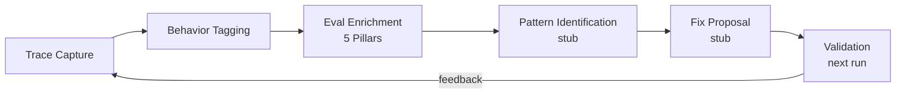

# HR & Agent Lifecycle

This page covers the operational lifecycle of every agent in a synthetic organization -- from hiring through performance tracking, promotion, evolution, and offboarding. The HR subsystem is how SynthOrg simulates a workforce: closed-loop hiring when new skills are needed, performance-driven pruning when agents fail to deliver, and pluggable evolution for agents that need to adapt their identity.

See [Agents](agents.md) for the identity layer (personality, skills, tool namespaces, identity versioning).

## Seniority & Authority Levels

| Level | Authority | Typical Model | Cost Tier |
|-------|----------|---------------|-----------|
| Intern/Junior | Execute assigned tasks only | small / local | $ |
| Mid | Execute + suggest improvements | medium / local | $$ |
| Senior | Execute + design + review others | medium / large | $$$ |
| Lead | All above + approve + delegate | large / medium | $$$ |
| Principal/Staff | All above + architectural decisions | large | $$$$ |
| Director | Strategic decisions + budget authority | large | $$$$ |
| VP | Department-wide authority | large | $$$$ |
| C-Suite (CEO/CTO/CFO) | Company-wide authority + final approvals | large | $$$$ |

---

## Role Catalog

The role catalog is extensible -- users can add [custom roles](#dynamic-roles) via config.
The built-in catalog covers common organizational roles:

=== "C-Suite / Executive"

    - **CEO** -- Overall strategy, final decision authority, cross-department coordination
    - **CTO** -- Technical vision, architecture decisions, technology choices
    - **CFO** -- Budget management, cost optimization, resource allocation
    - **COO** -- Operations, process optimization, workflow management
    - **CPO** -- Product strategy, roadmap, feature prioritization

=== "Product & Design"

    - **Product Manager** -- Requirements, user stories, prioritization, stakeholder communication
    - **UX Designer** -- User research, wireframes, user flows, usability
    - **UI Designer** -- Visual design, component design, design systems
    - **UX Researcher** -- User interviews, analytics, A/B test design
    - **Technical Writer** -- Documentation, API docs, user guides

=== "Engineering"

    - **Software Architect** -- System design, technology decisions, patterns
    - **Frontend Developer** (Junior/Mid/Senior) -- UI implementation, components, state management
    - **Backend Developer** (Junior/Mid/Senior) -- APIs, business logic, databases
    - **Full-Stack Developer** (Junior/Mid/Senior) -- End-to-end implementation
    - **DevOps/SRE Engineer** -- Infrastructure, CI/CD, monitoring, deployment
    - **Database Engineer** -- Schema design, query optimization, migrations
    - **Security Engineer** -- Security audits, vulnerability assessment, secure coding

=== "Quality Assurance"

    - **QA Lead** -- Test strategy, quality gates, release readiness
    - **QA Engineer** -- Test plans, manual testing, bug reporting
    - **Automation Engineer** -- Test frameworks, CI integration, E2E tests
    - **Performance Engineer** -- Load testing, profiling, optimization

=== "Data & Analytics"

    - **Data Analyst** -- Metrics, dashboards, business intelligence
    - **Data Engineer** -- Pipelines, ETL, data infrastructure
    - **ML Engineer** -- Model training, inference, MLOps

=== "Operations & Support"

    - **Project Manager** -- Timelines, dependencies, risk management, status tracking
    - **Scrum Master** -- Agile ceremonies, impediment removal, team health
    - **HR Manager** -- Hiring recommendations, team composition, performance tracking
    - **Security Operations** -- Request validation, safety checks, approval workflows

=== "Creative & Marketing"

    - **Content Writer** -- Blog posts, marketing copy, social media
    - **Brand Strategist** -- Messaging, positioning, competitive analysis
    - **Growth Marketer** -- Campaigns, analytics, conversion optimization

---

## Dynamic Roles

Users can define custom roles via config:

```yaml
custom_roles:
  - name: "Blockchain Developer"
    department: "Engineering"
    skills: ["solidity", "web3", "smart-contracts"]
    system_prompt_template: "blockchain_dev.md"
    authority_level: "senior"
    suggested_model: "large"
```

## Hiring Process

The HR system manages the agent workforce dynamically:

1. HR agent (or human) identifies a skill gap or workload issue
2. HR generates **candidate cards** based on team needs:
    - What skills are underrepresented?
    - What seniority level is needed?
    - What personality would complement the team?
    - What model/provider fits the budget?
3. Candidate cards are presented for approval (to CEO or human)
4. Approved candidates are instantiated and onboarded
5. Onboarding includes: company context, project briefing, team introductions, learned from seniors (training mode)

### Training Mode

Training mode is a pluggable knowledge-transfer pipeline that seeds newly hired agents with
curated senior experience at onboarding time. It runs as the `LEARNED_FROM_SENIORS` onboarding
step.

**Pipeline:**

1. **Source selection** -- select senior agents as knowledge sources (pluggable: role top
   performers, department diversity sampling, user-curated list, or composite)
2. **Extraction** -- extract procedural memories, semantic knowledge, and tool usage patterns
   from source agents in parallel
3. **Curation** -- reduce candidates to a ranked subset (pluggable: relevance score or LLM-curated)
4. **Guard chain** -- sanitization (mandatory, non-bypassable), volume caps (per-content-type
   hard limits), review gate (human approval via ApprovalStore)
5. **Storage** -- seed approved items into the new agent's memory backend with training tags

**Per-hire customization:**

- `override_sources` -- explicit agent IDs bypassing the selector
- `content_types` -- enable/disable specific extractors
- `custom_caps` -- override default volume caps per content type
- `skip_training` -- bypass the step entirely

**Safe defaults:** RoleTopPerformers (top 3), RelevanceScoreCuration, all guards enabled,
human review required. Idempotent by plan ID.

!!! info "Design decisions ([Decision Log](../architecture/decisions.md) D8)"

    - **D8.1 -- Source:** Templates + LLM customization. Templates for common roles
      (reuses existing [template system](organization.md#template-system)). LLM generates
      config for novel roles not covered by templates. Approval gate catches invalid/bad
      configs before instantiation.
    - **D8.2 -- Persistence:** Operational store via `PersistenceBackend`. YAML stays as
      bootstrap seed -- operational store wins for runtime state. Enables rehiring and
      auditable history.
    - **D8.3 -- Hot-plug:** Agents are hot-pluggable at runtime via a dedicated
      company/registry service (not `AgentEngine`, which remains the per-agent task runner).
      Thread-safe registry, wired into message bus + tools + budget.

---

## Pruning

The pruning service automates performance-driven agent removal with mandatory human approval.

- **`PruningPolicy`** protocol with two implementations:
    - `ThresholdPruningPolicy` -- prunes agents with quality AND collaboration below thresholds for N+ consecutive windows (7d/30d/90d).
    - `TrendPruningPolicy` -- prunes agents with declining Theil-Sen trend across all three windows.
- **`PruningService`** runs as a periodic background task, evaluates all active agents, and creates CRITICAL-risk approval items for eligible candidates.
- On human approval, delegates to `OffboardingService` with `FiringReason.PERFORMANCE`.
- Approval deduplication prevents multiple pending approvals per agent.
- Transient offboarding failures are retried on subsequent cycles.

Module: `src/synthorg/hr/pruning/` (models, policy, service).

## Dynamic Scaling

The scaling service closes the loop between workload, budget, skill coverage, and
performance signals and the existing hiring/pruning pipelines. It evaluates four
pluggable strategies in parallel, filters decisions through a guard chain, and
produces approved scaling actions.

### Architecture

```d2
Pipeline: "Scaling Pipeline" {
  Triggers: {
    Batched: BatchedScalingTrigger
    Threshold: SignalThresholdTrigger
    Composite: CompositeScalingTrigger
  }
  Context: ScalingContextBuilder {
    Workload: WorkloadSignalSource
    Budget: BudgetSignalSource
    Skill: SkillSignalSource
    Performance: PerformanceSignalSource
  }
  Strategies: "Strategies (parallel)" {
    WAS: WorkloadAutoScaleStrategy
    BC: BudgetCapStrategy
    SG: SkillGapStrategy
    PP: PerformancePruningStrategy
  }
  Guards: {
    CR: ConflictResolver
    CD: CooldownGuard
    RL: RateLimitGuard
    AG: ApprovalGateGuard
  }
  Execute: {
    Hire: HiringService
    Offboard: OffboardingService
  }

  Triggers -> Context -> Strategies -> Guards -> Execute
}
```

Orchestrated by ``ScalingService`` in ``hr/scaling/service.py``.

### Strategies

| Strategy | Signals | Actions | Default |
|----------|---------|---------|---------|
| **WorkloadAutoScale** | avg utilization, queue depth | HIRE when > 85% sustained, PRUNE when < 30% sustained | Enabled |
| **BudgetCap** | burn rate %, alert level | PRUNE when > 90% safety margin, HOLD to block hires | Enabled |
| **SkillGap** | coverage ratio, missing skills | HIRE with specific skill profile | Disabled (LLM cost) |
| **PerformancePruning** | quality/collaboration trends | PRUNE via existing PruningPolicy | Enabled |

Each strategy supports a headless (rule-based) path and an optional agent-delegated
path (``agent_delegate`` config field). Agent delegation is protocol-stubbed but not
implemented -- the headless path is always used.

**PerformancePruningStrategy** coordinates with the evolution system: when
``defer_during_evolution`` is True (default), agents with recent evolution
adaptations are skipped.

### Guard Chain

All decisions flow through guards sequentially before execution:

1. **ConflictResolver** -- priority-ordered resolution. Default: BudgetCap (0) >
   PerformancePruning (1) > SkillGap (2) > Workload (3). HOLD from BudgetCap
   blocks HIRE from lower-priority strategies.
2. **CooldownGuard** -- per action-type + target cooldown (default 1 hour).
3. **RateLimitGuard** -- global daily caps (default 3 hires, 1 prune per day).
4. **ApprovalGateGuard** -- routes decisions through ``ApprovalStore`` as
   ``ApprovalItem`` entries for human approval.

### Configuration

```yaml
scaling:
  enabled: true
  workload:
    enabled: true
    hire_threshold: 0.85
    prune_threshold: 0.30
  budget_cap:
    enabled: true
    safety_margin: 0.90
    headroom_fraction: 0.60
  skill_gap:
    enabled: false
  performance_pruning:
    enabled: true
    defer_during_evolution: true
  triggers:
    batched_interval_seconds: 900
  guards:
    cooldown_seconds: 3600
    max_hires_per_day: 3
    max_prunes_per_day: 1
    approval_expiry_days: 7
```

### Dashboard

The ``/scaling`` page shows:

- **Signal gauges**: utilization, budget burn, declining agent count
- **Strategy controls**: enabled status, priority order
- **Pending decisions**: awaiting human approval
- **Recent decisions**: history with outcome and rationale

Module: `src/synthorg/hr/scaling/` (models, protocols, strategies, signals,
triggers, guards, config, factory, service).

---

## Firing / Offboarding

Offboarding is triggered by: budget cuts, poor performance metrics, project completion, or
human decision.

1. Agent's memory is archived (not deleted)
2. Active tasks are reassigned
3. Team is notified

!!! info "Design decisions ([Decision Log](../architecture/decisions.md) D9, D10)"

    - **D9 -- Task Reassignment:** Pluggable `TaskReassignmentStrategy` protocol. Initial
      strategy: queue-return -- tasks return to unassigned queue, existing `TaskRoutingService`
      re-routes with priority boost for reassigned tasks. Future strategies:
      same-department/lowest-load, manager-decides (LLM), HR agent decides.
    - **D10 -- Memory Archival:** Pluggable `MemoryArchivalStrategy` protocol. Initial
      strategy: full snapshot, read-only. Pipeline: retrieve all memories, archive to
      `ArchivalStore`, selectively promote semantic+procedural memories to
      `OrgMemoryBackend` (rule-based), clean hot store, mark agent TERMINATED. Rehiring
      restores archived memories into a new `AgentIdentity`. Future strategies: selective
      discard, full-accessible.

## Performance Tracking

Performance data is exposed via three API sub-routes on `/api/v1/agents/{name}`:

| Sub-route | Response model | Description |
|-----------|---------------|-------------|
| `GET /performance` | `AgentPerformanceSummary` | Flat summary: tasks completed (total/7d/30d), success rate, cost per task, quality/collaboration scores, trend direction, plus raw window metrics and trend results |
| `GET /activity` | `PaginatedResponse[ActivityEvent]` | Paginated chronological timeline merging lifecycle events, task metrics, cost records, tool invocations, and delegation records (most recent first). Supports typed `ActivityEventType` enum filtering (invalid values return 400). Cost events are redacted for read-only roles. Response includes `degraded_sources` field for partial data detection |
| `GET /history` | `ApiResponse[tuple[CareerEvent, ...]]` | Career-relevant lifecycle events (hired, fired, promoted, demoted, onboarded) in chronological order |

The framework tracks detailed per-agent metrics:

```yaml
agent_metrics:
  tasks_completed: 42
  tasks_failed: 2
  average_quality_score: 8.5     # from code reviews, peer feedback
  average_cost_per_task: 0.45
  average_completion_time: "2h"
  collaboration_score: 7.8       # peer ratings
  last_review_date: "2026-02-20"
```

???+ note "Design decisions ([Decision Log](../architecture/decisions.md) D2, D3, D11, D12)"

    **D2 -- Quality Scoring:** Pluggable `QualityScoringStrategy` protocol. Initial
    strategy: layered combination --

    1. **FREE:** Objective CI signals (test pass/fail, lint, coverage delta)
    2. **Small daily cost (illustrative):** Small-model LLM judge (different family
       than agent) evaluates output vs acceptance criteria (actual spend is in the
       operator's configured currency and provider)
    3. **On-demand:** Human override via API, highest weight

    All three layers are implemented via `CompositeQualityStrategy`
    (configurable CI/LLM weights, human override short-circuits with
    highest priority).  Human override CRUD is exposed at
    `/agents/{agent_id}/quality/override`.  Config fields:
    `quality_judge_model`, `quality_judge_provider`, `quality_ci_weight`,
    `quality_llm_weight` in `PerformanceConfig`.  Future strategies:
    CI-only, LLM-only, human-only.

    ---

    **D3 -- Collaboration Scoring:** Pluggable `CollaborationScoringStrategy` protocol.
    Initial strategy: automated behavioral telemetry --

    ```
    collaboration_score = weighted_average(
        delegation_success_rate,
        delegation_response_latency,
        conflict_resolution_constructiveness,
        meeting_contribution_rate,
        loop_prevention_score,
        handoff_completeness
    )
    ```

    Weights are configurable per-role. Periodic LLM sampling (1%, configurable)
    for calibration is implemented via `LlmCalibrationSampler` (opt-in,
    requires `llm_sampling_model` config). Human override via API is
    implemented via `CollaborationOverrideStore` + `CollaborationController`
    at `/agents/{agent_id}/collaboration`. Future strategies: LLM evaluation,
    peer ratings, human-provided.

    ---

    **D11 -- Rolling Windows:** Pluggable `MetricsWindowStrategy` protocol. Initial
    strategy: multiple simultaneous windows --

    - **7d** for acute regressions
    - **30d** for sustained patterns
    - **90d** for baseline/drift

    Minimum 5 data points per window; below that, the system reports "insufficient data."
    Future strategies: fixed single window, per-metric configurable.

    ---

    **D12 -- Trend Detection:** Pluggable `TrendDetectionStrategy` protocol. Initial
    strategy: Theil-Sen regression slope per window + configurable thresholds classify
    trends as improving/stable/declining. Theil-Sen has 29.3% outlier breakdown (tolerates
    ~1 in 3 bad data points). Minimum 5 data points. Future strategies:
    period-over-period, OLS regression, threshold-only.

## Evaluation Loop

The closed-loop evaluation framework continuously measures agent performance and
identifies improvement opportunities. Built on top of the existing five-pillar
evaluation, performance tracking, trajectory scoring, and training infrastructure.

### Closed-Loop Architecture



The ``EvalLoopCoordinator`` orchestrates existing services into cycles:
collect metrics, enrich with five-pillar evaluation, identify failure patterns
(stub), propose targeted fixes (stub), and validate via next-run trajectory scores.

### Behavior Tagging

Each turn is tagged with one or more ``BehaviorTag`` categories for fine-grained
trace analysis and eval routing:

| Tag | Description |
|-----|-------------|
| `file_operations` | Read, write, edit, list, grep |
| `retrieval` | Search, multi-hop document synthesis |
| `tool_use` | Generic tool selection and chaining |
| `memory` | Recall, preference extraction, persistence |
| `conversation` | Multi-turn dialogue, clarifying questions |
| `summarization` | Context overflow handling |
| `delegation` | Sub-agent spawning, handoff |
| `coordination` | Multi-agent pipeline waves |
| `verification` | Rubric grading, quality assessment |

Tags are inferred by ``BehaviorTaggerMiddleware`` (opt-in, ``after_model`` slot)
via tool-name pattern matching. Stored on ``TurnRecord.behavior_tags``.

### Efficiency Ratios

Per-run efficiency ratios measured against ``IdealTrajectoryBaseline``:

- **Step ratio**: observed steps / ideal steps (1.0 = on target)
- **Tool call ratio**: observed calls / ideal calls
- **Latency ratio**: observed time / ideal time
- **Verbosity ratio**: observed output tokens / ideal tokens (from SlopCodeBench)
- **Structural erosion score**: composite 0.0--1.0 (duplicated blocks, cyclomatic
  complexity delta, dead-branch ratio)
- **PTE**: Prefill Token Equivalents (hardware-aware cost metric, from arXiv:2604.05404)
- **PTE ratio**: observed PTE / ideal PTE

Baselines are human-curated and versioned -- not auto-updated from observed runs.

### Quality Erosion Detection

New stagnation variant (``StagnationReason.QUALITY_EROSION``): agent keeps working
but ``structural_erosion_score`` climbs past threshold (default 0.5).
``QualityErosionDetector`` implements the ``StagnationDetector`` protocol and fires
corrective prompt injection or termination.

### External Benchmarks

Pluggable ``ExternalBenchmark`` protocol for adopting external benchmark suites
without modifying the framework. ``ExternalBenchmarkRegistry`` manages registration
and execution.

### Agent Evaluation Testing

Tests tagged ``@pytest.mark.agent_eval(category="file_operations")`` run separately
from the default unit suite:

```bash
uv run python -m pytest tests/evals/ -n 8 --eval-timeout=300
```

``n1_prefix_replay`` utility replays first N-1 turns of a recorded trace and lets
the agent generate only the final turn for regression testing.

CI: ``evals.yml`` runs nightly and on ``run-evals`` label.

---

## Promotions & Demotions

Agents can move between seniority levels based on performance:

- **Promotion criteria:** Sustained high quality scores, task complexity handled, peer feedback
- **Demotion criteria:** Repeated failures, quality drops, cost inefficiency
- Promotions can unlock higher [tool access levels](tools.md#tool-access-levels)
- Model upgrades/downgrades may accompany level changes (configurable, see [auto-downgrade](budget.md#cost-controls))

!!! info "Design decisions ([Decision Log](../architecture/decisions.md) D13, D14, D15)"

    - **D13 -- Promotion Criteria:** Pluggable `PromotionCriteriaStrategy` protocol. Initial
      strategy: configurable threshold gates. `ThresholdEvaluator` with
      `min_criteria_met: int` (N of M) + `required_criteria: list[str]`. Setting `min=total`
      gives AND; `min=1` gives OR. Default: junior-to-mid = 2 of 3 criteria,
      mid-to-senior = all.
    - **D14 -- Promotion Approval:** Pluggable `PromotionApprovalStrategy` protocol. Initial
      strategy: senior+ requires human approval. Junior-to-mid auto-promotes (low cost
      impact: small-to-medium ~4x). Demotions: auto-apply for cost-saving (model downgrade),
      human approval for authority-reducing demotions.
    - **D15 -- Model Mapping:** Pluggable `ModelMappingStrategy` protocol. Initial strategy:
      default ON (`hr.promotions.model_follows_seniority: true`). Model changes at task
      boundaries only (never mid-execution, consistent with
      [auto-downgrade](budget.md#cost-controls)). Per-agent `preferred_model` overrides seniority
      default. Smart routing still uses cheap models for simple tasks regardless of seniority.

---

## Agent Evolution

Agents improve over time through a pluggable evolution pipeline that closes the loop
between execution outcomes, learned knowledge, and agent behavior. The system follows
the [EvoSkill](https://arxiv.org/abs/2603.02766) three-agent separation principle:
the executing agent does not propose its own identity changes -- a separate analyzer
does.

### Architecture

```d2
Pipeline: "Evolution Pipeline" {
  Trigger: {
    T1: "BatchedTrigger\n(cron-like)"
    T2: "InflectionTrigger\n(performance trend)"
    T3: "PerTaskTrigger\n(post-execution)"
    T4: "CompositeTrigger\n(OR-combines)"
  }
  Context: "Build Context" {
    BC: "EvolutionContext\n(identity, performance, memories)"
  }
  Proposer: {
    P1: SeparateAnalyzerProposer
    P2: SelfReportProposer
    P3: CompositeProposer
  }
  Guards: {
    G1: RateLimitGuard
    G2: ReviewGateGuard
    G3: RollbackGuard
    G4: ShadowEvaluationGuard
    G5: CompositeGuard
  }
  Apply: "Adapter.apply" {
    A1: IdentityAdapter
    A2: StrategySelectionAdapter
    A3: PromptTemplateAdapter
  }

  Trigger -> Context -> Proposer -> Guards -> Apply
}
```

The pipeline is orchestrated by ``EvolutionService`` in ``engine/evolution/service.py``.

### Pluggable Axes

Every bullet is a strategy behind a ``@runtime_checkable Protocol``:

- **Triggers** (``engine/evolution/triggers/``): ``BatchedTrigger``, ``InflectionTrigger``, ``PerTaskTrigger``, ``CompositeTrigger``
- **Proposers** (``engine/evolution/proposers/``): ``SeparateAnalyzerProposer`` (EvoSkill strict), ``SelfReportProposer`` (heuristic), ``CompositeProposer`` (routes by outcome)
- **Adapters** (``engine/evolution/adapters/``): ``IdentityAdapter`` (identity mutation via version store), ``StrategySelectionAdapter`` (preference memory), ``PromptTemplateAdapter`` (prompt injection)
- **Guards** (``engine/evolution/guards/``): ``RateLimitGuard``, ``ReviewGateGuard``, ``RollbackGuard``, ``ShadowEvaluationGuard`` (runs adapted agent on a probe task suite via a pluggable ``ShadowTaskProvider`` + ``ShadowAgentRunner`` and rejects when score or pass rate regresses beyond configured tolerances), ``ApproveAllGuard`` (no-op fallback used when every real guard is disabled), ``CompositeGuard`` (chains ALL)

### Identity Version Store

``engine/identity/store/`` provides versioned identity storage with rollback:

- **``IdentityVersionStore``** protocol: ``put``, ``get_current``, ``get_version``, ``list_versions``, ``set_current`` (rollback)
- **``AppendOnlyIdentityStore``**: Every mutation appends a new version (full audit trail). ``set_current`` writes a new version pointing to the restored content.
- **``CopyOnWriteIdentityStore``**: Maintains a separate version pointer. ``set_current`` only updates the pointer (cheaper, but loses rollback audit trail).

Both wrap ``AgentRegistryService`` + ``VersioningService[AgentIdentity]``.

### Performance Inflection Events

``PerformanceTracker`` emits ``PerformanceInflection`` events via an ``InflectionSink`` protocol when a metric's trend direction changes (e.g., stable to declining). ``InflectionTrigger`` implements ``InflectionSink`` and queues events for the evolution service.

### Safe Defaults

| Axis | Default | Rationale |
|------|---------|-----------|
| Triggers | batched (daily) + inflection | Low cost, reactive |
| Proposer | composite (analyzer for failures, self-report for success) | EvoSkill separation |
| Adapters | prompt_template ON, strategy_selection ON, identity OFF | Identity is highest risk |
| Guards | review_gate + rollback + rate_limit ON; shadow OFF | Safety first |
| Identity store | append_only | Audit trail by default |
| Propagation | none | Opt-in per org |

### Configuration

```yaml
evolution:
  enabled: true
  triggers:
    types: [batched, inflection]
    batched_interval_seconds: 86400
  proposer:
    type: composite
    model: example-small-001
    temperature: 0.3
    max_tokens: 2000
  adapters:
    identity: false
    strategy_selection: true
    prompt_template: true
  guards:
    review_gate: true
    rollback: true
    rollback_window_tasks: 20
    rollback_regression_threshold: 0.1
    rate_limit: true
    rate_limit_per_day: 3
    shadow_evaluation: null        # null disables; set a ShadowEvaluationConfig to enable
  memory:
    capture:
      type: hybrid           # failure | success | hybrid
      min_quality_score: 8.0
    pruning:
      type: ttl              # ttl | pareto | hybrid
      max_age_days: 90
    propagation:
      type: none             # none | role_scoped | department_scoped
  identity_store:
    type: append_only
```

!!! note "Runtime wiring status"
    The evolution config, service, and factory are implemented. As of today,
    ``build_evolution_service()`` has no production callers -- the service is
    wired in tests and designed for app-init integration. REST API + dashboard
    for runtime evolution management are planned.

## Five-Pillar Evaluation Framework

Performance data is also evaluated through a structured five-pillar framework
([InfoQ: Evaluating AI Agents](https://www.infoq.com/articles/evaluating-ai-agents-lessons-learned/)):

| Pillar | Measures | Data Sources |
|--------|----------|--------------|
| **Intelligence/Accuracy** | Quality of task output, reasoning coherence | `QualityScoreResult`, `LlmCalibrationRecord` |
| **Performance/Efficiency** | Cost, latency, token usage | `WindowMetrics` (cost, time, tokens) |
| **Reliability/Resilience** | Consistency, failure recovery, streaks | `TaskMetricRecord` sequences |
| **Responsibility/Governance** | Compliance, trust stability, autonomy adherence | Audit log, trust system, autonomy system |
| **User Experience** | Clarity, helpfulness, tone, satisfaction | `InteractionFeedback` records |

Each pillar and its individual metrics can be independently enabled/disabled via
`EvaluationConfig`. Disabled pillars/metrics have their weight redistributed
proportionally to remaining enabled ones. All pillars ship enabled by default with
recommended weights (equal 0.2 each).

The `EvaluationService` orchestrates scoring, delegating to pluggable
`PillarScoringStrategy` implementations. The efficiency pillar is computed inline
from `WindowMetrics`. Human-calibrated LLM labeling uses the existing
`LlmCalibrationSampler` infrastructure -- calibration drift above a configurable
threshold reduces the intelligence pillar's confidence, signaling the need for
more human labels.

???+ note "Design decisions ([Decision Log](../architecture/decisions.md) D24)"

    **D24 -- Five-Pillar Evaluation:** Pluggable `PillarScoringStrategy` protocol with
    single `EvaluationContext` bag. Each pillar has a default strategy:

    - **Intelligence:** `QualityBlendIntelligenceStrategy` -- blends CI quality score
      (70%) with LLM calibration score (30%). High calibration drift reduces confidence.
    - **Efficiency:** Inline computation from `WindowMetrics` -- normalized cost (40%),
      time (30%), token (30%) efficiency scores.
    - **Resilience:** `TaskBasedResilienceStrategy` -- success rate (40%), recovery rate
      (25%), quality consistency (20%), streak bonus (15%).
    - **Governance:** `AuditBasedGovernanceStrategy` -- audit compliance (50%), trust
      level (30%), autonomy compliance (20%).
    - **Experience:** `FeedbackBasedUxStrategy` -- clarity (25%), helpfulness (25%),
      trust (20%), tone (15%), satisfaction (15%).

    All metrics toggleable via `EvaluationConfig` per-pillar sub-configs. Weight
    redistribution follows the `BehavioralTelemetryStrategy` pattern. Pull-based
    evaluation (no background daemon).

---

## Client Agents

Client agents are synthetic or real external actors that submit task requirements
and review deliverables. Unlike internal agents (which execute tasks), client agents
drive the organization from the outside -- generating workloads and evaluating outputs.

All client types implement `ClientInterface` from `synthorg.client.protocols`:

- **AIClient** -- LLM-backed persona that generates requirements and reviews
  deliverables autonomously.
- **HumanClient** -- Delegates decisions to a human via the API/dashboard.
- **HybridClient** -- AI drafts, human confirms.

Client behavior is configured via `ClientProfile` (persona, expertise domains,
strictness level) and driven by pluggable strategies for requirement generation
and feedback evaluation.

See [Client Simulation](client-simulation.md) for the full architecture.

---

## See Also

- [Agents](agents.md) -- agent identity, personality, skills, identity versioning
- [Organization](organization.md) -- company types, departments, templates
- [Budget & Cost](budget.md) -- performance-driven downgrade, risk budget
- [Design Overview](index.md) -- full index
