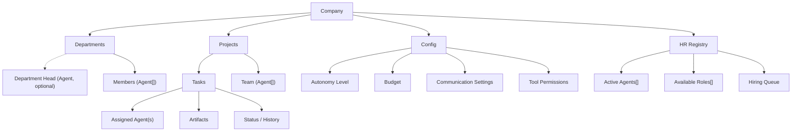

# Design Overview

## Core Vision

SynthOrg is a **configurable AI company framework** where AI agents operate within a virtual
organization. Each agent has a defined role, personality, skills, memory, and model backend.
The company can be configured from a 2-person startup to a 50+ enterprise, handling software
development, business operations, creative work, or any domain.

## Design Principles

<div class="grid cards" markdown>

-   **Configuration over Code**

    ---

    Company structures, roles, and workflows are defined via config, not hardcoded.

-   **Provider Agnostic**

    ---

    Any LLM backend: cloud APIs, OpenRouter, Ollama, custom endpoints.

-   **Composable**

    ---

    Mix and match roles, teams, and workflows. Build any type of company.

-   **Observable**

    ---

    Every agent action, communication, and decision is logged and visible.

-   **Autonomy Spectrum**

    ---

    From full human oversight to fully autonomous operation.

-   **Cost Aware**

    ---

    Built-in budget tracking, model routing optimization, and spending controls.

-   **Extensible**

    ---

    Plugin architecture for new roles, tools, providers, and workflows.

-   **Local First**

    ---

    Runs locally with the option to expose on network or host remotely later.

</div>

## What This Is NOT

- Not a chatbot or conversational AI product
- Not locked to software development only (though that is a primary use case)
- Not a wrapper around a single model or provider
- Not a toy/demo -- designed for real, production-quality output

!!! info "How to read the design specification"

    Sections describe the full vision. The full design is documented upfront to inform
    architecture decisions -- protocol interfaces are designed even for features that are
    not yet implemented. For current implementation status, see the
    [Roadmap](../roadmap/index.md).

## Configuration Philosophy

The framework follows **progressive disclosure** -- users only configure what they need:

1. **Templates** handle 90% of users -- pick a template, override 2-3 values, go
2. **Minimal config** for custom setups -- everything has sensible defaults
3. **Full config** for power users -- every knob exposed but none required

**Minimal custom company** (all other settings use defaults):

```yaml
company:
  name: "Acme Corp"
  template: "startup"
  budget_monthly: 50.00
```

All configuration systems in the framework are **pluggable** -- strategies, backends, and
policies are swappable via protocol interfaces without modifying existing code. Sensible
defaults are chosen for each, documented in the relevant section alongside the full
configuration reference.

---

## Glossary

| Term | Definition |
|------|-----------|
| **Agent** | An AI entity with a role, personality, model backend, memory, and tool access. The primary entity in the framework. Within a company context, agents serve as the company's employees. |
| **Company** | A configured organization of agents with structure, hierarchy, and workflows |
| **Department** | A grouping of related roles (Engineering, Product, Design, Operations, etc.) |
| **Role** | A job definition with required skills, responsibilities, authority level, and tool access |
| **Skill** | A capability an agent possesses (coding, writing, analysis, design, etc.) |
| **Task** | A unit of work assigned to one or more agents |
| **Project** | A collection of related tasks with a goal, deadline, and assigned team |
| **Meeting** | A structured multi-agent interaction for decisions, reviews, or planning |
| **Artifact** | Any output produced by agents: code, documents, designs, reports, etc. |

## Entity Relationships

The following diagram illustrates how the core entities in SynthOrg relate to each other:



---

<div class="grid cards" markdown>

-   [**Agents & HR**](agents.md)

    ---

    Agent identity, seniority levels, role catalog, hiring, firing, performance tracking,
    evaluation, and promotions.

-   [**Organization & Templates**](organization.md)

    ---

    Company types, organizational hierarchy, department configuration, template system,
    and dynamic scaling.

-   [**Communication**](communication.md)

    ---

    Message bus, delegation, conflict resolution, and meeting protocols.

-   [**Engine**](engine.md)

    ---

    Execution loops, task decomposition, routing, orchestration, and recovery.

-   [**Memory**](memory.md)

    ---

    Agent memory, retrieval pipeline, shared organizational memory, and consolidation.

-   [**Semantic Ontology**](ontology.md)

    ---

    Shared entity vocabulary, versioned definitions, drift detection, and context
    injection for inter-agent semantic alignment.

-   [**Operations**](operations.md)

    ---

    Budget enforcement, security, progressive trust, autonomy levels, and approval
    workflows.

-   [**Brand Identity & UX**](brand-and-ux.md)

    ---

    Visual identity, semantic color system, theme architecture, typography, density,
    and animation guidelines.

</div>
