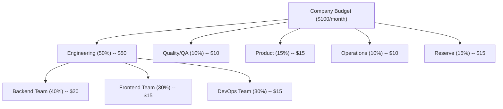

# Operations

This section covers the operational infrastructure of the SynthOrg framework: how agents
access LLM providers, how costs are tracked and controlled, how tools are sandboxed and
permissioned, how security policies are enforced, and how humans interact with the system.

---

## Providers

### Provider Abstraction

The framework provides a unified interface for all LLM interactions. The provider layer
abstracts away vendor differences, exposing a single `completion()` method regardless of
whether the backend is a cloud API, OpenRouter, Ollama, or a custom endpoint.

```text
+-------------------------------------------------+
|            Unified Model Interface               |
|   completion(messages, tools, config) -> resp    |
+-----------+-----------+-----------+--------------+
| Cloud API | OpenRouter|  Ollama   |  Custom      |
|  Adapter  |  Adapter  |  Adapter  |  Adapter     |
+-----------+-----------+-----------+--------------+
| Direct    | 400+ LLMs | Local LLMs|  Any API     |
| API call  | via OR    | Self-host |              |
+-----------+-----------+-----------+--------------+
```

### Provider Configuration

???+ note "Provider Configuration (YAML)"

    Model IDs, pricing, and provider examples below are **illustrative**. Actual models, costs,
    and provider availability are determined during implementation and loaded dynamically from
    provider APIs where possible.

    ```yaml
    providers:
      example-provider:
        family: "example-family"       # cross-validation grouping (optional)
        auth_type: api_key             # api_key | oauth | custom_header | none
        api_key: "${PROVIDER_API_KEY}"
        models:                        # example entries -- real list loaded from provider
          - id: "example-large-001"
            alias: "large"
            cost_per_1k_input: 0.015   # illustrative, verify at implementation time
            cost_per_1k_output: 0.075
            max_context: 200000
            estimated_latency_ms: 1500 # optional, used by fastest strategy
          - id: "example-medium-001"
            alias: "medium"
            cost_per_1k_input: 0.003
            cost_per_1k_output: 0.015
            max_context: 200000
            estimated_latency_ms: 500
          - id: "example-small-001"
            alias: "small"
            cost_per_1k_input: 0.0008
            cost_per_1k_output: 0.004
            max_context: 200000
            estimated_latency_ms: 200

      openrouter:
        auth_type: api_key           # api_key | oauth | custom_header | none
        api_key: "${OPENROUTER_API_KEY}"
        base_url: "https://openrouter.ai/api/v1"
        models:                        # example entries
          - id: "vendor-a/model-medium"
            alias: "or-medium"
          - id: "vendor-b/model-pro"
            alias: "or-pro"
          - id: "vendor-c/model-reasoning"
            alias: "or-reasoning"

      ollama:
        auth_type: none
        base_url: "http://localhost:11434"
        models:                        # example entries
          - id: "llama3.3:70b"
            alias: "local-llama"
            cost_per_1k_input: 0.0    # free, local
            cost_per_1k_output: 0.0
          - id: "qwen2.5-coder:32b"
            alias: "local-coder"
            cost_per_1k_input: 0.0
            cost_per_1k_output: 0.0
    ```

### LiteLLM Integration

The framework uses **LiteLLM** as the provider abstraction layer:

- Unified API across 100+ providers
- Built-in cost tracking
- Automatic retries and fallbacks
- Load balancing across providers
- OpenAI-compatible interface (all providers normalized)

### Provider Management

Providers can be managed at runtime through the API without restarting:

- **CRUD**: `POST /api/v1/providers` (create), `PUT /api/v1/providers/{name}` (update), `DELETE /api/v1/providers/{name}` (delete)
- **Connection test**: `POST /api/v1/providers/{name}/test` -- sends a minimal probe and reports latency
- **Model discovery**: `POST /api/v1/providers/{name}/discover-models` -- queries the provider endpoint for available models (Ollama `/api/tags`, standard `/models`) and updates the provider config. Also auto-triggered on preset creation for no-auth providers with empty model lists. SSRF-safe URL validation applied before outbound requests; bypassed for trusted URLs (no-auth local providers or validated preset-hinted URLs) where localhost/private IPs are expected by design. SSRF bypass is logged at WARNING level (`PROVIDER_DISCOVERY_SSRF_BYPASSED`).
- **Presets**: `GET /api/v1/providers/presets` lists built-in templates (Ollama, LM Studio, OpenRouter, vLLM); `POST /api/v1/providers/from-preset` creates from a template
- **Preset auto-probe**: `POST /api/v1/providers/probe-preset` -- for presets with `candidate_urls` (local providers: Ollama, LM Studio, vLLM), probes each URL in priority order (`host.docker.internal`, Docker bridge IP, `localhost`) with a 5-second timeout. Returns the first reachable URL and discovered model count. Used by the setup wizard to auto-detect local providers running on the host machine. SSRF validation is intentionally skipped because only hardcoded preset URLs are probed, never user input.
- **Hot-reload**: On mutation, `ProviderManagementService` rebuilds `ProviderRegistry` + `ModelRouter` and atomically swaps them in `AppState` -- no downtime
- **Auth types**: `api_key` (default), `oauth` (stores credentials, MVP uses pre-fetched token), `custom_header`, `none` (local providers)
- **Credential safety**: Secrets are Fernet-encrypted at rest via the `providers.configs` sensitive setting; API responses use `ProviderResponse` DTO that strips all secrets and provides `has_api_key`/`has_oauth_credentials`/`has_custom_header` boolean indicators

### Model Routing Strategy

Model routing determines which LLM handles a given request. Six strategies are available,
selectable via configuration:

| Strategy | Behavior |
|----------|----------|
| `manual` | Resolve an explicit model override; fails if not set |
| `role_based` | Match agent seniority level to routing rules, then catalog default |
| `cost_aware` | Match task-type rules, then pick cheapest model within budget |
| `cheapest` | Alias for `cost_aware` |
| `fastest` | Match task-type rules, then pick fastest model (by `estimated_latency_ms`) within budget; falls back to cheapest when no latency data is available |
| `smart` | Priority cascade: override > task-type > role > seniority > cheapest > fallback chain |

```yaml
routing:
  strategy: "smart"              # smart, cheapest, fastest, role_based, cost_aware, manual
  rules:
    - role_level: "C-Suite"
      preferred_model: "large"
      fallback: "medium"
    - role_level: "Senior"
      preferred_model: "medium"
      fallback: "small"
    - role_level: "Junior"
      preferred_model: "small"
      fallback: "local-coder"
    - task_type: "code_review"
      preferred_model: "medium"
    - task_type: "documentation"
      preferred_model: "small"
    - task_type: "architecture"
      preferred_model: "large"
  fallback_chain:
    - "example-provider"
    - "openrouter"
    - "ollama"
```

---

## Budget and Cost Management

### Budget Hierarchy

The framework enforces a hierarchical budget structure. Allocations cascade from the company
level through departments to individual teams.



!!! abstract "Note"

    Percentages are illustrative defaults. All allocations are configurable per company.

### Cost Tracking

Every API call is tracked with full context:

```json
{
  "agent_id": "sarah_chen",
  "task_id": "task-123",
  "provider": "example-provider",
  "model": "example-medium-001",
  "input_tokens": 4500,
  "output_tokens": 1200,
  "cost_usd": 0.0315,
  "timestamp": "2026-02-27T10:30:00Z"
}
```

`CostRecord` stores `input_tokens` and `output_tokens`; `total_tokens` is a `@computed_field`
property on `TokenUsage` (the model embedded in `CompletionResponse`). Spending aggregation
models (`AgentSpending`, `DepartmentSpending`, `PeriodSpending`) extend a shared
`_SpendingTotals` base class.

### CFO Agent Responsibilities

The CFO agent (when enabled) acts as a cost management system. Budget tracking, per-task cost
recording, and cost controls are enforced by `BudgetEnforcer` (a service the engine composes).
CFO cost optimization is implemented via `CostOptimizer`.

- Monitor real-time spending across all agents
- Alert when departments approach budget limits
- Suggest model downgrades when budget is tight
- Report daily/weekly spending summaries
- Recommend hiring/firing based on cost efficiency
- Block tasks that would exceed remaining budget
- Optimize model routing for cost/quality balance

`CostOptimizer` implements anomaly detection (sigma + spike factor), per-agent efficiency
analysis, model downgrade recommendations (via `ModelResolver`), routing optimization
suggestions, and operation approval evaluation. `ReportGenerator` produces multi-dimensional
spending reports with task/provider/model breakdowns and period-over-period comparison.

### Cost Controls

The budget system enforces three layers: pre-flight checks, in-flight monitoring, and
task-boundary auto-downgrade.

```yaml
budget:
  total_monthly: 100.00
  reset_day: 1
  alerts:
    warn_at: 75               # percent
    critical_at: 90
    hard_stop_at: 100
  per_task_limit: 5.00
  per_agent_daily_limit: 10.00
  auto_downgrade:
    enabled: true
    threshold: 85              # percent of budget used
    boundary: "task_assignment" # task_assignment only -- NEVER mid-execution
    downgrade_map:             # ordered pairs -- aliases reference configured models
      - ["large", "medium"]
      - ["medium", "small"]
      - ["small", "local-small"]
```

!!! tip "Auto-Downgrade Boundary"

    Model downgrades apply only at **task assignment time**, never mid-execution. An agent
    halfway through an architecture review cannot be switched to a cheaper model -- the task
    completes on its assigned model. The next task assignment respects the downgrade threshold.
    This prevents quality degradation from mid-thought model switches.

!!! info "Minimal Configuration"

    The only required field is `total_monthly`. All other fields have sensible defaults:

    ```yaml
    budget:
      total_monthly: 100.00
    ```

### LLM Call Analytics

Every LLM provider call is tracked with comprehensive metadata for financial reporting,
debugging, and orchestration overhead analysis.

#### Per-Call Tracking and Proxy Overhead Metrics

Every completion call produces a `CompletionResponse` with `TokenUsage` (token counts and
cost). The engine layer creates a `CostRecord` (with agent/task context) and records it
into `CostTracker`. The engine additionally logs **proxy overhead metrics** at task
completion:

- `turns_per_task` -- number of LLM turns to complete the task
- `tokens_per_task` -- total tokens consumed
- `cost_per_task` -- total USD cost
- `duration_seconds` -- wall-clock execution time
- `prompt_tokens` -- estimated system prompt tokens
- `prompt_token_ratio` -- ratio of prompt tokens to total tokens (overhead indicator; warns when >0.3)

These are natural overhead indicators -- a task consuming 15 turns and 50k tokens for a
one-line fix signals a problem. Metrics are captured in `TaskCompletionMetrics`, a frozen
Pydantic model with a `from_run_result()` factory method.

#### Call Categorization and Orchestration Ratio

When multi-agent coordination exists, each `CostRecord` is tagged with a **call category**:

| Category | Description | Examples |
|----------|-------------|---------|
| `productive` | Direct task work -- tool calls, code generation, task output | Agent writing code, running tests |
| `coordination` | Inter-agent communication -- delegation, reviews, meetings | Manager reviewing work, agent presenting in meeting |
| `system` | Framework overhead -- system prompt injection, context loading | Initial prompt, [memory retrieval injection](memory.md#memory-injection-strategies) |

The **orchestration ratio** (`coordination / total`) is surfaced in metrics and alerts. If
coordination tokens consistently exceed productive tokens, the company configuration needs
tuning (fewer approval layers, simpler [meeting protocols](communication.md#meeting-protocol),
etc.).

???+ note "Coordination Metrics Suite"

    A comprehensive suite of coordination metrics derived from empirical agent scaling research
    ([Kim et al., 2025](https://arxiv.org/abs/2512.08296)). These metrics explain coordination
    dynamics and enable data-driven tuning of multi-agent configurations.

    | Metric | Symbol | Definition | What It Signals |
    |--------|--------|------------|-----------------|
    | **Coordination efficiency** | `Ec` | `success_rate / (turns / turns_sas)` -- success normalized by relative turn count vs single-agent baseline | Overall coordination ROI. Low Ec = coordination costs exceed benefits |
    | **Coordination overhead** | `O%` | `(turns_mas - turns_sas) / turns_sas * 100%` -- relative turn increase | Communication cost. Optimal band: 200--300%. Above 400% = over-coordination |
    | **Error amplification** | `Ae` | `error_rate_mas / error_rate_sas` -- relative failure probability | Whether MAS corrects or propagates errors. Centralized ~4.4x, Independent ~17.2x |
    | **Message density** | `c` | Inter-agent messages per reasoning turn | Communication intensity. Performance saturates at ~0.39 messages/turn |
    | **Redundancy rate** | `R` | Mean cosine similarity of agent output embeddings | Agent agreement. Optimal at ~0.41 (balances fusion with independence) |

    All 5 metrics are opt-in via `coordination_metrics.enabled` in analytics config. `Ec` and
    `O%` are cheap (turn counting). `Ae` requires baseline comparison data. `c` and `R` require
    semantic analysis of agent outputs.

    ```yaml
    coordination_metrics:
      enabled: false                       # opt-in -- enable for data gathering
      collect:
        - efficiency                       # cheap -- turn counting
        - overhead                         # cheap -- turn counting
        - error_amplification              # requires SAS baseline data
        - message_density                  # requires message counting infrastructure
        - redundancy                       # requires embedding computation on outputs
      baseline_window: 50                  # number of SAS runs to establish baseline for Ae
      error_taxonomy:
        enabled: false                     # opt-in -- enable for targeted diagnosis
        categories:
          - logical_contradiction
          - numerical_drift
          - context_omission
          - coordination_failure
    ```

???+ note "Full Analytics Layer Configuration"

    Expanded per-call metadata for comprehensive financial and operational reporting:

    ```yaml
    call_analytics:
      track:
        - call_category                    # productive, coordination, system
        - success                          # true/false
        - retry_count                      # 0 = first attempt succeeded
        - retry_reason                     # rate_limit, timeout, internal_error
        - latency_ms                       # wall-clock time for the call
        - finish_reason                    # stop, tool_use, max_tokens, error
        - cache_hit                        # prompt caching hit/miss (provider-dependent)
      aggregation:
        - per_agent_daily                  # agent spending over time
        - per_task                         # total cost per task
        - per_department                   # department-level rollups
        - per_provider                     # provider reliability and cost comparison
        - orchestration_ratio              # coordination vs productive tokens
      alerts:
        orchestration_ratio:
          info: 0.30                       # info if coordination > 30% of total
          warn: 0.50                       # warn if coordination > 50% of total
          critical: 0.70                   # critical if coordination > 70% of total
        retry_rate_warn: 0.1               # warn if > 10% of calls need retries
    ```

    Analytics metadata is append-only and never blocks execution. Failed analytics writes are
    logged and skipped -- the agent's task is never delayed by telemetry.

#### Coordination Error Taxonomy

When coordination metrics collection is enabled, the system can optionally classify
coordination errors into structured categories for targeted diagnosis.

| Error Category | Description | Detection Method |
|---------------|-------------|-----------------|
| **Logical contradiction** | Agent asserts both "X is true" and "X is false," or derives conclusions violating its stated premises | Semantic contradiction detection on agent outputs |
| **Numerical drift** | Accumulated computational errors from cascading rounding or unit conversion (>5% deviation) | Numerical comparison against ground truth or cross-agent verification |
| **Context omission** | Failure to reference previously established entities, relationships, or state required for current reasoning | Missing-reference detection across agent conversation history |
| **Coordination failure** | Message misinterpretation, task allocation conflicts, state synchronization errors between agents | Protocol-level error detection in orchestration layer |

Error taxonomy classification requires semantic analysis of agent outputs and is expensive.
Enable via `coordination_metrics.error_taxonomy.enabled: true` only when actively gathering
data for system tuning. The classification pipeline runs post-execution (never blocks agent
work) and logs structured events to the observability layer.

Error categories derived from [Kim et al., 2025](https://arxiv.org/abs/2512.08296) and the
Multi-Agent System Failure Taxonomy (MAST) by Cemri et al. (2025).

---

## Tool and Capability System

### Tool Categories

| Category | Tools | Typical Roles |
|----------|-------|---------------|
| **File System** | Read, write, edit, list, delete files | All developers, writers |
| **Code Execution** | Run code in sandboxed environments | Developers, QA |
| **Version Control** | Git operations, PR management | Developers, DevOps |
| **Web** | HTTP requests, web scraping, search | Researchers, analysts |
| **Database** | Query, migrate, admin | Backend devs, DBAs |
| **Terminal** | Shell commands (sandboxed) | DevOps, senior devs |
| **Design** | Image generation, mockup tools | Designers |
| **Communication** | Email, Slack, notifications | PMs, executives |
| **Analytics** | Metrics, dashboards, reporting | Data analysts, CFO |
| **Deployment** | CI/CD, container management | DevOps, SRE |
| **MCP Servers** | Any MCP-compatible tool | Configurable per agent |

### Tool Execution Model

When the LLM requests multiple tool calls in a single turn, `ToolInvoker.invoke_all` executes
them **concurrently** using `asyncio.TaskGroup`. An optional `max_concurrency` parameter
(default unbounded) limits parallelism via `asyncio.Semaphore`. Recoverable errors are captured
as `ToolResult(is_error=True)` without aborting sibling invocations. Non-recoverable errors
(`MemoryError`, `RecursionError`) are collected and re-raised after all tasks complete (bare
exception for one, `ExceptionGroup` for multiple).

**Permission checking** follows a priority-based system:

1. `get_permitted_definitions()` filters tool definitions sent to the LLM -- the agent only
   sees tools it is permitted to use
2. At invocation time, denied tools return `ToolResult(is_error=True)` with a descriptive
   denial reason (defense-in-depth against LLM hallucinating unpresented tools)

Resolution order: denied list (highest) > allowed list > access-level categories > deny (default).

### Tool Sandboxing

Tool execution uses a **layered sandboxing strategy** with a pluggable `SandboxBackend`
protocol. The default configuration uses lighter isolation for low-risk tools and stronger
isolation for high-risk tools.

#### Sandbox Backends

| Backend | Isolation | Latency | Dependencies | Status |
|---------|-----------|---------|--------------|--------|
| `SubprocessSandbox` | Process-level: env filtering (allowlist + denylist), restricted PATH (configurable via `extra_safe_path_prefixes`), workspace-scoped cwd, timeout + process-group kill, library injection var blocking, explicit transport cleanup on Windows | ~ms | None | Implemented |
| `DockerSandbox` | Container-level: ephemeral container, mounted workspace, no network, resource limits (CPU/memory/time) | ~1-2s cold start | Docker | Implemented |
| `K8sSandbox` | Pod-level: per-agent containers, namespace isolation, resource quotas, network policies | ~2-5s | Kubernetes | Future |

???+ note "Default Layered Sandbox Configuration"

    ```yaml
    sandboxing:
      default_backend: "subprocess"        # subprocess, docker, k8s
      overrides:                           # per-category backend overrides
        file_system: "subprocess"          # low risk -- fast, no deps
        git: "subprocess"                  # low risk -- workspace-scoped
        web: "docker"                      # medium risk -- needs network isolation
        code_execution: "docker"           # high risk -- strong isolation required
        terminal: "docker"                 # high risk -- arbitrary commands
        database: "docker"                 # high risk -- data mutation
      subprocess:
        timeout_seconds: 30
        workspace_only: true               # restrict filesystem access to project dir
        restricted_path: true              # strip dangerous binaries from PATH
      docker:
        image: "synthorg-sandbox:latest" # pre-built image with common runtimes
        network: "none"                    # no network by default
        network_overrides:                 # category-specific network policies
          database: "bridge"               # database tools need TCP access to DB host
          web: "egress-only"               # web tools need outbound HTTP; no inbound
        allowed_hosts: []                  # allowlist of host:port pairs
        memory_limit: "512m"
        cpu_limit: "1.0"
        timeout_seconds: 120
        mount_mode: "ro"                   # read-only by default
        auto_remove: true                  # ephemeral -- container removed after execution
      k8s:                                 # future -- per-agent pod isolation
        namespace: "synthorg-agents"
        resource_requests:
          cpu: "250m"
          memory: "256Mi"
        resource_limits:
          cpu: "1"
          memory: "1Gi"
        network_policy: "deny-all"         # default deny, allowlist per tool
    ```

Per-category backend selection is implemented in `tools/sandbox/factory.py` via three functions:
`build_sandbox_backends` (instantiates only the backends referenced by config),
`resolve_sandbox_for_category` (looks up the correct backend for a `ToolCategory`), and
`cleanup_sandbox_backends` (parallel cleanup with error isolation). The tool factory
(`build_default_tools_from_config`) wires `VERSION_CONTROL` category; other categories will
be wired as their tool builders are added.

Docker is optional -- only required when code execution, terminal, web, or database tools are
enabled. File system and git tools work out of the box with subprocess isolation. This keeps
the local-first experience lightweight while providing strong isolation where it matters.

Docker MVP uses `aiodocker` (async-native) with a pre-built image
(Python 3.14 + Node.js LTS + basic utils, <500MB). If Docker is unavailable, the framework
fails with a clear error -- no unsafe subprocess fallback for code execution
([Decision Log](../architecture/decisions.md) D16).

!!! info "Scaling Path"

    In a future Kubernetes deployment (Phase 3-4), each agent can run in its own pod via
    `K8sSandbox`. At that point, the layered configuration becomes less relevant -- all tools
    execute within the agent's isolated pod. The `SandboxBackend` protocol makes this
    transition seamless.

### Git Clone SSRF Prevention

The `git_clone` tool validates clone URLs against SSRF attacks via hostname/IP
validation with async DNS resolution (`git_url_validator` module). All resolved
IPs must be public; private, loopback, link-local, and reserved addresses are
blocked by default. A configurable `hostname_allowlist` lets legitimate internal
Git servers bypass the private-IP check.

**TOCTOU DNS rebinding mitigation** closes the gap between DNS validation and
`git clone`'s own resolution:

- **HTTPS URLs:** Validated IPs are pinned via `git -c http.curloptResolve=host:port:ip`
  (git >= 2.37.0; sandbox ships git 2.39+), so git uses the same addresses the validator checked.
- **SSH / SCP-like URLs:** A second DNS resolution runs immediately before execution;
  if the re-resolved IP set is not a subset of the validated set, the clone is blocked.
- **Literal IP URLs:** Immune (no DNS resolution occurs).

Both mitigations are configurable via `GitCloneNetworkPolicy.dns_rebinding_mitigation`
(default: enabled). Disable for hosts behind CDNs or geo-DNS where resolved IPs
legitimately vary between queries. For full defense-in-depth, combine with
network-level egress controls (firewall, HTTP CONNECT proxy) or container
network isolation (see Tool Sandboxing above).

### MCP Integration

External tools are integrated via the **Model Context Protocol** (MCP).

- **SDK:** Official `mcp` Python SDK, pinned version. A thin `MCPBridgeTool` adapter layer
  isolates the rest of the codebase from SDK API changes
  ([Decision Log](../architecture/decisions.md) D17)
- **Transports:** stdio (local/dev) and Streamable HTTP (remote/production). Deprecated SSE
  is skipped.
- **Result mapping:** Text blocks concatenate to `content: str`; image/audio use placeholders
  with base64 in metadata; `structuredContent` maps to `metadata["structured_content"]`;
  `isError` maps 1:1 to `is_error`
  ([Decision Log](../architecture/decisions.md) D18)

### Action Type System

Action types classify agent actions for use by [autonomy presets](#autonomy-levels),
[SecOps validation](#security-operations-agent),
[tiered timeout policies](#approval-timeout-policy), and
[progressive trust](#progressive-trust)
([Decision Log](../architecture/decisions.md) D1).

**Registry:** `StrEnum` for ~25 built-in action types (type safety, autocomplete, typos caught
at compile time) + `ActionTypeRegistry` for custom types via explicit registration. Unknown
strings are rejected at config load time -- a typo in `human_approval` list silently meaning
"skip approval" is a critical safety concern.

**Granularity:** Two-level `category:action` hierarchy. Category shortcuts expand to all
actions in that category (e.g., `auto_approve: ["code"]` expands to all `code:*` actions).
Fine-grained overrides are supported (e.g., `human_approval: ["code:create"]`).

**Taxonomy (~25 leaf types):**

```text
code:read, code:write, code:create, code:delete, code:refactor
test:write, test:run
docs:write
vcs:read, vcs:commit, vcs:push, vcs:branch
deploy:staging, deploy:production
comms:internal, comms:external
budget:spend, budget:exceed
org:hire, org:fire, org:promote
db:query, db:mutate, db:admin
arch:decide
```

**Classification:** Static tool metadata. Each `BaseTool` declares its `action_type`. Default
mapping from `ToolCategory` to action type. Non-tool actions (`org:hire`, `budget:spend`) are
triggered by engine-level operations. No LLM in the security classification path.

### Tool Access Levels

???+ note "Tool Access Level Configuration"

    ```yaml
    tool_access:
      levels:
        sandboxed:
          description: "No external access. Isolated workspace."
          file_system: "workspace_only"
          code_execution: "containerized"
          network: "none"
          git: "local_only"

        restricted:
          description: "Limited external access with approval."
          file_system: "project_directory"
          code_execution: "containerized"
          network: "allowlist_only"
          git: "read_and_branch"
          requires_approval: ["deployment", "database_write"]

        standard:
          description: "Normal development access."
          file_system: "project_directory"
          code_execution: "containerized"
          network: "open"
          git: "full"
          terminal: "restricted_commands"

        elevated:
          description: "Full access for senior/trusted agents."
          file_system: "full"
          code_execution: "containerized"
          network: "open"
          git: "full"
          terminal: "full"
          deployment: true

        custom:
          description: "Per-agent custom configuration."
    ```

The current `ToolPermissionChecker` implements **category-level gating only** -- each access
level maps to a set of permitted `ToolCategory` values. The granular sub-constraints shown
above (network mode, containerization) are planned for Docker/K8s sandbox backends.

### Progressive Trust

Agents can earn higher tool access over time through configurable trust strategies. The trust
system implements a `TrustStrategy` protocol, making it extensible. All four strategies are
implemented.

!!! warning "Security Invariant"

    The `standard_to_elevated` promotion **always** requires human approval. No agent can
    auto-gain production access regardless of trust strategy.

=== "Disabled (Default)"

    Trust is disabled. Agents receive their configured access level at hire time and it never
    changes. Simplest option -- useful when the human manages permissions manually.

    ```yaml
    trust:
      strategy: "disabled"               # disabled, weighted, per_category, milestone
      initial_level: "standard"          # fixed access level for all agents
    ```

=== "Weighted Score"

    A single trust score computed from weighted factors: task difficulty completed, error rate,
    time active, and human feedback. One global trust level per agent, applied to all tool
    categories.

    ```yaml
    trust:
      strategy: "weighted"
      initial_level: "sandboxed"
      weights:
        task_difficulty: 0.3             # harder tasks completed = more trust
        completion_rate: 0.25
        error_rate: 0.25                 # inverse -- fewer errors = more trust
        human_feedback: 0.2
      promotion_thresholds:
        sandboxed_to_restricted: 0.4
        restricted_to_standard: 0.6
        standard_to_elevated:
          score: 0.8
          requires_human_approval: true  # always human-gated
    ```

    Simple model, easy to understand. One number to track. However, too coarse -- an agent
    trusted for file edits should not auto-gain deployment access.

=== "Per-Category"

    Separate trust tracks per tool category (filesystem, git, deployment, database, network).
    An agent can be "standard" for files but "sandboxed" for deployment. Promotion criteria
    differ per category.

    ```yaml
    trust:
      strategy: "per_category"
      initial_levels:
        file_system: "restricted"
        git: "restricted"
        code_execution: "sandboxed"
        deployment: "sandboxed"
        database: "sandboxed"
        terminal: "sandboxed"
      promotion_criteria:
        file_system:
          restricted_to_standard:
            tasks_completed: 10
            quality_score_min: 7.0
        deployment:
          sandboxed_to_restricted:
            tasks_completed: 20
            quality_score_min: 8.5
            requires_human_approval: true  # always human-gated for deployment
    ```

    Granular. Matches real security models (IAM roles). Prevents gaming via easy tasks. Trust
    state is a matrix per agent, not a scalar.

=== "Milestone Gates"

    Explicit capability milestones aligned with the Cloud Security Alliance Agentic Trust
    Framework. Automated promotion for low-risk levels. Human approval gates for elevated
    access. Trust is time-bound and subject to periodic re-verification.

    ```yaml
    trust:
      strategy: "milestone"
      initial_level: "sandboxed"
      milestones:
        sandboxed_to_restricted:
          tasks_completed: 5
          quality_score_min: 7.0
          auto_promote: true             # no human needed
        restricted_to_standard:
          tasks_completed: 20
          quality_score_min: 8.0
          time_active_days: 7
          auto_promote: true
        standard_to_elevated:
          requires_human_approval: true  # always human-gated
          clean_history_days: 14         # no errors in last 14 days
      re_verification:
        enabled: true
        interval_days: 90                # re-verify every 90 days
        decay_on_idle_days: 30           # demote one level if idle 30+ days
        decay_on_error_rate: 0.15        # demote if error rate exceeds 15%
    ```

    Industry-aligned. Re-verification prevents stale trust. Trust decay may need tuning
    to avoid frustrating users.

---

## Security and Approval System

### Approval Workflow

```text
                    +---------------+
                    |  Task/Action  |
                    +-------+-------+
                            |
                    +-------v-------+
                    | Security Ops  |
                    |   Agent       |
                    +-------+-------+
                      /           \
               +-----v-+      +---v----+
               |APPROVE |      | DENY   |
               |(auto)  |      |+ reason|
               +----+---+      +---+----+
                    |              |
               Execute         +---v---------+
                               | Human Queue |
                               | (Dashboard) |
                               +---+---------+
                             /         \
                      +-----v-+    +---v----------+
                      |Override|    |Alternative   |
                      |Approve |    |Suggested     |
                      +--------+    +--------------+
```

### Autonomy Levels

The framework provides four built-in autonomy presets that control which actions agents can
perform independently versus which require human approval. Most users only set the level.

```yaml
autonomy:
  level: "semi"                  # full, semi, supervised, locked
  presets:
    full:
      description: "Agents work independently. Human notified of results only."
      auto_approve: ["all"]
      human_approval: []

    semi:
      description: "Most work is autonomous. Major decisions need approval."
      auto_approve: ["code", "test", "docs", "comms:internal"]
      human_approval: ["deploy", "comms:external", "budget:exceed", "org:hire"]
      security_agent: true

    supervised:
      description: "Human approves major steps. Agents handle details."
      auto_approve: ["code:write", "comms:internal"]
      human_approval: ["arch", "code:create", "deploy", "vcs:push"]
      security_agent: true

    locked:
      description: "Human must approve every action."
      auto_approve: []
      human_approval: ["all"]
      security_agent: true        # still runs for audit logging
```

**Autonomy scope** ([Decision Log](../architecture/decisions.md) D6): Three-level
resolution chain: per-agent > per-department > company default. Seniority validation prevents
Juniors/Interns from being set to `full`.

**Runtime changes** ([Decision Log](../architecture/decisions.md) D7): Human-only
promotion via REST API (no agent, including CEO, can escalate privileges). Automatic downgrade
on: high error rate (one level down), budget exhausted (supervised), security incident (locked).
Recovery from auto-downgrade is human-only.

### Security Operations Agent

A special meta-agent that reviews all actions before execution:

- Evaluates safety of proposed actions
- Checks for data leaks, credential exposure, destructive operations
- Validates actions against company policies
- Maintains an audit log of all approvals/denials
- Escalates uncertain cases to human queue with explanation
- **Cannot be overridden by other agents** (only human can override)

**Rule engine** ([Decision Log](../architecture/decisions.md) D4): Hybrid
approach. Rule engine for known patterns (credentials, path traversal, destructive ops) --
sub-ms, covers ~95% of cases. LLM fallback only for uncertain cases (~5%). Full autonomy mode:
rules + audit logging only, no LLM path. Hard safety rules (credential exposure, data
destruction) **never bypass** regardless of autonomy level.

**Integration point** ([Decision Log](../architecture/decisions.md) D5):
Pluggable `SecurityInterceptionStrategy` protocol. Initial strategy intercepts before every
tool invocation -- slots into existing `ToolInvoker` between permission check and tool
execution. Post-tool-call scanning detects sensitive data in outputs.

### Output Scan Response Policies

After the output scanner detects sensitive data, a pluggable `OutputScanResponsePolicy`
protocol decides how to handle the findings. Each policy sets a `ScanOutcome` enum on the
returned `OutputScanResult` so downstream consumers (primarily `ToolInvoker`) can
distinguish intentional policy decisions from scanner failures:

| Policy | Behavior | `ScanOutcome` | Default for |
|--------|----------|---------------|-------------|
| **Redact** (default) | Return scanner's redacted content as-is | `REDACTED` | `SEMI`, `SUPERVISED` autonomy |
| **Withhold** | Clear redacted content — content withheld by policy | `WITHHELD` | `LOCKED` autonomy |
| **Log-only** | Discard findings (logs at WARNING), pass original output through | `LOG_ONLY` | `FULL` autonomy |
| **Autonomy-tiered** | Delegate to a sub-policy based on effective autonomy level | *(set by delegate)* | Composite policy |

The `ScanOutcome` enum (`CLEAN`, `REDACTED`, `WITHHELD`, `LOG_ONLY`) is set by the scanner
(initial `REDACTED` when findings are detected) and may be transformed by the policy (e.g.
`WithholdPolicy` changes `REDACTED` → `WITHHELD`). The `ToolInvoker._scan_output` method
branches on `ScanOutcome.WITHHELD` first to return a dedicated error message ("content
withheld by security policy") with `output_withheld` metadata — distinct from the generic
fail-closed path used for scanner exceptions.

Policy selection is declarative via `SecurityConfig.output_scan_policy_type`
(`OutputScanPolicyType` enum). A factory function (`build_output_scan_policy`) resolves the
enum to a concrete policy instance. The policy is applied *after* audit recording, preserving
audit fidelity regardless of policy outcome.

### Approval Timeout Policy

When an action requires human approval (per autonomy level), the agent must wait. The
framework provides configurable timeout policies that determine what happens when a human
does not respond. All policies implement a `TimeoutPolicy` protocol, configurable per autonomy
level and per action risk tier.

During any wait -- regardless of policy -- the agent **parks** the blocked task (saving its
full serialized `AgentContext` state: conversation, progress, accumulated cost, turn count)
and picks up other available tasks from its queue. When approval arrives, the agent **resumes**
the original context exactly where it left off. This mirrors real company behavior: a developer
starts another task while waiting for a code review, then returns to the original work when
feedback arrives.

=== "Wait Forever"

    The action stays in the human queue indefinitely. No timeout, no auto-resolution. The agent
    works on other tasks in the meantime.

    ```yaml
    approval_timeout:
      policy: "wait"                     # wait, deny, tiered, escalation
    ```

    Safest -- no risk of unauthorized actions. Can stall tasks indefinitely if human is
    unavailable.

=== "Deny on Timeout"

    All unapproved actions auto-deny after a configurable timeout. The agent receives a denial
    reason and can retry with a different approach or escalate explicitly.

    ```yaml
    approval_timeout:
      policy: "deny"
      timeout_minutes: 240               # 4 hours
    ```

    Industry consensus default ("fail closed"). May stall legitimate work if human is
    consistently slow.

=== "Tiered Timeout"

    Different timeout behavior based on action risk level. Low-risk actions auto-approve after
    a short wait. Medium-risk actions auto-deny. High-risk/security-critical actions wait
    forever.

    ```yaml
    approval_timeout:
      policy: "tiered"
      tiers:
        low_risk:
          timeout_minutes: 60
          on_timeout: "approve"          # auto-approve low-risk after 1 hour
          actions: ["code:write", "comms:internal", "test"]
        medium_risk:
          timeout_minutes: 240
          on_timeout: "deny"             # auto-deny medium-risk after 4 hours
          actions: ["code:create", "vcs:push", "arch:decide"]
        high_risk:
          timeout_minutes: null          # wait forever
          on_timeout: "wait"
          actions: ["deploy", "db:admin", "comms:external", "org:hire"]
    ```

    Pragmatic -- low-risk tasks do not stall, critical actions stay safe. Auto-approve on
    timeout carries risk. Tuning tier boundaries requires operational experience.

=== "Escalation Chain"

    On timeout, the approval request escalates to the next human in a configured chain. If the
    entire chain times out, the action is denied.

    ```yaml
    approval_timeout:
      policy: "escalation"
      chain:
        - role: "direct_manager"
          timeout_minutes: 120
        - role: "department_head"
          timeout_minutes: 240
        - role: "ceo_or_board"
          timeout_minutes: 480
      on_chain_exhausted: "deny"         # deny if entire chain times out
    ```

    Mirrors real organizations -- if one approver is unavailable, the next in line covers.
    Requires configuring an escalation chain.

!!! abstract "Park/Resume Mechanism"

    The park/resume mechanism relies on `AgentContext` snapshots (frozen Pydantic models). When
    a task is parked, the full context is persisted to the
    [`PersistenceBackend`](memory.md#operational-data-persistence). When approval arrives, the
    framework loads the snapshot, restores the agent's conversation and state, and resumes
    execution from the exact point of suspension. This works naturally with the
    `model_copy(update=...)` immutability pattern.

    **Design decisions** ([Decision Log](../architecture/decisions.md)):

    - **D19 -- Risk Tier Classification:** Pluggable `RiskTierClassifier` protocol. Configurable
      YAML mapping with sensible defaults. Unknown action types default to HIGH (fail-safe).
    - **D20 -- Context Serialization:** Pydantic JSON via persistence backend. `ParkedContext`
      model with metadata columns + `context_json` blob. Conversation stored verbatim --
      summarization is a context window management concern at resume time, not a persistence
      concern.
    - **D21 -- Resume Injection:** Tool result injection. Approval requests modeled as tool
      calls (`request_human_approval`). Approval decision returned as `ToolResult` --
      semantically correct (approval IS the tool's return value).

---

## Human Interaction Layer

### API-First Architecture

The REST/WebSocket API is the **primary interface** for all consumers. The Web UI and any
future CLI tool are thin clients that call the API -- they contain no business logic.

```text
+-------------------------------------------------+
|               SynthOrg Engine                   |
|  (Core Logic, Agent Orchestration, Tasks)        |
+--------------------+----------------------------+
                     |
            +--------v--------+
            |   REST/WS API    |  <-- primary interface
            |   (Litestar)     |
            +---+----------+--+
                |          |
        +-------v--+  +---v--------+
        |  Web UI   |  |  CLI Tool  |
        |  (Vue 3)  |  |  (Go)      |
        +----------+   +-----------+
```

!!! info "CLI Tool (Implemented)"

    Cross-platform Go binary (`cli/`) for Docker lifecycle management. Commands: `init`
    (interactive setup wizard), `start`, `stop`, `status`, `logs`, `update` (CLI self-update
    from GitHub Releases with automatic re-exec, compose template refresh with diff
    approval, container image update with version matching), `doctor`
    (diagnostics + bug report URL), `uninstall`, `version`, `config`, `completion-install`,
    `backup` (create/list/restore via backend API), `setup` (re-open first-run wizard).
    Built with Cobra + charmbracelet/huh. Distributed via GoReleaser + install scripts
    (`curl | sh` for Linux/macOS, `irm | iex` for Windows).

### API Surface

| Endpoint | Purpose |
|----------|---------|
| `/api/v1/health` | Health check, readiness |
| `/api/v1/auth` | Authentication: setup, login, password change, ws-ticket (login/setup/change-password rate-limited to 10 req/min) |
| `/api/v1/company` | CRUD company config |
| `/api/v1/agents` | List, hire, fire, modify agents |
| `/api/v1/departments` | Department management |
| `/api/v1/projects` | Project CRUD |
| `/api/v1/tasks` | Task management |
| `POST /api/v1/tasks/{task_id}/coordinate` | Trigger multi-agent coordination |
| `/api/v1/messages` | Communication log |
| `/api/v1/meetings` | Schedule, view meeting outputs |
| `/api/v1/artifacts` | Browse produced artifacts (code, docs, etc.) |
| `/api/v1/budget` | Spending, limits, projections |
| `/api/v1/approvals` | Pending human approvals queue |
| `/api/v1/analytics` | Performance metrics, dashboards |
| `/api/v1/settings` | Runtime-editable configuration (9 namespaces), schema discovery |
| `GET /api/v1/providers`, `POST /api/v1/providers`, `PUT /api/v1/providers/{name}`, `DELETE /api/v1/providers/{name}`, `POST /api/v1/providers/{name}/test`, `GET /api/v1/providers/presets`, `POST /api/v1/providers/from-preset`, `POST /api/v1/providers/{name}/discover-models`, `POST /api/v1/providers/probe-preset` | Provider CRUD, connection testing, presets, preset auto-probe, model discovery, 4 auth types (api_key, oauth, custom_header, none) |
| `/api/v1/setup` | First-run setup wizard: status check (public, reports `has_company`/`has_agents`/`has_providers` for step resume), template listing, company/agent creation, completion gate (requires company + agent + provider) |
| `/api/v1/admin/backups` | Manual backup, list, detail, delete |
| `/api/v1/ws` | WebSocket for real-time updates (ticket auth via `?ticket=`) |
| `POST /api/v1/auth/ws-ticket` | Exchange JWT for one-time WebSocket connection ticket |

### Error Response Format (RFC 9457)

All error responses follow [RFC 9457 (Problem Details for HTTP APIs)](https://www.rfc-editor.org/rfc/rfc9457).
The API supports two response formats via content negotiation:

- **Default (`application/json`)**: `ApiResponse` envelope with `error_detail` object
- **RFC 9457 bare (`application/problem+json`)**: Flat `ProblemDetail` body with `Content-Type: application/problem+json`

Clients request bare RFC 9457 responses by sending `Accept: application/problem+json`.

#### ErrorDetail Fields (Envelope Format)

The `error_detail` object in the envelope contains:

| Field | Type | Description |
|-------|------|-------------|
| `detail` | `str` | Human-readable occurrence-specific explanation |
| `error_code` | `int` | Machine-readable 4-digit code (category-grouped: 1xxx=auth, 2xxx=validation, 3xxx=not_found, 4xxx=conflict, 5xxx=rate_limit, 6xxx=budget_exhausted, 7xxx=provider_error, 8xxx=internal) |
| `error_category` | `str` | High-level category: `auth`, `validation`, `not_found`, `conflict`, `rate_limit`, `budget_exhausted`, `provider_error`, `internal` |
| `retryable` | `bool` | Whether the client should retry the request |
| `retry_after` | `int \| null` | Seconds to wait before retrying (null when not applicable) |
| `instance` | `str` | Request correlation ID for log tracing |
| `title` | `str` | Static per-category title (e.g., "Authentication Error") |
| `type` | `str` | Documentation URI for the error category (e.g., `https://synthorg.io/docs/errors#auth`) |

#### ProblemDetail Fields (RFC 9457 Bare Format)

When `Accept: application/problem+json`, the response body contains:

| Field | Type | Description |
|-------|------|-------------|
| `type` | `str` | Documentation URI for the error category |
| `title` | `str` | Static per-category title |
| `status` | `int` | HTTP status code |
| `detail` | `str` | Human-readable occurrence-specific explanation |
| `instance` | `str` | Request correlation ID for log tracing |
| `error_code` | `int` | Machine-readable 4-digit error code |
| `error_category` | `str` | High-level error category |
| `retryable` | `bool` | Whether the client should retry |
| `retry_after` | `int \| null` | Seconds to wait before retrying |

Agent consumers can use `retryable` and `retry_after` for autonomous retry logic,
`error_code` / `error_category` for programmatic error handling without parsing
message strings, and `type` URIs for documentation lookup.

See the [Error Reference](../errors.md) for the full error taxonomy, code list,
and retry guidance.

### Web UI Features

!!! note "Status"

    The Web UI is built as a Vue 3 + PrimeVue + Tailwind CSS dashboard. The API
    remains fully self-sufficient for all operations — the dashboard is a thin client.

- **Dashboard**: Real-time company overview, active tasks, spending
- **Org Chart**: Visual hierarchy, click to inspect any agent
- **Task Board**: Kanban/list view of all tasks across projects
- **Message Feed**: Real-time feed of agent communications
- **Approval Queue**: Pending approvals with context and recommendations
- **Agent Profiles**: Detailed view of each agent's identity, history, metrics
- **Budget Panel**: Spending charts, per-agent breakdown (projections/alerts planned)
- **Meeting Logs**: Placeholder — coming soon
- **Artifact Browser**: Placeholder — coming soon
- **Settings**:
    - *Provider management*: Add/edit/delete providers, connection test, preset-based creation, model auto-discovery (Ollama `/api/tags`, standard `/models`) -- integrated as a tab alongside company config and user settings.
    - *DB-backed persistence*: 9 namespaces (api, company, providers, memory, budget, security, coordination, observability, backup). Setting types: `STRING`, `INTEGER`, `FLOAT`, `BOOLEAN`, `ENUM`, `JSON`. 4-layer resolution: DB > env > YAML > code defaults. Fernet encryption for `sensitive` values. REST API (`GET`/`PUT`/`DELETE` + schema endpoints for dynamic UI generation), change notifications via message bus.
    - *`ConfigResolver`*: Typed scalar accessors assemble full Pydantic config models from individually resolved settings (using `asyncio.TaskGroup` for parallel resolution). Structural data accessors (`get_agents`, `get_departments`, `get_provider_configs`) resolve JSON-typed settings with Pydantic schema validation and graceful fallback to `RootConfig` defaults on invalid data.
    - *Hot-reload*: `SettingsChangeDispatcher` polls the `#settings` bus channel and routes change notifications to registered `SettingsSubscriber` implementations. Settings marked `restart_required=True` are filtered (logged as WARNING, not dispatched). Concrete subscribers: `ProviderSettingsSubscriber` (rebuilds `ModelRouter` on `routing_strategy` change via `AppState.swap_model_router`), `MemorySettingsSubscriber` (advisory logging for non-restart memory settings), `BackupSettingsSubscriber` (toggles `BackupScheduler` on `enabled` change, reschedules interval on `schedule_hours` change).

### Human Roles

| Role | Access | Description |
|------|--------|-------------|
| **Board Member** | Observe + major approvals only | Minimal involvement, strategic oversight |
| **CEO** | Full authority, replaces CEO agent | Human IS the CEO, agents are the team |
| **Manager** | Department-level authority | Manages one team/department directly |
| **Observer** | Read-only | Watch the company operate, no intervention |
| **Pair Programmer** | Direct collaboration with one agent | Work alongside a specific agent in real-time |

## Backup and Restore

The backup system protects persistent data -- persistence DB, agent memory, and company configuration -- through automated and manual backups with configurable retention policies and validated restore.

### Architecture

- **BackupService**: Central orchestrator coordinating component handlers, manifests, compression, and scheduling
- **ComponentHandler protocol**: Pluggable interface for backing up and restoring individual data components
  - `PersistenceComponentHandler`: SQLite `VACUUM INTO` for consistent point-in-time copies
  - `MemoryComponentHandler`: `shutil.copytree` with `symlinks=True` for agent memory data directory
  - `ConfigComponentHandler`: `shutil.copy2` for company YAML configuration
- **BackupScheduler**: Background asyncio task for periodic backups with interruptible sleep via `asyncio.Event`
- **RetentionManager**: Prunes old backups by count and age; never prunes the most recent backup or `pre_migration`-tagged backups

### Backup Triggers

| Trigger | When | Behavior |
|---------|------|----------|
| Scheduled | Configurable interval (default: 6h) | Background, non-blocking |
| Pre-shutdown | `Company.shutdown()` / SIGTERM | Synchronous, skips compression |
| Post-startup | After config load, before accepting tasks | Snapshot as recovery point |
| Manual | `POST /api/v1/admin/backups` | On-demand, returns manifest |
| Pre-migration | Before restore operations | Safety net, automatic |

### Restore Flow

1. Validate `backup_id` format (12-char hex)
2. Load and verify manifest (structural validation)
3. Re-compute and verify SHA-256 checksum against manifest
4. Validate component sources (handler-specific checks)
5. Create safety backup (pre-migration trigger)
6. Atomic restore per component (`.bak` rollback on failure)
7. Return `RestoreResponse` with safety backup ID

### Configuration

Backup settings live in the `backup` namespace with runtime editability via `BackupSettingsSubscriber`:

- `enabled`: Toggle scheduler start/stop
- `schedule_hours`: Reschedule interval (1--168 hours)
- `compression`, `on_shutdown`, `on_startup`: Advisory (read at use time)
- `path`: Requires restart (not dispatched)

### REST API

| Method | Path | Description |
|--------|------|-------------|
| `POST` | `/api/v1/admin/backups` | Trigger manual backup |
| `GET` | `/api/v1/admin/backups` | List available backups |
| `GET` | `/api/v1/admin/backups/{id}` | Get backup details |
| `DELETE` | `/api/v1/admin/backups/{id}` | Delete a specific backup |
| `POST` | `/api/v1/admin/backups/restore` | Restore from backup (requires `confirm=true`) |

## Observability and Logging

Structured logging pipeline built on **structlog** + stdlib, with automatic sensitive field
redaction, async-safe correlation tracking, and per-domain log routing.

### Sink Layout

Eight default sinks, activated at startup via `bootstrap_logging()`:

| Sink | Type | Level | Format | Routes | Description |
|------|------|-------|--------|--------|-------------|
| Console | stderr | INFO | Colored text | All loggers | Human-readable development output |
| `synthorg.log` | File | INFO | JSON | All loggers | Main application log (catch-all) |
| `audit.log` | File | INFO | JSON | `synthorg.security.*`, `synthorg.hr.*`, `synthorg.backup.*`, `synthorg.settings.*`, `synthorg.observability.*` | Audit-relevant events (security, HR, backup, settings, observability) |
| `errors.log` | File | ERROR | JSON | All loggers | Errors and above only |
| `agent_activity.log` | File | DEBUG | JSON | `synthorg.engine.*`, `synthorg.core.*`, `synthorg.communication.*`, `synthorg.tools.*`, `synthorg.memory.*` | Agent execution, communication, tools, and memory |
| `cost_usage.log` | File | INFO | JSON | `synthorg.budget.*`, `synthorg.providers.*` | Cost records and provider calls |
| `debug.log` | File | DEBUG | JSON | All loggers | Full debug trace (catch-all) |
| `access.log` | File | INFO | JSON | `synthorg.api.*` | HTTP request/response access log |

Logger name routing is implemented via `_LoggerNameFilter` on file handlers. Sinks without
explicit routing are catch-all (accept all loggers at their configured level).

### Log Directory

- **Docker**: `/data/logs/` (under the `synthorg-data` volume, persisted across restarts)
- **Local dev**: `logs/` relative to working directory (default)
- **Override**: `SYNTHORG_LOG_DIR` env var

### Rotation

File sinks use `RotatingFileHandler` by default (10 MB max, 5 backup files). Alternative:
`WatchedFileHandler` for external logrotate (`rotation.strategy: external` in config).

### Sensitive Field Redaction

The `sanitize_sensitive_fields` processor automatically redacts values for keys matching:
`password`, `secret`, `token`, `api_key`, `api_secret`, `authorization`, `credential`,
`private_key`, `bearer`, `session`. Redaction applies at all nesting depths in structured
log events. Redacted values are replaced with `"**REDACTED**"`.

### Correlation Tracking

Three correlation IDs propagated via `contextvars` (async-safe):

- **`request_id`**: Bound per HTTP request by `RequestLoggingMiddleware`. Links all log
  events during a single API call.
- **`task_id`**: Bound per task execution. Links agent activity to a specific task.
- **`agent_id`**: Bound per agent execution context.

All three are automatically injected into every log event by `merge_contextvars` in the
structlog processor chain.

### Per-Logger Levels

Default levels per domain module (overridable via `LogConfig.logger_levels`):

| Logger | Default Level |
|--------|---------------|
| `synthorg.engine` | DEBUG |
| `synthorg.memory` | DEBUG |
| `synthorg.core` | INFO |
| `synthorg.communication` | INFO |
| `synthorg.providers` | INFO |
| `synthorg.budget` | INFO |
| `synthorg.security` | INFO |
| `synthorg.tools` | INFO |
| `synthorg.api` | INFO |
| `synthorg.cli` | INFO |
| `synthorg.config` | INFO |
| `synthorg.templates` | INFO |

### Event Taxonomy

50 domain-specific event constant modules under `observability/events/` (one per subsystem:
api, budget, tool, git, engine, communication, etc.). Every log call uses a typed constant
(e.g., `API_REQUEST_STARTED`, `BUDGET_RECORD_ADDED`) for consistent, grep-friendly event
names. Format: `"<domain>.<noun>.<verb>"` (e.g., `"api.request.started"`).

### Uvicorn Integration

Uvicorn's default access logger is **disabled** (`access_log=False`, `log_config=None`).
HTTP access logging is handled by `RequestLoggingMiddleware`, which provides richer structured
fields (method, path, status_code, duration_ms, request_id) through structlog. Uvicorn's own
startup/error messages propagate through stdlib's root handler (which structlog wraps via
`ProcessorFormatter`).

### Litestar Integration

Litestar's built-in logging configuration is **disabled** (`logging_config=None` in the
`Litestar()` constructor). Without this, Litestar reconfigures stdlib's root handler on
startup via `dictConfig()`, which triggers `_clearExistingHandlers` and destroys the structlog
file sink handlers attached by `_bootstrap_app_logging()`. The bootstrap call in `create_app`
runs before the Litestar constructor and sets up all 8 sinks; `logging_config=None` ensures
they survive.

### Docker Logging

Two layers of log management:

1. **App-level** (structlog): 8 file sinks with `RotatingFileHandler` (10 MB x 5) writing
   JSON to `/data/logs/`. Console sink writes colored text to stderr.
2. **Container-level** (Docker): `json-file` driver with 10 MB x 3 rotation on
   stdout/stderr. Captures console sink output and any uncaught stderr.

The layers are complementary -- app files provide structured, routed logs; Docker captures
the console stream for `docker logs` access.

### Runtime Settings

Two observability settings are runtime-editable via `SettingsService`:

- `root_log_level` (enum: debug/info/warning/error/critical) -- changes the root logger level
- `enable_correlation` (boolean) -- toggles correlation ID injection

Console sink level can also be overridden via `SYNTHORG_LOG_LEVEL` env var.

Full sink CRUD via SettingsService (add/remove/reconfigure sinks at runtime) is planned as a
future enhancement.
