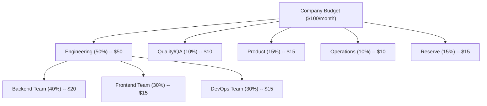

# Operations

This section covers the operational infrastructure of the SynthOrg framework: how agents
access LLM providers, how costs are tracked and controlled, how tools are sandboxed and
permissioned, how security policies are enforced, and how humans interact with the system.

---

## Providers

### Provider Abstraction

The framework provides a unified interface for all LLM interactions. The provider layer
abstracts away vendor differences, exposing a single `completion()` method regardless of
whether the backend is a cloud API, OpenRouter, Ollama, or a custom endpoint.

```text
+-------------------------------------------------+
|            Unified Model Interface               |
|   completion(messages, tools, config) -> resp    |
+-----------+-----------+-----------+--------------+
| Cloud API | OpenRouter|  Ollama   |  Custom      |
|  Adapter  |  Adapter  |  Adapter  |  Adapter     |
+-----------+-----------+-----------+--------------+
| Direct    | 400+ LLMs | Local LLMs|  Any API     |
| API call  | via OR    | Self-host |              |
+-----------+-----------+-----------+--------------+
```

### Provider Configuration

???+ note "Provider Configuration (YAML)"

    Model IDs, pricing, and provider examples below are **illustrative**. Actual models, costs,
    and provider availability are determined during implementation and loaded dynamically from
    provider APIs where possible.

    ```yaml
    providers:
      example-provider:
        litellm_provider: "anthropic"  # LiteLLM routing identifier (optional, defaults to provider name)
        family: "example-family"       # cross-validation grouping (optional)
        auth_type: api_key             # api_key | oauth | custom_header | subscription | none
        api_key: "${PROVIDER_API_KEY}"
        # subscription_token: "..."    # subscription token (subscription auth only; passed to LiteLLM as api_key; sensitive -- use env vars or secret management)
        # tos_accepted_at: "..."       # timestamp when subscription ToS was accepted
        models:                        # example entries -- real list loaded from provider
          - id: "example-large-001"
            alias: "large"
            cost_per_1k_input: 0.015   # illustrative, verify at implementation time
            cost_per_1k_output: 0.075
            max_context: 200000
            estimated_latency_ms: 1500 # optional, used by fastest strategy
          - id: "example-medium-001"
            alias: "medium"
            cost_per_1k_input: 0.003
            cost_per_1k_output: 0.015
            max_context: 200000
            estimated_latency_ms: 500
          - id: "example-small-001"
            alias: "small"
            cost_per_1k_input: 0.0008
            cost_per_1k_output: 0.004
            max_context: 200000
            estimated_latency_ms: 200

      openrouter:
        auth_type: api_key           # api_key | oauth | custom_header | subscription | none
        api_key: "${OPENROUTER_API_KEY}"
        base_url: "https://openrouter.ai/api/v1"
        models:                        # example entries
          - id: "vendor-a/model-medium"
            alias: "or-medium"
          - id: "vendor-b/model-pro"
            alias: "or-pro"
          - id: "vendor-c/model-reasoning"
            alias: "or-reasoning"

      ollama:
        auth_type: none
        base_url: "http://localhost:11434"
        models:                        # example entries
          - id: "llama3.3:70b"
            alias: "local-llama"
            cost_per_1k_input: 0.0    # free, local
            cost_per_1k_output: 0.0
          - id: "qwen2.5-coder:32b"
            alias: "local-coder"
            cost_per_1k_input: 0.0
            cost_per_1k_output: 0.0
    ```

### LiteLLM Integration

The framework uses **LiteLLM** as the provider abstraction layer:

- Unified API across 100+ providers
- Built-in cost tracking
- Automatic retries and fallbacks
- Load balancing across providers
- Chat completions-compatible interface (all providers normalized)
- **Model database**: `litellm.model_cost` provides pricing and context window data for all known models. Used at provider creation to dynamically populate model lists with up-to-date metadata. Provider-specific version filters (e.g. 4.5+ for Anthropic) exclude older generations. Deduplicates dated model variants (e.g. prefers `claude-opus-4-6` over `claude-opus-4-6-20260205`). Falls back to preset `default_models` when no models are found in the database.

### Provider Management

Providers can be managed at runtime through the API without restarting:

- **CRUD**: `POST /api/v1/providers` (create), `PUT /api/v1/providers/{name}` (update), `DELETE /api/v1/providers/{name}` (delete)
- **Connection test**: `POST /api/v1/providers/{name}/test` -- sends a minimal probe and reports latency
- **Model discovery**: `POST /api/v1/providers/{name}/discover-models`
  - Queries the provider endpoint for available models (Ollama `/api/tags`, standard `/models`) and updates the provider config.
  - Accepts an optional `preset_hint` query parameter (`?preset_hint={preset_name}`) that guides endpoint selection (Ollama vs standard API path). The `preset_hint` is no longer used for SSRF trust decisions.
  - Auto-triggered on preset creation for no-auth providers with empty model lists.
  - SSRF trust is determined by a dynamic `host:port` allowlist (`ProviderDiscoveryPolicy`), seeded from preset `candidate_urls` at startup and auto-updated on provider create/update/delete. Trusted URLs bypass SSRF validation; untrusted URLs go through full private-IP/DNS-rebinding checks. Bypasses are logged at WARNING level (`PROVIDER_DISCOVERY_SSRF_BYPASSED`).
- **Discovery allowlist**: `GET /api/v1/providers/discovery-policy` (read), `POST /api/v1/providers/discovery-policy/entries` (add entry), `POST /api/v1/providers/discovery-policy/remove-entry` (remove entry) -- manage the dynamic SSRF allowlist of trusted `host:port` pairs for provider discovery. Persisted in the settings system (DB > env > YAML > code).
- **Presets**: `GET /api/v1/providers/presets` lists built-in cloud and local provider templates (11 presets: Anthropic, OpenAI, Google AI, Mistral, Groq, DeepSeek, Azure OpenAI, Ollama, LM Studio, vLLM, OpenRouter); `POST /api/v1/providers/from-preset` creates from a template. Each preset declares `supported_auth_types` (e.g. `["api_key"]`, `["none"]`, `["api_key", "subscription"]`) which the UI uses to present the available authentication options during provider creation. Presets also declare `requires_base_url` (e.g. `true` for Azure, Ollama, LM Studio, vLLM) which the UI uses to conditionally require a base URL. Presets also declare `supports_model_pull`, `supports_model_delete`, `supports_model_config` (local model management capability flags used by the UI to gate management controls).
- **Preset auto-probe**: `POST /api/v1/providers/probe-preset` -- for presets with `candidate_urls` (local providers: Ollama and LM Studio), probes each URL in priority order (`host.docker.internal`, Docker bridge IP, `localhost`) with a 5-second timeout. Returns the first reachable URL and discovered model count. Used by the setup wizard to auto-detect local providers running on the host machine. SSRF validation is intentionally skipped because only hardcoded preset URLs are probed, never user input. Note: vLLM's `candidate_urls` is intentionally empty (users deploy vLLM at arbitrary endpoints), so it cannot be auto-probed and requires manual URL configuration.
- **Hot-reload**: On mutation, `ProviderManagementService` rebuilds `ProviderRegistry` + `ModelRouter` and atomically swaps them in `AppState` -- no downtime
- **Auth types**: `api_key` (default), `subscription` (token-based auth for provider subscription plans, passed to LiteLLM as `api_key`, requires ToS acceptance), `oauth` (stores credentials, MVP uses pre-fetched token), `custom_header`, `none` (local providers)
- **Routing key**: Optional `litellm_provider` field decouples the provider display name from LiteLLM routing (e.g. a provider named "my-claude" can route to `anthropic` via `litellm_provider: anthropic`). Falls back to provider name when unset.
- **Credential safety**: Secrets are Fernet-encrypted at rest via the `providers.configs` sensitive setting; API responses use `ProviderResponse` DTO that strips all secrets and provides `has_api_key`/`has_oauth_credentials`/`has_custom_header`/`has_subscription_token` boolean indicators
- **Health**: `GET /api/v1/providers/{name}/health` -- returns health status (up/degraded/down/unknown derived from 24h call count and error rate; unknown when no calls recorded), average response time, error rate percentage, call count, total tokens, and total cost. In-memory tracking via `ProviderHealthTracker` (concurrency-safe, append-only with periodic pruning). Token/cost totals are enriched from `CostTracker` at query time
- **Health probing**: `ProviderHealthProber` background service pings providers with `base_url` (local/self-hosted) every 30 minutes using lightweight HTTP requests (no model loading). Ollama: pings root URL; standard providers: `GET /models`. Skips providers with recent real API traffic. Results are recorded in `ProviderHealthTracker`. Cloud providers without `base_url` rely on real call outcomes for health status
- **Model capabilities**: `GET /api/v1/providers/{name}/models` returns `ProviderModelResponse` DTOs enriched with runtime capability flags (`supports_tools`, `supports_vision`, `supports_streaming`) from the driver layer's `ModelCapabilities`. Falls back to defaults when driver is unavailable
- **Local model management**: Providers with `supports_model_pull`/`supports_model_delete`/`supports_model_config` capability flags expose model lifecycle operations. `POST /api/v1/providers/{name}/models/pull` streams download progress via SSE (Ollama `/api/pull`). `DELETE /api/v1/providers/{name}/models/{model_id}` removes models. `PUT /api/v1/providers/{name}/models/{model_id}/config` sets per-model launch parameters (`LocalModelParams`: `num_ctx`, `num_gpu_layers`, `num_threads`, `num_batch`, `repeat_penalty`). Currently implemented for Ollama; LM Studio support deferred (unstable API).

### Model Routing Strategy

Model routing determines which LLM handles a given request. Six strategies are available,
selectable via configuration:

| Strategy | Behavior |
|----------|----------|
| `manual` | Resolve an explicit model override; fails if not set |
| `role_based` | Match agent seniority level to routing rules, then catalog default |
| `cost_aware` | Match task-type rules, then pick cheapest model within budget |
| `cheapest` | Alias for `cost_aware` |
| `fastest` | Match task-type rules, then pick fastest model (by `estimated_latency_ms`) within budget; falls back to cheapest when no latency data is available |
| `smart` | Priority cascade: override > task-type > role > seniority > cheapest > fallback chain |

```yaml
routing:
  strategy: "smart"              # smart, cheapest, fastest, role_based, cost_aware, manual
  rules:
    - role_level: "C-Suite"
      preferred_model: "large"
      fallback: "medium"
    - role_level: "Senior"
      preferred_model: "medium"
      fallback: "small"
    - role_level: "Junior"
      preferred_model: "small"
      fallback: "local-coder"
    - task_type: "code_review"
      preferred_model: "medium"
    - task_type: "documentation"
      preferred_model: "small"
    - task_type: "architecture"
      preferred_model: "large"
  fallback_chain:
    - "example-provider"
    - "openrouter"
    - "ollama"
```

#### Multi-Provider Model Resolution

When multiple providers register the same model ID or alias, the `ModelResolver`
stores all variants as a candidate tuple rather than raising a collision error.
At resolution time, a `ModelCandidateSelector` picks the best candidate from the
tuple.

Two built-in selectors are provided:

| Selector | Behavior |
|----------|----------|
| `QuotaAwareSelector` (default) | Prefer providers with available quota, then cheapest among those; falls back to cheapest overall when all providers are exhausted |
| `CheapestSelector` | Always pick the cheapest candidate by total cost per 1k tokens, ignoring quota state |

The selector is injected into `ModelResolver` (and transitively into `ModelRouter`)
at construction time.  `QuotaAwareSelector` is constructed with a snapshot from
`QuotaTracker.peek_quota_available()`, which returns a synchronous `dict[str, bool]`
of per-provider quota availability.

All routing strategies (`smart`, `cost_aware`, `fastest`, etc.) and the fallback chain
automatically use the injected selector when resolving model references, so multi-provider
selection is transparent to the strategy layer.

---

## Budget and Cost Management

### Budget Hierarchy

The framework enforces a hierarchical budget structure. Allocations cascade from the company
level through departments to individual teams.



!!! abstract "Note"

    Percentages are illustrative defaults. All allocations are configurable per company.
    Dollar signs in the diagram are illustrative -- the actual currency is determined by
    the `budget.currency` setting (ISO 4217 code, defaults to EUR).

### Cost Tracking

Every API call is tracked with full context:

```json
{
  "agent_id": "sarah_chen",
  "task_id": "task-123",
  "provider": "example-provider",
  "model": "example-medium-001",
  "input_tokens": 4500,
  "output_tokens": 1200,
  "cost_usd": 0.0315,  // field name retained for API backward compatibility
  "timestamp": "2026-02-27T10:30:00Z"
}
```

`CostRecord` stores `input_tokens` and `output_tokens`; `total_tokens` is a `@computed_field`
property on `TokenUsage` (the model embedded in `CompletionResponse`). Spending aggregation
models (`AgentSpending`, `DepartmentSpending`, `PeriodSpending`) extend a shared
`_SpendingTotals` base class.

The `GET /budget/records` endpoint returns paginated cost records alongside two server-computed
summaries (aggregated from **all** matching records, not just the current page):

- **`daily_summary`**: per-day aggregation with `date`, `total_cost_usd`, `total_input_tokens`,
  `total_output_tokens`, and `record_count`, sorted chronologically.
- **`period_summary`**: overall stats including `avg_cost_usd` (computed), `total_cost_usd`,
  `total_input_tokens`, `total_output_tokens`, and `record_count`.

### CFO Agent Responsibilities

The CFO agent (when enabled) acts as a cost management system. Budget tracking, per-task cost
recording, and cost controls are enforced by `BudgetEnforcer` (a service the engine composes).
CFO cost optimization is implemented via `CostOptimizer`.

- Monitor real-time spending across all agents
- Alert when departments approach budget limits
- Suggest model downgrades when budget is tight
- Report daily/weekly spending summaries
- Recommend hiring/firing based on cost efficiency
- Block tasks that would exceed remaining budget
- Optimize model routing for cost/quality balance

`CostOptimizer` implements anomaly detection (sigma + spike factor), per-agent efficiency
analysis, model downgrade recommendations (via `ModelResolver`), routing optimization
suggestions, and operation approval evaluation. `ReportGenerator` produces multi-dimensional
spending reports with task/provider/model breakdowns and period-over-period comparison.

### Cost Controls

The budget system enforces three layers: pre-flight checks, in-flight monitoring, and
task-boundary auto-downgrade.

```yaml
budget:
  total_monthly: 100.00
  currency: "EUR"  # ISO 4217 currency code for display
  reset_day: 1
  alerts:
    warn_at: 75               # percent
    critical_at: 90
    hard_stop_at: 100
  per_task_limit: 5.00
  per_agent_daily_limit: 10.00
  auto_downgrade:
    enabled: true
    threshold: 85              # percent of budget used
    boundary: "task_assignment" # task_assignment only -- NEVER mid-execution
    downgrade_map:             # ordered pairs -- aliases reference configured models
      - ["large", "medium"]
      - ["medium", "small"]
      - ["small", "local-small"]
```

!!! tip "Auto-Downgrade Boundary"

    Model downgrades apply only at **task assignment time**, never mid-execution. An agent
    halfway through an architecture review cannot be switched to a cheaper model -- the task
    completes on its assigned model. The next task assignment respects the downgrade threshold.
    This prevents quality degradation from mid-thought model switches.

    When a downgrade target alias matches a valid tier name (`large`/`medium`/`small`), the
    downgraded `ModelConfig` stores the tier in `model_tier`, enabling prompt profile
    adaptation (see [Prompt Profiles](engine.md#prompt-profiles)).

!!! info "Minimal Configuration"

    The only required field is `total_monthly`. All other fields have sensible defaults:

    ```yaml
    budget:
      total_monthly: 100.00
    ```

### Quota Degradation

When a provider's quota is exhausted, the framework applies the configured degradation
strategy before failing. Each provider has a `DegradationConfig` specifying the strategy:

| Strategy | Behavior |
|----------|----------|
| `alert` (default) | Raise `QuotaExhaustedError` immediately |
| `fallback` | Walk the `fallback_providers` list, use the first provider with available quota |
| `queue` | Wait for the soonest quota window to reset (capped at `queue_max_wait_seconds`), then retry |

```yaml
providers:
  example-provider:
    degradation:
      strategy: "fallback"
      fallback_providers:
        - "secondary-provider"
        - "local-provider"
  secondary-provider:
    degradation:
      strategy: "queue"
      queue_max_wait_seconds: 300
```

`QuotaTracker` also exposes a synchronous `peek_quota_available()` method that returns
a `dict[str, bool]` snapshot of per-provider quota availability.  This is used by the
`QuotaAwareSelector` at routing time to prefer providers with remaining quota.  The
method reads cached counters without acquiring the async lock (safe on the single-threaded
asyncio event loop) and tolerates TOCTOU for heuristic selection decisions.

Degradation is resolved during pre-flight checks (`BudgetEnforcer.check_can_execute`),
which returns a `PreFlightResult` carrying the effective provider and degradation details.
The engine's `AgentEngine._apply_degradation` swaps the provider driver via the
`ProviderRegistry` when FALLBACK selects a different provider. QUEUE keeps the same
provider -- it waits for the quota window to rotate, then re-checks.

!!! tip "Degradation Boundary"
    Like auto-downgrade, degradation applies only at **task assignment time** (pre-flight).
    An agent mid-execution is never switched to a different provider.

### LLM Call Analytics

Every LLM provider call is tracked with comprehensive metadata for financial reporting,
debugging, and orchestration overhead analysis.

#### Per-Call Tracking and Proxy Overhead Metrics

Every completion call produces a `CompletionResponse` with `TokenUsage` (token counts and
cost). The engine layer creates a `CostRecord` (with agent/task context) and records it
into `CostTracker`. The engine additionally logs **proxy overhead metrics** at task
completion:

- `turns_per_task` -- number of LLM turns to complete the task
- `tokens_per_task` -- total tokens consumed
- `cost_per_task` -- total cost in configured currency
- `duration_seconds` -- wall-clock execution time
- `prompt_tokens` -- estimated system prompt tokens
- `prompt_token_ratio` -- ratio of prompt tokens to total tokens (overhead indicator; warns when >0.3)

These are natural overhead indicators -- a task consuming 15 turns and 50k tokens for a
one-line fix signals a problem. Metrics are captured in `TaskCompletionMetrics`, a frozen
Pydantic model with a `from_run_result()` factory method.

#### Call Categorization and Orchestration Ratio

When multi-agent coordination exists, each `CostRecord` is tagged with a **call category**:

| Category | Description | Examples |
|----------|-------------|---------|
| `productive` | Direct task work -- tool calls, code generation, task output | Agent writing code, running tests |
| `coordination` | Inter-agent communication -- delegation, reviews, meetings | Manager reviewing work, agent presenting in meeting |
| `system` | Framework overhead -- system prompt injection, context loading | Initial prompt, [memory retrieval injection](memory.md#memory-injection-strategies) |
| `embedding` | Embedding model calls -- memory store/retrieve vectorization | Mem0 store embedding, similarity search query embedding |

The **orchestration ratio** (`coordination / total`) is surfaced in metrics and alerts. If
coordination tokens consistently exceed productive tokens, the company configuration needs
tuning (fewer approval layers, simpler [meeting protocols](communication.md#meeting-protocol),
etc.).

???+ note "Coordination Metrics Suite"

    A comprehensive suite of coordination metrics derived from empirical agent scaling research
    ([Kim et al., 2025](https://arxiv.org/abs/2512.08296)). These metrics explain coordination
    dynamics and enable data-driven tuning of multi-agent configurations.

    | Metric | Symbol | Definition | What It Signals |
    |--------|--------|------------|-----------------|
    | **Coordination efficiency** | `Ec` | `success_rate / (turns / turns_sas)` -- success normalized by relative turn count vs single-agent baseline | Overall coordination ROI. Low Ec = coordination costs exceed benefits |
    | **Coordination overhead** | `O%` | `(turns_mas - turns_sas) / turns_sas * 100%` -- relative turn increase | Communication cost. Optimal band: 200--300%. Above 400% = over-coordination |
    | **Error amplification** | `Ae` | `error_rate_mas / error_rate_sas` -- relative failure probability | Whether MAS corrects or propagates errors. Centralized ~4.4x, Independent ~17.2x |
    | **Message density** | `c` | Inter-agent messages per reasoning turn | Communication intensity. Performance saturates at ~0.39 messages/turn |
    | **Redundancy rate** | `R` | Mean cosine similarity of agent output embeddings | Agent agreement. Optimal at ~0.41 (balances fusion with independence) |

    All 5 metrics are opt-in via `coordination_metrics.enabled` in analytics config. `Ec` and
    `O%` are cheap (turn counting). `Ae` requires baseline comparison data. `c` and `R` require
    semantic analysis of agent outputs.

    ```yaml
    coordination_metrics:
      enabled: false                       # opt-in -- enable for data gathering
      collect:
        - efficiency                       # cheap -- turn counting
        - overhead                         # cheap -- turn counting
        - error_amplification              # requires SAS baseline data
        - message_density                  # requires message counting infrastructure
        - redundancy                       # requires embedding computation on outputs
      baseline_window: 50                  # number of SAS runs to establish baseline for Ae
      error_taxonomy:
        enabled: false                     # opt-in -- enable for targeted diagnosis
        categories:
          - logical_contradiction
          - numerical_drift
          - context_omission
          - coordination_failure
    ```

???+ note "Full Analytics Layer Configuration"

    Expanded per-call metadata for comprehensive financial and operational reporting:

    ```yaml
    call_analytics:
      track:
        - call_category                    # productive, coordination, system, embedding
        - success                          # true/false
        - retry_count                      # 0 = first attempt succeeded
        - retry_reason                     # rate_limit, timeout, internal_error
        - latency_ms                       # wall-clock time for the call
        - finish_reason                    # stop, tool_use, max_tokens, error
        - cache_hit                        # prompt caching hit/miss (provider-dependent)
      aggregation:
        - per_agent_daily                  # agent spending over time
        - per_task                         # total cost per task
        - per_department                   # department-level rollups
        - per_provider                     # provider reliability and cost comparison
        - orchestration_ratio              # coordination vs productive tokens
      alerts:
        orchestration_ratio:
          info: 0.30                       # info if coordination > 30% of total
          warn: 0.50                       # warn if coordination > 50% of total
          critical: 0.70                   # critical if coordination > 70% of total
        retry_rate_warn: 0.1               # warn if > 10% of calls need retries
    ```

    Analytics metadata is append-only and never blocks execution. Failed analytics writes are
    logged and skipped -- the agent's task is never delayed by telemetry.

#### Coordination Error Taxonomy

When coordination metrics collection is enabled, the system can optionally classify
coordination errors into structured categories for targeted diagnosis.

| Error Category | Description | Detection Method |
|---------------|-------------|-----------------|
| **Logical contradiction** | Agent asserts both "X is true" and "X is false," or derives conclusions violating its stated premises | Semantic contradiction detection on agent outputs |
| **Numerical drift** | Accumulated computational errors from cascading rounding or unit conversion (>5% deviation) | Numerical comparison against ground truth or cross-agent verification |
| **Context omission** | Failure to reference previously established entities, relationships, or state required for current reasoning | Missing-reference detection across agent conversation history |
| **Coordination failure** | Message misinterpretation, task allocation conflicts, state synchronization errors between agents | Protocol-level error detection in orchestration layer |

Error taxonomy classification requires semantic analysis of agent outputs and is expensive.
Enable via `coordination_metrics.error_taxonomy.enabled: true` only when actively gathering
data for system tuning. The classification pipeline runs post-execution (never blocks agent
work) and logs structured events to the observability layer.

Error categories derived from [Kim et al., 2025](https://arxiv.org/abs/2512.08296) and the
Multi-Agent System Failure Taxonomy (MAST) by Cemri et al. (2025).

### Risk Budget

The framework tracks **cumulative risk** alongside monetary cost. While the
`RiskClassifier` assigns per-action risk levels (LOW/MEDIUM/HIGH/CRITICAL),
the risk budget tracks risk _accumulation_ -- an agent executing 50 MEDIUM-risk
actions in a row should trigger escalation even though each individual action
is approved.

#### Risk Scoring Model

Each action is scored on four dimensions (0.0--1.0):

| Dimension | Meaning | 0.0 | 1.0 |
|-----------|---------|-----|-----|
| `reversibility` | How irreversible | Fully reversible | Irreversible |
| `blast_radius` | Scope of impact | None | Global |
| `data_sensitivity` | Data touched | Public | Secret |
| `external_visibility` | External parties | Internal only | Fully public |

A weighted sum produces a scalar `risk_units` value (default weights:
0.3/0.3/0.2/0.2). The `RiskScorer` protocol is pluggable; the default
implementation maps built-in `ActionType` values to pre-defined `RiskScore`
instances (CRITICAL ~0.88, HIGH ~0.62, MEDIUM ~0.31, LOW ~0.05).

#### Risk Budget Configuration

```yaml
budget:
  risk_budget:
    enabled: false                  # opt-in
    per_task_risk_limit: 5.0
    per_agent_daily_risk_limit: 20.0
    total_daily_risk_limit: 100.0
    alerts:
      warn_at: 75                   # percent of daily limit
      critical_at: 90
```

Zero limits mean unlimited. Risk budget is disabled by default.

#### Risk Tracker

`RiskTracker` mirrors `CostTracker`: append-only `RiskRecord` entries with
TTL-based eviction (7 days), asyncio.Lock concurrency safety, and
per-agent/per-task/total aggregation queries.

#### Enforcement

`BudgetEnforcer` checks risk limits alongside monetary limits:

1. **Pre-flight**: `check_risk_budget()` checks per-task, per-agent daily,
   and total daily risk limits. Raises `RiskBudgetExhaustedError` on breach.
2. **Recording**: `record_risk()` scores and records each action via
   the `RiskScorer` and `RiskTracker`.
3. **Auto-downgrade**: `RISK_BUDGET_EXHAUSTED` added to `DowngradeReason`.

#### Shadow Mode

`SecurityEnforcementMode` (on `SecurityConfig`) controls enforcement:

| Mode | Behavior |
|------|----------|
| `active` (default) | Full enforcement -- verdicts applied as-is |
| `shadow` | Full pipeline runs, audit recorded, but blocking verdicts convert to ALLOW |
| `disabled` | No evaluation, always ALLOW |

Shadow mode enables pre-deployment calibration: operators can observe what
_would_ have been blocked without disrupting agent work, then tune risk
weights and limits before switching to active enforcement.

### Automated Reporting

The framework generates periodic reports summarizing spending, performance,
task completion, and risk trends. Reports are generated on demand via API
or on a schedule.

#### Report Periods

| Period | Coverage |
|--------|----------|
| `daily` | Previous day (00:00 UTC to 00:00 UTC) |
| `weekly` | Previous week (Monday 00:00 UTC to Monday 00:00 UTC) |
| `monthly` | Previous month (1st 00:00 UTC to 1st 00:00 UTC) |

#### Report Templates

| Template | Data Source | Contents |
|----------|-----------|----------|
| `spending_summary` | `CostTracker` | Per-task, per-provider, per-model cost breakdowns |
| `performance_metrics` | `PerformanceTracker` | Per-agent quality scores, task counts, cost/risk totals |
| `task_completion` | `CostTracker` | Completion rates, department breakdowns |
| `risk_trends` | `RiskTracker` | Risk accumulation by agent and action type, daily trend |
| `comprehensive` | All sources | Combines all templates into a single report |

#### API Endpoints

| Method | Path | Description |
|--------|------|-------------|
| `POST` | `/api/v1/reports/generate` | Generate an on-demand report for a given period |
| `GET` | `/api/v1/reports/periods` | List available report periods |

---

## Tool and Capability System

### Tool Categories

| Category | Tools | Typical Roles |
|----------|-------|---------------|
| **File System** | Read, write, edit, list, delete files | All developers, writers |
| **Code Execution** | Run code in sandboxed environments | Developers, QA |
| **Version Control** | Git operations, PR management | Developers, DevOps |
| **Web** | HTTP requests, web scraping, search | Researchers, analysts |
| **Database** | Query, migrate, admin | Backend devs, DBAs |
| **Terminal** | Shell commands (sandboxed) | DevOps, senior devs |
| **Design** | Image generation, mockup tools | Designers |
| **Communication** | Email, Slack, notifications | PMs, executives |
| **Analytics** | Metrics, dashboards, reporting | Data analysts, CFO |
| **Deployment** | CI/CD, container management | DevOps, SRE |
| **Memory** | Search memory, recall by ID | All agents (tool-based strategy) |
| **MCP Servers** | Any MCP-compatible tool | Configurable per agent |

### Tool Execution Model

When the LLM requests multiple tool calls in a single turn, `ToolInvoker.invoke_all` executes
them **concurrently** using `asyncio.TaskGroup`. An optional `max_concurrency` parameter
(default unbounded) limits parallelism via `asyncio.Semaphore`. Recoverable errors are captured
as `ToolResult(is_error=True)` without aborting sibling invocations. Non-recoverable errors
(`MemoryError`, `RecursionError`) are collected and re-raised after all tasks complete (bare
exception for one, `ExceptionGroup` for multiple).

**Permission checking** follows a priority-based system:

1. `get_permitted_definitions()` filters tool definitions sent to the LLM -- the agent only
   sees tools it is permitted to use
2. At invocation time, denied tools return `ToolResult(is_error=True)` with a descriptive
   denial reason (defense-in-depth against LLM hallucinating unpresented tools)

Resolution order: denied list (highest) > allowed list > access-level categories > deny (default).

### Tool Sandboxing

Tool execution uses a **layered sandboxing strategy** with a pluggable `SandboxBackend`
protocol. The default configuration uses lighter isolation for low-risk tools and stronger
isolation for high-risk tools.

#### Sandbox Backends

| Backend | Isolation | Latency | Dependencies | Status |
|---------|-----------|---------|--------------|--------|
| `SubprocessSandbox` | Process-level: env filtering (allowlist + denylist), restricted PATH (configurable via `extra_safe_path_prefixes`), workspace-scoped cwd, timeout + process-group kill, library injection var blocking, explicit transport cleanup on Windows | ~ms | None | Implemented |
| `DockerSandbox` | Container-level: ephemeral container, mounted workspace, no network (default) or iptables-based host:port allowlist, resource limits (CPU/memory/time) | ~1-2s cold start | Docker | Implemented |
| `K8sSandbox` | Pod-level: per-agent containers, namespace isolation, resource quotas, network policies | ~2-5s | Kubernetes | Future |

???+ note "Default Layered Sandbox Configuration"

    ```yaml
    sandboxing:
      default_backend: "subprocess"        # subprocess, docker, k8s
      overrides:                           # per-category backend overrides
        file_system: "subprocess"          # low risk -- fast, no deps
        git: "subprocess"                  # low risk -- workspace-scoped
        web: "docker"                      # medium risk -- needs network isolation
        code_execution: "docker"           # high risk -- strong isolation required
        terminal: "docker"                 # high risk -- arbitrary commands
        database: "docker"                 # high risk -- data mutation
      subprocess:
        timeout_seconds: 30
        workspace_only: true               # restrict filesystem access to project dir
        restricted_path: true              # strip dangerous binaries from PATH
      docker:
        image: "synthorg-sandbox:latest" # pre-built image with common runtimes
        network: "none"                    # no network by default
        network_overrides:                 # category-specific network policies
          database: "bridge"               # database tools need TCP access to DB host
          web: "bridge"                    # web tools need outbound HTTP; no inbound
        allowed_hosts: []                  # allowlist of host:port pairs (TCP only)
        dns_allowed: true                  # allow outbound DNS when allowed_hosts restricts network
        loopback_allowed: true             # allow loopback traffic in restricted network mode
        memory_limit: "512m"
        cpu_limit: "1.0"
        timeout_seconds: 120
        mount_mode: "ro"                   # read-only by default
        auto_remove: true                  # ephemeral -- container removed after execution
      k8s:                                 # future -- per-agent pod isolation
        namespace: "synthorg-agents"
        resource_requests:
          cpu: "250m"
          memory: "256Mi"
        resource_limits:
          cpu: "1"
          memory: "1Gi"
        network_policy: "deny-all"         # default deny, allowlist per tool
    ```

Per-category backend selection is implemented in `tools/sandbox/factory.py` via three functions:
`build_sandbox_backends` (instantiates only the backends referenced by config),
`resolve_sandbox_for_category` (looks up the correct backend for a `ToolCategory`), and
`cleanup_sandbox_backends` (parallel cleanup with error isolation). The tool factory
(`build_default_tools_from_config`) wires `VERSION_CONTROL` category; other categories will
be wired as their tool builders are added.

Docker is optional -- only required when code execution, terminal, web, or database tools are
enabled. File system and git tools work out of the box with subprocess isolation. This keeps
the local-first experience lightweight while providing strong isolation where it matters.

Docker MVP uses `aiodocker` (async-native) with a pre-built image
(Python 3.14 + Node.js LTS + basic utils, <500MB). If Docker is unavailable, the framework
fails with a clear error -- no unsafe subprocess fallback for code execution
([Decision Log](../architecture/decisions.md) D16).

!!! info "Scaling Path"

    In a future Kubernetes deployment (Phase 3-4), each agent can run in its own pod via
    `K8sSandbox`. At that point, the layered configuration becomes less relevant -- all tools
    execute within the agent's isolated pod. The `SandboxBackend` protocol makes this
    transition seamless.

### Git Clone SSRF Prevention

The `git_clone` tool validates clone URLs against SSRF attacks via hostname/IP
validation with async DNS resolution (`git_url_validator` module). All resolved
IPs must be public; private, loopback, link-local, and reserved addresses are
blocked by default. A configurable `hostname_allowlist` lets legitimate internal
Git servers bypass the private-IP check.

**TOCTOU DNS rebinding mitigation** closes the gap between DNS validation and
`git clone`'s own resolution:

- **HTTPS URLs:** Validated IPs are pinned via `git -c http.curloptResolve=host:port:ip`
  (git >= 2.37.0; sandbox ships git 2.39+), so git uses the same addresses the validator checked.
- **SSH / SCP-like URLs:** A second DNS resolution runs immediately before execution;
  if the re-resolved IP set is not a subset of the validated set, the clone is blocked.
- **Literal IP URLs:** Immune (no DNS resolution occurs).

Both mitigations are configurable via `GitCloneNetworkPolicy.dns_rebinding_mitigation`
(default: enabled). Disable for hosts behind CDNs or geo-DNS where resolved IPs
legitimately vary between queries. For full defense-in-depth, combine with
network-level egress controls (firewall, HTTP CONNECT proxy) or container
network isolation (see Tool Sandboxing above).

### MCP Integration

External tools are integrated via the **Model Context Protocol** (MCP).

- **SDK:** Official `mcp` Python SDK, pinned version. A thin `MCPBridgeTool` adapter layer
  isolates the rest of the codebase from SDK API changes
  ([Decision Log](../architecture/decisions.md) D17)
- **Transports:** stdio (local/dev) and Streamable HTTP (remote/production). Deprecated SSE
  is skipped.
- **Result mapping:** Text blocks concatenate to `content: str`; image/audio use placeholders
  with base64 in metadata; `structuredContent` maps to `metadata["structured_content"]`;
  `isError` maps 1:1 to `is_error`
  ([Decision Log](../architecture/decisions.md) D18)

### Action Type System

Action types classify agent actions for use by [autonomy presets](#autonomy-levels),
[SecOps validation](#security-operations-agent),
[tiered timeout policies](#approval-timeout-policy), and
[progressive trust](#progressive-trust)
([Decision Log](../architecture/decisions.md) D1).

**Registry:** `StrEnum` for ~26 built-in action types (type safety, autocomplete, typos caught
at compile time) + `ActionTypeRegistry` for custom types via explicit registration. Unknown
strings are rejected at config load time -- a typo in `human_approval` list silently meaning
"skip approval" is a critical safety concern.

**Granularity:** Two-level `category:action` hierarchy. Category shortcuts expand to all
actions in that category (e.g., `auto_approve: ["code"]` expands to all `code:*` actions).
Fine-grained overrides are supported (e.g., `human_approval: ["code:create"]`).

**Taxonomy (~26 leaf types):**

```text
code:read, code:write, code:create, code:delete, code:refactor
test:write, test:run
docs:write
vcs:read, vcs:commit, vcs:push, vcs:branch
deploy:staging, deploy:production
comms:internal, comms:external
budget:spend, budget:exceed
org:hire, org:fire, org:promote
db:query, db:mutate, db:admin
arch:decide
memory:read
```

**Classification:** Static tool metadata. Each `BaseTool` declares its `action_type`. Default
mapping from `ToolCategory` to action type. Non-tool actions (`org:hire`, `budget:spend`) are
triggered by engine-level operations. No LLM in the security classification path.

### Tool Access Levels

???+ note "Tool Access Level Configuration"

    ```yaml
    tool_access:
      levels:
        sandboxed:
          description: "No external access. Isolated workspace."
          file_system: "workspace_only"
          code_execution: "containerized"
          network: "none"
          git: "local_only"

        restricted:
          description: "Limited external access with approval."
          file_system: "project_directory"
          code_execution: "containerized"
          network: "allowlist_only"
          git: "read_and_branch"
          requires_approval: ["deployment", "database_write"]

        standard:
          description: "Normal development access."
          file_system: "project_directory"
          code_execution: "containerized"
          network: "open"
          git: "full"
          terminal: "restricted_commands"

        elevated:
          description: "Full access for senior/trusted agents."
          file_system: "full"
          code_execution: "containerized"
          network: "open"
          git: "full"
          terminal: "full"
          deployment: true

        custom:
          description: "Per-agent custom configuration."
    ```

The current `ToolPermissionChecker` implements **category-level gating only** -- each access
level maps to a set of permitted `ToolCategory` values. The granular sub-constraints shown
above (network mode, containerization) are planned for Docker/K8s sandbox backends.

### Progressive Trust

Agents can earn higher tool access over time through configurable trust strategies. The trust
system implements a `TrustStrategy` protocol, making it extensible. All four strategies are
implemented.

!!! warning "Security Invariant"

    The `standard_to_elevated` promotion **always** requires human approval. No agent can
    auto-gain production access regardless of trust strategy.

=== "Disabled (Default)"

    Trust is disabled. Agents receive their configured access level at hire time and it never
    changes. Simplest option -- useful when the human manages permissions manually.

    ```yaml
    trust:
      strategy: "disabled"               # disabled, weighted, per_category, milestone
      initial_level: "standard"          # fixed access level for all agents
    ```

=== "Weighted Score"

    A single trust score computed from weighted factors: task difficulty completed, error rate,
    time active, and human feedback. One global trust level per agent, applied to all tool
    categories.

    ```yaml
    trust:
      strategy: "weighted"
      initial_level: "sandboxed"
      weights:
        task_difficulty: 0.3             # harder tasks completed = more trust
        completion_rate: 0.25
        error_rate: 0.25                 # inverse -- fewer errors = more trust
        human_feedback: 0.2
      promotion_thresholds:
        sandboxed_to_restricted: 0.4
        restricted_to_standard: 0.6
        standard_to_elevated:
          score: 0.8
          requires_human_approval: true  # always human-gated
    ```

    Simple model, easy to understand. One number to track. However, too coarse -- an agent
    trusted for file edits should not auto-gain deployment access.

=== "Per-Category"

    Separate trust tracks per tool category (filesystem, git, deployment, database, network).
    An agent can be "standard" for files but "sandboxed" for deployment. Promotion criteria
    differ per category.

    ```yaml
    trust:
      strategy: "per_category"
      initial_levels:
        file_system: "restricted"
        git: "restricted"
        code_execution: "sandboxed"
        deployment: "sandboxed"
        database: "sandboxed"
        terminal: "sandboxed"
      promotion_criteria:
        file_system:
          restricted_to_standard:
            tasks_completed: 10
            quality_score_min: 7.0
        deployment:
          sandboxed_to_restricted:
            tasks_completed: 20
            quality_score_min: 8.5
            requires_human_approval: true  # always human-gated for deployment
    ```

    Granular. Matches real security models (IAM roles). Prevents gaming via easy tasks. Trust
    state is a matrix per agent, not a scalar.

=== "Milestone Gates"

    Explicit capability milestones aligned with the Cloud Security Alliance Agentic Trust
    Framework. Automated promotion for low-risk levels. Human approval gates for elevated
    access. Trust is time-bound and subject to periodic re-verification.

    ```yaml
    trust:
      strategy: "milestone"
      initial_level: "sandboxed"
      milestones:
        sandboxed_to_restricted:
          tasks_completed: 5
          quality_score_min: 7.0
          auto_promote: true             # no human needed
        restricted_to_standard:
          tasks_completed: 20
          quality_score_min: 8.0
          time_active_days: 7
          auto_promote: true
        standard_to_elevated:
          requires_human_approval: true  # always human-gated
          clean_history_days: 14         # no errors in last 14 days
      re_verification:
        enabled: true
        interval_days: 90                # re-verify every 90 days
        decay_on_idle_days: 30           # demote one level if idle 30+ days
        decay_on_error_rate: 0.15        # demote if error rate exceeds 15%
    ```

    Industry-aligned. Re-verification prevents stale trust. Trust decay may need tuning
    to avoid frustrating users.

---

## Security and Approval System

### Approval Workflow

```text
                    +---------------+
                    |  Task/Action  |
                    +-------+-------+
                            |
                    +-------v-------+
                    | Security Ops  |
                    |   Agent       |
                    +-------+-------+
                      /           \
               +-----v-+      +---v----+
               |APPROVE |      | DENY   |
               |(auto)  |      |+ reason|
               +----+---+      +---+----+
                    |              |
               Execute         +---v---------+
                               | Human Queue |
                               | (Dashboard) |
                               +---+---------+
                             /         \
                      +-----v-+    +---v----------+
                      |Override|    |Alternative   |
                      |Approve |    |Suggested     |
                      +--------+    +--------------+
```

### Autonomy Levels

The framework provides four built-in autonomy presets that control which actions agents can
perform independently versus which require human approval. Most users only set the level.

```yaml
autonomy:
  level: "semi"                  # full, semi, supervised, locked
  presets:
    full:
      description: "Agents work independently. Human notified of results only."
      auto_approve: ["all"]
      human_approval: []

    semi:
      description: "Most work is autonomous. Major decisions need approval."
      auto_approve: ["code", "test", "docs", "comms:internal"]
      human_approval: ["deploy", "comms:external", "budget:exceed", "org:hire"]
      security_agent: true

    supervised:
      description: "Human approves major steps. Agents handle details."
      auto_approve: ["code:write", "comms:internal"]
      human_approval: ["arch", "code:create", "deploy", "vcs:push"]
      security_agent: true

    locked:
      description: "Human must approve every action."
      auto_approve: []
      human_approval: ["all"]
      security_agent: true        # still runs for audit logging
```

Built-in templates set autonomy levels appropriate to their archetype (e.g. `full` for
Solo Builder, Research Lab, and Data Team, `supervised` for Agency, Enterprise Org, and
Consultancy). See the
[Company Types table](organization.md#company-types) for per-template defaults.

**Autonomy scope** ([Decision Log](../architecture/decisions.md) D6): Three-level
resolution chain: per-agent > per-department > company default. Seniority validation prevents
Juniors/Interns from being set to `full`.

**Runtime changes** ([Decision Log](../architecture/decisions.md) D7): Human-only
promotion via REST API (no agent, including CEO, can escalate privileges). Automatic downgrade
on: high error rate (one level down), budget exhausted (supervised), security incident (locked).
Recovery from auto-downgrade is human-only.

### Security Operations Agent

A special meta-agent that reviews all actions before execution:

- Evaluates safety of proposed actions
- Checks for data leaks, credential exposure, destructive operations
- Validates actions against company policies
- Maintains an audit log of all approvals/denials
- Escalates uncertain cases to human queue with explanation
- **Cannot be overridden by other agents** (only human can override)

**Rule engine** ([Decision Log](../architecture/decisions.md) D4): Hybrid
approach. Rule engine for known patterns (credentials, path traversal, destructive ops) plus
user-defined custom policy rules (`custom_policies` in security config) -- sub-ms, covers ~95%
of cases. LLM fallback only for uncertain cases (~5%). Full autonomy mode:
rules + audit logging only, no LLM path. Hard safety rules (credential exposure, data
destruction) **never bypass** regardless of autonomy level.

**Integration point** ([Decision Log](../architecture/decisions.md) D5):
Pluggable `SecurityInterceptionStrategy` protocol. Initial strategy intercepts before every
tool invocation -- slots into existing `ToolInvoker` between permission check and tool
execution. Post-tool-call scanning detects sensitive data in outputs.

### Output Scan Response Policies

After the output scanner detects sensitive data, a pluggable `OutputScanResponsePolicy`
protocol decides how to handle the findings. Each policy sets a `ScanOutcome` enum on the
returned `OutputScanResult` so downstream consumers (primarily `ToolInvoker`) can
distinguish intentional policy decisions from scanner failures:

| Policy | Behavior | `ScanOutcome` | Default for |
|--------|----------|---------------|-------------|
| **Redact** (default) | Return scanner's redacted content as-is | `REDACTED` | `SEMI`, `SUPERVISED` autonomy |
| **Withhold** | Clear redacted content -- content withheld by policy | `WITHHELD` | `LOCKED` autonomy |
| **Log-only** | Discard findings (logs at WARNING), pass original output through | `LOG_ONLY` | `FULL` autonomy |
| **Autonomy-tiered** | Delegate to a sub-policy based on effective autonomy level | *(set by delegate)* | Composite policy |

The `ScanOutcome` enum (`CLEAN`, `REDACTED`, `WITHHELD`, `LOG_ONLY`) is set by the scanner
(initial `REDACTED` when findings are detected) and may be transformed by the policy (e.g.
`WithholdPolicy` changes `REDACTED` → `WITHHELD`). The `ToolInvoker._scan_output` method
branches on `ScanOutcome.WITHHELD` first to return a dedicated error message ("content
withheld by security policy") with `output_withheld` metadata -- distinct from the generic
fail-closed path used for scanner exceptions.

Policy selection is declarative via `SecurityConfig.output_scan_policy_type`
(`OutputScanPolicyType` enum). A factory function (`build_output_scan_policy`) resolves the
enum to a concrete policy instance. The policy is applied *after* audit recording, preserving
audit fidelity regardless of policy outcome.

### Review Gate Invariants

Review gates enforce no-self-review as a structural invariant, not a convention.
An agent must never act as reviewer on a task it executed. The invariant is enforced
at three layers, each independently sufficient:

1. **Service-layer preflight** -- `ReviewGateService.check_can_decide()` runs before
   the approval row is persisted. A `SelfReviewError` at preflight raises `403
   Forbidden` with a generic message (the error's `task_id` and `agent_id`
   attributes are available for structured logs but never leaked in the HTTP body).
   The preflight-before-persist ordering ensures a rejected self-review attempt
   never leaves a decided approval row or a broadcast WebSocket event behind.
2. **Pydantic model validator** -- `DecisionRecord._forbid_self_review` rejects
   construction when `executing_agent_id == reviewer_agent_id`. Type-level invariants
   catch bugs in any caller that bypasses the service layer.
3. **SQL `CHECK` constraint** -- the `decision_records` table carries
   `CHECK(reviewer_agent_id != executing_agent_id)`, providing a last-resort
   defense at the database boundary. If a direct SQL caller somehow bypasses
   both the service and the model, the DB rejects the write.

#### Auditable Decisions Drop-Box

Every completed review appends an immutable `DecisionRecord` to the drop-box
(`DecisionRepository`) capturing full context at decision time: executor,
reviewer, outcome (`DecisionOutcome`: `APPROVED` / `REJECTED` / `AUTO_APPROVED`
/ `AUTO_REJECTED` / `ESCALATED`), reason, acceptance-criteria snapshot, approval
ID cross-reference, and a server-assigned monotonic version per task.

- **Append-only** -- the protocol exposes no update or delete operations; the
  SQL schema backs this up by enforcing a `FOREIGN KEY ... ON DELETE RESTRICT`
  on `task_id`, preventing cascade-deletes that would erase audit trails.
- **Atomic versioning** -- `append_with_next_version` computes the next version
  inside a single `INSERT ... (SELECT COALESCE(MAX(version), 0) + 1 ...)`
  statement, eliminating the TOCTOU race that a read-then-write pattern would
  create under concurrent reviewers. The `UNIQUE(task_id, version)` constraint
  rejects any residual collision as `DuplicateRecordError`.
- **Best-effort append after transition** -- a failed append is logged at ERROR
  (via `logger.exception`) for audit forensics but does not roll back the review
  transition itself. Only known transient persistence errors (`QueryError`,
  `DuplicateRecordError`) are treated as non-fatal; programming errors
  (`ValidationError`, `TypeError`, etc.) propagate loudly so schema drift
  surfaces in dev/CI instead of being masked as silent audit loss.
- **Unassigned executor -- no record** -- when a task reaches the review gate
  without an assigned executor (an anomalous operational state), the service
  logs an ERROR event and refuses to write a decision record rather than
  smuggling a sentinel string through the `NotBlankStr` `executing_agent_id`
  field and contaminating the audit trail.

#### Design Rationale: Append-Only vs Consolidation

The drop-box is deliberately append-only, not consolidated into org memory.
Org-memory consolidation is lossy by design (it summarises, compresses, and
discards detail for context-window efficiency) -- appropriate for conversational
knowledge but unsuitable for compliance-grade audit data, where every decision
must be reproducible and verifiable after the fact. Keeping the decision log as
a dedicated append-only store avoids coupling audit integrity to memory
consolidation heuristics and makes tamper-evident review trivial (any record
ever written stays written, verbatim).

### Approval Timeout Policy

When an action requires human approval (per autonomy level), the agent must wait. The
framework provides configurable timeout policies that determine what happens when a human
does not respond. All policies implement a `TimeoutPolicy` protocol, configurable per autonomy
level and per action risk tier.

During any wait -- regardless of policy -- the agent **parks** the blocked task (saving its
full serialized `AgentContext` state: conversation, progress, accumulated cost, turn count)
and picks up other available tasks from its queue. When approval arrives, the agent **resumes**
the original context exactly where it left off. This mirrors real company behavior: a developer
starts another task while waiting for a code review, then returns to the original work when
feedback arrives.

=== "Wait Forever"

    The action stays in the human queue indefinitely. No timeout, no auto-resolution. The agent
    works on other tasks in the meantime.

    ```yaml
    approval_timeout:
      policy: "wait"                     # wait, deny, tiered, escalation
    ```

    Safest -- no risk of unauthorized actions. Can stall tasks indefinitely if human is
    unavailable.

=== "Deny on Timeout"

    All unapproved actions auto-deny after a configurable timeout. The agent receives a denial
    reason and can retry with a different approach or escalate explicitly.

    ```yaml
    approval_timeout:
      policy: "deny"
      timeout_minutes: 240               # 4 hours
    ```

    Industry consensus default ("fail closed"). May stall legitimate work if human is
    consistently slow.

=== "Tiered Timeout"

    Different timeout behavior based on action risk level. Low-risk actions auto-approve after
    a short wait. Medium-risk actions auto-deny. High-risk/security-critical actions wait
    forever.

    ```yaml
    approval_timeout:
      policy: "tiered"
      tiers:
        low_risk:
          timeout_minutes: 60
          on_timeout: "approve"          # auto-approve low-risk after 1 hour
          actions: ["code:write", "comms:internal", "test"]
        medium_risk:
          timeout_minutes: 240
          on_timeout: "deny"             # auto-deny medium-risk after 4 hours
          actions: ["code:create", "vcs:push", "arch:decide"]
        high_risk:
          timeout_minutes: null          # wait forever
          on_timeout: "wait"
          actions: ["deploy", "db:admin", "comms:external", "org:hire"]
    ```

    Pragmatic -- low-risk tasks do not stall, critical actions stay safe. Auto-approve on
    timeout carries risk. Tuning tier boundaries requires operational experience.

=== "Escalation Chain"

    On timeout, the approval request escalates to the next human in a configured chain. If the
    entire chain times out, the action is denied.

    ```yaml
    approval_timeout:
      policy: "escalation"
      chain:
        - role: "direct_manager"
          timeout_minutes: 120
        - role: "department_head"
          timeout_minutes: 240
        - role: "ceo"
          timeout_minutes: 480
      on_chain_exhausted: "deny"         # deny if entire chain times out
    ```

    Mirrors real organizations -- if one approver is unavailable, the next in line covers.
    Requires configuring an escalation chain.

!!! info "Approval API Response Enrichment"
    The approval REST API enriches every `ApprovalItem` response with computed
    urgency fields so the dashboard can display time-sensitive indicators without
    client-side computation:

    - **`seconds_remaining`** (`float | null`): seconds until `expires_at`, clamped
      to 0.0 for expired items; `null` when no TTL is set.
    - **`urgency_level`** (enum): `critical` (< 1 hr), `high` (< 4 hrs),
      `normal` (>= 4 hrs), `no_expiry` (no TTL). Applied to all list, detail,
      create, approve, and reject endpoints.

!!! abstract "Park/Resume Mechanism"

    The park/resume mechanism relies on `AgentContext` snapshots (frozen Pydantic models). When
    a task is parked, the full context is persisted to the
    [`PersistenceBackend`](memory.md#operational-data-persistence). When approval arrives, the
    framework loads the snapshot, restores the agent's conversation and state, and resumes
    execution from the exact point of suspension. This works naturally with the
    `model_copy(update=...)` immutability pattern.

    **Design decisions** ([Decision Log](../architecture/decisions.md)):

    - **D19 -- Risk Tier Classification:** Pluggable `RiskTierClassifier` protocol. Configurable
      YAML mapping with sensible defaults. Unknown action types default to HIGH (fail-safe).
    - **D20 -- Context Serialization:** Pydantic JSON via persistence backend. `ParkedContext`
      model with metadata columns + `context_json` blob. Conversation stored verbatim --
      summarization is a context window management concern at resume time, not a persistence
      concern.
    - **D21 -- Resume Injection:** Tool result injection. Approval requests modeled as tool
      calls (`request_human_approval`). Approval decision returned as `ToolResult` --
      semantically correct (approval IS the tool's return value).

---

## Human Interaction Layer

### API-First Architecture

The REST/WebSocket API is the **primary interface** for all consumers. The Web UI and any
future CLI tool are thin clients that call the API -- they contain no business logic.

```text
+-------------------------------------------------+
|               SynthOrg Engine                   |
|  (Core Logic, Agent Orchestration, Tasks)        |
+--------------------+----------------------------+
                     |
            +--------v--------+
            |   REST/WS API    |  <-- primary interface
            |   (Litestar)     |
            +---+----------+--+
                |          |
        +-------v--+  +---v--------+
        |  Web UI   |  |  CLI Tool  |
        |  (React)  |  |  (Go)      |
        +----------+   +-----------+
```

!!! info "CLI Tool (Implemented)"

    Cross-platform Go binary (`cli/`) for Docker lifecycle management. Commands: `init`
    (interactive setup wizard), `start`, `stop`, `status`, `logs`, `update` (CLI self-update
    from GitHub Releases with automatic re-exec, channel-aware (stable/dev), compose
    template refresh with diff approval, container image update with version matching), `doctor`
    (diagnostics + bug report URL), `uninstall`, `version`, `config`, `completion-install`,
    `backup` (create/list/restore via backend API), `wipe` (factory-reset with interactive backup and restart prompts),
    `cleanup` (remove old container images to free disk space).
    Built with Cobra + charmbracelet/huh. Distributed via GoReleaser + install scripts
    (`curl | sh` for Linux/macOS, `irm | iex` for Windows).
    Global output modes: `--quiet` (errors only), `--verbose/-v` (verbose/trace), `--plain`
    (ASCII-only), `--json` (machine-readable), `--no-color`, `--yes` (non-interactive).
    Typed exit codes: 0 (success), 1 (runtime), 2 (usage), 3 (unhealthy), 4 (unreachable),
    10 (update available). Key flags have corresponding `SYNTHORG_*` or standard env vars.

### API Surface

| Endpoint | Purpose |
|----------|---------|
| `/api/v1/health` | Health check, readiness |
| `/api/v1/auth` | Authentication: setup, login (HttpOnly cookie sessions, CSRF double-submit), password change (rotates session cookie), ws-ticket, session management (list/revoke, concurrent session limits), logout, account lockout (429 with Retry-After), refresh token rotation (tiered rate limiting: 20 req/min unauth by IP, 6,000 req/min auth by user ID -- see `docs/security.md`) |
| `/api/v1/company` | CRUD company config |
| `/api/v1/agents` | List, hire, fire, modify agents |
| `GET /api/v1/agents/{name}/performance` | Agent performance metrics summary |
| `GET /api/v1/agents/{name}/activity` | Paginated agent activity timeline (lifecycle, task, cost, tool, delegation events); `degraded_sources` included in `PaginatedResponse` contract |
| `GET /api/v1/agents/{name}/history` | Agent career history events |
| `GET /api/v1/activities` | Org-wide activity feed (merges all agents, enum-validated type filtering, cost event redaction for read-only roles, degraded source reporting) |
| `/api/v1/departments` | Department management |
| `/api/v1/projects` | Project listing, creation, and retrieval |
| `/api/v1/tasks` | Task management |
| `POST /api/v1/tasks/{task_id}/coordinate` | Trigger multi-agent coordination |
| `/api/v1/messages` | Communication log |
| `/api/v1/meetings` | Schedule, view meeting outputs |
| `/api/v1/artifacts` | Artifact listing, creation, retrieval, deletion with binary content upload/download (code, docs, etc.) |
| `/api/v1/budget` | Spending, limits, projections |
| `/api/v1/approvals` | Pending human approvals queue |
| `/api/v1/analytics` | `GET /overview` (metrics summary with budget status, 7d spend sparkline, agent counts), `GET /trends?period=7d\|30d\|90d&metric=spend\|tasks_completed\|active_agents\|success_rate` (time-series bucketed metrics; hourly buckets for 7d, daily for 30d/90d; defaults: `period=7d`, `metric=spend`), `GET /forecast?horizon_days=1..90` (budget spend projection with daily projections and exhaustion estimate; default 14; 400 on out-of-range) |
| `POST /api/v1/reports/generate`, `GET /api/v1/reports/periods` | On-demand report generation (comprehensive periodic reports: spending, performance, task completion, risk trends), available report period listing |
| `/api/v1/settings` | Runtime-editable configuration (9 namespaces), schema discovery |
| `GET /api/v1/providers`, `GET /api/v1/providers/{name}`, `GET /api/v1/providers/{name}/models`, `GET /api/v1/providers/{name}/health`, `POST /api/v1/providers`, `PUT /api/v1/providers/{name}`, `DELETE /api/v1/providers/{name}`, `POST /api/v1/providers/{name}/test`, `GET /api/v1/providers/presets`, `POST /api/v1/providers/from-preset`, `POST /api/v1/providers/{name}/discover-models`, `POST /api/v1/providers/probe-preset`, `GET /api/v1/providers/discovery-policy`, `POST /api/v1/providers/discovery-policy/entries`, `POST /api/v1/providers/discovery-policy/remove-entry`, `POST /api/v1/providers/{name}/models/pull`, `DELETE /api/v1/providers/{name}/models/{model_id}`, `PUT /api/v1/providers/{name}/models/{model_id}/config` | Provider CRUD, single provider detail, model listing, health status, connection testing, presets, preset auto-probe, model discovery, discovery SSRF allowlist management, local model management (pull with SSE progress, delete, per-model config), 5 auth types (api_key, subscription, oauth, custom_header, none) |
| `GET /api/v1/setup/status`, `GET /api/v1/setup/templates`, `POST /api/v1/setup/company`, `POST /api/v1/setup/agent`, `GET /api/v1/setup/agents`, `PUT /api/v1/setup/agents/{agent_index}/model` (`{agent_index}` = zero-based position in the list returned by `GET /api/v1/setup/agents`; not a stable ID -- re-fetch to resolve; out-of-range returns 404), `PUT /api/v1/setup/agents/{agent_index}/name`, `POST /api/v1/setup/agents/{agent_index}/randomize-name`, `PUT /api/v1/setup/agents/{agent_index}/personality`, `GET /api/v1/setup/personality-presets`, `GET /api/v1/setup/name-locales/available`, `GET /api/v1/setup/name-locales`, `PUT /api/v1/setup/name-locales`, `POST /api/v1/setup/complete` | First-run setup wizard: status check (public, reports `has_company`/`has_agents`/`has_providers`/`has_name_locales` for step resume), template listing, company creation (auto-creates template agents with model matching), agent listing + model/name/personality reassignment, manual agent creation (blank path), personality preset listing, name locale management (list available Faker locales, get/set selected locales for agent name generation), completion gate (requires company + providers; agents are optional for Quick Setup mode) |
| `GET /api/v1/personalities/presets`, `GET /api/v1/personalities/presets/{name}`, `GET /api/v1/personalities/schema`, `POST /api/v1/personalities/presets`, `PUT /api/v1/personalities/presets/{name}`, `DELETE /api/v1/personalities/presets/{name}` | Personality preset discovery (builtin + custom list, detail with full config, JSON schema), custom preset CRUD (create with name collision prevention, update, delete with builtin protection) |
| `/api/v1/users` | CEO-only user CRUD: create, list, get, update role, delete human user accounts |
| `/api/v1/admin/backups` | Manual backup, list, detail, delete |
| `/api/v1/ws` | WebSocket for real-time updates (ticket auth via `?ticket=`) |
| `POST /api/v1/auth/ws-ticket` | Exchange JWT for one-time WebSocket connection ticket |

### Error Response Format (RFC 9457)

All error responses follow [RFC 9457 (Problem Details for HTTP APIs)](https://www.rfc-editor.org/rfc/rfc9457).
The API supports two response formats via content negotiation:

- **Default (`application/json`)**: `ApiResponse` envelope with `error_detail` object
- **RFC 9457 bare (`application/problem+json`)**: Flat `ProblemDetail` body with `Content-Type: application/problem+json`

Clients request bare RFC 9457 responses by sending `Accept: application/problem+json`.

#### ErrorDetail Fields (Envelope Format)

The `error_detail` object in the envelope contains:

| Field | Type | Description |
|-------|------|-------------|
| `detail` | `str` | Human-readable occurrence-specific explanation |
| `error_code` | `int` | Machine-readable 4-digit code (category-grouped: 1xxx=auth, 2xxx=validation, 3xxx=not_found, 4xxx=conflict, 5xxx=rate_limit, 6xxx=budget_exhausted, 7xxx=provider_error, 8xxx=internal) |
| `error_category` | `str` | High-level category: `auth`, `validation`, `not_found`, `conflict`, `rate_limit`, `budget_exhausted`, `provider_error`, `internal` |
| `retryable` | `bool` | Whether the client should retry the request |
| `retry_after` | `int \| null` | Seconds to wait before retrying (null when not applicable) |
| `instance` | `str` | Request correlation ID for log tracing |
| `title` | `str` | Static per-category title (e.g., "Authentication Error") |
| `type` | `str` | Documentation URI for the error category (e.g., `https://synthorg.io/docs/errors#auth`) |

#### ProblemDetail Fields (RFC 9457 Bare Format)

When `Accept: application/problem+json`, the response body contains:

| Field | Type | Description |
|-------|------|-------------|
| `type` | `str` | Documentation URI for the error category |
| `title` | `str` | Static per-category title |
| `status` | `int` | HTTP status code |
| `detail` | `str` | Human-readable occurrence-specific explanation |
| `instance` | `str` | Request correlation ID for log tracing |
| `error_code` | `int` | Machine-readable 4-digit error code |
| `error_category` | `str` | High-level error category |
| `retryable` | `bool` | Whether the client should retry |
| `retry_after` | `int \| null` | Seconds to wait before retrying |

Agent consumers can use `retryable` and `retry_after` for autonomous retry logic,
`error_code` / `error_category` for programmatic error handling without parsing
message strings, and `type` URIs for documentation lookup.

See the [Error Reference](../errors.md) for the full error taxonomy, code list,
and retry guidance.

### Web UI Features

!!! note "Status"

    The Web UI is built as a React 19 + shadcn/ui + Tailwind CSS dashboard. The API
    remains fully self-sufficient for all operations -- the dashboard is a thin client.

For the full page list, navigation hierarchy, URL routing map, and WebSocket channel subscriptions, see [Page Structure & IA](page-structure.md).

**Primary navigation** (sidebar, always visible):

- **Dashboard** (`/`): Org overview -- department health indicators, recent activity widget, budget snapshot, active task summary, agent status counts, approval badge count
- **Org Chart** (`/org`): Living org visualization with hierarchy and communication graph views, real-time agent status, drag-drop agent reassignment. Merged with former Company page -- "Edit Organization" mode (`/org/edit`) provides form-based company config CRUD with sub-tabs (General, Agents, Departments)
- **Task Board** (`/tasks`): Kanban (default) and list view toggle. Task detail includes "Coordinate" action for multi-agent coordination
- **Budget** (`/budget`): P&L management dashboard -- current spend vs budget, per-agent/department breakdowns, trend lines, forecast projections (`/budget/forecast`)
- **Approvals** (`/approvals`): Pending decisions queue with risk-level badges, approve/reject with comment, history view

**Secondary navigation** (sidebar, collapsible "Workspace" section):

- **Agents** (`/agents`): Agent profile cards/table. Click navigates to Agent Detail page (`/agents/{agentName}`) -- single scrollable page with identity header, prose insights, performance metrics, tool badges, career timeline, task history, and activity log
- **Messages** (`/messages`): Channel-filtered agent-to-agent communication feed for investigating delegation chains and coordination
- **Meetings** (`/meetings`): Meeting history, transcripts, outcomes. Trigger meeting action
- **Providers** (`/providers`): LLM provider CRUD, connection test, preset-based creation, model auto-discovery (Ollama `/api/tags`, standard `/models`). Model pull dialog with SSE streaming progress, model deletion with confirmation, per-model launch parameter configuration drawer, model list refresh. Provider routing settings alongside CRUD cards
- **Settings** (`/settings`): Configuration for 7 namespaces (api, memory, budget, security, coordination, observability, backup). Namespace tab bar navigation with single-column layout, basic/advanced mode, GUI/Code edit toggle (split-pane diff view for JSON/YAML). Observability sinks sub-page (`/settings/observability/sinks`) for log sink management with card grid and test-before-save. Backup management CRUD nested under backup namespace. System-managed settings hidden from GUI. Environment-sourced settings read-only.
    - *DB-backed persistence*: 9 namespaces total (api, company, providers, memory, budget, security, coordination, observability, backup) -- company and providers are managed on their own dedicated pages. Setting types: `STRING`, `INTEGER`, `FLOAT`, `BOOLEAN`, `ENUM`, `JSON`. 4-layer resolution: DB > env > YAML > code defaults. Fernet encryption for `sensitive` values. REST API (`GET`/`PUT`/`DELETE` + schema endpoints for dynamic UI generation), change notifications via message bus.
    - *`ConfigResolver`*: Typed scalar accessors assemble full Pydantic config models from individually resolved settings (using `asyncio.TaskGroup` for parallel resolution). Structural data accessors (`get_agents`, `get_departments`, `get_provider_configs`) resolve JSON-typed settings with Pydantic schema validation and graceful fallback to `RootConfig` defaults on invalid data.
    - *Hot-reload*: `SettingsChangeDispatcher` polls the `#settings` bus channel and routes change notifications to registered `SettingsSubscriber` implementations. Settings marked `restart_required=True` are filtered (logged as WARNING, not dispatched). Concrete subscribers: `ProviderSettingsSubscriber` (rebuilds `ModelRouter` on `routing_strategy` change via `AppState.swap_model_router`), `MemorySettingsSubscriber` (advisory logging for non-restart memory settings), `BackupSettingsSubscriber` (toggles `BackupScheduler` on `enabled` change, reschedules interval on `schedule_hours` change).

### Human Roles

| Role | Access | Description |
|------|--------|-------------|
| **Board Member** | Read-only + approve/reject | Strategic oversight; can view all resources and decide on pending approvals, but cannot create or modify resources |
| **CEO** | Full authority, user management | Human IS the CEO, agents are the team. Sole authority to create, modify, and delete user accounts |
| **Manager** | Department-level authority | Manages one team/department directly |
| **Observer** | Read-only | Watch the company operate, no intervention |
| **Pair Programmer** | Direct collaboration with one agent | Work alongside a specific agent in real-time |
| **System** | Write (backup/wipe only) | Internal CLI-to-backend identity. Cannot log in, be deleted, or be modified. Scoped to backup/restore/wipe endpoints only. Bootstrapped at startup. |

## Backup and Restore

The backup system protects persistent data -- persistence DB, agent memory, and company configuration -- through automated and manual backups with configurable retention policies and validated restore.

### Architecture

- **BackupService**: Central orchestrator coordinating component handlers, manifests, compression, and scheduling
- **ComponentHandler protocol**: Pluggable interface for backing up and restoring individual data components
  - `PersistenceComponentHandler`: SQLite `VACUUM INTO` for consistent point-in-time copies
  - `MemoryComponentHandler`: `shutil.copytree` with `symlinks=True` for agent memory data directory
  - `ConfigComponentHandler`: `shutil.copy2` for company YAML configuration
- **BackupScheduler**: Background asyncio task for periodic backups with interruptible sleep via `asyncio.Event`
- **RetentionManager**: Prunes old backups by count and age; never prunes the most recent backup or `pre_migration`-tagged backups

### Backup Triggers

| Trigger | When | Behavior |
|---------|------|----------|
| Scheduled | Configurable interval (default: 6h) | Background, non-blocking |
| Pre-shutdown | `Company.shutdown()` / SIGTERM | Synchronous, skips compression |
| Post-startup | After config load, before accepting tasks | Snapshot as recovery point |
| Manual | `POST /api/v1/admin/backups` | On-demand, returns manifest |
| Pre-migration | Before restore operations | Safety net, automatic |

### Restore Flow

1. Validate `backup_id` format (12-char hex)
2. Load and verify manifest (structural validation)
3. Re-compute and verify SHA-256 checksum against manifest
4. Validate component sources (handler-specific checks)
5. Create safety backup (pre-migration trigger)
6. Atomic restore per component (`.bak` rollback on failure)
7. Return `RestoreResponse` with safety backup ID

### Configuration

Backup settings live in the `backup` namespace with runtime editability via `BackupSettingsSubscriber`:

- `enabled`: Toggle scheduler start/stop
- `schedule_hours`: Reschedule interval (1--168 hours)
- `compression`, `on_shutdown`, `on_startup`: Advisory (read at use time)
- `path`: Requires restart (not dispatched)

### REST API

| Method | Path | Description |
|--------|------|-------------|
| `POST` | `/api/v1/admin/backups` | Trigger manual backup |
| `GET` | `/api/v1/admin/backups` | List available backups |
| `GET` | `/api/v1/admin/backups/{id}` | Get backup details |
| `DELETE` | `/api/v1/admin/backups/{id}` | Delete a specific backup |
| `POST` | `/api/v1/admin/backups/restore` | Restore from backup (requires `confirm=true`) |

## Performance Tracking Configuration

The `performance` namespace in the company YAML configures the performance tracking
subsystem, including quality scoring weights, LLM judge settings, and trend detection
thresholds. These values flow through `RootConfig.performance` into
`_build_performance_tracker` at app startup.

```yaml
performance:
  min_data_points: 5              # Minimum data points for meaningful aggregation
  windows:
    - "7d"
    - "30d"
    - "90d"
  improving_threshold: 0.05       # Slope threshold for improving trend
  declining_threshold: -0.05      # Slope threshold for declining trend
  quality_judge_model: null       # Model ID for LLM quality judge (null = disabled)
  quality_judge_provider: null    # Provider name (null = auto from first available)
  quality_ci_weight: 0.4          # Weight for CI signal in composite score
  quality_llm_weight: 0.6         # Weight for LLM judge in composite score
  llm_sampling_rate: 0.01         # Fraction of events sampled by LLM calibration
  llm_sampling_model: null        # Model for calibration sampling (null = disabled)
  collaboration_weights: null      # Custom weights for collaboration scoring (null = defaults)
  calibration_retention_days: 90  # Days to retain calibration records
```

| Field | Type | Default | Description |
|-------|------|---------|-------------|
| `quality_judge_model` | `string` or `null` | `null` | Model ID for quality LLM judge. `null` disables the judge. |
| `quality_judge_provider` | `string` or `null` | `null` | Provider name for the judge. Requires `quality_judge_model`. |
| `quality_ci_weight` | `float` | `0.4` | Weight for CI signal (0.0--1.0). Must sum to 1.0 with `quality_llm_weight`. |
| `quality_llm_weight` | `float` | `0.6` | Weight for LLM judge (0.0--1.0). Must sum to 1.0 with `quality_ci_weight`. |
| `min_data_points` | `int` | `5` | Minimum data points for meaningful metric aggregation. |
| `windows` | `list[string]` | `["7d", "30d", "90d"]` | Time window labels for rolling metrics (at least one required). |
| `improving_threshold` | `float` | `0.05` | Slope above which a metric trend is classified as "improving". |
| `declining_threshold` | `float` | `-0.05` | Slope below which a metric trend is classified as "declining". |
| `collaboration_weights` | `object` or `null` | `null` | Custom weights for collaboration scoring components. `null` uses defaults. |
| `llm_sampling_rate` | `float` | `0.01` | Fraction of task events sampled for LLM calibration. |
| `llm_sampling_model` | `string` or `null` | `null` | Model ID for LLM calibration sampling. `null` disables sampling. |
| `calibration_retention_days` | `int` | `90` | Days to retain calibration records before expiry. |

!!! note "Validation Rules"
    - `quality_ci_weight + quality_llm_weight` must equal `1.0` (tolerance: 1e-6)
    - `improving_threshold` must be strictly greater than `declining_threshold`
    - `quality_judge_provider` requires `quality_judge_model` to be set

## Observability and Logging

Structured logging pipeline built on **structlog** + stdlib, with automatic sensitive field
redaction, async-safe correlation tracking, and per-domain log routing.

### Sink Layout

Eleven default sinks, activated at startup via `bootstrap_logging()`:

| Sink | Type | Level | Format | Routes | Description |
|------|------|-------|--------|--------|-------------|
| Console | stderr | INFO | Colored text | All loggers | Human-readable development output |
| `synthorg.log` | File | INFO | JSON | All loggers | Main application log (catch-all) |
| `audit.log` | File | INFO | JSON | `synthorg.security.*`, `synthorg.hr.*`, `synthorg.observability.*` | Audit-relevant events (security, HR, observability) |
| `errors.log` | File | ERROR | JSON | All loggers | Errors and above only |
| `agent_activity.log` | File | DEBUG | JSON | `synthorg.engine.*`, `synthorg.core.*`, `synthorg.communication.*`, `synthorg.tools.*`, `synthorg.memory.*` | Agent execution, communication, tools, and memory |
| `cost_usage.log` | File | INFO | JSON | `synthorg.budget.*`, `synthorg.providers.*` | Cost records and provider calls |
| `debug.log` | File | DEBUG | JSON | All loggers | Full debug trace (catch-all) |
| `access.log` | File | INFO | JSON | `synthorg.api.*` | HTTP request/response access log |
| `persistence.log` | File | INFO | JSON | `synthorg.persistence.*` | Database operations, migrations, CRUD |
| `configuration.log` | File | INFO | JSON | `synthorg.settings.*`, `synthorg.config.*` | Settings resolution, config loading |
| `backup.log` | File | INFO | JSON | `synthorg.backup.*` | Backup/restore lifecycle |

In addition to the 11 default sinks, two shipping sink types are available for centralized
log aggregation:

| Sink Type | Transport | Format | Description |
|-----------|-----------|--------|-------------|
| Syslog | UDP or TCP to a configurable endpoint | JSON | Ship structured logs to rsyslog, syslog-ng, or Graylog |
| HTTP | Batched POST to a configurable URL | JSON array | Ship log batches to any JSON-accepting endpoint |

The HTTP sink sends raw JSON arrays.  Backends that expect different payload formats
(e.g., Grafana Loki's `/loki/api/v1/push`, Elasticsearch's `/_bulk`) require a
collector/proxy (Promtail, Logstash, Vector, etc.) to translate the payload.

Shipping sinks are catch-all (no logger name routing) and are configured at runtime via the
`custom_sinks` setting or YAML. See the [Centralized Logging](../guides/centralized-logging.md)
guide for configuration examples and deployment patterns.

Logger name routing is implemented via `_LoggerNameFilter` on file handlers. Sinks without
explicit routing are catch-all (accept all loggers at their configured level).

Exception formatting differs between sink types: `format_exc_info` is applied only to sinks
with `json_format=True` (converting `exc_info` tuples to formatted traceback strings for
serialization). Sinks with `json_format=False` (the default console sink) omit this
processor because `ConsoleRenderer` handles exception rendering natively.

### Log Directory

- **Docker**: `/data/logs/` (under the `synthorg-data` volume, persisted across restarts)
- **Local dev**: `logs/` relative to working directory (default)
- **Override**: `SYNTHORG_LOG_DIR` env var

### Rotation and Compression

File sinks use `RotatingFileHandler` by default (10 MB max, 5 backup files). Alternative:
`WatchedFileHandler` for external logrotate (`rotation.strategy: external` in config).

Rotated backup files can be automatically gzip-compressed by setting `compress_rotated: true`
in the rotation config. Compressed backups are stored as `.log.N.gz` instead of `.log.N`,
typically achieving 5--10x size reduction for structured JSON logs. Compression is off by
default for backward compatibility. `compress_rotated` is only supported with the builtin
rotation strategy; it is rejected when `rotation.strategy` is set to `external`.

### Sensitive Field Redaction

The `sanitize_sensitive_fields` processor automatically redacts values for keys matching:
`password`, `secret`, `token`, `api_key`, `api_secret`, `authorization`, `credential`,
`private_key`, `bearer`, `session`. Redaction applies at all nesting depths in structured
log events. Redacted values are replaced with `"**REDACTED**"`.

### Correlation Tracking

Three correlation IDs propagated via `contextvars` (async-safe):

- **`request_id`**: Bound per HTTP request by `RequestLoggingMiddleware`. Links all log
  events during a single API call.
- **`task_id`**: Bound per task execution. Links agent activity to a specific task.
- **`agent_id`**: Bound per agent execution context.

All three are automatically injected into every log event by `merge_contextvars` in the
structlog processor chain.

### Per-Logger Levels

Default levels per domain module (overridable via `LogConfig.logger_levels`):

| Logger | Default Level |
|--------|---------------|
| `synthorg.engine` | DEBUG |
| `synthorg.memory` | DEBUG |
| `synthorg.core` | INFO |
| `synthorg.communication` | INFO |
| `synthorg.providers` | INFO |
| `synthorg.budget` | INFO |
| `synthorg.security` | INFO |
| `synthorg.tools` | INFO |
| `synthorg.api` | INFO |
| `synthorg.cli` | INFO |
| `synthorg.config` | INFO |
| `synthorg.templates` | INFO |

### Event Taxonomy

64 domain-specific event constant modules under `observability/events/` (one per subsystem:
api, budget, risk_budget, reporting, blueprint, workflow_version, tool, git, engine, communication, security, etc.). Every log call uses a typed constant
(e.g., `API_REQUEST_STARTED`, `BUDGET_RECORD_ADDED`) for consistent, grep-friendly event
names. Format: `"<domain>.<noun>.<verb>"` (e.g., `"api.request.started"`).

### Uvicorn Integration

Uvicorn's default access logger is **disabled** (`access_log=False`, `log_config=None`).
HTTP access logging is handled by `RequestLoggingMiddleware`, which provides richer structured
fields (method, path, status_code, duration_ms, request_id) through structlog. Uvicorn's own
handlers are cleared by `_tame_third_party_loggers()` and its loggers (`uvicorn`,
`uvicorn.error`, `uvicorn.access`) are set to `WARNING` with `propagate = True` -- startup
INFO messages (e.g., "Uvicorn running on ...") are intentionally suppressed since the
application's own lifecycle logging provides equivalent structured events via structlog.
Warning and error messages still propagate through the structlog pipeline.

### Litestar Integration

Litestar's built-in logging configuration is **disabled** (`logging_config=None` in the
`Litestar()` constructor). Without this, Litestar reconfigures stdlib's root handler on
startup via `dictConfig()`, which triggers `_clearExistingHandlers` and destroys the structlog
file sink handlers attached by `_bootstrap_app_logging()`. The bootstrap call in `create_app`
runs before the Litestar constructor and sets up all 11 sinks; `logging_config=None` ensures
they survive.

### Third-Party Logger Taming

LiteLLM and its HTTP stack (httpx, httpcore) attach their own `StreamHandler` instances at
import time, producing duplicate output in Docker logs -- once via the library's own handler,
and once again via root propagation through the structlog sinks.

`_tame_third_party_loggers()` (called as step 7 of `configure_logging`, before per-logger level
overrides so explicit user settings take precedence) resolves this by:

- Suppressing LiteLLM's raw `print()` output via `litellm.set_verbose = False` and
  `litellm.suppress_debug_info = True` (applied only when `litellm` is already imported --
  avoids triggering LiteLLM's expensive import side-effects)
- Clearing all handlers from `LiteLLM`, `LiteLLM Router`, `LiteLLM Proxy`, `aiosqlite`,
  `httpcore`, `httpcore.http11`, `httpcore.connection`, `httpx`, `uvicorn`, `uvicorn.error`,
  `uvicorn.access`, `anyio`, `multipart`, `faker`, and `faker.factory` loggers
- Setting each to `WARNING` and `propagate = True` so warnings and errors still flow through
  the structlog pipeline

The provider and persistence layers already log meaningful events at appropriate levels via
their own structlog calls; the third-party loggers would otherwise add noisy DEBUG output
that duplicates or contradicts those structured events.

### Docker Logging

Two layers of log management:

1. **App-level** (structlog): 11 sinks (10 file + 1 console). File sinks use `RotatingFileHandler`
   (10 MB x 5) writing JSON to `/data/logs/`. Console sink writes colored text to stderr.
2. **Container-level** (Docker): `json-file` driver with 10 MB x 3 rotation on
   stdout/stderr. Captures console sink output and any uncaught stderr.

The layers are complementary -- app files provide structured, routed logs; Docker captures
the console stream for `docker logs` access.

### Runtime Settings

Four observability settings are runtime-editable via `SettingsService`:

- `root_log_level` (enum: debug/info/warning/error/critical) -- changes the root logger level
- `enable_correlation` (boolean) -- toggles correlation ID injection
- `sink_overrides` (JSON) -- per-sink overrides keyed by sink identifier (`__console__` for the
  console sink, file path for file sinks). Each value is an object with optional fields:
  `enabled` (bool), `level` (string), `json_format` (bool), `rotation` (object with `max_bytes`,
  `backup_count`, `strategy`, `compress_rotated` (builtin-only)). The console sink cannot be disabled
  (`enabled: false` is rejected).
- `custom_sinks` (JSON) -- additional sinks as a JSON array. Each entry may specify `sink_type`
  (`file`, `syslog`, `http`; defaults to `file`). File sinks require `file_path` and accept
  `level`, `json_format`, `rotation`, `routing_prefixes`. Syslog sinks require `syslog_host`
  and accept `syslog_port`, `syslog_facility`, `syslog_protocol`, `level`. HTTP sinks require
  `http_url` and accept `http_headers`, `http_batch_size`, `http_flush_interval_seconds`,
  `http_timeout_seconds`, `http_max_retries`, `level`.

Console sink level can also be overridden via `SYNTHORG_LOG_LEVEL` env var.

Changes take effect without restart -- the `ObservabilitySettingsSubscriber` rebuilds the entire
logging pipeline via `configure_logging()` (idempotent) when any of the four observability
settings change (`root_log_level`, `enable_correlation`, `sink_overrides`, or `custom_sinks`).
Custom sink file paths cannot collide with default sink paths (reserved even if disabled).

---

## Notifications

The notification subsystem delivers operator-facing alerts for events that require
human attention -- approval gate decisions, budget threshold breaches, system errors,
and timeout escalations.

### NotificationSink Protocol

All notification adapters implement the `NotificationSink` protocol:

- ``async send(notification: Notification) -> None`` -- deliver a single notification
- ``async close() -> None`` -- release resources (connections, file handles)

The protocol is intentionally minimal so new adapters (PagerDuty, Teams, Discord, etc.)
can be added without modifying dispatcher logic.

### NotificationDispatcher

The `NotificationDispatcher` fans out each `Notification` to all registered sinks
concurrently via `asyncio.TaskGroup`. Failures in individual sinks are isolated --
a failing Slack webhook does not prevent ntfy or email delivery. All errors are
logged with structured event constants and collected into an `ExceptionGroup` that
preserves per-sink context.

The dispatcher applies **severity-based filtering**: notifications below the
configured `min_severity` threshold are dropped before fan-out. An explicit
`close()` method tears down all sinks in parallel.

### Adapters

Four built-in adapters are provided:

| Adapter | Transport | Required Config |
|---------|-----------|-----------------|
| **Console** | stderr via structured logger | None (always available as fallback) |
| **ntfy** | HTTPS POST to ntfy server | `topic` (required), `server_url` (defaults to `https://ntfy.sh`), `token` (optional) |
| **Slack** | HTTPS POST to Incoming Webhook | `webhook_url` (required) |
| **Email** | SMTP with STARTTLS | `host`, `to_addrs` (required), `port`, `username`, `password`, `from_addr`, `use_tls` |

The ntfy and Slack adapters validate target URLs against SSRF (private/loopback IP
rejection). The email adapter enforces STARTTLS when `use_tls` is enabled and
rejects partial credentials (username without password or vice versa).

### Integration Points

Three subsystems emit notifications through the dispatcher:

- **Approval gate** (`ApprovalGateService`): Sends notifications when approval items
  are submitted, auto-approved, auto-denied, or expired. Severity maps to approval
  outcome (INFO for auto-approve, WARNING for timeout deny, CRITICAL for expiry).
- **Budget enforcer** (`BudgetEnforcer`): Sends threshold-crossing notifications at
  the configured warn, critical, and hard-stop percentages. Also notifies on
  per-agent daily limit exhaustion.
- **Timeout scheduler** (`ApprovalTimeoutScheduler`): Sends notifications when
  approval items are about to expire or have been escalated to the next approver
  in the escalation chain.

### Configuration

Notifications are configured under the `notifications` key in the company YAML:

```yaml
notifications:
  min_severity: info          # info, warning, error, critical
  sinks:
    - type: console
      enabled: true
    - type: ntfy
      enabled: true
      params:
        server_url: "https://ntfy.example.com"
        topic: "synthorg-alerts"
        token: "${NTFY_TOKEN}"
    - type: slack
      enabled: true
      params:
        webhook_url: "${SLACK_WEBHOOK_URL}"
    - type: email
      enabled: false
      params:
        host: "smtp.example.com"
        port: "587"
        username: "${SMTP_USER}"
        password: "${SMTP_PASSWORD}"
        from_addr: "synthorg@example.com"
        to_addrs: "ops@example.com,oncall@example.com"
        use_tls: "true"
```

When no sinks are configured or all configured sinks are disabled, the factory
automatically includes a console sink as a fallback so notifications are never
silently dropped.
