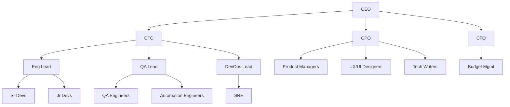

# Organization & Templates

## Company Types

SynthOrg provides pre-built company templates for common organizational patterns:

| Template | Size | Autonomy | Communication | Workflow | Use Case |
|----------|------|----------|---------------|----------|----------|
| **Solo Founder** | 1-2 | full | event_driven | kanban | Quick prototypes, solo projects |
| **Startup** | 3-5 | semi | hybrid | agile_kanban | Small projects, MVPs |
| **Dev Shop** | 5-10 | semi | hybrid | agile_kanban | Software development focus |
| **Product Team** | 8-15 | semi | meeting_based | agile_kanban | Product-focused development |
| **Agency** | 10-20 | supervised | hierarchical | kanban | Client work, multiple projects |
| **Full Company** | 20-50+ | supervised | hierarchical | agile_kanban | Enterprise simulation |
| **Research Lab** | 5-10 | full | event_driven | kanban | Research and analysis |
| **Custom** | Any | semi | hybrid | agile_kanban | Anything |

See the [Template System](#template-system) section for details on how templates are defined,
inherited, and customized.

---

## Organizational Hierarchy

The framework supports a full organizational hierarchy with reporting lines and
delegation authority:



Each node in the hierarchy corresponds to an [agent](agents.md) with a defined
[seniority level](agents.md#seniority-authority-levels) that determines their authority,
delegation rights, and typical model tier.

---

## Department Configuration

???+ example "Full department configuration YAML"

    ```yaml
    departments:
      - name: "engineering"
        head: "cto"
        budget_percent: 60
        teams:
          - name: "backend"
            lead: "backend_lead"
            members: ["sr_backend_1", "mid_backend_1", "jr_backend_1"]
          - name: "frontend"
            lead: "frontend_lead"
            members: ["sr_frontend_1", "mid_frontend_1"]
        reporting_lines:
          - subordinate: "Backend Developer"
            subordinate_id: "backend-senior"
            supervisor: "Software Architect"
          - subordinate: "Backend Developer"
            subordinate_id: "backend-mid"
            supervisor: "Backend Developer"
            supervisor_id: "backend-senior"
          - subordinate: "Frontend Developer"
            supervisor: "Software Architect"
      - name: "product"
        head: "cpo"
        budget_percent: 20
        teams:
          - name: "core"
            lead: "pm_lead"
            members: ["pm_1", "ux_designer_1", "ui_designer_1"]
      - name: "operations"
        head: "coo"
        budget_percent: 10
        teams:
          - name: "devops"
            lead: "devops_lead"
            members: ["sre_1"]
      - name: "quality"
        head: "qa_lead"
        budget_percent: 10
        teams:
          - name: "qa"
            lead: "qa_lead"
            members: ["qa_engineer_1", "automation_engineer_1"]
    ```

Each department defines:

- **head** (optional) -- The agent who leads the department (typically a C-suite or Lead role).  Defaults to ``None`` when no head is designated; hierarchy resolution skips the team-lead-to-head link for headless departments.  When multiple agents share the same role name, use the companion ``head_id`` field to disambiguate.  In template YAML this is written as ``head_merge_id`` (matching the agent's ``merge_id``); the renderer maps it to ``head_id`` at runtime -- paralleling how ``subordinate_id``/``supervisor_id`` work in ``reporting_lines``
- **budget_percent** -- The share of the company's task-execution budget allocated to this department (covers agent compute and API costs, not provider subscriptions or seat licensing)
- **teams** -- Named sub-groups within the department, each with a lead and members
- **reporting_lines** -- Explicit subordinate/supervisor relationships within the department.  Each entry has ``subordinate`` and ``supervisor`` (role names), plus optional ``subordinate_id``/``supervisor_id`` for disambiguating agents that share the same role name (typically matching the agent's ``merge_id``)

---

## Dynamic Scaling

The company can dynamically grow or shrink through several mechanisms:

- **Auto-scale** -- The HR agent detects workload increases and proposes new
  [hires](agents.md#hiring-process)
- **Manual scale** -- A human adds or removes agents via config or UI
- **Budget-driven** -- The CFO agent caps headcount based on budget constraints
- **Skill-gap** -- HR analyzes team capabilities, identifies missing skills, and proposes
  targeted hires

---

## Template System

Templates are YAML/JSON files defining a complete company setup. The framework uses templates as
the primary mechanism for bootstrapping organizations.

### Template Structure

```yaml
# templates/startup.yaml (simplified -- real templates also declare
# variables, departments, min_agents/max_agents, and tags)
template:
  name: "Tech Startup"
  description: "Small team for building MVPs and prototypes"
  version: "1.0"

  company:
    type: "startup"
    budget_monthly: "{{ budget | default(50.00) }}"
    autonomy:
      level: "semi"

  # Built-in templates use explicit names drawn from Faker at build time.
  # User-defined templates may use Jinja2 placeholders (e.g. {{ name | auto }})
  # which trigger Faker-based auto-generation at render time using the
  # locales selected in the Names setup step.
  agents:
    - role: "CEO"
      name: "Amara Okafor"
      model: "large"
      personality_preset: "visionary_leader"

    - role: "CTO"
      name: "Hiroshi Tanaka"
      model: "large"
      personality_preset: "rapid_prototyper"

    - role: "Full-Stack Developer"
      merge_id: "fullstack-senior"
      name: "Kenji Matsuda"
      level: "senior"
      model: "medium"
      personality_preset: "pragmatic_builder"

    - role: "Full-Stack Developer"
      merge_id: "fullstack-mid"
      name: "Sofia Reyes"
      level: "mid"
      model: "small"
      personality_preset: "team_diplomat"

    - role: "Product Manager"
      name: "Liam Chen"
      model: "medium"
      personality_preset: "strategic_planner"

  departments:
    - name: "executive"
      budget_percent: 20
      head_role: "CEO"
      reporting_lines:
        - subordinate: "CTO"
          supervisor: "CEO"
    - name: "engineering"
      budget_percent: 60
      head_role: "CTO"
      reporting_lines:
        - subordinate: "Full-Stack Developer"
          subordinate_id: "fullstack-senior"
          supervisor: "CTO"
        - subordinate: "Full-Stack Developer"
          subordinate_id: "fullstack-mid"
          supervisor: "CTO"
    - name: "product"
      budget_percent: 20
      head_role: "Product Manager"

  workflow: "agile_kanban"     # operational configs vary per template --
  communication: "hybrid"      # see Company Types table for each template's defaults

  workflow_handoffs:
    - from_department: "engineering"
      to_department: "product"
      trigger: "Feature implementation completed for product review"
      artifacts:
        - "pull_request"
        - "release_notes"

  escalation_paths:
    - from_department: "engineering"
      to_department: "executive"
      condition: "Technical blocker requiring executive decision"
      priority_boost: 1
```

Templates support **Jinja2-style variables** (`{{ variable | default(value) }}`) for
user-customizable values, and **personality presets** for reusable agent personality
configurations.

### Template Inheritance

Templates can extend other templates using `extends`:

```yaml
template:
  name: "Extended Startup"
  extends: "startup"         # inherits all agents, departments, config
  agents:
    - role: "QA Engineer"    # appended to parent agents
      level: "mid"
    - role: "Full-Stack Developer"
      merge_id: "fullstack-mid"
      department: "engineering"
      _remove: true          # removes matching parent agent by key
```

Inheritance resolves parent-to-child chains up to **10 levels deep**. Circular inheritance
is detected via chain tracking and raises `TemplateInheritanceError`.

### Merge Semantics

The merge behavior during template inheritance follows these rules:

Scalars (`company_name`, `company_type`)
:   Child wins if present.

`config` dict
:   Deep-merged (child keys override parent).

`agents` list
:   Merged by `(role, department, merge_id)` composite key. When `merge_id` is omitted, it
    defaults to an empty string, making the key `(role, department, "")`. The child template
    can override, append, or remove (`_remove: true`) parent agents.

`departments` list
:   Merged by department `name` (case-insensitive). A child department with the same `name`
    replaces the parent entry entirely; departments with new names are appended.

`workflow_handoffs` and `escalation_paths`
:   Child replaces entirely if present.

---

## Company Builder

The web dashboard includes a setup wizard with six substantive steps (Welcome, Admin,
Provider, Names, Company, Review Org) followed by a completion screen. The Names step lets
users choose which cultural locales are used for Faker-based agent name generation (e.g.,
English, Portuguese, Yoruba); selected locales are persisted and applied when templates render
agent names. When a template is selected in the Company step, all template agents are
auto-created with models matched to configured providers via a cost-based tier classification
engine. The Review Org step lets users inspect agents and reassign models before completing
setup. All configuration is persisted to the database via REST API calls. To re-run the
setup wizard from scratch, use `synthorg wipe` (creates a backup, wipes all data, restarts
the stack, and re-opens the wizard).

---

## Community Marketplace

!!! warning "Planned"

    A future community marketplace would enable sharing and discovery of:

    - Company templates
    - Custom role definitions
    - Workflow configurations
    - Rating and review system
    - Import/export in standard format
