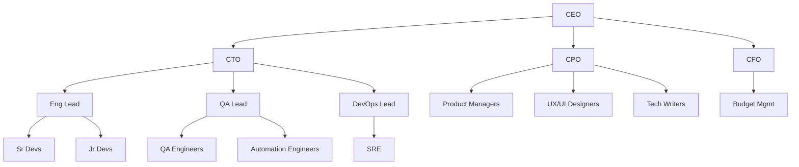

# Organization & Templates

## Company Types

SynthOrg provides pre-built company templates for common organizational patterns:

| Template | Size | Autonomy | Communication | Workflow | Use Case |
|----------|------|----------|---------------|----------|----------|
| **Solo Builder** | 1-2 | full | event_driven | kanban | Quick prototypes, solo projects |
| **Tech Startup** | 3-5 | semi | hybrid | agile_kanban | Small projects, MVPs |
| **Engineering Squad** | 5-10 | semi | hybrid | agile_kanban | Software development focus |
| **Product Studio** | 8-15 | semi | meeting_based | agile_kanban | Product-focused development |
| **Agency** | 10-20 | supervised | hierarchical | kanban | Client work, multiple projects |
| **Enterprise Org** | 20-50+ | supervised | hierarchical | agile_kanban | Enterprise simulation |
| **Research Lab** | 5-10 | full | event_driven | kanban | Research and analysis |
| **Consultancy** | 4-6 | supervised | hierarchical | kanban | Client-facing advisory/delivery |
| **Data Team** | 5-8 | full | event_driven | kanban | Analytics and ML pipelines |
| **Custom** | Any | semi | hybrid | agile_kanban | Anything |

See the [Template System](#template-system) section for details on how templates are defined,
inherited, and customized.

### Skill Pattern Taxonomy

Each template is classified using a five-pattern taxonomy that describes how its agents
interact to accomplish work. Based on
[Google Cloud's agent skill design patterns](https://cloud.google.com/blog/topics/developers-practitioners/5-agent-skill-design-patterns):

| Pattern | Description |
|---------|-------------|
| **Tool Wrapper** | On-demand domain expertise; agents self-direct using specialized context |
| **Generator** | Consistent structured output from reusable templates |
| **Reviewer** | Modular rubric-based evaluation; separates what to check from how to check it |
| **Inversion** | Agent interviews user before acting; structured requirements gathering |
| **Pipeline** | Strict sequential workflow with hard checkpoints between stages |

Templates declare which patterns they exhibit via the `skill_patterns` metadata field:

| Template | Skill Patterns |
|----------|----------------|
| **Solo Builder** | Tool Wrapper |
| **Tech Startup** | Tool Wrapper, Generator, Pipeline |
| **Engineering Squad** | Pipeline, Reviewer, Tool Wrapper |
| **Product Studio** | Inversion, Pipeline, Reviewer |
| **Agency** | Pipeline, Generator, Reviewer |
| **Enterprise Org** | Tool Wrapper, Generator, Reviewer, Inversion, Pipeline |
| **Research Lab** | Inversion, Generator, Reviewer |
| **Consultancy** | Generator, Pipeline, Reviewer |
| **Data Team** | Generator, Reviewer, Tool Wrapper |

Patterns compose naturally: a Pipeline can embed a Reviewer step at each gate, a Generator
can begin with an Inversion phase to gather variables, and individual Pipeline stages can
activate different Tool Wrapper skills depending on the domain.

---

## Organizational Hierarchy

The framework supports a full organizational hierarchy with reporting lines and
delegation authority:



Each node in the hierarchy corresponds to an [agent](agents.md) with a defined
[seniority level](agents.md#seniority-authority-levels) that determines their authority,
delegation rights, and typical model tier.

---

## Department Configuration

???+ example "Full department configuration YAML"

    ```yaml
    departments:
      - name: "engineering"
        head: "cto"
        budget_percent: 60
        policies:
          review_requirements:
            min_reviewers: 2
          approval_chains:
            - action_type: "code_review"
              approvers: ["Software Architect", "CTO"]
        teams:
          - name: "backend"
            lead: "backend_lead"
            members: ["sr_backend_1", "mid_backend_1", "jr_backend_1"]
          - name: "frontend"
            lead: "frontend_lead"
            members: ["sr_frontend_1", "mid_frontend_1"]
        reporting_lines:
          - subordinate: "Backend Developer"
            subordinate_id: "backend-senior"
            supervisor: "Software Architect"
          - subordinate: "Backend Developer"
            subordinate_id: "backend-mid"
            supervisor: "Backend Developer"
            supervisor_id: "backend-senior"
          - subordinate: "Frontend Developer"
            supervisor: "Software Architect"
      - name: "product"
        head: "cpo"
        budget_percent: 20
        teams:
          - name: "core"
            lead: "pm_lead"
            members: ["pm_1", "ux_designer_1", "ui_designer_1"]
      - name: "operations"
        head: "coo"
        budget_percent: 10
        teams:
          - name: "devops"
            lead: "devops_lead"
            members: ["sre_1"]
      - name: "quality"
        head: "qa_lead"
        budget_percent: 10
        teams:
          - name: "qa"
            lead: "qa_lead"
            members: ["qa_engineer_1", "automation_engineer_1"]
    ```

Each department defines:

- **head** (optional) -- The agent who leads the department (typically a C-suite or Lead role).  Defaults to ``None`` when no head is designated; hierarchy resolution skips the team-lead-to-head link for headless departments.  When multiple agents share the same role name, use the companion ``head_id`` field to disambiguate.  In template YAML this is written as ``head_merge_id`` (matching the agent's ``merge_id``); the renderer maps it to ``head_id`` at runtime -- paralleling how ``subordinate_id``/``supervisor_id`` work in ``reporting_lines``
- **budget_percent** -- The share of the company's task-execution budget allocated to this department (covers agent compute and API costs, not provider subscriptions or seat licensing)
- **teams** -- Named sub-groups within the department, each with a lead and members
- **reporting_lines** -- Explicit subordinate/supervisor relationships within the department.  Each entry has ``subordinate`` and ``supervisor`` (role names), plus optional ``subordinate_id``/``supervisor_id`` for disambiguating agents that share the same role name (typically matching the agent's ``merge_id``)
- **policies** (optional) -- Department-level operational policies.  Contains ``review_requirements`` (minimum reviewers, required reviewer roles, self-review toggle) and ``approval_chains`` (ordered approver lists keyed by action type such as ``code_review``, ``security_review``, or ``change_management``).  Defaults to a single required reviewer and no approval chains when omitted

---

## Dynamic Scaling

The company can dynamically grow or shrink through several mechanisms:

- **Auto-scale** -- The HR agent detects workload increases and proposes new
  [hires](agents.md#hiring-process)
- **Manual scale** -- A human adds or removes agents via config or UI
- **Budget-driven** -- The CFO agent caps headcount based on budget constraints
- **Skill-gap** -- HR analyzes team capabilities, identifies missing skills, and proposes
  targeted hires

---

## Template System

Templates are YAML/JSON files defining a complete company setup. The framework uses templates as
the primary mechanism for bootstrapping organizations.

### Template Structure

```yaml
# templates/startup.yaml (simplified -- real templates also declare
# min_agents/max_agents, tags, and department policies)
template:
  name: "Tech Startup"
  description: "Small team for building MVPs and prototypes"
  version: "1.0"

  variables:
    - name: "sprint_length"
      description: "Sprint duration in days"
      var_type: "int"
      default: 7
    - name: "wip_limit"
      description: "Work-in-progress limit per column"
      var_type: "int"
      default: 3

  company:
    type: "startup"
    budget_monthly: "{{ budget | default(50.00) }}"
    autonomy:
      level: "semi"

  # Built-in templates use explicit names drawn from Faker at build time.
  # User-defined templates may use Jinja2 placeholders (e.g. {{ name | auto }})
  # which trigger Faker-based auto-generation at render time using the
  # locales selected in the Names setup step.
  # The `model` field accepts either a string tier alias (backward-compatible)
  # or a structured dict with tier, priority, min_context, and optionally
  # capabilities.  Structured format overrides personality-based affinity
  # defaults.
  agents:
    - role: "CEO"
      name: "Amara Okafor"
      model:                          # structured model requirement
        tier: "large"
        priority: "quality"
        min_context: 100000
      personality_preset: "visionary_leader"

    - role: "CTO"
      name: "Hiroshi Tanaka"
      model:
        tier: "large"
        priority: "quality"
        min_context: 100000
      personality_preset: "rapid_prototyper"

    - role: "Full-Stack Developer"
      merge_id: "fullstack-senior"
      name: "Kenji Matsuda"
      level: "senior"
      model: "medium"                 # string tier alias (still works)
      personality_preset: "pragmatic_builder"

    - role: "Full-Stack Developer"
      merge_id: "fullstack-mid"
      name: "Sofia Reyes"
      level: "mid"
      model:
        tier: "small"
        priority: "cost"
      personality_preset: "team_diplomat"

    - role: "Product Manager"
      name: "Liam Chen"
      model:
        tier: "medium"
        priority: "speed"
      personality_preset: "strategic_planner"

  departments:
    - name: "executive"
      budget_percent: 20
      head_role: "CEO"
      reporting_lines:
        - subordinate: "CTO"
          supervisor: "CEO"
    - name: "engineering"
      budget_percent: 60
      head_role: "CTO"
      reporting_lines:
        - subordinate: "Full-Stack Developer"
          subordinate_id: "fullstack-senior"
          supervisor: "CTO"
        - subordinate: "Full-Stack Developer"
          subordinate_id: "fullstack-mid"
          supervisor: "CTO"
    - name: "product"
      budget_percent: 20
      head_role: "Product Manager"

  workflow: "agile_kanban"     # operational configs vary per template --
  communication: "hybrid"      # see Company Types table for each template's defaults

  workflow_config:             # optional Kanban/Sprint sub-configurations
    kanban:
      wip_limits:
        - column: "in_progress"
          limit: {{ wip_limit | default(3) }}
        - column: "review"
          limit: 2
      enforce_wip: true
    sprint:
      duration_days: {{ sprint_length | default(7) }}
      ceremonies:
        - name: "sprint_planning"
          protocol: "structured_phases"
          frequency: "weekly"
        - name: "sprint_review"
          protocol: "round_robin"
          frequency: "weekly"

  workflow_handoffs:
    - from_department: "engineering"
      to_department: "product"
      trigger: "Feature implementation completed for product review"
      artifacts:
        - "pull_request"
        - "release_notes"

  escalation_paths:
    - from_department: "engineering"
      to_department: "executive"
      condition: "Technical blocker requiring executive decision"
      priority_boost: 1
```

Templates support **Jinja2-style variables** (`{{ variable | default(value) }}`) for
user-customizable values, and **personality presets** for reusable agent personality
configurations.

### Personality Presets

Personality presets come in two flavors:

- **Built-in presets** ship with the codebase (`templates/presets.py`) and are read-only.
- **Custom presets** are user-defined via the REST API (`POST /api/v1/personalities/presets`), persisted to the database, and managed through full CRUD operations.

Custom preset names must match `^[a-z][a-z0-9_]*$` and cannot shadow built-in names. All custom presets are validated against `PersonalityConfig` before persistence. The API distinguishes origin via a `source: "builtin" | "custom"` field in responses.

During template rendering and setup agent expansion, custom presets are fetched from the database and passed into the rendering pipeline alongside builtins. If an agent references a preset name that exists in neither custom nor built-in collections, the system logs a warning rather than raising an error: during template rendering, the personality is omitted (the agent proceeds with no personality assigned); during setup agent expansion, the agent falls back to the `pragmatic_builder` default. The `validate_preset_references()` function provides advisory pre-flight validation for template import/export scenarios, returning warning strings for unknown presets without raising.

Discovery endpoints (`GET /api/v1/personalities/presets`, `GET /api/v1/personalities/presets/{name}`, `GET /api/v1/personalities/schema`) are available to all authenticated users. CRUD endpoints require write access.

### Template Inheritance

Templates can extend other templates using `extends`:

```yaml
template:
  name: "Extended Startup"
  extends: "startup"         # inherits all agents, departments, config
  agents:
    - role: "QA Engineer"    # appended to parent agents
      level: "mid"
    - role: "Full-Stack Developer"
      merge_id: "fullstack-mid"
      department: "engineering"
      _remove: true          # removes matching parent agent by key
```

Inheritance resolves parent-to-child chains up to **10 levels deep**. Circular inheritance
is detected via chain tracking and raises `TemplateInheritanceError`.

### Merge Semantics

The merge behavior during template inheritance follows these rules:

Scalars (`company_name`, `company_type`)
:   Child wins if present.

`config` dict
:   Deep-merged (child keys override parent).

`agents` list
:   Merged by `(role, department, merge_id)` composite key. When `merge_id` is omitted, it
    defaults to an empty string, making the key `(role, department, "")`. The child template
    can override, append, or remove (`_remove: true`) parent agents.

`departments` list
:   Merged by department `name` (case-insensitive). A child department with the same `name`
    replaces the parent entry entirely; departments with new names are appended.

`workflow_config` dict
:   Not merged during inheritance.  A child template that uses ``extends`` must
    declare its full ``workflow_config`` if it needs one; the parent's
    ``workflow_config`` is not carried forward.

`workflow_handoffs` and `escalation_paths`
:   Child replaces entirely if present.

---

## Company Builder

The web dashboard includes a setup wizard with a mode selection gate after account creation
(conditional -- only shown when no admin exists). The user chooses **Guided Setup**
(recommended, full wizard) or **Quick Setup** (minimal: company name + provider, configure
the rest later in Settings). Guided mode steps: Mode, Template (searchable grid with
category/size filters, recommended/others grouping, and structural metadata cards showing
agent count, departments, autonomy level, and workflow), Company (name, description,
currency, and model tier profile), Providers (configure LLM providers with auto-detection
for local instances (with probe-detected base URLs) and full provider form supporting
API key, subscription, custom configurations, and manually entered base URLs),
Agents (customize names, roles, personality presets, and model assignments),
Theme (set UI preferences for palette, density, animation, sidebar, and typography), and
Complete (review summary and launch). Quick mode steps: Mode, Company, Providers, and
Complete -- skipping template, agents, and theme. Providers are configured before agents so
model assignment is available during agent customization. When a template is selected, all
template agents are auto-created with models matched to configured providers via a tier
classification engine that respects each agent's priority axis (quality, speed, cost, or
balanced). All configuration is persisted to the database via REST API calls. To re-run the
setup wizard from scratch, use `synthorg wipe` (walks you through an interactive backup,
wipes all data, and optionally restarts the stack to re-open the wizard).

---

## Community Marketplace

!!! warning "Planned"

    A future community marketplace would enable sharing and discovery of:

    - Company templates
    - Custom role definitions
    - Workflow configurations
    - Rating and review system
    - Import/export in standard format
