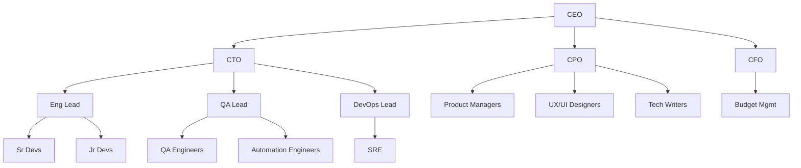

# Organization & Templates

## Company Types

SynthOrg provides pre-built company templates for common organizational patterns:

| Template | Size | Roles | Use Case |
|----------|------|-------|----------|
| **Solo Founder** | 1-2 | CEO + Full-Stack Dev | Quick prototypes, solo projects |
| **Startup** | 3-5 | CEO, CTO, 2 Devs, PM | Small projects, MVPs |
| **Dev Shop** | 5-10 | Lead, Sr Dev, Jr Devs, QA, DevOps | Software development focus |
| **Product Team** | 8-15 | PM, Designer, Devs, QA, Data Analyst | Product-focused development |
| **Agency** | 10-20 | Multiple PMs, Designers, Devs, Content | Client work, multiple projects |
| **Full Company** | 20-50+ | All departments, full hierarchy | Enterprise simulation |
| **Research Lab** | 5-10 | Lead Researcher, Analysts, Engineers | Research and analysis |
| **Custom** | Any | User-defined | Anything |

See the [Template System](#template-system) section for details on how templates are defined,
inherited, and customized.

---

## Organizational Hierarchy

The framework supports a full organizational hierarchy with reporting lines and
delegation authority:



Each node in the hierarchy corresponds to an [agent](agents.md) with a defined
[seniority level](agents.md#seniority-authority-levels) that determines their authority,
delegation rights, and typical model tier.

---

## Department Configuration

???+ example "Full department configuration YAML"

    ```yaml
    departments:
      - name: "engineering"
        head: "cto"
        budget_percent: 60
        teams:
          - name: "backend"
            lead: "backend_lead"
            members: ["sr_backend_1", "mid_backend_1", "jr_backend_1"]
          - name: "frontend"
            lead: "frontend_lead"
            members: ["sr_frontend_1", "mid_frontend_1"]
      - name: "product"
        head: "cpo"
        budget_percent: 20
        teams:
          - name: "core"
            lead: "pm_lead"
            members: ["pm_1", "ux_designer_1", "ui_designer_1"]
      - name: "operations"
        head: "coo"
        budget_percent: 10
        teams:
          - name: "devops"
            lead: "devops_lead"
            members: ["sre_1"]
      - name: "quality"
        head: "qa_lead"
        budget_percent: 10
        teams:
          - name: "qa"
            lead: "qa_lead"
            members: ["qa_engineer_1", "automation_engineer_1"]
    ```

Each department defines:

- **head** -- The agent who leads the department (typically a C-suite or Lead role)
- **budget_percent** -- The share of the company's total budget allocated to this department
- **teams** -- Named sub-groups within the department, each with a lead and members

---

## Dynamic Scaling

The company can dynamically grow or shrink through several mechanisms:

- **Auto-scale** -- The HR agent detects workload increases and proposes new
  [hires](agents.md#hiring-process)
- **Manual scale** -- A human adds or removes agents via config or UI
- **Budget-driven** -- The CFO agent caps headcount based on budget constraints
- **Skill-gap** -- HR analyzes team capabilities, identifies missing skills, and proposes
  targeted hires

---

## Template System

Templates are YAML/JSON files defining a complete company setup. The framework uses templates as
the primary mechanism for bootstrapping organizations.

### Template Structure

```yaml
# templates/startup.yaml (simplified -- real templates also declare
# variables, departments, min_agents/max_agents, and tags)
template:
  name: "Tech Startup"
  description: "Small team for building MVPs and prototypes"
  version: "1.0"

  company:
    type: "startup"
    budget_monthly: "{{ budget | default(50.00) }}"
    autonomy:
      level: "semi"

  agents:
    - role: "CEO"
      name: "{{ ceo_name | auto }}"
      model: "large"
      personality_preset: "visionary_leader"

    - role: "Full-Stack Developer"
      merge_id: "fullstack-senior"
      name: "{{ dev1_name | auto }}"
      level: "senior"
      model: "medium"
      personality_preset: "pragmatic_builder"

    - role: "Full-Stack Developer"
      merge_id: "fullstack-mid"
      name: "{{ dev2_name | auto }}"
      level: "mid"
      model: "small"
      personality_preset: "eager_learner"

    - role: "Product Manager"
      name: "{{ pm_name | auto }}"
      model: "medium"
      personality_preset: "strategic_planner"

  workflow: "agile_kanban"
  communication: "hybrid"

  workflow_handoffs:
    - from_department: "engineering"
      to_department: "qa"
      trigger: "pr_ready"

  escalation_paths:
    - from_department: "engineering"
      to_department: "security"
      condition: "vulnerability_found"
```

Templates support **Jinja2-style variables** (`{{ variable | default(value) }}`) for
user-customizable values, and **personality presets** for reusable agent personality
configurations.

### Template Inheritance

Templates can extend other templates using `extends`:

```yaml
template:
  name: "Extended Startup"
  extends: "startup"         # inherits all agents, departments, config
  agents:
    - role: "QA Engineer"    # appended to parent agents
      level: "mid"
    - role: "Full-Stack Developer"
      merge_id: "fullstack-mid"
      department: "engineering"
      _remove: true          # removes matching parent agent by key
```

Inheritance resolves parent-to-child chains up to **10 levels deep**. Circular inheritance
is detected via chain tracking and raises `TemplateInheritanceError`.

### Merge Semantics

The merge behavior during template inheritance follows these rules:

Scalars (`company_name`, `company_type`)
:   Child wins if present.

`config` dict
:   Deep-merged (child keys override parent).

`agents` list
:   Merged by `(role, department, merge_id)` composite key. When `merge_id` is omitted, it
    defaults to an empty string, making the key `(role, department, "")`. The child template
    can override, append, or remove (`_remove: true`) parent agents.

`departments` list
:   Merged by department `name` (case-insensitive). A child department with the same `name`
    replaces the parent entry entirely; departments with new names are appended.

`workflow_handoffs` and `escalation_paths`
:   Child replaces entirely if present.

---

## Company Builder

The web dashboard includes a setup wizard with five substantive steps (Welcome, Admin,
Provider, Company, Review Org) followed by a completion screen. When a template is selected
in the Company step, all template agents are auto-created with models matched to configured
providers via a cost-based tier classification engine. The Review Org step lets users inspect
agents and reassign models before completing setup. All configuration is persisted to the
database via REST API calls. The CLI equivalent (`synthorg setup`) is planned as a future
addition.

---

## Community Marketplace

!!! warning "Planned"

    A future community marketplace would enable sharing and discovery of:

    - Company templates
    - Custom role definitions
    - Workflow configurations
    - Rating and review system
    - Import/export in standard format
