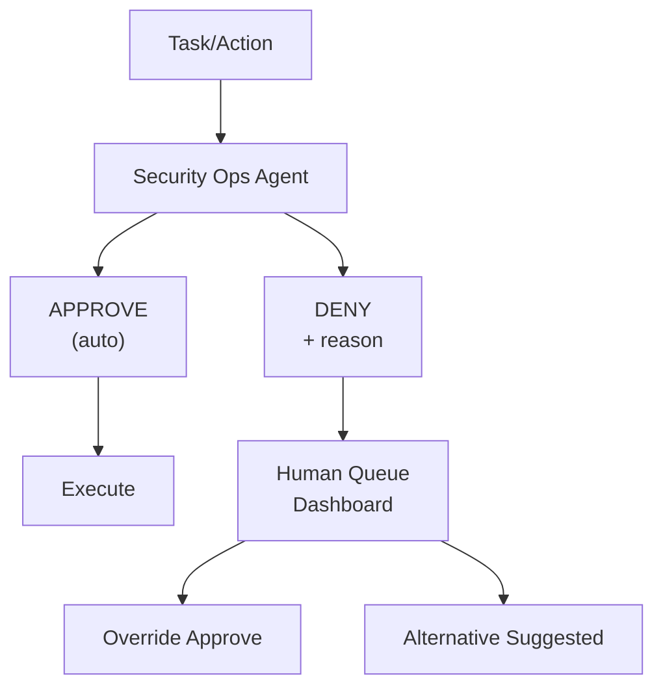

# Security & Approval System

SynthOrg enforces a fail-closed security model: every agent action is evaluated by a rule engine (with an optional LLM fallback) before execution, every output is scanned for leaked secrets, and every credential flows through an isolated **hands** plane that never enters the model context. Four configurable autonomy levels (`full`, `semi`, `supervised`, `locked`) control which actions require human approval, and a pluggable trust system lets agents earn higher tool access over time.

## Approval Workflow



## Autonomy Levels

The framework provides four built-in autonomy presets that control which actions agents can
perform independently versus which require human approval. Most users only set the level.

```yaml
autonomy:
  level: "semi"                  # full, semi, supervised, locked
  presets:
    full:
      description: "Agents work independently. Human notified of results only."
      auto_approve: ["all"]
      human_approval: []

    semi:
      description: "Most work is autonomous. Major decisions need approval."
      auto_approve: ["code", "test", "docs", "comms:internal"]
      human_approval: ["deploy", "comms:external", "budget:exceed", "org:hire"]
      security_agent: true

    supervised:
      description: "Human approves major steps. Agents handle details."
      auto_approve: ["code:write", "comms:internal"]
      human_approval: ["arch", "code:create", "deploy", "vcs:push"]
      security_agent: true

    locked:
      description: "Human must approve every action."
      auto_approve: []
      human_approval: ["all"]
      security_agent: true        # still runs for audit logging
```

Built-in templates set autonomy levels appropriate to their archetype (e.g. `full` for
Solo Builder, Research Lab, and Data Team, `supervised` for Agency, Enterprise Org, and
Consultancy). See the
[Company Types table](organization.md#company-types) for per-template defaults.

**Autonomy scope** ([Decision Log](../architecture/decisions.md) D6): Three-level
resolution chain: per-agent > per-department > company default. Seniority validation prevents
Juniors/Interns from being set to `full`.

**Runtime changes** ([Decision Log](../architecture/decisions.md) D7): Human-only
promotion via REST API (no agent, including CEO, can escalate privileges). Automatic downgrade
on: high error rate (one level down), budget exhausted (supervised), security incident (locked).
Recovery from auto-downgrade is human-only.

## Security Operations Agent

A special meta-agent that reviews all actions before execution:

- Evaluates safety of proposed actions
- Checks for data leaks, credential exposure, destructive operations
- Validates actions against company policies
- Maintains an audit log of all approvals/denials
- Escalates uncertain cases to human queue with explanation
- **Cannot be overridden by other agents** (only human can override)

**Rule engine** ([Decision Log](../architecture/decisions.md) D4): Hybrid
approach. Rule engine for known patterns (credentials, path traversal, destructive ops) plus
user-defined custom policy rules (`custom_policies` in security config) -- sub-ms, covers ~95%
of cases. LLM fallback only for uncertain cases (~5%). Full autonomy mode:
rules + audit logging only, no LLM path. Hard safety rules (credential exposure, data
destruction) **never bypass** regardless of autonomy level.

**Integration point** ([Decision Log](../architecture/decisions.md) D5):
Pluggable `SecurityInterceptionStrategy` protocol. Initial strategy intercepts before every
tool invocation -- slots into existing `ToolInvoker` between permission check and tool
execution. Post-tool-call scanning detects sensitive data in outputs.

## Output Scan Response Policies

After the output scanner detects sensitive data, a pluggable `OutputScanResponsePolicy`
protocol decides how to handle the findings. Each policy sets a `ScanOutcome` enum on the
returned `OutputScanResult` so downstream consumers (primarily `ToolInvoker`) can
distinguish intentional policy decisions from scanner failures:

| Policy | Behavior | `ScanOutcome` | Default for |
|--------|----------|---------------|-------------|
| **Redact** (default) | Return scanner's redacted content as-is | `REDACTED` | `SEMI`, `SUPERVISED` autonomy |
| **Withhold** | Clear redacted content -- content withheld by policy | `WITHHELD` | `LOCKED` autonomy |
| **Log-only** | Discard findings (logs at WARNING), pass original output through | `LOG_ONLY` | `FULL` autonomy |
| **Autonomy-tiered** | Delegate to a sub-policy based on effective autonomy level | *(set by delegate)* | Composite policy |

The `ScanOutcome` enum (`CLEAN`, `REDACTED`, `WITHHELD`, `LOG_ONLY`) is set by the scanner
(initial `REDACTED` when findings are detected) and may be transformed by the policy (e.g.
`WithholdPolicy` changes `REDACTED` -> `WITHHELD`). The `ToolInvoker._scan_output` method
branches on `ScanOutcome.WITHHELD` first to return a dedicated error message ("content
withheld by security policy") with `output_withheld` metadata -- distinct from the generic
fail-closed path used for scanner exceptions.

Policy selection is declarative via `SecurityConfig.output_scan_policy_type`
(`OutputScanPolicyType` enum). A factory function (`build_output_scan_policy`) resolves the
enum to a concrete policy instance. The policy is applied *after* audit recording, preserving
audit fidelity regardless of policy outcome.

## Review Gate Invariants

Review gates enforce no-self-review as a structural invariant, not a convention.
An agent must never act as reviewer on a task it executed. The invariant is enforced
at three layers, each independently sufficient:

1. **Service-layer preflight** -- `ReviewGateService.check_can_decide()` runs before
   the approval row is persisted. A `SelfReviewError` at preflight raises `403
   Forbidden` with a generic message (the error's `task_id` and `agent_id`
   attributes are available for structured logs but never leaked in the HTTP body).
   The preflight-before-persist ordering ensures a rejected self-review attempt
   never leaves a decided approval row or a broadcast WebSocket event behind.
2. **Pydantic model validator** -- `DecisionRecord._forbid_self_review` rejects
   construction when `executing_agent_id == reviewer_agent_id`. Type-level invariants
   catch bugs in any caller that bypasses the service layer.
3. **SQL `CHECK` constraint** -- the `decision_records` table carries
   `CHECK(reviewer_agent_id != executing_agent_id)`, providing a last-resort
   defense at the database boundary. If a direct SQL caller somehow bypasses
   both the service and the model, the DB rejects the write.

### Auditable Decisions Drop-Box

Every completed review appends an immutable `DecisionRecord` to the drop-box
(`DecisionRepository`) capturing full context at decision time: executor,
reviewer, outcome (`DecisionOutcome`: `APPROVED` / `REJECTED` / `AUTO_APPROVED`
/ `AUTO_REJECTED` / `ESCALATED`), reason, acceptance-criteria snapshot, approval
ID cross-reference, and a server-assigned monotonic version per task.

- **Append-only** -- the protocol exposes no update or delete operations; the
  SQL schema backs this up by enforcing a `FOREIGN KEY ... ON DELETE RESTRICT`
  on `task_id`, preventing cascade-deletes that would erase audit trails.
- **Atomic versioning** -- `append_with_next_version` computes the next version
  inside a single `INSERT ... (SELECT COALESCE(MAX(version), 0) + 1 ...)`
  statement, eliminating the TOCTOU race that a read-then-write pattern would
  create under concurrent reviewers. The `UNIQUE(task_id, version)` constraint
  rejects any residual collision as `DuplicateRecordError`.
- **Best-effort append after transition** -- a failed append is logged at ERROR
  (via `logger.exception`) for audit forensics but does not roll back the review
  transition itself. Only known transient persistence errors (`QueryError`,
  `DuplicateRecordError`) are treated as non-fatal; programming errors
  (`ValidationError`, `TypeError`, etc.) propagate loudly so schema drift
  surfaces in dev/CI instead of being masked as silent audit loss.
- **Unassigned executor -- no record** -- when a task reaches the review gate
  without an assigned executor (an anomalous operational state), the service
  logs an ERROR event and refuses to write a decision record rather than
  smuggling a sentinel string through the `NotBlankStr` `executing_agent_id`
  field and contaminating the audit trail.

### Design Rationale: Append-Only vs Consolidation

The drop-box is deliberately append-only, not consolidated into org memory.
Org-memory consolidation is lossy by design (it summarises, compresses, and
discards detail for context-window efficiency) -- appropriate for conversational
knowledge but unsuitable for compliance-grade audit data, where every decision
must be reproducible and verifiable after the fact. Keeping the decision log as
a dedicated append-only store avoids coupling audit integrity to memory
consolidation heuristics and makes tamper-evident review trivial (any record
ever written stays written, verbatim).

## Credential Isolation Boundary

Credentials flow exclusively through the **hands** plane (tool execution) via the sandbox credential proxy (`tools/sandbox/`).  They never enter the **brain** plane (`AgentContext`, turn records, conversation history) or the **session** plane (observability events, replay).

Three enforcement points maintain this boundary:

1. **Task metadata validator** -- `engine/_validation.py::validate_task_metadata()` runs at the engine input boundary before execution begins.  It recursively scans all dict keys in `Task.metadata` (including nested dicts and dicts inside lists), rejecting any key matching credential patterns (`token`, `secret`, `api_key`, `password`, `bearer`) with an `EXECUTION_CREDENTIAL_ISOLATION_VIOLATION` error event (`execution.credential_isolation.violation`) and raises `ExecutionStateError`.
2. **Sandbox credential manager** -- `tools/sandbox/credential_manager.py::SandboxCredentialManager` strips 14 credential-like patterns from environment variable overrides before they enter sandbox containers.  Stripped keys are logged via `SANDBOX_CREDENTIAL_STRIPPED`.
3. **Auth proxy (planned)** -- `tools/sandbox/auth_proxy.py::SandboxAuthProxy` is the planned enforcement point for outbound header injection.  Once implemented, it will intercept outgoing HTTP requests from sandbox containers and inject authentication headers from SynthOrg's provider store at execution time, so credentials never enter the container.

See also: [Engine > Brain / Hands / Session](agent-execution.md#brain--hands--session).

## Approval Timeout Policy

When an action requires human approval (per autonomy level), the agent must wait. The
framework provides configurable timeout policies that determine what happens when a human
does not respond. All policies implement a `TimeoutPolicy` protocol, configurable per autonomy
level and per action risk tier.

During any wait -- regardless of policy -- the agent **parks** the blocked task (saving its
full serialized `AgentContext` state: conversation, progress, accumulated cost, turn count)
and picks up other available tasks from its queue. When approval arrives, the agent **resumes**
the original context exactly where it left off. This mirrors real company behavior: a developer
starts another task while waiting for a code review, then returns to the original work when
feedback arrives.

=== "Wait Forever"

    The action stays in the human queue indefinitely. No timeout, no auto-resolution. The agent
    works on other tasks in the meantime.

    ```yaml
    approval_timeout:
      policy: "wait"                     # wait, deny, tiered, escalation
    ```

    Safest -- no risk of unauthorized actions. Can stall tasks indefinitely if human is
    unavailable.

=== "Deny on Timeout"

    All unapproved actions auto-deny after a configurable timeout. The agent receives a denial
    reason and can retry with a different approach or escalate explicitly.

    ```yaml
    approval_timeout:
      policy: "deny"
      timeout_minutes: 240               # 4 hours
    ```

    Industry consensus default ("fail closed"). May stall legitimate work if human is
    consistently slow.

=== "Tiered Timeout"

    Different timeout behavior based on action risk level. Low-risk actions auto-approve after
    a short wait. Medium-risk actions auto-deny. High-risk/security-critical actions wait
    forever.

    ```yaml
    approval_timeout:
      policy: "tiered"
      tiers:
        low_risk:
          timeout_minutes: 60
          on_timeout: "approve"          # auto-approve low-risk after 1 hour
          actions: ["code:write", "comms:internal", "test"]
        medium_risk:
          timeout_minutes: 240
          on_timeout: "deny"             # auto-deny medium-risk after 4 hours
          actions: ["code:create", "vcs:push", "arch:decide"]
        high_risk:
          timeout_minutes: null          # wait forever
          on_timeout: "wait"
          actions: ["deploy", "db:admin", "comms:external", "org:hire"]
    ```

    Pragmatic -- low-risk tasks do not stall, critical actions stay safe. Auto-approve on
    timeout carries risk. Tuning tier boundaries requires operational experience.

=== "Escalation Chain"

    On timeout, the approval request escalates to the next human in a configured chain. If the
    entire chain times out, the action is denied.

    ```yaml
    approval_timeout:
      policy: "escalation"
      chain:
        - role: "direct_manager"
          timeout_minutes: 120
        - role: "department_head"
          timeout_minutes: 240
        - role: "ceo"
          timeout_minutes: 480
      on_chain_exhausted: "deny"         # deny if entire chain times out
    ```

    Mirrors real organizations -- if one approver is unavailable, the next in line covers.
    Requires configuring an escalation chain.

!!! info "Approval API Response Enrichment"
    The approval REST API enriches every `ApprovalItem` response with computed
    urgency fields so the dashboard can display time-sensitive indicators without
    client-side computation:

    - **`seconds_remaining`** (`float | null`): seconds until `expires_at`, clamped
      to 0.0 for expired items; `null` when no TTL is set.
    - **`urgency_level`** (enum): `critical` (< 1 hr), `high` (< 4 hrs),
      `normal` (>= 4 hrs), `no_expiry` (no TTL). Applied to all list, detail,
      create, approve, and reject endpoints.

!!! abstract "Park/Resume Mechanism"

    The park/resume mechanism relies on `AgentContext` snapshots (frozen Pydantic models). When
    a task is parked, the full context is persisted to the
    [`PersistenceBackend`](memory.md#operational-data-persistence). When approval arrives, the
    framework loads the snapshot, restores the agent's conversation and state, and resumes
    execution from the exact point of suspension. This works naturally with the
    `model_copy(update=...)` immutability pattern.

    **Design decisions** ([Decision Log](../architecture/decisions.md)):

    - **D19 -- Risk Tier Classification:** Pluggable `RiskTierClassifier` protocol. Configurable
      YAML mapping with sensible defaults. Unknown action types default to HIGH (fail-safe).
    - **D20 -- Context Serialization:** Pydantic JSON via persistence backend. `ParkedContext`
      model with metadata columns + `context_json` blob. Conversation stored verbatim --
      summarization is a context window management concern at resume time, not a persistence
      concern.
    - **D21 -- Resume Injection:** Tool result injection. Approval requests modeled as tool
      calls (`request_human_approval`). Approval decision returned as `ToolResult` --
      semantically correct (approval IS the tool's return value).

!!! info "EvidencePackage (HITL Approval Payload)"
    `ApprovalItem.evidence_package` (optional `EvidencePackage | None`) carries a structured
    approval payload for human review. See
    [Communication: EvidencePackage Schema](communication.md#evidencepackage-schema) for the
    full model specification. Existing approval paths (hiring, promotion, pruning) can adopt
    the package incrementally -- the field defaults to `None`.

## Runtime Policy Engine

A pluggable runtime pre-execution gate that evaluates structured action requests
(tool invocations, delegations, approval executions) against loaded policy
definitions *before* the action runs. This complements the existing
`security/rules/` preventive rule engine, which already evaluates actions
before tool execution, by adding a structured policy-as-code decision layer.

**Cedar adapter** (primary): uses `cedarpy` for stateless embedded evaluation.
Policies are loaded from files at company boot. No external process needed.

**Configuration** (`SecurityConfig.policy_engine`):

| Field | Default | Description |
|-------|---------|-------------|
| `engine` | `"none"` | Backend: `"cedar"` or `"none"` |
| `policy_files` | `()` | Paths to Cedar policy files |
| `evaluation_mode` | `"log_only"` | `"enforce"` blocks; `"log_only"` logs only |
| `fail_closed` | `False` | Deny on evaluation errors if `True` |

**Integration points** (via R1 middleware):

- `wrap_tool_call` -- `PolicyGateMiddleware` with `action_type="tool_invoke"`
- `before_decompose` -- coordination middleware with `action_type="delegation"`
- `ApprovalGate.park_context()` -- with `action_type="approval_execute"`

**Safety defaults**: engine defaults to `"none"` (disabled). When enabled,
`evaluation_mode` defaults to `"log_only"` so first adoption never breaks
existing flows. Operators graduate to `"enforce"` after observing decisions.

**Module**: `src/synthorg/security/policy_engine/`

## Quantum-Safe Audit Trail

An observability sink that signs security events with ML-DSA-65 (FIPS 204)
via the Asqav library and chains them in an append-only hash chain for
tamper-evident audit. Wraps the existing `observability/sinks.py` logging
handler protocol -- no changes to event producers.

**Features**:

- ML-DSA-65 post-quantum signatures per security event
- SHA-256 hash chain linking each entry to its predecessor
- RFC 3161 timestamping via public TSA with local-clock fallback
  (emits `SECURITY_TIMESTAMP_FALLBACK` on fallback)
- `AuditChainVerifier` for end-to-end chain integrity verification
- m-of-n threshold signing for high-risk `EvidencePackage` approvals

**Configuration** (`AuditChainConfig`, opt-in):

| Field | Default | Description |
|-------|---------|-------------|
| `enabled` | `False` | Opt-in activation |
| `backend` | `"asqav"` | Signing backend |
| `tsa_url` | `None` | RFC 3161 TSA endpoint (None = local clock) |
| `signing_key_path` | `None` | Path to signing key |
| `chain_storage_path` | `None` | Path for chain persistence |

**Module**: `src/synthorg/observability/audit_chain/`

## OWASP Agentic Top 10 (ASI) Coverage Matrix

This matrix maps SynthOrg security mechanisms to the
[OWASP Top 10 for Agentic Applications (2026)](https://genai.owasp.org/resource/owasp-top-10-for-agentic-applications-for-2026/).
Coverage is independently derived from codebase analysis and may not be fully
aligned with OWASP ASI specifications. Operators should cross-reference with
official OWASP documentation.

| ASI | Risk | Coverage | Primary Modules |
|-----|------|----------|----------------|
| ASI01 | Agent Goal Hijack | Partial | `security/rules/` (credential/path detectors), `engine/classification/` (semantic detectors), `HTMLParseGuard` (tool output sanitization), `SemanticDriftDetector` (middleware) |
| ASI02 | Tool Misuse and Exploitation | Covered | `PolicyEngine` (Cedar pre-exec gate), `security/rules/` (preventive rule engine), `tools/sandbox/` (Docker/subprocess isolation), `ApprovalGate` |
| ASI03 | Identity and Privilege Abuse | Covered | Progressive trust (`security/trust/`), 4 autonomy levels, `AuthorityDeferenceGuard`, `ApprovalGate`, delegation budget, `ToolPermissionChecker` |
| ASI04 | Agentic Supply Chain Vulnerabilities | Partial | `ToolRegistryIntegrityCheck` (boot-time hash verification), pip-audit/npm-audit/Trivy in CI, cosign signatures, SLSA provenance. **Gap**: no runtime plugin integrity verification beyond boot-time hash. |
| ASI05 | Unexpected Code Execution (RCE) | Covered | `tools/sandbox/` (Docker with ephemeral containers, subprocess with env filtering), gVisor runtime for high-risk categories (`code_execution`, `terminal`), `SandboxCredentialManager`, workspace boundary enforcement |
| ASI06 | Memory and Context Poisoning | Partial | Procedural memory generation guards, MVCC `SharedKnowledgeStore`, `SemanticDriftDetector`. **Gap**: no automated RAG-store integrity verification. |
| ASI07 | Insecure Inter-Agent Communication | Partial | `DelegationChainHashMiddleware` (content hash on delegation chain), `AuthorityDeferenceGuard` (strips authority cues from transcripts). **Gap**: no message-level encryption (in-process agents, not needed currently). |
| ASI08 | Cascading Failures | Covered | S1 15-risk register mitigations, circuit breakers (`BudgetEnforcer`), `StagnationDetector`, `CoordinationReplanHook` with `max_stall_count`/`max_reset_count` hard caps, team-size bounds (3-4 per group, 8 per meeting) |
| ASI09 | Human-Agent Trust Exploitation | Partial | `EvidencePackage` (structured HITL artifacts with `RecommendedAction` options), `AuditChainSink` (tamper-evident decision trail), `ApprovalGate` with configurable timeout policies. **Gap**: no cognitive-bias-specific UI warnings. |
| ASI10 | Rogue Agents | Covered | 4 autonomy levels (full/semi/supervised/locked), `PolicyEngine` (pre-exec gate), tool permissions (`ToolPermissionChecker`), sandbox isolation, `ToolRegistryIntegrityCheck`, budget limits, `AuthorityBreachDetector` |

**Summary**: 5 covered, 5 partial, 0 uncovered. Partial gaps are documented
above with specific module references.

## A2A Security

*Applies when the [A2A External Gateway](communication.md#a2a-external-gateway) is
enabled (`a2a.enabled: true`). All A2A security controls are inactive when the gateway
is disabled (the default).*

### Authentication Schemes

The gateway supports multiple authentication schemes for both inbound and outbound A2A
communication, configurable per direction:

| Scheme | Inbound (external -> SynthOrg) | Outbound (SynthOrg -> external) |
|--------|-------------------------------|--------------------------------|
| `apiKey` | Validate API key in request header | Send API key with outbound requests |
| `oauth2` | Validate OAuth2 bearer token | Obtain and send bearer token |
| `bearer` | Validate static bearer token | Send static bearer token |
| `mTLS` | Verify client certificate | Present client certificate |
| `none` | No authentication (development only) | No authentication |

!!! warning "Production Requirement"

    `none` authentication is intended for local development and testing only. Production
    deployments must not use `none` for inbound requests -- configure any of the
    authenticated schemes (`apiKey`, `oauth2`, `bearer`, or `mTLS`).

### Inbound Request Validation

Every inbound A2A request passes through two validation layers before reaching internal
agents:

1. **DelegationGuard** -- the same
   [five loop prevention mechanisms](communication.md#loop-prevention) that protect
   internal delegation also apply to external requests. External agents are treated as
   delegation sources with the gateway as the entry point into the delegation chain.

2. **External-specific checks**:
    - Agent Card verification (see below)
    - Request signature validation (when configured)
    - Rate limiting scoped to external callers (separate from internal per-pair limits)
    - Payload size validation (configurable max request body size)

### Agent Trust Establishment

External agent identity is verified through two independent layers, both configurable:

Allowlist (default, always available)
:   The `a2a.allowed_agents` list controls which external agents can interact with the
    organization. Entries are matched against the Agent Card URL or agent ID. An empty
    allowlist with `a2a.enabled: true` rejects all inbound requests (fail-closed). The
    allowlist is operator-managed via the A2A configuration.

Agent Card signature verification (opt-in)
:   When `a2a.agent_card_verification.require_signatures` is enabled, inbound requests
    must include a JWS-signed Agent Card. The gateway verifies the signature against a
    set of trusted public keys or JWKS endpoints. This provides cryptographic proof of
    agent identity beyond the allowlist.

    ```yaml
    a2a:
      agent_card_verification:
        enabled: true
        require_signatures: false    # opt-in for high-security deployments
        trusted_jwks_urls: []        # JWKS endpoints for key discovery
        trusted_public_keys: []      # inline PEM-encoded public keys
    ```

The two layers are independent: the allowlist gates access (who may connect), signatures
verify identity (who is connecting). Both can be enabled simultaneously for defense in
depth.

### Push Notification Webhook Security

A2A push notifications allow external agents to receive task updates via webhooks.
SynthOrg will implement a generic `WebhookReceiver` that is reusable beyond A2A:

| Protection | Description |
|------------|-------------|
| **HMAC signature verification** | Webhook payloads are signed with a shared secret using the configured algorithm (default: HMAC-SHA256). The receiver verifies the signature before processing |
| **Timestamp validation** | Requests include a timestamp header. The receiver rejects requests with timestamps outside the configured clock skew tolerance (default: 300 seconds) |
| **Nonce/replay prevention** | Each request includes a unique nonce. The receiver maintains a TTL-based dedup window (default: 60 seconds) to reject replayed requests |

The `WebhookReceiver` will be a standalone reusable component, not A2A-specific. It will
protect any endpoint that receives webhook callbacks from external systems.

### SSRF Prevention

A2A push notification webhook URLs submitted by external agents must be validated
against SSRF attacks. The framework provides a consolidated `SsrfValidator` service
that unifies URL validation across all outbound connection points:

| Consumer | Current Implementation | After Consolidation |
|----------|----------------------|-------------------|
| Notification adapters (ntfy, Slack) | `_validate_outbound_url()` | `SsrfValidator` |
| Git clone URLs | `git_url_validator` module | `SsrfValidator` |
| Provider discovery | `ProviderDiscoveryPolicy` allowlist | `SsrfValidator` + allowlist |
| A2A push notification webhooks | (new) | `SsrfValidator` |

For HTTP(S) consumers (webhooks, notifications, provider discovery), the `SsrfValidator`
rejects URLs targeting private IP ranges (10.0.0.0/8, 172.16.0.0/12, 192.168.0.0/16),
loopback addresses, link-local addresses, and non-HTTP(S) schemes. Git clone URLs
continue to use the existing `git_url_validator` module, which supports SSH and SCP-like
syntax with its own validation rules. A configurable allowlist permits legitimate internal
endpoints (e.g., local providers, internal Git servers). DNS rebinding mitigation follows
the existing pattern from `git_url_validator`: resolved IPs are pinned and re-validated
before connection.

### Quadratic Communication Enforcement

The existing `MessageOverhead.is_quadratic` detection (see
[Microservices Anti-Patterns](communication.md#microservices-anti-patterns-assessment))
will be extended with a pluggable `QuadraticEnforcementStrategy` protocol. This is
particularly relevant for A2A federation where external agent connections can amplify
quadratic scaling. Currently, only detection exists -- enforcement strategies are
proposed below.

Four built-in strategies are planned:

| Strategy | Behavior | Default |
|----------|----------|---------|
| `alert_only` | Current behavior -- detect and notify via `NotificationDispatcher` | Yes |
| `soft_throttle` | Auto-tighten rate limiter for affected agent group by `rate_reduction_factor` | No |
| `hard_block` | Reject new connections when agent count exceeds `max_agent_connections` | No |
| `disabled` | No detection or enforcement | No |

The strategy will be pluggable via the `QuadraticEnforcementStrategy` protocol -- custom
strategies can be registered without modifying built-in code.

???+ example "Quadratic enforcement configuration"

    ```yaml
    loop_prevention:
      quadratic_enforcement:
        strategy: "alert_only"         # alert_only, soft_throttle, hard_block, disabled
        soft_throttle:
          rate_reduction_factor: 0.5   # halve rate limits for affected group
        hard_block:
          max_agent_connections: 20    # reject connections beyond this count
    ```

### A2AConfig

The gateway is configured under the `a2a` key in the company YAML:

???+ example "Full A2A configuration"

    ```yaml
    a2a:
      enabled: false                     # gateway disabled by default
      auth:
        inbound: apiKey                  # apiKey, oauth2, bearer, mTLS, none
        outbound: bearer                 # auth scheme for outbound requests
        api_key: "${A2A_API_KEY}"        # inbound API key (env var recommended)
        outbound_token: "${A2A_OUTBOUND_TOKEN}"  # outbound bearer token
      allowed_agents: []                 # allowlist of external agent IDs/URLs
      agent_card_verification:
        enabled: false                   # Agent Card verification
        require_signatures: false        # JWS signature verification (opt-in)
        trusted_jwks_urls: []
        trusted_public_keys: []
      push_notifications:
        enabled: false                   # push notification support
        webhook_receiver:
          signature_algorithm: hmac-sha256
          clock_skew_seconds: 300        # timestamp tolerance
          replay_window_seconds: 60      # nonce dedup window
      rate_limiting:
        external_max_per_minute: 30      # per-external-agent rate limit
        external_burst_allowance: 5
      max_request_body_bytes: 1048576    # 1 MB payload limit
    ```

See [A2A External Gateway](communication.md#a2a-external-gateway) for the architecture
overview, Agent Card projection, and concept mapping tables.

---

## See Also

- [Tools](tools.md) -- tool categories, sandboxing, progressive trust
- [Budget](budget.md) -- risk budget, shadow mode enforcement
- [Design Overview](index.md) -- full index
