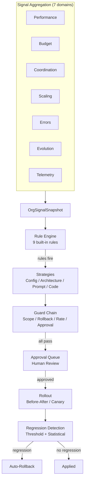

# Self-Improving Company

The self-improvement meta-loop observes company-wide signals from 7 existing subsystems and produces deployment and product-level improvement proposals through a rule-first hybrid pipeline with mandatory human approval.

## Architecture Overview

The meta-loop operates at the **company altitude** (distinct from per-agent evolution in #243) and follows the pluggable protocol + strategy + factory + config discriminator pattern used throughout SynthOrg.



## Package Structure

```text
src/synthorg/meta/
  models.py            -- ImprovementProposal, RollbackPlan, CodeChange, etc.
  signal_models.py     -- OrgSignalSnapshot, signal domain summaries
  protocol.py          -- SignalAggregator, ImprovementStrategy, ProposalGuard, CIValidator
  config.py            -- SelfImprovementConfig (frozen, safe defaults)
  service.py           -- SelfImprovementService orchestrator
  factory.py           -- Component construction from config

  rules/               -- Signal pattern detection
    engine.py          -- RuleEngine (evaluates rules, sorts by severity)
    builtin.py         -- 9 built-in rules with configurable thresholds
    custom.py          -- Declarative custom rules (CustomRuleDefinition, DeclarativeRule, METRIC_REGISTRY, Comparator)

  strategies/          -- Proposal generation
    config_tuning.py   -- Config field changes
    architecture.py    -- Structural changes (roles, workflows)
    prompt_tuning.py   -- Org-wide constitutional principles
    code_modification.py -- Framework code changes (LLM-generated)

  signals/             -- Signal aggregation from existing subsystems
    performance.py     -- PerformanceTracker wrapper
    budget.py          -- Budget analytics wrapper
    coordination.py    -- Coordination metrics wrapper
    scaling.py         -- ScalingService wrapper
    errors.py          -- Classification pipeline wrapper
    evolution.py       -- EvolutionService wrapper
    telemetry.py       -- Telemetry pipeline wrapper
    snapshot.py        -- Parallel snapshot builder

  guards/              -- Proposal validation chain
    scope_check.py     -- Altitude scope enforcement
    rollback_plan.py   -- Rollback plan validation
    rate_limit.py      -- Submission rate limiting
    approval_gate.py   -- Mandatory human approval routing

  rollout/             -- Staged deployment
    before_after.py    -- Whole-org with Clock-backed observation window
    canary.py          -- Canary subset with Clock-backed observation window
    ab_test.py         -- A/B test group assignment and observation loop
    ab_comparator.py   -- Control vs treatment comparison (Welch-backed)
    ab_models.py       -- GroupAssignment, ABTestVerdict, GroupMetrics (sample-backed)
    clock.py           -- Clock protocol + RealClock (wall-time abstraction for tests)
    roster.py          -- OrgRoster protocol + CallableOrgRoster / NoOpOrgRoster
    group_aggregator.py -- GroupSignalAggregator protocol + TrackerGroupAggregator
    inverse_dispatch.py -- RollbackHandler protocol + 4 mutator protocols + default handlers
    rollback.py        -- RollbackExecutor (dispatches by operation_type)
    regression/        -- Tiered detection
      threshold.py     -- Layer 1: instant circuit-breaker
      statistical.py   -- Layer 2: StatisticalDetector (Welch-backed)
      welch.py         -- Hand-rolled Welch's t-test (no numpy/scipy dep)
      composite.py     -- Combines both layers

  appliers/            -- Change execution
    config_applier.py  -- RootConfig reconstruction
    architecture_applier.py -- Role/workflow creation
    prompt_applier.py  -- Constitutional principle injection
    code_applier.py    -- Local CI + GitHub API push + draft PR
    github_client.py   -- GitHub REST API client (httpx, no git CLI)

  validation/          -- CI and scope validation for code modifications
    scope_validator.py -- Path allowlist/denylist enforcement
    ci_validator.py    -- Local ruff + mypy + pytest runner

  mcp/                 -- Unified MCP API server with capability-based scoping
    server.py          -- Server singleton lifecycle
    tools.py           -- Legacy 9 signal tool definitions
    registry.py        -- MCPToolDef model + DomainToolRegistry
    scoping.py         -- MCPToolScoper (wildcard capability matching)
    invoker.py         -- MCPToolInvoker (handler dispatch + error mapping)
    tool_builder.py    -- read_tool / write_tool / admin_tool builders
    domains/           -- 15 domain tool definition modules (~204 tools)
    handlers/          -- 15 domain handler modules + common factory

  chief_of_staff/      -- Interactive agent role + advanced capabilities
    role.py            -- CustomRole definition
    prompts.py         -- Analysis + explanation prompt templates
    config.py          -- ChiefOfStaffConfig (learning, alerts, chat)
    models.py          -- ProposalOutcome, OutcomeStats, OrgInflection, Alert, ChatQuery/Response
    protocol.py        -- OutcomeStore, ConfidenceAdjuster, OrgInflectionSink, AlertSink
    outcome_store.py   -- MemoryBackendOutcomeStore (episodic memory persistence)
    learning.py        -- EMA + Bayesian confidence adjusters
    inflection.py      -- OrgInflectionDetector (snapshot comparison)
    monitor.py         -- OrgInflectionMonitor (async background loop)
    alerts.py          -- ProactiveAlertService + LoggingAlertSink
    chat.py            -- ChiefOfStaffChat (LLM-powered explanations)

  telemetry/           -- Cross-deployment analytics (opt-in, anonymized)
    config.py          -- CrossDeploymentAnalyticsConfig (disabled by default)
    models.py          -- AnonymizedOutcomeEvent, EventBatch, AggregatedPattern, ThresholdRecommendation
    protocol.py        -- AnalyticsEmitter, AnalyticsCollector, RecommendationProvider
    anonymizer.py      -- Pure anonymization functions (strict allowlist)
    emitter.py         -- HttpAnalyticsEmitter (async httpx, batching, retry)
    collector.py       -- InMemoryAnalyticsCollector (event storage + pattern queries)
    aggregator.py      -- aggregate_patterns() (cross-deployment pattern identification)
    recommender.py     -- DefaultThresholdRecommender (pattern-to-threshold recommendations)
    factory.py         -- Component construction from config
```

## Design Decisions

| Decision | Choice | Rationale |
|----------|--------|-----------|
| Meta-analyst | Interactive Chief of Staff agent | Company metaphor, conversational UX, evolvable via #243 |
| Signal access | MCP tools | First slice of API-as-MCP; agents use native tool interface |
| Proposal generation | Rule-first hybrid | Rules detect (cheap, auditable); LLM synthesizes (creative, scoped) |
| Altitudes | Config + Architecture + Prompt + Code | All pluggable, config enabled by default, others opt-in |
| Scope | Deployment + product level | Code modification altitude for framework improvements |
| Rollout | Before/after default, canary + A/B test opt-in | Per-proposal choice; A/B uses group assignment + statistical comparison |
| Regression | Tiered: threshold + statistical | Layer 1 for catastrophic, Layer 2 for subtle degradation |
| Signals consumed | All 7 domains | Performance, budget, coordination, scaling, errors, evolution, telemetry |
| Evolution boundary | Org-wide default; override + advisory alternatives | Clear separation from per-agent #243 |
| Safe defaults | Disabled, opt-in, mandatory approval | Never auto-applies without human review |
| Cross-deployment analytics | Dedicated protocol in `meta/telemetry/` | Domain events, not log records; follows meta/ pluggable pattern |
| Analytics anonymization | Strict allowlist (enums + numerics only) | Maximum privacy; free text dropped, UUIDs hashed, timestamps coarsened |
| Analytics aggregation | In-process API endpoints | Zero extra infra; any deployment can be emitter and/or collector |

## Signal Domains

| Domain | Source | Key Metrics |
|--------|--------|-------------|
| Performance | `PerformanceTracker` | Quality, success rate, collaboration, trends (all windows) |
| Budget | Budget pure functions | Spend, category breakdown, orchestration ratio, forecast |
| Coordination | Coordination metrics | 9 composable metrics (Ec, O%, Ae, etc.) |
| Scaling | `ScalingService` | Decision outcomes, success rate, signal patterns |
| Errors | Classification pipeline | Category distribution, severity histogram, trends |
| Evolution | `EvolutionService` | Proposal outcomes, approval rate, axis distribution |
| Telemetry | Telemetry pipeline | Event counts, top event types, error events |

## Built-in Rules

| Rule | Severity | Triggers When |
|------|----------|---------------|
| `quality_declining` | WARNING | Org quality below threshold |
| `success_rate_drop` | WARNING | Success rate below threshold |
| `budget_overrun` | CRITICAL | Budget exhaustion imminent |
| `coordination_cost_ratio` | WARNING | Coordination spend too high |
| `coordination_overhead` | WARNING | Coordination overhead % too high |
| `straggler_bottleneck` | INFO | Straggler gap ratio consistently high |
| `redundancy` | INFO | Work redundancy rate too high |
| `scaling_failure` | WARNING | Scaling decisions failing too often |
| `error_spike` | WARNING | Error findings exceed threshold |

All thresholds are configurable via constructor arguments.

## Proposal Lifecycle

1. **Signal collection**: `SnapshotBuilder` runs all 7 aggregators in parallel
2. **Rule evaluation**: `RuleEngine` checks all enabled rules against the snapshot
3. **Strategy dispatch**: Matching strategies generate proposals (rule-first hybrid)
4. **Guard chain**: Sequential evaluation (scope, rollback plan, rate limit, approval gate)
5. **Human approval**: Proposals queue in `ApprovalStore` for mandatory review
6. **Rollout**: Before/after comparison, canary subset, or A/B test (per proposal)
7. **Regression detection**: Tiered (threshold circuit-breaker + statistical significance)
8. **Auto-rollback**: On regression, `RollbackExecutor` applies the rollback plan

## Configuration

```yaml
self_improvement:
  enabled: false                    # Master switch (opt-in)
  chief_of_staff_enabled: false     # Agent persona (opt-in)
  config_tuning_enabled: true       # Config changes (on when enabled)
  architecture_proposals_enabled: false  # Structural changes (opt-in)
  prompt_tuning_enabled: false      # Prompt policies (opt-in)
  code_modification_enabled: false  # Framework code changes (opt-in)
  schedule:
    cycle_interval_hours: 168       # Weekly
    inflection_trigger_enabled: true
  rollout:
    default_strategy: before_after
    observation_window_hours: 48
    regression_check_interval_hours: 4
    ab_test:
      control_fraction: 0.5
      min_agents_per_group: 5
      min_observations_per_group: 10
      improvement_threshold: 0.15
  regression:
    quality_drop_threshold: 0.10
    cost_increase_threshold: 0.20
    error_rate_increase_threshold: 0.15
    success_rate_drop_threshold: 0.10
    statistical_significance_level: 0.05
    min_data_points: 10
  guards:
    proposal_rate_limit: 10
    rate_limit_window_hours: 24
  # Cross-deployment analytics (#1341) -- opt-in, disabled by default.
  cross_deployment_analytics:
    enabled: false                       # Master switch
    collector_url: null                  # HTTPS endpoint for event POST (required when enabled)
    deployment_id_salt: null             # Secret salt for SHA-256 deployment hash (required when enabled)
    collector_enabled: false             # Also act as a collector receiving events
    industry_tag: null                   # Optional industry category (max 100 chars)
    batch_size: 50                       # Max events buffered before flush
    flush_interval_seconds: 30.0         # Periodic flush interval
    http_timeout_seconds: 10.0           # HTTP POST timeout
    min_deployments_for_pattern: 3       # Min unique deployments for pattern reporting
    recommendation_min_observations: 10  # Min events for threshold recommendations
```

## Safety Mechanisms

- **Mandatory human approval**: Every proposal goes through `ApprovalStore`. No auto-apply.
- **Guard chain**: 4 sequential guards must all pass before approval routing.
- **Rollback plans**: Every proposal must carry a concrete, validated rollback plan.
- **Tiered regression detection**: Instant circuit-breaker + delayed statistical test.
- **Auto-rollback**: On regression, the rollback plan executes automatically.
- **Rate limiting**: Configurable proposal submission limits prevent flood.
- **Scope enforcement**: Proposals outside enabled altitudes are rejected.
- **Disabled by default**: The entire system is opt-in.

## Follow-up Issues

1. ~~Full API-as-MCP server~~ -- completed via #1353 (issue #1339; 204 tools, 15 domains, capability-based scoping)
2. ~~Product-level improvement~~ -- completed via #1340 (CODE_MODIFICATION altitude, LLM code gen, CI validation, draft PR creation)
3. ~~Cross-deployment analytics~~ -- completed via #1341 (opt-in anonymized telemetry, pattern aggregation, threshold recommendations; see `docs/cross-deployment-privacy.md`)
4. ~~Chief of Staff advanced capabilities~~ -- completed via #1342 (outcome learning, proactive alerts, NL chat)
5. ~~Custom rule authoring UI (visual rule builder)~~ -- shipped (#1343 / PR #1355)
