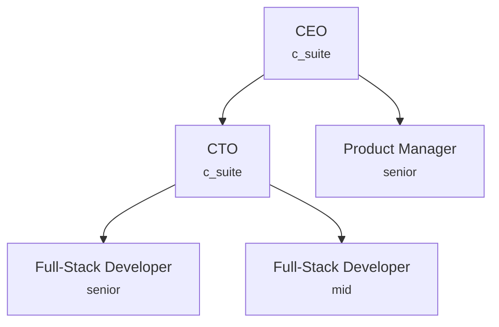

# Agent Roles & Hierarchy

Agents are the core building blocks of a synthetic organization. Each agent has an identity (role, name, personality), a position in the hierarchy (department, seniority, reporting line), and capabilities (model, tools, authority). This guide covers how to configure all of these.

---

## How Agents Work

An agent's configuration is split into two layers:

- **Config layer** (frozen) -- identity, personality, role, model, department. Set at creation time and never mutated.
- **Runtime state** (mutable-via-copy) -- execution status, current task, trust level, cost spent. Evolves during operation using `model_copy(update=...)`.

This separation means you configure *who an agent is* in YAML, and the engine manages *what the agent is doing* at runtime.

---

## Defining an Agent

Agents are defined in the `agents` list of your company configuration:

```yaml
agents:
  - role: "Full-Stack Developer"
    name: "Alex"
    level: senior
    department: "engineering"
    model:
      tier: "medium"
      priority: "balanced"
      min_context: 50000
    personality:
      openness: 0.5
      conscientiousness: 0.85
      decision_making: analytical
      verbosity: balanced
    autonomy_level: semi  # override company-wide level
```

### Agent Configuration Fields

| Field | Type | Default | Description |
|-------|------|---------|-------------|
| `name` | string | *(required)* | Display name |
| `role` | string | *(required)* | Role from the built-in catalog or `custom_roles` |
| `department` | string | *(required)* | Department this agent belongs to |
| `level` | SeniorityLevel | `mid` | Seniority level (see table below) |
| `personality` | dict | `{}` | Personality config injected into the system prompt (see [Personality](#personality-configuration)) |
| `model` | dict | `{}` | Model assignment -- structured config with tier, priority, min_context |
| `memory` | dict | `{}` | Per-agent memory overrides |
| `tools` | dict | `{}` | Tool access configuration |
| `authority` | dict | `{}` | Delegation and approval authority |
| `autonomy_level` | AutonomyLevel | `null` | Per-agent autonomy override |

!!! tip "Template-only fields"

    When using a **template** (e.g. `company_type: startup`), the template format supports additional fields: `personality_preset` (named preset resolved into a `personality` dict) and `merge_id` (disambiguation ID for multiple agents with the same role). These are resolved by the template engine before constructing the final config. Templates also auto-generate agent names via Faker when `name` is omitted.

!!! note "Unique agent identity"

    Agent names must be unique within the organization. For template inheritance, agent matching is keyed by `(role, department, merge_id)`. Use `merge_id` to disambiguate multiple agents sharing the same `(role, department)` pair.

---

## Seniority Levels

Seniority determines an agent's authority scope, typical model tier, and position in the delegation hierarchy:

| Level | Value | Authority Scope | Typical Model Tier |
|-------|-------|-----------------|-------------------|
| Junior | `junior` | Execute assigned tasks | Small |
| Mid | `mid` | Execute tasks, limited delegation | Small--Medium |
| Senior | `senior` | Delegate to juniors, review work | Medium |
| Lead | `lead` | Team-level decisions, delegation | Medium--Large |
| Principal | `principal` | Cross-team technical decisions | Large |
| Director | `director` | Department-level strategy | Large |
| VP | `vp` | Multi-department oversight | Large |
| C-Suite | `c_suite` | Organization-wide authority | Large |

Higher-seniority agents can delegate tasks to lower-seniority agents within their authority scope. The engine enforces that agents cannot assign work to peers or superiors.

---

## Built-in Roles

SynthOrg ships with 50+ built-in roles organized by department:

| Department | Roles |
|-----------|-------|
| Executive | CEO, CTO, CFO, COO |
| Product | Product Manager, Product Designer, UX Researcher |
| Engineering | Full-Stack Developer, Backend Developer, Frontend Developer, DevOps Engineer, QA Engineer, Security Engineer, Data Engineer, ML Engineer, Software Architect |
| Design | UI Designer, Graphic Designer |
| Data | Data Scientist, Data Analyst, Business Analyst |
| Operations | SysAdmin, Technical Writer, Project Coordinator |
| Creative | Content Writer, Marketing Specialist |

### Custom Roles

Define custom roles when the built-in catalog does not cover your needs:

```yaml
custom_roles:
  - role: "Compliance Officer"
    system_prompt_template: |
      You are a compliance officer responsible for ensuring
      all outputs meet regulatory requirements.
    skills:
      - "regulatory_analysis"
      - "policy_review"
    authority_level: "senior"
```

---

## Departments & Reporting Lines

Departments group agents and define budget allocation and reporting structure:

```yaml
departments:
  - name: "engineering"
    budget_percent: 60
    head_role: "CTO"
    reporting_lines:
      - subordinate: "Full-Stack Developer"
        subordinate_id: "fullstack-senior"
        supervisor: "CTO"
      - subordinate: "Full-Stack Developer"
        subordinate_id: "fullstack-mid"
        supervisor: "CTO"
  - name: "product"
    budget_percent: 20
    head_role: "Product Manager"
  - name: "executive"
    budget_percent: 20
    head_role: "CEO"
    reporting_lines:
      - subordinate: "CTO"
        supervisor: "CEO"
```

### Hierarchy Diagram

A typical startup hierarchy looks like this:



### Department Fields

| Field | Type | Default | Description |
|-------|------|---------|-------------|
| `name` | string | *(required)* | Unique department name |
| `budget_percent` | int | `0` | Percentage of company budget allocated |
| `head_role` | string | *(required)* | Role of the department head |
| `reporting_lines` | list | `[]` | Subordinate-supervisor pairs |

Use `subordinate_id` in reporting lines when you have multiple agents with the same role (matches the agent's `merge_id` when using templates).

---

## Personality Configuration

Agent personality is injected into the LLM system prompt and influences the agent's behavior, communication style, and decision-making.

### Big Five Dimensions

Each dimension is a float from 0.0 to 1.0:

| Dimension | Low (0.0) | High (1.0) |
|-----------|-----------|------------|
| `openness` | Conservative, routine-oriented | Curious, creative, experimental |
| `conscientiousness` | Flexible, spontaneous | Organized, reliable, thorough |
| `extraversion` | Reserved, independent | Sociable, energetic, assertive |
| `agreeableness` | Competitive, direct | Cooperative, empathetic |
| `stress_response` | Reactive, anxious | Calm, resilient, composed |

### Behavioral Traits

| Trait | Values |
|-------|--------|
| `decision_making` | `analytical`, `intuitive`, `consultative`, `directive` |
| `collaboration` | `independent`, `pair`, `team` |
| `verbosity` | `terse`, `balanced`, `verbose` |
| `conflict_approach` | `avoid`, `accommodate`, `compete`, `compromise`, `collaborate` |

### Personality Presets

Rather than configuring each dimension manually, use a named preset:

| Preset | Key Traits |
|--------|-----------|
| `visionary_leader` | High openness (0.85), directive decisions, authoritative communication |
| `pragmatic_builder` | High conscientiousness (0.85), analytical decisions, concise communication |
| `rapid_prototyper` | High openness (0.85), intuitive decisions, informal communication |
| `eager_learner` | High openness (0.8), consultative decisions, enthusiastic communication |
| `methodical_analyst` | Very high conscientiousness (0.9), analytical decisions, formal communication |
| `creative_innovator` | Very high openness (0.95), intuitive decisions, verbose communication |
| `strategic_planner` | Moderate conscientiousness (0.7), consultative decisions, structured communication |
| `team_diplomat` | Very high agreeableness (0.9), consultative decisions, collaborative conflict approach |

These are 8 of the 22 built-in presets. See the [library reference](../api/templates.md) for the complete preset catalog.

!!! tip "Using presets"

    Personality presets are available when using **templates** (via `personality_preset` in the template agent config). In raw YAML config, use the `personality` dict directly with the resolved values.

Provide a full personality object for fine-grained control:

```yaml
agents:
  - role: "CEO"
    personality:
      openness: 0.9
      conscientiousness: 0.7
      extraversion: 0.8
      agreeableness: 0.6
      stress_response: 0.8
      decision_making: directive
      collaboration: team
      verbosity: balanced
      conflict_approach: collaborate
```

---

## Model Assignment

Models can be assigned to agents in two ways:

=== "String Alias"

    Reference a model alias defined in your providers:

    ```yaml
    agents:
      - role: "Full-Stack Developer"
        model: "medium"
    ```

=== "Structured Config"

    Specify tier, priority, and constraints:

    ```yaml
    agents:
      - role: "CEO"
        model:
          tier: "large"      # large, medium, small
          priority: "quality" # quality, cost, balanced, speed
          min_context: 100000
    ```

When no model is specified, the routing strategy selects one based on the agent's seniority level and the task type.

---

## Templates as Starting Points

Templates pre-populate agents, departments, and workflows. You can customize any aspect after selecting a template:

| Template | Agents | Autonomy | Workflow | Communication |
|----------|--------|----------|----------|---------------|
| `solo_founder` | 2 | Full | Kanban | Event-driven |
| `startup` | 5 | Semi | Agile/Kanban | Hybrid |
| `dev_shop` | 6--10 | Semi | Kanban | Hybrid |
| `product_team` | 8--12 | Semi | Agile/Kanban | Meeting-based |
| `agency` | 4--8 | Supervised | Pipeline | Hierarchical |
| `full_company` | 8--15 | Semi | Agile | Hybrid |
| `research_lab` | 5--10 | Full | Kanban | Event-driven |
| `consultancy` | 4--6 | Supervised | Pipeline | Hierarchical |
| `data_team` | 5--8 | Full | Kanban | Event-driven |

Templates support **inheritance** via the `extends` keyword (deep merge up to 10 levels) and **variables** with Jinja2 placeholders for customization.

---

## Workflow Handoffs & Escalation

### Handoffs

Define automatic handoffs between departments when specific conditions are met:

```yaml
workflow_handoffs:
  - from_department: "engineering"
    to_department: "product"
    trigger: "Feature implementation completed for product review"
    artifacts:
      - "pull_request"
      - "release_notes"
```

### Escalation Paths

Define escalation routes for blockers or conflicts:

```yaml
escalation_paths:
  - from_department: "engineering"
    to_department: "executive"
    condition: "Technical blocker requiring executive decision"
    priority_boost: 1
  - from_department: "product"
    to_department: "executive"
    condition: "Scope or priority conflict needing CEO resolution"
    priority_boost: 1
```

The `priority_boost` field increases the priority of escalated tasks (0 = no change, 1 = one level up, etc.).

---

## See Also

- [Company Configuration](company-config.md) -- full configuration reference
- [Budget & Cost Control](budget.md) -- per-agent budgets and cost tracking
- [Security & Trust Policies](security.md) -- autonomy levels and trust strategies
- [Design: Agents](../design/agents.md) -- full design specification for agents
- [Design: Organization](../design/organization.md) -- template system and hierarchy
