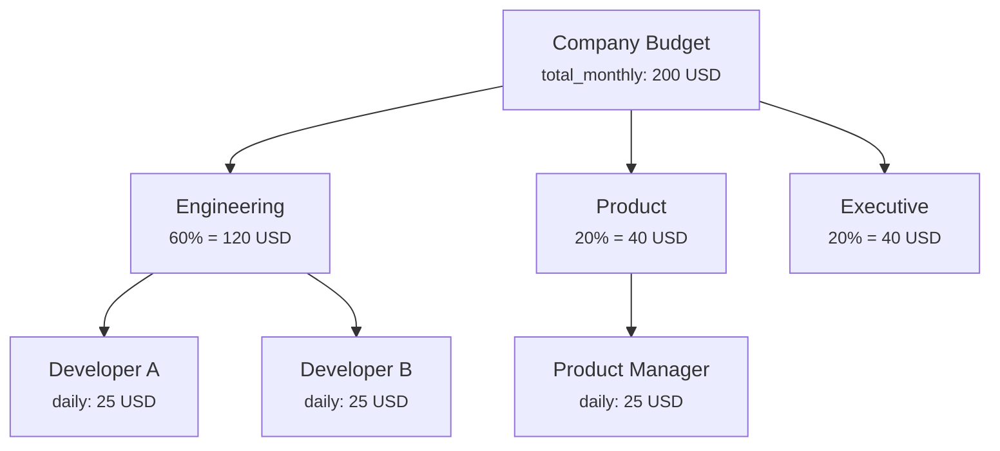

# Budget & Cost Control

SynthOrg tracks every LLM API call and enforces spending limits at multiple levels. This guide covers how to configure budgets, set alert thresholds, enable auto-downgrade to cheaper models, and monitor spending.

---

## Budget Architecture

Budgets are enforced in a three-layer hierarchy:



The budget enforcer checks spending at three boundaries:

1. **Pre-flight** -- before a task is assigned, verify sufficient budget remains
2. **In-flight** -- monitor spending during task execution (best-effort under concurrency)
3. **Task-boundary** -- auto-downgrade to cheaper models at task assignment (never mid-execution)

---

## Configuring the Budget

```yaml
budget:
  total_monthly: 200.0
  currency: "USD"
  reset_day: 1
  per_task_limit: 10.0
  per_agent_daily_limit: 25.0
```

### Budget Fields

| Field | Type | Default | Description |
|-------|------|---------|-------------|
| `total_monthly` | float | `100.0` | Monthly budget limit. Set to `0` to disable enforcement. |
| `currency` | string | `"USD"` | ISO 4217 currency code for display. **Display only** -- SynthOrg does not convert LLM provider costs (token prices are USD-denominated). Changing this relabels the symbol but leaves the numeric values untouched. |
| `reset_day` | int | `1` | Day of the month the budget resets (1--28) |
| `per_task_limit` | float | `5.0` | Maximum cost allowed per individual task |
| `per_agent_daily_limit` | float | `10.0` | Maximum cost per agent per day |

!!! info "Validation rules"

    - `per_task_limit` must be less than or equal to `total_monthly` (when budget > 0)
    - `per_agent_daily_limit` must be less than or equal to `total_monthly` (when budget > 0)
    - `reset_day` must be between 1 and 28 (avoids month-length edge cases)

---

## Alert Thresholds

Alert thresholds trigger notifications and behavior changes as spending approaches the budget limit:

```yaml
budget:
  alerts:
    warn_at: 75
    critical_at: 90
    hard_stop_at: 100
```

| Field | Type | Default | Description |
|-------|------|---------|-------------|
| `warn_at` | int | `75` | Warning threshold (percentage of `total_monthly`) |
| `critical_at` | int | `90` | Critical alert threshold |
| `hard_stop_at` | int | `100` | Hard stop -- reject new tasks |

**What happens at each level:**

| Threshold | Effect |
|-----------|--------|
| Below `warn_at` | Normal operation |
| `warn_at` reached | Warning alert emitted, budget status visible in dashboard |
| `critical_at` reached | Critical alert emitted. Auto-downgrade is independent -- it triggers at `auto_downgrade.threshold` (default 85%), not `critical_at`. |
| `hard_stop_at` reached | New task assignment blocked, `BudgetExhaustedError` raised |

!!! warning "Threshold ordering"

    Thresholds must be strictly ordered: `warn_at < critical_at < hard_stop_at`. Violating this produces a validation error at config load time.

---

## Auto-Downgrade

When spending approaches the budget limit, auto-downgrade switches agents to cheaper models at the next task assignment:

```yaml
budget:
  auto_downgrade:
    enabled: true
    threshold: 85
    downgrade_map:
      - ["large", "medium"]
      - ["medium", "small"]
```

### Auto-Downgrade Fields

| Field | Type | Default | Description |
|-------|------|---------|-------------|
| `enabled` | bool | `false` | Whether auto-downgrade is active |
| `threshold` | int | `85` | Budget percentage that triggers downgrade |
| `downgrade_map` | list | `[]` | Ordered pairs of `[source_alias, target_alias]` |
| `boundary` | string | `"task_assignment"` | When downgrades apply (always at task assignment) |

!!! tip "Downgrades never happen mid-execution"

    The `boundary` is always `"task_assignment"` -- an agent that starts a task on a large model will complete that task on the large model, even if the budget threshold is crossed during execution. The downgrade only applies to the *next* task assignment.

### Downgrade Map

The `downgrade_map` is an ordered list of `[from_alias, to_alias]` pairs:

```yaml
downgrade_map:
  - ["large", "medium"]    # large -> medium
  - ["medium", "small"]    # medium -> small
```

**Validation rules:**

- No self-downgrades (e.g. `["large", "large"]` is rejected)
- No duplicate source aliases (each source can only appear once)
- Aliases should reference model aliases or IDs defined in your `providers` configuration (unresolvable aliases are silently skipped at runtime)

---

## Cost Tracking

Every LLM API call is recorded as a cost record with full context:

| Field | Description |
|-------|-------------|
| `agent_id` | Which agent made the call |
| `task_id` | Which task the call was for |
| `provider` | Which provider was used |
| `model` | Which model was used |
| `input_tokens` | Number of input tokens |
| `output_tokens` | Number of output tokens |
| `cost` | Numeric cost of the call. Provider APIs publish token prices in USD; changing `budget.currency` relabels the stamped code but does not convert this value. |
| `currency` | ISO 4217 currency code (e.g. `USD`, `EUR`, `JPY`). Stamped from `budget.currency` at record-creation time; historical rows retain the code that was active when they were created. |
| `timestamp` | When the call was made (UTC) |

!!! info "Aggregation invariant"

    Every sum/average/budget-check site requires a single currency across the
    contributing rows. Mixing currencies raises
    `MixedCurrencyAggregationError` (HTTP 409). This is by design -- FX
    conversion is out of scope for the initial release; partition records by
    currency first, or apply your own conversion before aggregating.

### API Endpoints

| Endpoint | Description |
|----------|-------------|
| `GET /api/v1/budget/config` | Active `BudgetConfig` (limits, alert thresholds, cascade rules, currency) |
| `GET /api/v1/budget/records` | Cost records with filtering and aggregation |
| `GET /api/v1/budget/agents/{agent_id}` | Per-agent cost summary |

---

## Spending Reports

The budget system provides two aggregation views:

- **Daily summary** -- spending per agent and model for a given day
- **Period summary** -- spending over a date range with trend data

These are available via the dashboard budget page and the REST API.

---

## Department Budget Allocation

Each department receives a percentage of the company budget via `budget_percent`:

```yaml
departments:
  - name: "engineering"
    budget_percent: 60    # 60% of total_monthly
  - name: "product"
    budget_percent: 20
  - name: "executive"
    budget_percent: 20
```

Department budgets are advisory -- the hard enforcement is at the company and per-agent levels. Department allocation helps with reporting and planning.

---

## Practical Example

Here is a complete budget configuration for a startup team with three tiers of models:

```yaml
budget:
  total_monthly: 150.0
  currency: "USD"
  reset_day: 1
  per_task_limit: 8.0
  per_agent_daily_limit: 20.0
  alerts:
    warn_at: 70
    critical_at: 85
    hard_stop_at: 95
  auto_downgrade:
    enabled: true
    threshold: 80
    downgrade_map:
      - ["large", "medium"]
      - ["medium", "small"]
```

**Scenario walkthrough:**

1. **Day 1--15**: Normal operation. The CEO uses the `large` model, developers use `medium`.
2. **Day 16**: Spending reaches 70% (105 USD). A warning alert is emitted.
3. **Day 18**: Spending reaches 80% (120 USD). Auto-downgrade triggers:
   - The CEO's *next* task uses `medium` instead of `large`
   - Developers' *next* tasks use `small` instead of `medium`
4. **Day 22**: Spending reaches 85% (127.50 USD). Critical alert emitted.
5. **Day 25**: Spending reaches 95% (142.50 USD). Hard stop -- new tasks are rejected until the budget resets on Day 1.

---

## Budget API

Query spending, stream cost records, and integrate budget alerts into external dashboards.

### Budget configuration

```bash
curl http://localhost:3001/api/v1/budget/config \
  -H "Cookie: ${SESSION}" | jq
```

Returns the active `BudgetConfig` (limits, alert thresholds, cascade rules, currency). Current period spending and alert level are derived from the cost records stream (`/budget/records` summaries) or the WebSocket `budget` channel -- there is no separate `/budget/status` endpoint today.

### List cost records

```bash
# First page, 100 records (server default is 50 when limit is omitted)
curl "http://localhost:3001/api/v1/budget/records?limit=100" \
  -H "Cookie: ${SESSION}" | jq

# Filter by agent
curl "http://localhost:3001/api/v1/budget/records?agent_id=${AGENT_ID}&limit=50" \
  -H "Cookie: ${SESSION}" | jq

# Filter by task
curl "http://localhost:3001/api/v1/budget/records?task_id=${TASK_ID}" \
  -H "Cookie: ${SESSION}" | jq
```

The response includes `data` (paginated records), `daily_summary` (per-day totals aggregated across ALL matching records, not just the page), and `period_summary` (overall totals + computed `avg_cost`).

Supported query parameters: `agent_id`, `task_id`, `offset`, `limit`. Additional slicing (by provider, model, tag, project, date range) is done client-side from the paginated response today; a dedicated report-generation endpoint is planned but not yet implemented.

### Budget alert webhook integration

Budget thresholds emit notifications through `NotificationDispatcher`. To route them to a configured sink (see [Notifications & Events](notifications-and-events.md) for the shipped adapter catalog), add the sink to `notifications.sinks` and filter by `event_type` starting with `BUDGET_`.

Alternatively, subscribe to the `budget` WebSocket channel for real-time threshold events:

```javascript
ws.send(JSON.stringify({ action: 'subscribe', channels: ['budget'] }))
```

Wire event types (see `WsEventType` in `src/synthorg/api/ws_models.py`): `budget.record_added`, `budget.alert`.

### Risk budget enforcement

Risk enforcement (`risk_budget.enabled: true`) is handled internally by `RiskTracker` and `RiskEnforcer`. It is not exposed through dedicated public API endpoints today; risk events flow through the same `budget.alert` WebSocket event type described above.

---

## See Also

- [Company Configuration](company-config.md) -- full configuration reference
- [Agent Roles & Hierarchy](agents.md) -- per-agent model assignment
- [Design: Budget & Cost](../design/budget.md) -- budget architecture in the design spec
- [Notifications & Events](notifications-and-events.md) -- budget alert routing
