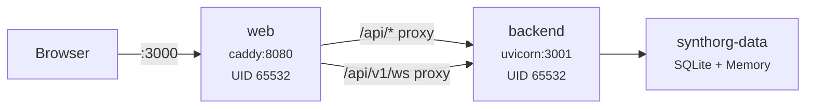

# Deployment (Docker)

SynthOrg runs as two Docker containers -- a Python backend API and a Caddy + React web dashboard. This guide covers production deployment, environment configuration, security hardening, and operations.

---

## Architecture



| Container | Image | Purpose |
|-----------|-------|---------|
| **backend** | `ghcr.io/aureliolo/synthorg-backend` | Litestar API server (Wolfi apko-composed distroless, non-root) |
| **web** | `ghcr.io/aureliolo/synthorg-web` | Caddy + React 19 SPA (proxies API and WebSocket) |

---

## Quick Deploy

=== "CLI (recommended)"

    ```bash
    synthorg init     # interactive setup wizard
    synthorg start    # pull images, verify signatures, start containers
    synthorg status   # verify health
    ```

=== "Docker Compose (manual)"

    ```bash
    git clone https://github.com/Aureliolo/synthorg
    cd synthorg
    cp docker/.env.example docker/.env
    # Edit docker/.env with your secrets (see Environment Variables below)
    docker compose -f docker/compose.yml up -d
    ```

See the [Quickstart Tutorial](quickstart.md) for a complete walkthrough and the [User Guide](../user_guide.md) for all CLI commands.

---

## Environment Variables

All environment variables are configured in `docker/.env` (copy from `docker/.env.example`):

### Required

| Variable | Description |
|----------|-------------|
| `SYNTHORG_JWT_SECRET` | JWT signing secret. Must be >= 32 characters of URL-safe base64. Never commit to version control. Generate: `python -c "import secrets; print(secrets.token_urlsafe(48))"` |
| `SYNTHORG_SETTINGS_KEY` | Fernet encryption key for sensitive settings at rest. Must be a valid Fernet key. Generate: `python -c "from cryptography.fernet import Fernet; print(Fernet.generate_key().decode())"` |

### Optional

| Variable | Default | Description |
|----------|---------|-------------|
| `SYNTHORG_DB_PATH` | `/data/synthorg.db` | SQLite database path (inside container) |
| `SYNTHORG_MEMORY_DIR` | `/data/memory` | Agent memory storage directory |
| `SYNTHORG_PERSISTENCE_BACKEND` | `sqlite` | Persistence backend |
| `SYNTHORG_MEMORY_BACKEND` | `mem0` | Memory backend |
| `SYNTHORG_LOG_DIR` | `/data/logs` | Log file directory |
| `SYNTHORG_LOG_LEVEL` | `info` | Log level: `debug`, `info`, `warning`, `error`, `critical` |
| `BACKEND_PORT` | `3001` | Host port for the backend API |
| `WEB_PORT` | `3000` | Host port for the web dashboard |
| `MEM0_TELEMETRY` | `false` | Mem0 telemetry (disable to reduce overhead) |
| `DOCKER_HOST` | *(unset)* | Docker socket for agent code execution sandbox (optional) |
| `SYNTHORG_TELEMETRY` | `false` | Enable opt-in anonymous product telemetry. Set to `true` / `1` / `yes` to enable; values like `false` / `0` / `no` keep it off. |
| `SYNTHORG_LOGFIRE_PROJECT_TOKEN` | *(unset)* | Logfire write token for product telemetry delivery. Empty disables delivery (collector falls back to noop). Only consulted when `SYNTHORG_TELEMETRY=true`. **Runtime-only**: supply via compose env or deployment secrets; it is deliberately **not** a Dockerfile build-arg, to keep the secret out of image layers and registry history. |
| `SYNTHORG_TELEMETRY_ENV` | *(unset)* | Explicit deployment-environment tag (`dev` / `pre-release` / `prod` / `ci` / `staging-east` / ...). Always wins the resolution chain if set. |
| `SYNTHORG_TELEMETRY_ENV_BAKED` | set by image | Image-baked fallback tag for the deployment environment. Release-tag CI builds bake `prod`; every pre-release tag form (`-dev.N`, `-rc.*`, `-alpha.*`, `-beta.*`) bakes `pre-release`; everything else bakes `dev`. Consulted only when `SYNTHORG_TELEMETRY_ENV` is unset *and* no CI markers are present; operators normally override via `SYNTHORG_TELEMETRY_ENV`. |

**Resolution chain** (first match wins, in `synthorg.telemetry.collector._resolve_environment`):

1. `SYNTHORG_TELEMETRY_ENV` (operator override) -- always wins if non-empty.
2. CI auto-detection -- `CI` / `GITLAB_CI` / `BUILDKITE` / `JENKINS_URL` / any `RUNPOD_*` present -> `"ci"`.
3. `SYNTHORG_TELEMETRY_ENV_BAKED` (image-baked fallback) -- set by CI via `DEPLOYMENT_ENV` build-arg; see above.
4. The parsed `TelemetryConfig.environment` value -- which itself defaults to `"dev"` when not configured.

### Image build-args

| Build arg | Default | Description |
|-----------|---------|-------------|
| `DEPLOYMENT_ENV` | `dev` | Baked deployment-environment tag (`dev` / `pre-release` / `prod`). CI computes and passes this automatically; local `docker build` without `--build-arg` inherits `dev`. |

---

## First-Run Setup

After the containers are running, open `http://localhost:3000`. The setup wizard appears on a fresh install. See the [User Guide](../user_guide.md#first-run-setup) for the full wizard walkthrough.

---

## Container Details

### Backend

- **Base image**: Wolfi apko-composed distroless (no shell, continuously scanned)
- **Build**: 2-stage (builder -> apko runtime) for minimal attack surface
- **User**: UID 65532 (distroless non-root)
- **Health check**: `GET /api/v1/health` (10s interval, 5s timeout, 3 retries, 30s start period)
- **Entry point**: `uvicorn synthorg.api.app:create_app --factory --no-access-log`

### Web

- **Base image**: Pure apko Wolfi (Caddy + melange-packaged static assets, no Dockerfile)
- **User**: UID 65532 (caddy)
- **Health check**: `GET /healthz` via Caddy (compose-level probe using `wget`; 10s interval, 3s timeout, 3 retries, 10s start period). The apko image intentionally ships no Dockerfile `HEALTHCHECK`, so the probe is declared alongside the service and targets `127.0.0.1` to avoid Docker DNS.
- **Routing**: SPA routing (`try_files {path} /index.html`), API proxy to backend, WebSocket proxy, per-request CSP nonce via Caddy `templates` directive
- **Caching**: `/index.html` is no-cache; `/assets/*` is immutable with 1-year max-age (content-hashed filenames)
- **Static compression**: pre-compressed `.gz` files served via `file_server { precompressed gzip }`

---

## Security Hardening

The Docker Compose configuration follows the [CIS Docker Benchmark v1.6.0](https://www.cisecurity.org/benchmark/docker):

| Control | Setting | CIS Reference |
|---------|---------|---------------|
| No new privileges | `security_opt: [no-new-privileges:true]` | 5.3 |
| Drop all capabilities | `cap_drop: [ALL]` | 5.12 |
| Read-only root filesystem | `read_only: true` + tmpfs mounts | 5.25 |
| PID limits | 256 (backend), 64 (web) | 5.28 |
| Memory limits | 4G (backend), 256M (web) | -- |
| CPU limits | 2.0 (backend), 0.5 (web) | -- |
| Log rotation | json-file, 10MB max, 3 files | -- |
| Tmpfs security | `noexec,nosuid,nodev` on `/tmp` | -- |

### Security Headers (Caddy)

The web container sets the following response headers:

- `X-Content-Type-Options: nosniff`
- `X-Frame-Options: DENY`
- `Referrer-Policy: strict-origin-when-cross-origin`
- `Permissions-Policy: geolocation=(), camera=(), microphone=()`
- `Content-Security-Policy: default-src 'self'; script-src 'self'; style-src 'self' 'nonce-{http.request.uuid}' 'unsafe-inline'; style-src-elem 'self' 'nonce-{http.request.uuid}'; style-src-attr 'unsafe-inline'; connect-src 'self'; img-src 'self' data:; font-src 'self'; object-src 'none'; base-uri 'self'; form-action 'self'; frame-ancestors 'none'`
- `Strict-Transport-Security: max-age=63072000` (2 years)

The CSP uses Level 3 directive splitting: `style-src-elem` locks `<style>` elements to the per-request nonce (injected by Caddy's `templates` directive substituting `{http.request.uuid}` into `<meta name="csp-nonce">`), while `style-src-attr 'unsafe-inline'` covers the transient inline positioning styles set by Floating UI (used internally by Base UI). See [`docs/security.md` → CSP Nonce Infrastructure](../security.md#csp-nonce-infrastructure) for the full flow -- any reverse proxy in front of the web container must preserve Caddy's template substitution and the matching CSP header, otherwise inline styles will be blocked.

---

## Volumes & Data Persistence

The `synthorg-data` Docker volume persists all application data:

- SQLite database (`/data/synthorg.db`)
- Agent memory files (`/data/memory/`)
- Log files (`/data/logs/`)

### Backup

```bash
synthorg backup             # create a backup
synthorg backup --list       # list available backups
synthorg backup --restore    # restore from backup
```

For manual Docker Compose deployments, back up the `synthorg-data` volume directly.

### Wipe & Reset

```bash
synthorg wipe    # offers backup, wipes all data, optionally restarts fresh
```

---

## Networking

Both containers run on the `synthorg-net` Docker network. The web container proxies API requests to the backend:

- `http://localhost:3000/api/*` -> `http://backend:3001/api/*`
- `ws://localhost:3000/api/v1/ws` -> `ws://backend:3001/api/v1/ws`

### Fine-Tuning (optional)

Embedding fine-tuning runs in a dedicated ephemeral container that the backend spawns on demand. It is **disabled by default** because the image is large and the workload is heavy.

Two image variants ship from GHCR, both amd64-only:

| Image | Torch | Size | When to pick |
|-------|-------|------|--------------|
| `ghcr.io/aureliolo/synthorg-fine-tune-gpu` | bundled CUDA (`torch==2.11.0`) | ~4 GB | Host has an NVIDIA GPU + compatible driver; practical training speed |
| `ghcr.io/aureliolo/synthorg-fine-tune-cpu` | CPU-only (`torch==2.11.0+cpu` via `download.pytorch.org/whl/cpu`) | ~1.7 GB | Host has no GPU; correctness-first, training is slower |

Fine-tuning also requires the sandbox to be enabled (`sandbox=true`). The backend launches each pipeline stage in a one-shot container using the Docker API.

=== "CLI (post-install)"

    Enable on an existing install without wiping data:

    ```bash
    synthorg config set sandbox true
    synthorg config set fine_tuning true
    synthorg config set fine_tuning_variant gpu   # or: cpu
    synthorg stop && synthorg start               # compose.yml is regenerated automatically
    ```

    `synthorg init` also prompts for this -- but only use `init` on a **fresh** data dir; it overwrites `config.json` and regenerates `compose.yml`. Existing installs should use `config set` as above.

=== "Docker Compose (manual / BYO)"

    In a hand-managed `compose.yml`, wire the fine-tune image into the backend's environment and declare the service. The canonical snippet lives in the commented-out `fine-tune:` block at the bottom of [`docker/compose.yml`](https://github.com/Aureliolo/synthorg/blob/main/docker/compose.yml); uncomment and pick a variant:

    ```yaml
    services:
      backend:
        environment:
          # Backend reads this on demand to spawn fine-tune containers via
          # the Docker API. Point at a digest-pinned ref for reproducibility.
          SYNTHORG_FINE_TUNE_IMAGE: ghcr.io/aureliolo/synthorg-fine-tune-gpu:${SYNTHORG_IMAGE_TAG:-latest}
      fine-tune:
        image: ghcr.io/aureliolo/synthorg-fine-tune-gpu:${SYNTHORG_IMAGE_TAG:-latest}
        # For CPU-only hosts, swap to: ghcr.io/aureliolo/synthorg-fine-tune-cpu
        volumes:
          - synthorg-data:/data:ro
        depends_on:
          backend:
            condition: service_healthy
        user: "10003:10003"
        group_add: ["65532"]
        security_opt: [no-new-privileges:true]
        cap_drop: [ALL]
        read_only: true
    ```

    Image signatures can be verified out-of-band with `cosign verify` and SLSA provenance with `gh attestation verify oci://...`; the CLI-generated compose pins digests automatically. See [Image Verification](#image-verification) below.

### Local LLM Providers

To use a local LLM like Ollama running on the host machine, configure the provider with `host.docker.internal`:

```yaml
providers:
  local-ollama:
    auth_type: none
    base_url: "http://host.docker.internal:11434"
```

---

## Image Verification

SynthOrg container images are signed with [cosign](https://docs.sigstore.dev/cosign/) keyless signatures and include [SLSA Level 3](https://slsa.dev/) provenance attestations.

`synthorg start` and `synthorg update` automatically verify signatures before pulling images. If verification fails (e.g. in an air-gapped environment):

```bash
synthorg start --skip-verify
# or
export SYNTHORG_SKIP_VERIFY=1
synthorg start
```

---

## Updates

```bash
synthorg update    # pull latest images, verify signatures, restart containers
```

The CLI re-launches itself after binary replacement so the remaining steps use the new version. If the compose template has structural changes, the diff is shown for approval before applying.

### Channels

| Channel | Description |
|---------|-------------|
| `stable` | Stable releases only (default) |
| `dev` | Pre-release builds on every push to main |

```bash
synthorg config set channel dev      # opt in to pre-release builds
synthorg config set channel stable   # switch back to stable
```

### Auto-Cleanup

Automatically remove old container images after updates (keeps current + previous version):

```bash
synthorg config set auto_cleanup true
```

---

## Production Checklist

!!! info "Production readiness checklist"

    - [ ] Generate strong secrets for `SYNTHORG_JWT_SECRET` and `SYNTHORG_SETTINGS_KEY`
    - [ ] Set `SYNTHORG_LOG_LEVEL` to `warning` or `info` (not `debug`)
    - [ ] Review and set appropriate `BACKEND_PORT` and `WEB_PORT`
    - [ ] Configure budget limits to prevent runaway LLM costs
    - [ ] Set autonomy level to `semi` or `supervised` (not `full`) for production orgs
    - [ ] Enable security audit logging (`security.audit_enabled: true`)
    - [ ] Set up backup schedule (`synthorg backup`)
    - [ ] Place behind a reverse proxy with TLS termination
    - [ ] Restrict Docker socket access if using the sandbox feature
    - [ ] Monitor container health via `synthorg status` or Docker health checks

---

## Troubleshooting

### Health Check

```bash
synthorg doctor    # run diagnostics
synthorg status    # check container health
synthorg logs      # view container logs
```

### Common Issues

| Issue | Solution |
|-------|----------|
| Backend container keeps restarting | Check `synthorg logs` for startup errors. Verify `SYNTHORG_JWT_SECRET` and `SYNTHORG_SETTINGS_KEY` are set. |
| Dashboard shows "Connection refused" | Ensure the web container is healthy and `WEB_PORT` is not in use. |
| Image pull fails | Check network connectivity. If air-gapped, use `--skip-verify`. |
| "Port already in use" | Change `BACKEND_PORT` or `WEB_PORT` in `docker/.env`. |
| Ollama not connecting | Use `http://host.docker.internal:11434` as the base URL. |

---

## See Also

- [Quickstart Tutorial](quickstart.md) -- get started in 5 minutes
- [User Guide](../user_guide.md) -- CLI commands and setup wizard
- [Security](../security.md) -- security architecture reference
- [Company Configuration](company-config.md) -- full configuration reference
