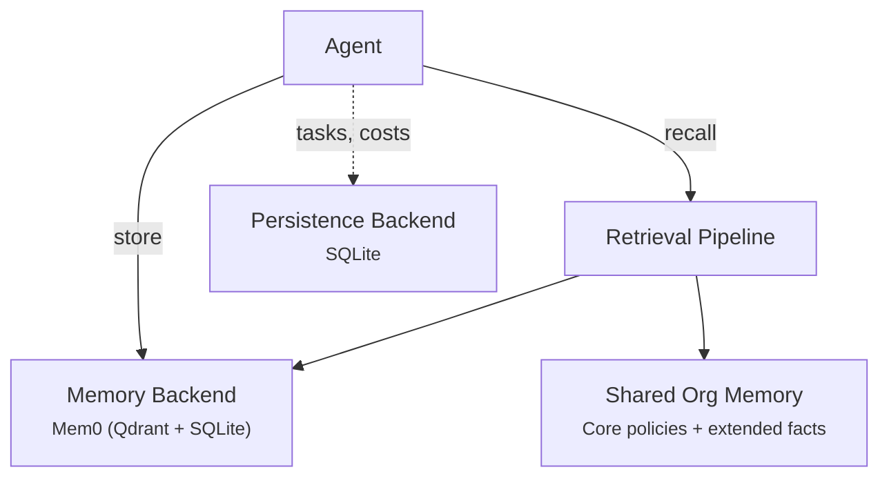

# Memory Configuration

SynthOrg agents have persistent memory that spans conversations and tasks. The memory system stores experiences, knowledge, skills, and relationships, and retrieves relevant memories to inject into the agent's context. This guide covers how to configure memory backends, persistence levels, retrieval tuning, shared organizational memory, and consolidation.

---

## Memory Architecture

The memory system has two concerns:

- **Agent memory** -- per-agent memories (what an agent has learned, experienced, and knows) stored in a pluggable memory backend
- **Operational data** -- structured records (tasks, cost records, messages, audit entries) stored in a persistence backend (SQLite)



---

## Memory Types

Agents store five types of memory:

| Type | Description | Typical Lifetime |
|------|-------------|-----------------|
| **Working** | Current task context, active plans | Task duration |
| **Episodic** | Past events, conversations, outcomes | Configurable retention |
| **Semantic** | Learned facts, domain knowledge | Long-term |
| **Procedural** | Skills, patterns, how-to knowledge | Long-term |
| **Social** | Relationships, collaboration history | Long-term |

---

## Memory Levels

The `level` field controls how long memories persist:

| Level | Value | Behavior |
|-------|-------|----------|
| Persistent | `persistent` | Memories survive across all sessions and projects |
| Project | `project` | Memories persist for the duration of a project |
| Session | `session` | Memories persist for the current session only (default) |
| None | `none` | No memory storage |

---

## Agent Memory Configuration

Configure memory in the `memory` section of your company config:

```yaml
memory:
  backend: "mem0"
  level: session
  storage:
    data_dir: "/data/memory"
    vector_store: "qdrant"
    history_store: "sqlite"
  options:
    retention_days: null          # null = keep forever
    max_memories_per_agent: 10000
    consolidation_interval: daily
    shared_knowledge_base: true
  retrieval:
    strategy: context
    relevance_weight: 0.7
    recency_weight: 0.3
    min_relevance: 0.3
    max_memories: 20
    include_shared: true
  consolidation:
    interval: daily
    max_memories_per_agent: 10000
```

### Top-Level Memory Fields

| Field | Type | Default | Description |
|-------|------|---------|-------------|
| `backend` | string | `"mem0"` | Memory backend (currently only `"mem0"`) |
| `level` | MemoryLevel | `"session"` | Default persistence level |
| `storage` | MemoryStorageConfig | *(defaults)* | Storage backend settings |
| `options` | MemoryOptionsConfig | *(defaults)* | Behavior options |
| `retrieval` | MemoryRetrievalConfig | *(defaults)* | Retrieval pipeline settings |
| `consolidation` | ConsolidationConfig | *(defaults)* | Consolidation settings |

---

## Storage Configuration

| Field | Type | Default | Description |
|-------|------|---------|-------------|
| `data_dir` | string | `"/data/memory"` | Directory for memory data (Docker volume mount) |
| `vector_store` | string | `"qdrant"` | Vector store: `"qdrant"` (embedded) or `"qdrant-external"` |
| `history_store` | string | `"sqlite"` | History store: `"sqlite"` or `"postgresql"` |

!!! note

    The `data_dir` path is validated to reject parent-directory traversal (`..`) to prevent path escape attacks.

---

## Memory Options

| Field | Type | Default | Description |
|-------|------|---------|-------------|
| `retention_days` | int or null | `null` | Days to retain memories (`null` = forever) |
| `max_memories_per_agent` | int | `10000` | Upper bound on memories per agent |
| `consolidation_interval` | string | `"daily"` | How often to consolidate: `hourly`, `daily`, `weekly`, `never` |
| `shared_knowledge_base` | bool | `true` | Whether shared knowledge is enabled |

---

## Retrieval Pipeline

When an agent needs context, the retrieval pipeline queries the memory backend, ranks results, and injects the top matches into the agent's prompt.

### Retrieval Fields

| Field | Type | Default | Description |
|-------|------|---------|-------------|
| `strategy` | string | `"context"` | Injection strategy (currently only `"context"`) |
| `relevance_weight` | float | `0.7` | Weight for backend relevance score (0.0--1.0) |
| `recency_weight` | float | `0.3` | Weight for recency decay score (0.0--1.0) |
| `recency_decay_rate` | float | `0.01` | Exponential decay rate per hour |
| `personal_boost` | float | `0.1` | Boost for personal memories over shared (0.0--1.0) |
| `min_relevance` | float | `0.3` | Minimum combined score to include a memory |
| `max_memories` | int | `20` | Maximum memories to inject (1--100) |
| `include_shared` | bool | `true` | Whether to query shared org memory |
| `default_relevance` | float | `0.5` | Score for entries missing a relevance score |
| `injection_point` | string | `"system"` | Where to inject: `"system"` (system prompt) or `"user"` |
| `non_inferable_only` | bool | `false` | Only inject memories tagged as non-inferable |
| `fusion_strategy` | string | `"linear"` | Ranking fusion: `"linear"` (currently supported) |
| `rrf_k` | int | `60` | RRF smoothing constant (only with RRF strategy, 1--1000) |

### Weight Tuning

For the `linear` fusion strategy, `relevance_weight` + `recency_weight` must equal 1.0:

```yaml
retrieval:
  relevance_weight: 0.7   # prioritize semantic relevance
  recency_weight: 0.3     # with some recency bias
```

- **Higher `relevance_weight`** -- better for knowledge-heavy tasks where the most relevant memory matters regardless of when it was stored
- **Higher `recency_weight`** -- better for conversational contexts where recent interactions are more important
- **`personal_boost`** -- adds a bonus to the agent's own memories over shared org memories (0.1 = 10% boost)

---

## Shared Organizational Memory

Beyond per-agent memory, SynthOrg supports shared organizational memory -- knowledge available to all agents:

```yaml
org_memory:
  backend: "hybrid_prompt_retrieval"
  core_policies:
    - "All code must pass review before merging."
    - "Customer data is never logged or stored in plain text."
    - "Budget decisions require CFO approval above 50 units in the configured currency."
  extended_store:
    backend: "sqlite"
    max_retrieved_per_query: 5
```

### Org Memory Fields

| Field | Type | Default | Description |
|-------|------|---------|-------------|
| `backend` | string | `"hybrid_prompt_retrieval"` | Org memory backend |
| `core_policies` | list | `[]` | Policy texts injected into every agent's system prompt |
| `extended_store` | ExtendedStoreConfig | *(defaults)* | Extended facts store |
| `write_access` | WriteAccessConfig | *(defaults)* | Write access control |

### How It Works

The **hybrid prompt + retrieval** backend uses two layers:

1. **Core policies** -- short, critical rules injected directly into every agent's system prompt. These are always available and never filtered.
2. **Extended store** -- a searchable database of organizational facts, procedures, and conventions. These are retrieved on demand via the retrieval pipeline (up to `max_retrieved_per_query` per query).

---

## Consolidation & Archival

Over time, agent memories accumulate. Consolidation manages memory volume through retention rules and archival:

```yaml
consolidation:
  interval: daily
  max_memories_per_agent: 10000
  retention:
    default_retention_days: null   # keep forever by default
    rules: []                      # per-category overrides
  archival:
    enabled: false
    age_threshold_days: 90
    dual_mode:
      enabled: false
      dense_threshold: 0.5
      summarization_model: "example-medium-001"
      max_summary_tokens: 200
      max_facts: 20
      anchor_length: 150
```

### Consolidation Fields

| Field | Type | Default | Description |
|-------|------|---------|-------------|
| `interval` | string | `"daily"` | Run frequency: `hourly`, `daily`, `weekly`, `never` |
| `max_memories_per_agent` | int | `10000` | Upper bound on memories per agent |

### Retention

Per-category retention rules (uniform across all agents):

| Field | Type | Default | Description |
|-------|------|---------|-------------|
| `default_retention_days` | int or null | `null` | Default retention (`null` = forever) |
| `rules` | list | `[]` | Per-category retention rules |

### Archival

When archival is enabled, memories older than `age_threshold_days` are archived using one of two modes:

| Mode | When Used | Description |
|------|-----------|-------------|
| **Abstractive** | Sparse/conversational content | LLM generates a summary of the memory |
| **Extractive** | Dense/factual content | Verbatim key facts + start/mid/end anchors preserved |

The archival system classifies each memory by density score and routes to the appropriate mode:

| Field | Type | Default | Description |
|-------|------|---------|-------------|
| `archival.enabled` | bool | `false` | Whether archival is active |
| `archival.age_threshold_days` | int | `90` | Minimum age before archival |
| `archival.dual_mode.enabled` | bool | `false` | Enable density-aware dual-mode |
| `archival.dual_mode.dense_threshold` | float | `0.5` | Score threshold for DENSE classification |
| `archival.dual_mode.summarization_model` | string | `null` | Model for abstractive summaries (required when enabled) |
| `archival.dual_mode.max_summary_tokens` | int | `200` | Max tokens for summaries (50--1000) |
| `archival.dual_mode.max_facts` | int | `20` | Max extracted key facts (1--100) |
| `archival.dual_mode.anchor_length` | int | `150` | Character length per anchor snippet (50--500) |

!!! note

    When `dual_mode.enabled` is `true`, `summarization_model` must be set. This model is used for abstractive archival and should be a cost-effective model.

---

## Practical Example

A complete memory configuration for a research lab that prioritizes long-term knowledge retention:

```yaml
memory:
  backend: "mem0"
  level: persistent
  storage:
    data_dir: "/data/memory"
    vector_store: "qdrant"
    history_store: "sqlite"
  options:
    retention_days: null
    max_memories_per_agent: 50000
    consolidation_interval: weekly
    shared_knowledge_base: true
  retrieval:
    strategy: context
    relevance_weight: 0.8        # strong relevance bias for research
    recency_weight: 0.2
    personal_boost: 0.05
    min_relevance: 0.4           # higher threshold for quality
    max_memories: 30             # more context for complex tasks
    include_shared: true
  consolidation:
    interval: weekly
    max_memories_per_agent: 50000
    archival:
      enabled: true
      age_threshold_days: 180
      dual_mode:
        enabled: true
        dense_threshold: 0.6
        summarization_model: "example-small-001"
        max_summary_tokens: 300
        max_facts: 30

org_memory:
  backend: "hybrid_prompt_retrieval"
  core_policies:
    - "All research findings must be reproducible."
    - "Cite sources for all claims."
  extended_store:
    max_retrieved_per_query: 10
```

---

## See Also

- [Company Configuration](company-config.md) -- full configuration reference
- [Design: Memory](../design/memory.md) -- memory architecture in the design spec
- [Library Reference: Memory](../api/memory.md) -- API documentation
