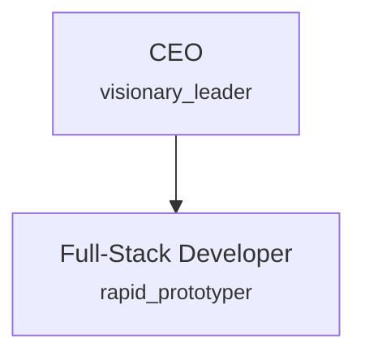
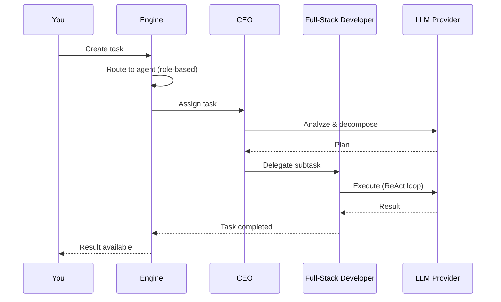

# Quickstart Tutorial

This tutorial walks you through installing SynthOrg, choosing a template, and running your first synthetic organization -- all in about 5 minutes.

---

## What You Will Build

You will create a **Solo Builder** organization -- a lean two-agent team designed for rapid prototyping:



The CEO handles strategy and task decomposition while the Full-Stack Developer writes code and builds features. Both operate with full autonomy and event-driven communication -- no approval gates or hierarchy overhead.

---

## Prerequisites

- **Docker Desktop** (or Docker Engine + Docker Compose) -- [install Docker](https://docs.docker.com/get-docker/)
- **An LLM provider API key** -- any provider supported by LiteLLM (e.g. a cloud provider or a local instance like Ollama)

---

## Step 1: Install the CLI

=== "Linux / macOS"

    ```bash
    curl -sSfL https://synthorg.io/get/install.sh | bash
    ```

=== "Windows (PowerShell)"

    ```powershell
    irm https://synthorg.io/get/install.ps1 | iex
    ```

Verify the installation:

```bash
synthorg version
```

See the [User Guide](../user_guide.md) for alternative installation methods and CLI commands.

---

## Step 2: Initialize

Run the interactive setup wizard:

```bash
synthorg init
```

The wizard will prompt you to configure infrastructure settings:

1. **Data directory** -- where SynthOrg stores its data (default: platform-appropriate path).
2. **Backend API port** -- port for the REST/WebSocket API (default: 3001).
3. **Web dashboard port** -- port for the web UI (default: 3000).
4. **Enable agent code sandbox** -- optionally mount the Docker socket for sandboxed code execution.

`synthorg init` generates the required secrets (`SYNTHORG_JWT_SECRET` and `SYNTHORG_SETTINGS_KEY`) and writes the configuration automatically. Company setup (name, LLM provider, template) happens in the web dashboard after containers start (see [Step 4](#step-4-explore-the-dashboard)).

---

## Step 3: Start

```bash
synthorg start
```

This pulls container images (with automatic [cosign signature verification](deployment.md#image-verification)), starts the backend and web dashboard, and waits for health checks to pass.

Check that everything is running:

```bash
synthorg status
```

You should see both containers (`backend` and `web`) reporting healthy.

---

## Step 4: Explore the Dashboard

Open [http://localhost:3000](http://localhost:3000) in your browser.

On a fresh install, the **setup wizard** appears and walks you through company configuration:

1. **Name your company** -- pick any name (e.g. "My First Org").
2. **Add an LLM provider** -- enter your provider's API key. Local providers like Ollama are auto-detected.
3. **Select a template** -- choose **Solo Builder** (the minimal 2-agent template).

Once the wizard completes, the dashboard loads and you will see:

- **Agents** -- the CEO and Full-Stack Developer, each with their personality and model assignment
- **Organization status** -- health indicators for your synthetic company
- **Task board** -- currently empty, ready for your first task

---

## Step 5: Submit Your First Task

=== "Dashboard"

    Use the task board in the dashboard to create a new task. Give it a title and description, and the engine will route it to the appropriate agent.

=== "API"

    ```bash
    curl -X POST http://localhost:3001/api/v1/tasks \
      -H "Content-Type: application/json" \
      -H "Authorization: Bearer <your-jwt-token>" \
      -d '{
        "title": "Write a hello world script",
        "description": "Create a simple Python script that prints hello world"
      }'
    ```

    Replace `<your-jwt-token>` with the JWT from your admin session. See the [REST API Reference](../openapi/index.md) for authentication details.

---

## What Happened

When you submitted a task, the SynthOrg engine processed it through a multi-step pipeline:



1. **Task created** -- the engine validates the task and puts it in the queue.
2. **Task routed** -- the routing strategy (default: `role_based`) matches the task to the best-suited agent.
3. **Agent executes** -- the assigned agent uses its configured LLM model in a ReAct loop (Think, Act, Observe).
4. **Result returned** -- the completed task and its artifacts are available in the dashboard and API.

---

## Stop

When you are done:

```bash
synthorg stop
```

Your data persists in the `synthorg-data` Docker volume and will be available next time you run `synthorg start`.

---

## Next Steps

- [Company Configuration](company-config.md) -- customize every aspect of your organization via YAML
- [Agent Roles & Hierarchy](agents.md) -- add more agents, define departments, configure personality
- [Budget & Cost Control](budget.md) -- set spending limits and auto-downgrade policies
- [Deployment (Docker)](deployment.md) -- production hardening and operations
