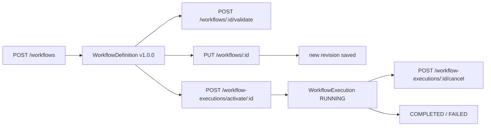

# Workflow API Tutorial

This guide shows you how to drive the workflow engine programmatically. It walks the full lifecycle -- create a workflow definition, save a version, activate it into an execution, track per-node status, and cancel when needed -- with curl examples you can copy-paste.

The full schema for every endpoint is in the [OpenAPI reference](../openapi/index.md). This page is the narrative counterpart: when to call which endpoint, and how the pieces fit together.

---

## Prerequisites

All examples assume:

- SynthOrg backend reachable at `http://localhost:3001`
- A valid session cookie (`session=...`) from `/api/v1/auth/login`
- `jq` installed for JSON pretty-printing

```bash
export SESSION='session=<your-cookie-value>'
```

## Workflow Lifecycle

Endpoint paths in the diagram below omit the `/api/v1` prefix for readability; every curl example later in this guide uses the full `/api/v1/...` path.



A workflow is a reusable DAG template. Activating one instantiates concrete tasks via `TaskEngine` that execute according to the graph's dependencies.

## 1. Create a workflow definition

```bash
curl -X POST http://localhost:3001/api/v1/workflows \
  -H "Content-Type: application/json" \
  -H "Cookie: ${SESSION}" \
  -d '{
    "name": "Weekly Status Report",
    "description": "Research + draft + review + publish",
    "workflow_type": "sequential",
    "version": "1.0.0",
    "nodes": [
      {"id": "start", "type": "start", "position": {"x": 0, "y": 0}},
      {"id": "research", "type": "task", "config": {"title": "Gather metrics", "assigned_to": "data_analyst"}, "position": {"x": 100, "y": 0}},
      {"id": "draft", "type": "task", "config": {"title": "Draft report", "assigned_to": "content_writer"}, "position": {"x": 200, "y": 0}},
      {"id": "review", "type": "task", "config": {"title": "Review", "assigned_to": "editor"}, "position": {"x": 300, "y": 0}},
      {"id": "end", "type": "end", "position": {"x": 400, "y": 0}}
    ],
    "edges": [
      {"source": "start", "target": "research", "type": "sequential"},
      {"source": "research", "target": "draft", "type": "sequential"},
      {"source": "draft", "target": "review", "type": "sequential"},
      {"source": "review", "target": "end", "type": "sequential"}
    ]
  }' | jq
```

Response payload:

```json
{
  "success": true,
  "data": {
    "id": "wf_01j...",
    "name": "Weekly Status Report",
    "version": "1.0.0",
    "revision": 1,
    "created_at": "2026-04-21T10:00:00Z",
    "nodes": [...],
    "edges": [...]
  }
}
```

Capture the ID:

```bash
export WF_ID='wf_01j...'
```

## 2. Validate before activating

```bash
curl -X POST "http://localhost:3001/api/v1/workflows/${WF_ID}/validate" \
  -H "Cookie: ${SESSION}" | jq
```

A valid workflow returns `{"success": true, "data": {"is_valid": true}}`. Invalid workflows return `is_valid: false` with a list of `errors` (unreachable nodes, missing TRUE/FALSE edges on conditionals, etc.). Activation will reject invalid workflows, so validate first.

## 3. List versions

Every create / update / rollback persists a content-addressable version snapshot. List them:

```bash
curl "http://localhost:3001/api/v1/workflows/${WF_ID}/versions" \
  -H "Cookie: ${SESSION}" | jq '.data[] | {version, content_hash, saved_at, saved_by}'
```

## 4. Diff two versions

```bash
curl "http://localhost:3001/api/v1/workflows/${WF_ID}/versions/diff?from_version=1&to_version=2" \
  -H "Cookie: ${SESSION}" | jq
```

## 5. Rollback to a previous version

```bash
curl -X POST "http://localhost:3001/api/v1/workflows/${WF_ID}/versions/rollback" \
  -H "Content-Type: application/json" \
  -H "Cookie: ${SESSION}" \
  -d '{"target_version": 1, "reason": "v2 introduced a routing bug"}' | jq
```

Rollback writes a new revision whose content hash equals the restored version -- history is never mutated, just extended.

## 6. Activate into an execution

```bash
curl -X POST "http://localhost:3001/api/v1/workflow-executions/activate/${WF_ID}" \
  -H "Content-Type: application/json" \
  -H "Cookie: ${SESSION}" \
  -d '{"context": {"quarter": "Q2"}}' | jq
```

Response:

```json
{
  "success": true,
  "data": {
    "id": "wfe_01j...",
    "workflow_id": "wf_01j...",
    "status": "running",
    "node_executions": [
      {"node_id": "start", "status": "completed"},
      {"node_id": "research", "status": "task_created", "task_id": "task_01j..."},
      {"node_id": "draft", "status": "pending"},
      {"node_id": "review", "status": "pending"},
      {"node_id": "end", "status": "pending"}
    ],
    "created_at": "..."
  }
}
```

Eager instantiation: every reachable task node gets a concrete `Task` created upfront with dependencies wired from the graph. `TaskEngine` handles execution ordering.

```bash
export WFE_ID='wfe_01j...'
```

## 7. Track progress

```bash
curl "http://localhost:3001/api/v1/workflow-executions/${WFE_ID}" \
  -H "Cookie: ${SESSION}" | jq '.data.node_executions[] | {node_id, status, task_id}'
```

Node statuses progress through: `pending` -> `task_created` -> `task_completed` / `task_failed` / `skipped` (for conditional branches not taken).

Real-time updates are also available via the WebSocket `tasks` channel -- see [Notifications & Events](notifications-and-events.md).

## 8. List all executions for a definition

```bash
curl "http://localhost:3001/api/v1/workflow-executions/by-definition/${WF_ID}" \
  -H "Cookie: ${SESSION}" | jq '.data[] | {id, status, created_at}'
```

## 9. Cancel a running execution

```bash
curl -X POST "http://localhost:3001/api/v1/workflow-executions/${WFE_ID}/cancel" \
  -H "Cookie: ${SESSION}" | jq
```

Cancels every in-flight task and transitions the execution to `CANCELLED`. Already-`COMPLETED` nodes are preserved; only `task_created` and `pending` nodes move to `task_failed`.

## Subworkflows

To compose reusable fragments (e.g. a "review" step shared across workflows), publish as a subworkflow and invoke via `SUBWORKFLOW` nodes:

```bash
# 1. Mark a workflow as publishable
curl -X PUT "http://localhost:3001/api/v1/workflows/${WF_ID}" \
  -H "Content-Type: application/json" \
  -H "Cookie: ${SESSION}" \
  -d '{"is_subworkflow": true, "inputs": [{"name": "doc_id", "type": "string", "required": true}], "outputs": [{"name": "verdict", "type": "string", "required": true}]}'

# 2. Reference from a parent
# In the parent's nodes array:
# {"id": "review_step", "type": "subworkflow", "config": {
#   "subworkflow_id": "wf_01j...",
#   "version": "1.0.0",
#   "input_bindings": {"doc_id": "@parent.draft_id"},
#   "output_bindings": {"verdict": "@child.verdict"}
# }}
```

See the [engine design](../design/engine.md#subworkflows) for the full subworkflow contract (typed I/O, static cycle detection, runtime depth limit).

---

## See Also

- [OpenAPI Reference](../openapi/index.md) -- full schema for every endpoint
- [Design: Task & Workflow Engine](../design/engine.md) -- workflow types, node types, edge types, validation
- [Notifications & Events](notifications-and-events.md) -- subscribe to task lifecycle events in real time
