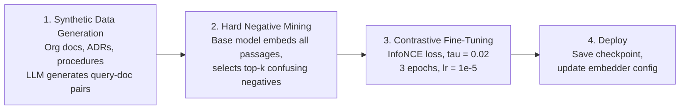

# Embedding Model Evaluation

## Why LMEB, Not MTEB

The standard text embedding benchmark ([MTEB](https://huggingface.co/spaces/mteb/leaderboard))
evaluates traditional passage retrieval. SynthOrg's memory system requires **long-horizon memory
retrieval** -- fragmented, context-dependent, and temporally distant information across episodic,
procedural, semantic, and social memory types.

The [LMEB benchmark](https://arxiv.org/abs/2603.12572) (Zhao et al., March 2026) evaluates
exactly this: 22 datasets, 193 zero-shot retrieval tasks across four memory types. Its key finding
is that **MTEB performance does not generalize to memory retrieval**:

| Correlation | Pearson | Spearman |
|-------------|---------|----------|
| Overall LMEB vs MTEB | -0.115 | -0.130 |
| Episodic vs MTEB | -0.271 | -0.150 |
| Dialogue vs MTEB | -0.496 | -0.364 |
| Semantic vs MTEB | 0.103 | 0.061 |
| Procedural vs MTEB | 0.291 | 0.429 |

Negative or near-zero correlations mean a model that tops MTEB may perform poorly on the memory
retrieval tasks SynthOrg relies on. Procedural memory shows the strongest (but still weak) transfer,
while dialogue memory shows **anti-correlation** -- the worst MTEB models sometimes outperform the
best on dialogue retrieval.

---

## SynthOrg Memory Type Mapping

SynthOrg defines five memory categories (`MemoryCategory` enum). LMEB defines four. The mapping
is direct for three types; two SynthOrg types share a single LMEB category.

| SynthOrg Category | LMEB Category | LMEB Task Examples | Evaluation Priority |
|-------------------|---------------|-------------------|---------------------|
| **EPISODIC** | Episodic | EPBench (54 tasks), KnowMeBench (15 tasks) -- temporal event recall | **High** |
| **PROCEDURAL** | Procedural | Gorilla, ToolBench, ReMe, MemGovern, DeepPlanning (67 tasks) -- skill/action retrieval | **High** |
| **SEMANTIC** | Semantic | QASPER, NovelQA, PeerQA, SciFact (15 tasks) -- factual knowledge recall | Medium |
| **SOCIAL** | Dialogue | LoCoMo, LongMemEval, REALTALK, ConvoMem (42 tasks) -- multi-turn context | Medium |
| **WORKING** | (not applicable) | Working memory is in-context, not stored/retrieved | N/A |

**Priority rationale**: episodic and procedural memory are the primary retrieval-dependent types in
SynthOrg. Social memory maps to dialogue retrieval (the hardest LMEB category). Semantic memory
is important but shows partial overlap with traditional passage retrieval. Working memory is
in-context and does not use the embedding pipeline.

---

## LMEB Leaderboard Analysis

All scores are NDCG@10 (with instruction prompts unless noted). Source: LMEB paper, Table 3.

### Top Models by Memory Type

| Rank | Model | Params | Episodic | Procedural | Dialogue | Semantic | Overall |
|------|-------|--------|----------|------------|----------|----------|---------|
| 1 | bge-multilingual-gemma2 | 9B | 70.88 | 61.40 | **59.60** | 60.41 | **61.41** |
| 2 | KaLM-Embedding-Gemma3 | 12B | **70.89** | **63.43** | 56.59 | 57.53 | 60.10 |
| 3 | NV-Embed-v2 | 7B | 68.45 | 58.77 | 56.42 | **62.18** | 60.25 |
| 4 | e5-mistral-7b-instruct | 7B | 67.43 | 55.41 | 55.03 | 57.63 | 57.08 |
| 5 | multilingual-e5-large-instruct | 560M | 63.60 | 52.22 | 54.62 | 57.18 | 55.33 |

### Small Models (< 1B parameters)

| Model | Params | Episodic | Procedural | Overall | Notes |
|-------|--------|----------|------------|---------|-------|
| EmbeddingGemma-300M | 307M | -- | -- | 56.03 (w/o inst.) | Outperforms 9B models without instructions |
| Qwen3-Embedding-0.6B | 596M | -- | -- | ~53 | Competitive small model |
| Qwen3-Embedding-4B | 4B | -- | 59.81 | ~58 | Strong procedural performance |

### Key Findings

1. **Larger does not mean better.** EmbeddingGemma-300M (307M params) scores 56.03 without
   instructions, outperforming bge-multilingual-gemma2 (9B) at 45.10 without instructions.
   Architecture and training data matter more than parameter count.

2. **Instruction sensitivity varies wildly.** Some models gain +3-5% with instructions
   (KaLM-Embedding-Gemma3), others are neutral (NV-Embed-v2), and some are harmed by instructions
   (EmbeddingGemma-300M, bge-m3). Instruction tuning must be validated per deployment.

3. **Dialogue memory is the critical gap.** The highest dialogue score is 59.60 (bge-multilingual-gemma2),
   well below episodic (70.89) and semantic (62.18). This affects SynthOrg's SOCIAL memory quality.

4. **No universal embedding model exists.** No single model excels across all memory types.
   Model selection must be optimized for the deployment's primary memory retrieval pattern.

---

## Recommendation

### For SynthOrg Deployments

The embedding model choice depends on the deployment's resource constraints and primary memory
retrieval patterns. Three tiers are recommended:

#### Tier 1: Full-resource deployment (GPU server, 7-12B model)

**Recommended: bge-multilingual-gemma2 (9B)**

- Best overall LMEB score (61.41 NDCG@10)
- Best dialogue/social memory retrieval (59.60) -- the hardest category
- Strong episodic (70.88) and procedural (61.40)
- Consistent instruction-following (+1.96 gain with prompts)
- Multilingual support (relevant for international org simulations)

**Alternative: NV-Embed-v2 (7B)** if semantic memory is the priority (best semantic at 62.18)
and instruction stability is preferred (performs consistently regardless of prompt formatting).

#### Tier 2: Mid-resource deployment (consumer GPU, 1-4B model)

**Recommended: Qwen3-Embedding-4B (4B)**

- Strong procedural memory performance (59.81 NDCG@10)
- Reasonable balance across all types
- Fits on consumer GPUs (16-24 GB VRAM for inference)

#### Tier 3: CPU-only / embedded deployment (< 1B model)

**Recommended: EmbeddingGemma-300M (307M)**

- Surprisingly competitive overall score (56.03 w/o instructions)
- Runs on CPU with acceptable latency for async memory retrieval
- Best cost-performance ratio in the LMEB evaluation
- **Do not use instruction prompts** -- performance degrades with instructions for this model

### Embedder Configuration

The `Mem0EmbedderConfig` already supports any Mem0-compatible provider and model. Example
configuration for the recommended Tier 1 model (provider name is Mem0 SDK-specific):

```yaml
# Embedder config is passed programmatically via the factory:
#   create_memory_backend(config, embedder=Mem0EmbedderConfig(
#       provider="<mem0-provider-id>",
#       model="<model-id>",
#       dims=3584,  # bge-multilingual-gemma2 output dimensions
#   ))
```

The `dims` field must match the model's output dimensionality. Changing the embedding model
after initial deployment requires recreating the Qdrant collection (existing vectors become
incompatible). Plan model selection before first production deployment.

---

## Domain Fine-Tuning Pipeline

Even with LMEB-optimized model selection, domain-specific fine-tuning can improve retrieval
quality by 10-27% ([NVIDIA blog](https://huggingface.co/blog/nvidia/domain-specific-embedding-finetune),
tested on NVDocs and Jira datasets). The pipeline requires no manual annotation and runs on a
single GPU.

### Pipeline Overview



### Stage Details

**Stage 1 -- Synthetic Data Generation**

- Input: organization documents (policies, ADRs, procedures, coding standards, meeting notes)
- Process: LLM generates realistic retrieval queries for each document chunk
- Output: `(query, positive_document)` pairs
- No GPU required (API-based LLM calls)

**Stage 2 -- Hard Negative Mining**

- Input: query-document pairs + base embedding model
- Process: embed all passages, compute query-passage similarity, select top-k highest-scoring
  non-positive passages (with margin filter to avoid false negatives)
- Output: `(query, positive, [hard_negative_1, ..., hard_negative_k])` triples
- GPU required (40 GB VRAM for embedding)

**Stage 3 -- Contrastive Fine-Tuning**

- Input: training triples from Stage 2
- Process: biencoder contrastive training with InfoNCE loss, temperature tau=0.02
- Key hyperparameters: 3 epochs, lr=1e-5, batch size 128, 5 passages per query (1 positive + 4 hard negatives)
- GPU required (80 GB VRAM for training, or reduced batch size on smaller GPUs)
- Duration: 1-2 hours for typical org corpus (~500 documents)

**Stage 4 -- Deploy**

- Save fine-tuned model checkpoint to configured path
- Update `Mem0EmbedderConfig` to point to the fine-tuned model (via custom Mem0 provider or
  local model path)
- On next backend initialization, the fine-tuned model can be used by pointing configuration to the checkpoint

### Integration Design

Fine-tuning is an **offline pipeline**, not a runtime operation. The `EmbeddingFineTuneConfig`
(see [Memory Design Spec](../design/memory.md#embedding-model-selection))
stores the configuration. Initialization behavior in the Mem0 adapter:

1. If `fine_tune.enabled` and `checkpoint_path` is set: the checkpoint path is used as the model
   identifier passed to the Mem0 SDK (the embedding provider must serve the fine-tuned model)
2. If `fine_tune.enabled` is `False` (default): the base model is used, no checkpoint check

The pipeline is triggered via `POST /admin/memory/fine-tune` (see `MemoryAdminController`).
This follows the project's pattern of disabled-by-default optional features
(cf. `DualModeConfig` in consolidation).

### Improvement Expectations

Based on the NVIDIA evaluation:

| Dataset | Metric | Base | Fine-Tuned | Improvement |
|---------|--------|------|-----------|-------------|
| NVDocs | NDCG@10 | 0.555 | 0.616 | +10.9% |
| NVDocs | Recall@10 | 0.630 | 0.693 | +10.0% |
| Jira (Atlassian) | Recall@60 | 0.751 | 0.951 | +26.7% |

Domain-specific corpora (like organizational documents) tend to see higher gains because the base
model's generic training does not cover domain-specific terminology and relationships.

---

## References

- Zhao et al., ["LMEB: Long-horizon Memory Embedding Benchmark"](https://arxiv.org/abs/2603.12572) (March 2026)
- NVIDIA, ["Domain-Specific Embedding Fine-Tuning"](https://huggingface.co/blog/nvidia/domain-specific-embedding-finetune) (2026)
- [LMEB GitHub Repository](https://github.com/KaLM-Embedding/LMEB) -- datasets, evaluation code, leaderboard
- [LMEB HuggingFace Dataset](https://huggingface.co/datasets/KaLM-Embedding/LMEB)
