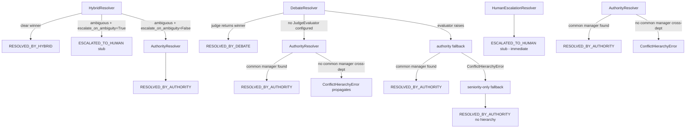

# Multi-Agent Failure Pattern Audit

## Context

Two independent sources converge on a warning relevant to SynthOrg's architecture:

1. **CIO article**: Empirical failure rates -- swarm topology 68%, hierarchical 36%, gated
   pipelines 100% failure without human checkpoints. The data validates SynthOrg's
   orchestrated-hierarchical approach. But the warning is that even orchestrated systems
   drift toward swarm behavior if agent boundaries are poorly managed.

2. **Medium article**: Multi-agent systems recreate microservices problems: unowned
   services, chatty interfaces, cascading failures, observability gaps, and distributed
   monolith emergence. These are solved problems in microservices -- but the solutions
   (service ownership, circuit breakers, distributed tracing) need analogues in agent systems.

This audit examines SynthOrg's current guardrails, identifies concrete vulnerabilities, and
documents the strength of existing mitigations.

---

## Meeting Protocol Audit for Swarm Behavior Potential

### StructuredPhasesProtocol

**Source**: `src/synthorg/communication/meeting/structured_phases.py`

The structured phases protocol is bounded at every stage:
- Phase 1 (agenda broadcast): no LLM call, O(n) message distribution
- Phase 2 (parallel input): bounded by `max_tokens_per_agent` and `TokenTracker`
- Phase 3 (discussion): bounded by `max_discussion_tokens`; skipped entirely when
  `skip_discussion_if_no_conflicts=True` (default) and no conflicts detected
- Phase 4 (synthesis): 20% of total budget reserved before execution begins;
  `MeetingBudgetExhaustedError` raised if synthesis cannot start

`TokenTracker.is_exhausted` is checked at every phase boundary. `KeywordConflictDetector`
is a single keyword scan ("CONFLICTS: YES") -- not an LLM call, no loop.

**Verdict**: Safe. Bounded termination guaranteed.

### RoundRobinProtocol

**Source**: `src/synthorg/communication/meeting/round_robin.py`

Bounded by `max_turns_per_agent` (default 2) and `max_total_turns` (default 16). 20%
budget reserved for synthesis. Budget tracker enforced throughout.

**Verdict**: Safe. Finite turn limit enforced.

### PositionPapersProtocol

**Source**: `src/synthorg/communication/meeting/position_papers.py`

All participants generate position papers in parallel, bounded by `max_tokens_per_position`
(default 300). Single synthesis pass by the leader/synthesizer. O(n) token cost.

**Verdict**: Safe. Cheapest protocol, parallel collection with bounded output.

### Meeting-Task Feedback Loop -- VULNERABILITY FOUND

**Source**: `src/synthorg/communication/meeting/config.py` (line 103),
`src/synthorg/communication/meeting/orchestrator.py` (line 319),
`src/synthorg/communication/meeting/scheduler.py` (line 165)

`MeetingProtocolConfig.auto_create_tasks` defaults to `True`. When enabled,
`MeetingOrchestrator._create_tasks()` spawns `Task` objects from action items extracted
from meeting minutes. These tasks can be assigned to agents who execute them. If task
execution emits events that match `MeetingScheduler.trigger_event()` patterns, new meetings
are triggered.

`MeetingScheduler.trigger_event()` has **no deduplication** -- any event matching a
registered meeting type fires that meeting immediately, without cooldown or recency check:

```python
matching = tuple(mt for mt in self._config.types if mt.trigger == event_name)
# ...
async with asyncio.TaskGroup() as tg:
    tasks = [tg.create_task(self._execute_meeting(mt, context)) for mt in matching]
```

This creates a potential feedback loop:
1. Sprint planning meeting generates action items -> tasks created
2. Task completion events trigger "post-sprint" meeting type
3. Post-sprint meeting generates more action items -> more tasks
4. Repeat without bound

The only backstop is the budget enforcer (hard stop terminates all activity) and the
`TaskEngine`'s ability to refuse task creation if per-agent daily budgets are exhausted.
Neither is a purpose-built cycle guard.

**Severity**: High. In production deployments with event-triggered meetings and
`auto_create_tasks=True`, this can create unbounded task/meeting cycles that exhaust budget
before useful work is done.

**Recommendation**: Add a `min_interval_seconds` field to `MeetingTypeConfig` for event-
triggered meetings, and track last-triggered timestamps in `MeetingScheduler` to enforce
cooldowns. Alternatively, add a `max_tasks_per_meeting` cap to `MeetingProtocolConfig`.

---

## Conflict Resolution Termination Audit

### AuthorityResolver

**Source**: `src/synthorg/communication/conflict_resolution/authority_strategy.py`

Deterministic seniority comparison. N-party conflicts use pairwise comparison. Equal
seniority falls back to hierarchy proximity (lowest common manager). If no common manager
exists across departments, `ConflictHierarchyError` is raised -- this is the correct
behavior (cross-department conflicts without hierarchy require human escalation).

**Verdict**: Safe. Always terminates; no LLM calls.

### DebateResolver

**Source**: `src/synthorg/communication/conflict_resolution/debate_strategy.py`

Makes **exactly one** LLM call to the judge evaluator (`self._judge_evaluator.evaluate()`).
There is no retry loop or max_rounds parameter. If the judge returns an agent_id not present
in the conflict positions, `find_position_or_raise()` raises `ConflictStrategyError`. If no
`JudgeEvaluator` is configured, falls back to `AuthorityResolver`.

**Initial concern about looping was unfounded.** The debate is single-shot.

**Exception handling**: If the judge evaluator raises an exception (provider error, timeout),
the exception is caught and the resolver falls back to `_authority_fallback(conflict)`. If the
authority fallback itself raises `ConflictHierarchyError` (no common manager across
departments), that exception is also caught and a final seniority-only fallback is used
(without hierarchy). A resolution is always produced unless `MemoryError` or `RecursionError`
occurs.

**Verdict**: Safe (terminates). On the evaluator-raises path, the multi-level fallback chain (`_authority_fallback` -> seniority-only on `ConflictHierarchyError`) ensures a resolution is always produced. On the no-JudgeEvaluator-configured path, `DebateResolver` calls `_authority_fallback` without a surrounding `try`, so a `ConflictHierarchyError` from AR2 propagates to the caller.

### HumanEscalationResolver

**Source**: `src/synthorg/communication/conflict_resolution/human_strategy.py`

This is a **stub implementation** pending approval queue integration (#37). It does not
block waiting for a human -- it returns a `ConflictResolution` with outcome
`ESCALATED_TO_HUMAN` immediately. The caller receives a resolution object but with no
winning position. What happens next depends on the caller's handling of
`ESCALATED_TO_HUMAN` -- there is no standard downstream behavior enforced by the resolver.

This means conflicts assigned to `HumanEscalationResolver` are technically "resolved" from
the resolver's perspective but have no actual decision. Callers that do not handle
`ESCALATED_TO_HUMAN` specially will treat an unresolved conflict as resolved-with-no-winner.

**Severity**: Medium. Until #37 is implemented (approval queue integration), human
escalation for conflict resolution is a no-op that silently produces unresolved conflicts.

**Verdict**: Terminates immediately (no hang). Functional gap: no actual human blocking.

### HybridResolver

**Source**: `src/synthorg/communication/conflict_resolution/hybrid_strategy.py`

Single LLM review call. If the winner matches a participant, auto-resolves. On ambiguity:
- `escalate_on_ambiguity=True`: delegates to `HumanEscalationResolver` (same stub behavior)
- `escalate_on_ambiguity=False`: falls back to `AuthorityResolver`

**Verdict**: Safe. Single LLM call; no loop. Ambiguity handled deterministically.

### Complete Fallback Chain



All paths terminate. No infinite loops. `DebateResolver` catches evaluator exceptions and
cascades through authority and seniority fallbacks; the weakest remaining path is the
`HumanEscalationResolver` stub (no actual resolution).

---

## Microservices Anti-Pattern Cross-Check

### Chatty Interface Pattern

**Definition**: Agents exchange excessive fine-grained messages requiring many round-trips
to accomplish a task.

**SynthOrg detection**: `budget/coordination_metrics.py` implements `MessageOverhead` which
flags when `message_count > team_size^2 * threshold` (`is_quadratic` property). The
`CoordinationMetricsConfig` tracks message density and redundancy rate.

**Gap**: These metrics are computed and emitted as structured log events but they are not
enforced as circuit breakers. A coordination run with quadratic message overhead continues
to completion (or budget exhaustion) -- the metric is observational only. There is no
"coordination overhead budget" that halts a run when message density exceeds a threshold.

**Assessment**: Detection exists; enforcement does not. Acceptable for now given the
budget enforcer as ultimate backstop, but the detection-without-enforcement gap means
chatty behavior can exhaust significant budget before the hard stop triggers.

### Distributed Monolith Pattern

**Definition**: Services that appear independent but are so tightly coupled they must be
deployed and coordinated together.

**SynthOrg assessment**: The message bus uses a pull model (`InMemoryMessageBus` with
async `receive()`). Agents do not share in-process state beyond the message bus. The
`TaskEngine` single-writer actor serializes task state mutations but is not a synchronous
coupling point for agent execution. The `CoordinationService` can operate independently of
any specific agent being present.

**Verdict**: Not a current concern. The async pull model and single-writer actor design
actively prevent synchronous coupling. Future risk if a transport with ordering guarantees
is introduced across agent groups.

### Ownership Ambiguity Pattern

**Definition**: It is unclear which service/agent owns a resource, leading to conflicting
mutations.

**SynthOrg assessment**: `TaskEngine` is a single-writer actor -- all task state mutations
are serialized through its `asyncio.Queue`. Task `assigned_to` is a single agent ID field.
`ResourceLock` prevents concurrent execution of the same task by multiple agents.
`DelegationService` validates authority before creating sub-tasks.

**Verdict**: Safe. Single-writer actor pattern eliminates ownership races.

### Cascading Failure Pattern

**Definition**: One failing component causes downstream failures to propagate through the
system.

**SynthOrg assessment**:
- `fail_fast` in `CoordinationConfig` halts remaining waves when one wave fails
- `RecoveryStrategy` per execution handles individual agent failures
- `ParallelExecutor` captures per-task exceptions without stopping the group (unless
  `fail_fast=True`)
- Budget hard stop terminates all activity uniformly

**Partial gap**: There is no upstream contamination detection. If agent A produces bad
output that causes agent B's subtask to fail, the failure is attributed to agent B's
execution, not to agent A's output quality. See #848 (structural credit assignment) for
this gap.

**Verdict**: Partially mitigated. Cascades are bounded by budget. Attribution is imprecise.

---

## Human Checkpoint Path Validation

All critical decision points have human intervention paths:

| Decision Point | Trigger | Path | Blocking? |
|---|---|---|---|
| Sensitive tool use | Security rule ESCALATE verdict | `ApprovalGate` parks context; human approves/rejects | Yes -- execution paused |
| Autonomy-gated action | Action in `human_approval_actions` (LOCKED preset) | Same approval flow | Yes |
| Trust promotion | Any standard-to-elevated promotion | `TrustService._enforce_elevated_gate()` creates approval item | Yes -- promotion blocked |
| Conflict resolution | `HumanEscalationResolver` or `HybridResolver` with ambiguity | Returns `ESCALATED_TO_HUMAN` (stub) | No -- stub returns immediately |
| Budget hard stop | Monthly spend >= `hard_stop_at` % | Execution halted | No -- no override path |
| Model downgrade | Budget >= `auto_downgrade.threshold` | Applied at task boundary | No -- automatic |

**Gap**: Budget hard stop halts all execution with no override path. In production, an
operator may need to temporarily extend a budget to complete critical work. There is no
`POST /budget/emergency-override` or equivalent.

**Gap**: Conflict resolution human escalation is a stub (#37). Until the approval queue
integration is complete, conflicts requiring human judgment are silently unresolved.

---

## Guardrails Against Swarm Drift

### Delegation Guard (5 Mechanisms)

**Source**: `src/synthorg/communication/loop_prevention/guard.py`

The `DelegationGuard` runs 5 checks in order, short-circuiting on first failure:

1. **Ancestry check**: Prevents delegating to an agent in the delegation chain (cycle)
2. **Max depth**: Configurable limit (default 5); raises `DelegationDepthError`
3. **Deduplication**: 60s window; identical task content from same delegator is rejected
4. **Rate limiting**: 10 delegations/min per agent-pair
5. **Circuit breaker**: Trips after 3 bounces (same pair, short window)

**Vulnerability -- circuit breaker bounce count reset**:

After cooldown (default 300s), the circuit breaker evicts the state entry entirely:

```python
# circuit_breaker.py:112-114
# Cooldown expired: evict the stale entry
del self._pairs[key]
```

This resets the bounce count to 0. A pair that was tripped can resume with a fresh
counter after 300 seconds. The deduplication window (60s) and rate limiter (10/min) mitigate
within a single cycle, but slow-burn patterns -- where the same pair redelegates with
>60s gaps -- can bypass all guards:

- Bounce 1 at t=0 (counted)
- Bounce 2 at t=90s (outside dedup window, counted)
- Bounce 3 at t=180s (circuit trips)
- t=480s: cooldown expires, counter resets to 0
- Pattern repeats indefinitely

This is a genuine slow-burn delegation vulnerability. The existing 5-mechanism design would
benefit from an exponential backoff strategy on the circuit breaker reset (e.g., first
reset at 5 min, second at 10 min, third at 20 min) or a global per-pair bounce counter that
persists across resets.

**Additional concern**: All delegation guard state is in-memory. A service restart resets
all circuit breakers, dedup windows, and rate limiters. Immediate post-restart, delegation
storms that were being suppressed can resume.

### Stagnation Detection

**Source**: `src/synthorg/engine/stagnation/detector.py`

Dual-signal: tool repetition ratio (fraction of repeated fingerprints in sliding window)
and cycle detection (A->B->A->B patterns). After `max_corrections` corrective prompt
injections, returns `TERMINATE`. Hard termination is guaranteed.

**Verdict**: Robust. The dual-signal approach and hard termination limit make this the
most reliable anti-drift mechanism for single-agent loops.

### Budget Enforcement as Ultimate Backstop

All agent activity is bounded by the monthly budget hard stop. Even if all other guardrails
fail, budget exhaustion terminates all execution. This is correct but blunt -- it means
budget exhaustion is the failure signal for undetected drift, not a purpose-built guard.

**No global coordination overhead cap**: Individual agent budgets and task budgets exist,
but there is no system-level metric like "if coordination tokens exceed 40% of total tokens
spent, trigger human review." The coordination metrics (`budget/coordination_metrics.py`)
compute orchestration ratios but they are not wired to any enforcement action.

### Topology Locking

Coordination topology (SAS, centralized, decentralized, context-dependent) is selected at
the start of a coordination run and remains fixed throughout. There is no runtime topology
mutation -- agents cannot renegotiate their coordination structure mid-execution.

**Verdict**: Strong guarantee against emergent topology drift. The orchestrator selects
topology deterministically; agents cannot change it.

---

## Risk Matrix

| # | Risk | Severity | Likelihood | Existing Mitigation | Recommendation |
|---|------|----------|------------|--------------------|----|
| R1 | Meeting-task feedback loop | High | Medium | Budget hard stop only | Add cooldown to event-triggered meetings; cap tasks per meeting |
| R2 | Circuit breaker bounce count reset | Medium | Low | Dedup (60s) + rate limit | Exponential backoff reset; global per-pair counter |
| R3 | No coordination overhead cap | Medium | Low | Budget hard stop | Wire `orchestration_ratio` metric to configurable human-review threshold |
| R4 | Human escalation for conflict is a stub | Medium | High (pending #37) | None | Complete #37 (approval queue integration) |
| R5 | DebateResolver evaluator exception fallback | Low | Low | Multi-level fallback: evaluator exception -> `_authority_fallback()` -> seniority-only on `ConflictHierarchyError` | Mitigated (implemented in `DebateResolver.resolve` and `DebateResolver._authority_fallback` in `debate_strategy.py`) |
| R6 | Chatty interface detection without enforcement | Low | Low | Observational metric | Wire `MessageOverhead.is_quadratic` to coordination throttle |
| R7 | In-memory guardrail state lost on restart | Low | Medium | None | Persist circuit breaker + dedup state to SQLite |
| R8 | Budget hard stop has no operator override | Low | Low | None | Add emergency budget override endpoint with CEO+BOARD approval |

---

## Summary

SynthOrg's orchestrated architecture is well-validated against the CIO article's failure
modes. The hierarchical topology, single-writer task ownership, locked coordination
topology, and layered budget enforcement directly address the root causes of swarm failure
and microservices chaos.

The two most actionable findings:

1. **Meeting-task feedback loop** (R1): The default `auto_create_tasks=True` combined with
   event-triggered meetings and no cooldown is a production-ready feedback loop waiting to
   fire. This should be addressed before event-triggered meetings are deployed at scale.

2. **Circuit breaker bounce count reset** (R2): The deliberate state eviction on cooldown
   expiry is correct for preventing permanent lockouts between legitimate agent pairs, but
   creates a slow-burn delegation vulnerability. Exponential backoff on reset is the
   minimal fix.

All conflict resolution strategies terminate. The HumanEscalationResolver stub (R4) is the
most immediate functional gap, but it is already tracked as a dependency (#37).

---

## Appendix: 15 emergent risk categories (S1 / #1254)

[arXiv:2603.27771](https://huggingface.co/papers/2603.27771) "Emergent Social
Intelligence Risks in Generative Multi-Agent Systems" (2026) introduces the
first systematic taxonomy of 15 collective-level failure modes in multi-agent
LLM systems -- risks that cannot be reduced to individual agent safety. This
appendix maps each risk to SynthOrg coverage. Full analysis in
[S1 Multi-Agent Architecture Decision](s1-multi-agent-decision.md).

| # | Risk | Coverage | Location / Action |
|---|---|---|---|
| 1.1 | Tacit collusion | Gap (low priority) | Only relevant for negotiation/client-simulation templates (v0.8+). |
| 1.2 | Priority monopolization | Partial | `budget/coordination_config.py`; no fee/rotation mechanism yet. |
| 1.3 | Competitive task avoidance | Partial | Manual / hierarchical strategies safe; `AuctionAssignmentStrategy` vulnerable. |
| 1.4 | Strategic information withholding | Gap (low priority) | Material only for adversarial A2A federation. Constraint on #1253. |
| 1.5 | Information asymmetry exploitation | Gap (low priority) | Material only for negotiation templates. |
| **2.1** | **Majority sway bias** | **Gap (HIGH)** | `EvidenceWeightedSynthesizer`. Paper data: 6/10 fake-news override. Constraint on #1251. |
| **2.2** | **Authority deference** | **Structural (HIGHEST)** | `AuthorityResolver` is the default. Paper data: 0/10 → 10/10 deterministic errors under authority cue. `AuthorityDeferenceGuard`. Constraint on #1250 + #1251 + #1253. |
| 3.1 | Non-convergence without arbitrator | Covered | `ConflictResolver` protocol with arbitrator escalation. |
| 3.2 | Over-adherence to initial instructions | Partial | `AssumptionViolationSignal` propagation as escalation (not retry). Constraint on #1250 + #1251. |
| 3.3 | Architecturally induced clarification failure | Gap (medium) | Pre-decomposition specificity check on `acceptance_criteria`. Constraint on #1251. |
| 3.4 | Role allocation failure | Covered | Hard role binding, `merge_id` disambiguation. |
| 3.5 | Role stability under incentive pressure | Covered (by absence) | No inter-agent monetary incentives. Documented risk if reintroduced. |
| 4.1 | Competitive resource overreach | Covered | `BudgetEnforcer` hard caps. |
| 4.2 | Steganography | Gap (low priority) | Only if agents face oversight-evasion incentives. |
| 4.3 | Semantic drift in sequential handoffs | Partial | Content-hash drift detection on `TurnRecord` / `TaskExecution.delegation_chain`. Constraint on #1253. |

**Coverage totals**: 5 fully covered (3.1, 3.4, 3.5, 4.1 + design-by-absence),
3 partially covered (1.3, 3.2, 4.3), 2 HIGH-priority structural gaps (2.1, 2.2),
5 LATER/low-priority (1.1, 1.2, 1.4, 1.5, 4.2), 1 medium-priority (3.3).

The two HIGH-priority gaps (2.1 majority sway + 2.2 authority deference) are
the critical new work S1 surfaces, and both are encoded as constraints on the
existing R1/R2/R4 RFC issues rather than filed as standalone implementation
tickets -- each mitigation is a structural hook that the RFCs must design
around.
