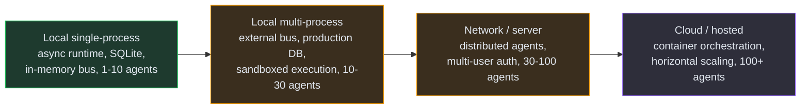

# Future Vision

The longer-term direction for SynthOrg. Items here are either **planned** (scheduled or under active design) or **backlog** (candidates for research, not yet scheduled).

## Planned

| Feature | Status |
|---------|--------|
| PostgreSQL persistence backend | Planned |
| Distributed message bus (NATS JetStream) | Planned |
| Distributed task queue | Planned |
| Multi-project support with project-scoped teams and isolated budgets | Planned |
| Dynamic company scaling across clusters | Planned |
| Plugin system | Planned |
| Benchmarking suite | Planned |
| REST API and dashboard UI for agent evolution | Planned |
| Notification sink MVP (Slack, ntfy, HTTP-relay) | Planned |
| OpenAPI TypeScript codegen for the dashboard | Planned |

## Backlog (Research Candidates)

| Feature | Status |
|---------|--------|
| Community template marketplace | Research |
| Inter-company communication beyond A2A | Research |
| Shift system for agents | Research |
| Self-improving company (meta-loop signal aggregation, staged rollout) | Research |
| Advanced memory architecture (GraphRAG, consistency protocols, RL consolidation) | Research |
| Kubernetes sandbox backend | Research |
| Training mode (learn from senior agents) | Research |

## Scaling Path

SynthOrg is designed to scale incrementally from a local single-process deployment to a hosted platform.

See the [Distributed Runtime](../design/distributed-runtime.md) page for the NATS JetStream backend and distributed task queue design.

Each phase builds on the previous one. The pluggable protocol interfaces throughout the codebase (persistence, memory, message bus, sandbox) are designed to make these transitions configuration changes rather than rewrites.
